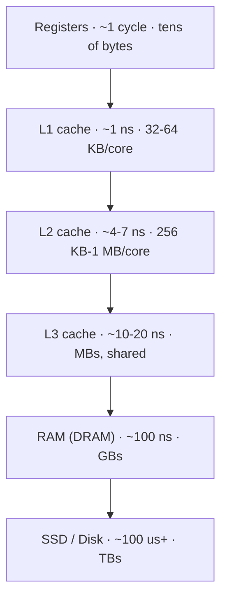

# CPU and Memory Hierarchy

*Why the fastest chip on earth spends most of its life waiting -- and how caches hide that.*

`⏱️ ~7 min · 1 of 12 · Computing Fundamentals`

> [!TIP] The gist
> A CPU core runs billions of instructions per second, but reaching main memory (RAM) takes ~100 ns -- long enough to execute hundreds of instructions. So hardware stacks a hierarchy of small-fast-to-big-slow storage (registers -> L1 -> L2 -> L3 -> RAM -> disk) between the core and memory. Code that reuses nearby data stays in the fast tiers and flies; code that scatters memory accesses stalls waiting on RAM.

## Contents

- [Intuition](#intuition)
- [How it works](#how-it-works)
- [In the real world](#in-the-real-world)
- [Trade-offs](#trade-offs)
- [Remember](#remember)
- [Check yourself](#check-yourself)

## Intuition

Picture a chef at a stove. What's fast to reach shapes how fast they cook:

- **On the cutting board** (registers): the two ingredients in hand right now.
- **On the counter** (L1/L2 cache): today's mise en place, an arm's reach away.
- **In the fridge** (L3 cache / RAM): a walk across the kitchen.
- **At the supermarket** (disk/SSD): get in the car.

A great chef keeps what they need close. A CPU works the same way -- and *your code* decides how often it has to "drive to the store."

## How it works

**The hierarchy, top to bottom.** Each level down is roughly an order of magnitude bigger, slower, and cheaper than the one above.

The exact numbers shift every hardware generation. What sticks is the *shape*: each hop down costs roughly 5-100x more than the one above. RAM is about 100x slower than L1.

---

**Caches move chunks, not bytes.** A cache never fetches a single byte. It pulls a fixed **cache line** -- commonly **64 bytes** -- so reading one byte drags in the 64 surrounding it. That single fact explains two golden rules:

- **Spatial locality** -- accessing addresses *near* one you just touched is fast, because they rode in on the same cache line.
- **Temporal locality** -- reusing the *same* address soon is fast, because it's still resident, not yet evicted.

---

**Why layout beats big-O for small data.** Iterating a contiguous array is fast: one 64-byte line load serves ~16 consecutive `int`s. Chasing pointers through a linked list scatters nodes across memory, so each hop likely misses cache and pays the full ~100 ns RAM penalty. The same loop over the same data can be 10x+ faster or slower purely from cache-line utilization.

---

**False sharing -- the multi-core trap.** Two *unrelated* variables written by two different threads can land on the *same* 64-byte line. Every write forces the cache-coherence protocol to ping-pong that line between cores, silently serializing work that looked independent. The fix is padding the variables onto separate lines.

## In the real world

**Discord: Go to Rust to kill periodic latency spikes.** Discord's Read States service (tracks which messages each user has read) held tens of millions of entries in an in-memory LRU cache. On Go, the garbage collector ran at least every ~2 minutes and had to scan that *entire* cache to find what was still reachable -- causing a latency spike every couple of minutes no matter how little garbage existed. Rewriting in Rust, whose ownership model frees an evicted entry's memory instantly, removed the spikes entirely; after tuning, Rust beat Go on latency, CPU, and memory at once (p99 fell from double-digit to low-single-digit milliseconds). A direct illustration that memory-layout and allocation strategy -- not just algorithmic complexity -- decide tail latency at scale.

Source: [Discord Engineering, "Why Discord is switching from Go to Rust"](../../../research/backend/F/f-computing-fundamentals-cases-and-sources.md#ss1-cpu-and-memory-hierarchy)

## Trade-offs

| More / bigger caches | Cost |
|---|---|
| Fewer memory stalls | Die area and power |
| Higher effective throughput | Must be kept coherent across cores (protocol overhead) |
| Rewards cache-friendly layout | Software can't control caches directly -- only influence via layout |

✅ Contiguous arrays, structs-of-arrays, padding to avoid false sharing
❌ Pointer-chasing structures, arrays-of-structs with unused fields, hot variables sharing a line

## Remember

> [!IMPORTANT] Remember
> The CPU is almost never the bottleneck -- *waiting for memory* is. Keep the data you reuse small and close together, and you keep it in the fast tiers.

## Check yourself

1. You loop over a 1-million-element array of structs but only read one 4-byte field of each. Why might this be far slower than the same data stored as a plain array of that field, even though you touch the same number of values?
2. Two threads each increment their own private counter, yet throughput is terrible. What single-word phrase names the likely cause, and how would you fix it?

---

→ Next: [Processes vs Threads](02-processes-vs-threads.md)
↩ Comes back in: B-tree node sizing (L2 storage engines), columnar and vectorized query engines (L13), and the "everything is a cache, from CPU to CDN" theme throughout.
