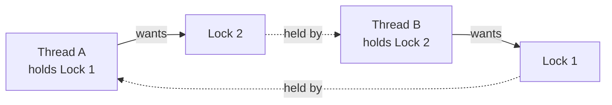

# Locks, Race Conditions, Deadlock, and Atomicity

*What goes wrong when threads share, and the tools that make sharing safe.*

`⏱️ ~8 min · 4 of 12 · Computing Fundamentals`

> [!TIP] The gist
> When threads read and write shared state without coordination, results depend on timing -- a **race condition**. Fix it by letting only the right number of threads into the shared code at once: a **mutex** (exactly one) or a **semaphore** (up to N). Careless locking causes **deadlock** (everyone waiting forever). At the bottom, hardware **atomic** instructions (like compare-and-swap) make an operation indivisible -- the foundation for both locks and lock-free code.

## Contents

- [Intuition](#intuition)
- [How it works](#how-it-works)
- [Trade-offs](#trade-offs)
- [Remember](#remember)
- [Check yourself](#check-yourself)

## Intuition

One bathroom, several people. Without a lock on the door, two walk in at once -- a **race condition**. Put a lock on it and only one enters at a time -- a **mutex**. A gym locker room with 20 lockers lets 20 people in but makes the 21st wait -- a **semaphore**. And if two people each stand blocking a doorway the other needs to pass, both wait forever -- **deadlock**.

## How it works

**Race condition -- why `counter++` lies.** It looks like one step but is three: read `counter` into a register, add 1, write it back. If two threads interleave those steps, one increment vanishes:

```
Thread A: read 5 ......... add 1 -> 6 . write 6
Thread B: ....... read 5 . add 1 -> 6 ......... write 6   # lost update: should be 7
```

The unsafe code touching shared state is the **critical section**. The fix: let only one thread in at a time.

---

**Mutex vs semaphore.**

- **Mutex** (mutual exclusion): a binary lock, at most one holder. `lock()` before the critical section, `unlock()` after; latecomers are *parked* by the OS (not spinning) until it frees. Convention: only the thread that locked it may unlock it -- it models *ownership*.
- **Semaphore**: a counter allowing up to **N** holders. No ownership -- *any* thread can release. Perfect for bounding access to a *pool*: cap concurrent DB connections at 20 with a semaphore of count 20; the 21st caller blocks until a permit frees.

---

**Spinlock vs blocking lock.** A **spinlock** busy-waits in a tight loop rechecking the lock -- it burns CPU but skips the context-switch cost, worth it only when the critical section is a handful of instructions *and* the holder is likely running on another core right now. A **blocking lock** parks the waiter so the OS runs something else -- the right call for anything longer.

---

**Deadlock -- and how to prevent it.** Classic case: A holds lock 1 and wants lock 2; B holds lock 2 and wants lock 1. Neither can proceed. Deadlock needs *all four* **Coffman conditions** at once:



1. **Mutual exclusion** -- resources can't be shared
2. **Hold and wait** -- hold one while waiting for another
3. **No preemption** -- can't be forcibly taken away
4. **Circular wait** -- a cycle of threads each waiting on the next

Break any one and deadlock can't form. The most common fix is a **global lock ordering** -- always acquire locks in the same agreed order everywhere (e.g., lock the lower account ID before the higher one in a funds transfer), which eliminates circular wait by construction. Other tools: `tryLock` with timeout and backoff (breaks "no preemption"), or needing fewer simultaneous locks. Cousins to know: **livelock** (threads keep reacting to each other but never progress -- both politely stepping aside forever) and **starvation** (one thread perpetually denied a resource).

---

**Atomicity and lock-free basics.** An operation is **atomic** if the rest of the system sees it as indivisible -- not started, or fully done, never halfway. CPUs provide atomic instructions like **compare-and-swap (CAS)**: "if the value equals X, set it to Y, and tell me if it worked." These build both locks *and* **lock-free** structures, which stay thread-safe using only atomics (typically CAS loops: read, compute, CAS, retry if someone beat you). The payoff is dodging lock contention, deadlock, and one paused thread blocking everyone. The cost: they're much harder to get right, prone to subtle bugs like the **ABA problem** (a value goes A -> B -> A between your read and CAS, so the CAS wrongly sees "no change"), and under heavy contention can burn CPU retrying. Used selectively in hot, short-critical-section paths (counters, queues), not as a blanket replacement for locks.

## Trade-offs

| Tool | Use when | Watch out for |
|---|---|---|
| Mutex | One thread at a time in a critical section | Deadlock if you hold multiple |
| Semaphore | Bound access to a pool of N resources | No ownership -- easy to over/under-release |
| Spinlock | Critical section is tiny, holder on another core | Wastes CPU if held long |
| Lock-free (CAS) | Hot, highly-contended, short path | Hard to reason about; ABA; retry storms |

✅ One consistent lock order everywhere; keep critical sections short
❌ Nested locks acquired in different orders; long work inside a lock; spinning on a long-held lock

## Remember

> [!IMPORTANT] Remember
> A race is a correctness bug from unsynchronized sharing; a deadlock is a liveness bug from over-synchronizing. Enforce one global lock order and keep critical sections short, and you avoid most of both.

## Check yourself

1. Why is `counter++` unsafe across threads even though it's one line of code? Name the three machine steps.
2. Two threads deadlock acquiring the same two mutexes in opposite orders. Which Coffman condition does a global lock ordering eliminate, and how?

---

→ Next: [IO Models](05-io-models.md)
↩ Comes back in: database row/table locking and MVCC (L2), distributed locks and fencing tokens (L5), and idempotency / exactly-once semantics (L5, L6).
