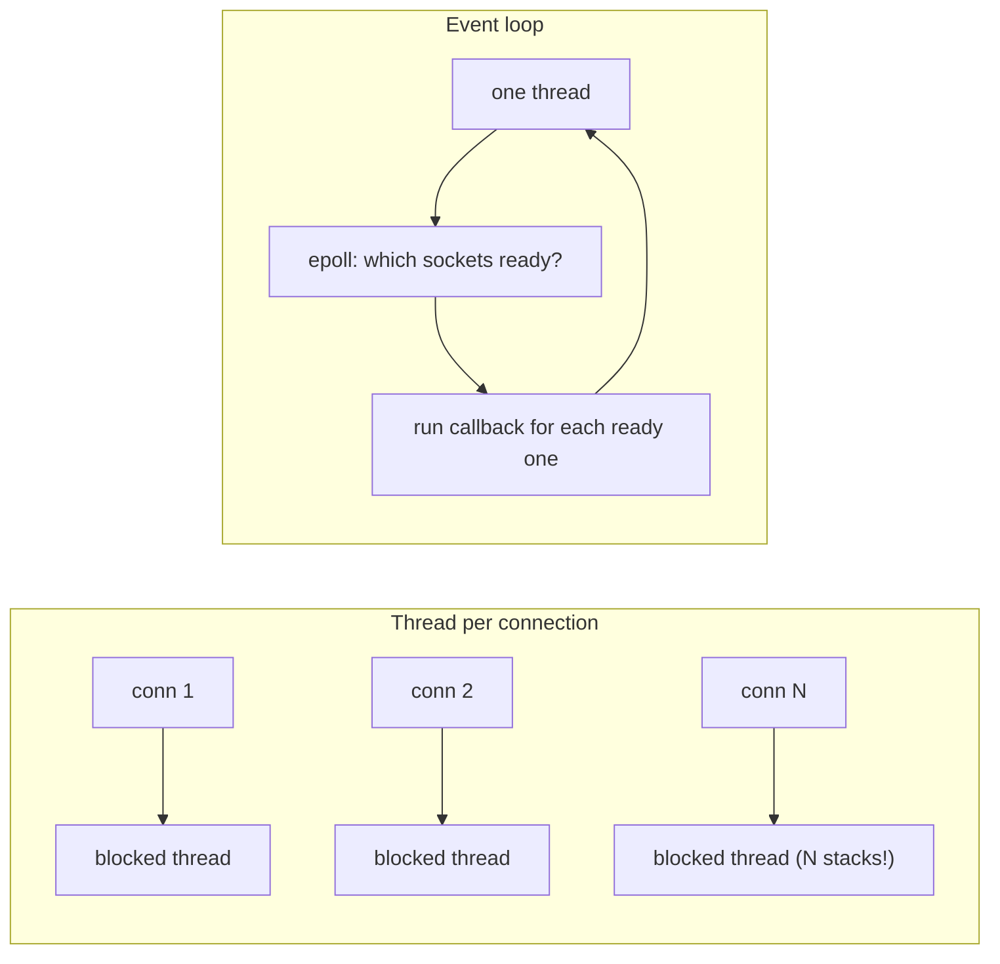

# IO Models: Blocking, Non-Blocking, Async, and Event Loops

*How one thread learned to watch a hundred thousand connections at once.*

`⏱️ ~8 min · 5 of 12 · Computing Fundamentals`

> [!TIP] The gist
> **Blocking I/O** parks a whole thread until data arrives -- simple, but one thread per in-flight operation. **Non-blocking I/O** returns immediately, so one thread can manage many connections -- but needs a way to know which are ready. `epoll` gives the kernel a persistent watch list and hands back only the ready sockets, powering the **event loop**: one thread juggling tens of thousands of connections. It shines for I/O-bound work and falls apart if any callback blocks.

## Contents

- [Intuition](#intuition)
- [How it works](#how-it-works)
- [In the real world](#in-the-real-world)
- [Trade-offs](#trade-offs)
- [Remember](#remember)
- [Check yourself](#check-yourself)

## Intuition

You order at a restaurant.

- **Blocking**: a waiter takes your order and stands at your table doing nothing until your food is ready. One waiter per table. Hire 10,000 waiters for 10,000 tables and you go broke.
- **Non-blocking + event loop**: one waiter takes all orders, then circles the room checking which tables are *ready* for the next step -- serving whoever's ready, moving on instantly. One waiter, the whole room. But if that waiter stops to personally cook one dish, *every* table waits.

## How it works

**The four models, in order of sophistication.**

- **Blocking I/O** -- `read()` suspends the calling thread until data is available. Code reads top-to-bottom, dead simple, but ties up one whole thread per operation.
- **Non-blocking I/O** -- the socket is set non-blocking; `read()` returns immediately, either with data or an "nothing yet, try later" error (`EWOULDBLOCK`/`EAGAIN`). Frees the thread, but naively re-calling in a loop (**busy-polling**) wastes CPU.

---

**Multiplexing: from `select` to `epoll`.**

- `select()` / `poll()` let one thread ask the OS "which of these N descriptors are ready?" and block until at least one is. The catch: you re-pass and the kernel re-scans the *whole* set every call -- **O(n)** as connections grow (and `select` caps at ~1024 descriptors).
- **`epoll`** (Linux; `kqueue` on BSD/macOS, IOCP on Windows) fixes this: the kernel keeps a persistent **interest list** and hands back only the **subset that's actually ready** -- roughly **O(1)**. This is what lets one thread efficiently watch tens or hundreds of thousands of sockets, and it sits under essentially every high-performance event loop (nginx, Redis, Node.js's libuv, Envoy).

---

**The event loop pattern.** One thread, repeating forever:

1. Ask the OS (via epoll) which sockets are ready.
2. Run each ready socket's callback.
3. Repeat.

Brilliant for **I/O-bound** work (lots of waiting, little CPU per request) -- one thread handles huge connection counts without per-thread memory and switch overhead. Terrible if a callback does **CPU-bound or blocking** work: it stalls the *entire* loop and every other connection waits. That's why event-loop systems push heavy work to a separate thread pool.

---

**True async I/O.** epoll/kqueue are *readiness*-based: they tell you *when you may perform I/O without blocking* -- you still issue the read yourself. True async (Linux `io_uring`, Windows IOCP) is *completion*-based: you submit the operation to the kernel and get notified when it's *done*, cutting round-trips into the app. Generally more scalable for very high throughput, and an active area of evolution beyond epoll.

---

**The C10K problem.** In the late 1990s, 10,000 simultaneous connections was a wall for thread-per-connection servers: at ~1-8 MB of stack reserved per thread, 10,000 threads demand multiple gigabytes, plus O(n) `select()` scans and heavy context switching starve real work. Event loops on epoll/kqueue (popularized by nginx) solved it by *decoupling connection count from thread count* -- and the same idea now scales the conversation toward "C10M" via techniques like kernel-bypass networking.

## In the real world

**nginx solved C10K; Cloudflare hit the loop's limit at internet scale.** nginx was built specifically for the C10K problem: instead of one thread per connection, it runs a small fixed set of single-threaded worker processes, each driving a non-blocking event loop on `epoll` so one worker reacts to many thousands of live sockets. Cloudflare, serving over 10 million requests/second across 150+ data centers on nginx, later found a single blocking operation -- synchronous disk I/O -- inside that loop could stall a whole worker; blocked event loops accounted for more than *half* of their p99 time-to-first-byte. The fix was moving blocking file operations off the loop onto a thread pool -- a contemporary re-application of "don't block the event loop" at global scale.

Source: [Cloudflare, "How we scaled nginx and saved the world 54 years every day"](../../../research/backend/F/f-computing-fundamentals-cases-and-sources.md#ss5-io-models-and-event-loops)

## Trade-offs

| | Thread-per-connection | Event loop / async |
|---|---|---|
| Mental model | Simple straight-line blocking code | Callback chains or `async`/`await` |
| Scaling with connections | Poor (memory + switch cost) | Excellent on few threads |
| Risk | Runs out of memory/threads | One blocking call stalls everyone |
| Best for | Modest concurrency, CPU work | High-concurrency I/O-bound work |

## Remember

> [!IMPORTANT] Remember
> An event loop trades "one thread per connection" for "one thread, many connections" -- and the whole bargain collapses the instant a single callback blocks. Never block the event loop; push CPU-heavy or blocking work to a thread pool.

## Check yourself

1. Why does `epoll` scale to 100,000 connections where `select()` chokes? Point to the specific difference in how each handles the descriptor set.
2. Your Node.js server handles thousands of idle connections fine, but one request that does heavy synchronous JSON crunching tanks latency for *all* clients. What's happening, and what's the fix?

---

→ Next: [OS Scheduling and Virtual Memory](06-os-scheduling-virtual-memory.md)
↩ Comes back in: reverse proxies, load balancers, and API gateways (L1), backpressure and worker-pool design (L10, L6), and WebSocket/SSE servers holding many idle connections cheaply (L13).
