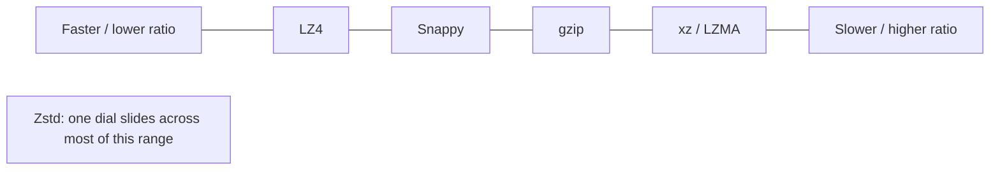

# Compression

_Real data is full of repetition - compression is the art of not writing the same thing twice._

`⏱️ ~6 min · 10 of 12 · Computing Fundamentals`

## Contents

- [The gist](#the-gist)
- [Intuition](#intuition)
- [How it works](#how-it-works)
- [In the real world](#in-the-real-world)
- [Trade-offs](#trade-offs)
- [Remember](#remember)
- [Check yourself](#check-yourself)

> [!TIP] The gist
> Lossless compression shrinks data by exploiting its redundancy - repeated substrings and uneven symbol frequencies - and rebuilds the original _exactly_. Every choice is a point on one line: **speed vs ratio**. gzip is the old middle ground; LZ4/Snappy chase speed; Zstd broke the trade-off by being tunable across the whole range.

## Intuition

Imagine summarizing a book where the phrase "the quick brown fox" appears 500 times. Instead of writing it out each time, you write it once and then say **"repeat phrase #1"** everywhere else. And for letters: give the common ones (e, t, a) short shorthand and the rare ones (q, z) longer shorthand. That's the whole game - back-references for repeats, short codes for frequent symbols.

## How it works

**Two classic techniques, usually combined.**

- **Dictionary coding** (the LZ family, e.g. LZ77) - scan for previously-seen sequences and replace later copies with a short back-reference: "go back N bytes, copy M bytes."
- **Entropy coding** (Huffman, arithmetic/range coding) - give frequent symbols shorter bit-codes and rare ones longer codes, dropping the average bits per symbol below fixed-width.

Most real compressors do both.

 

**The four you'll meet.**

- **gzip** - implements DEFLATE (LZ77 + Huffman). Solid ratio, moderate speed, universally supported (`Content-Encoding: gzip`).
- **Snappy** (Google) - deliberately compresses _less_ than gzip to be much faster; built for hot read/write paths (BigTable, Cassandra).
- **LZ4** - even faster than Snappy, decompression in the multi-GB/s range, lower ratio; chosen when CPU is the tightest resource (real-time pipelines, Kafka batches).
- **Zstd** (Meta) - at LZ4-like speed it can match or beat gzip's ratio, and exposes tunable levels (roughly 1 = fastest, up to ~22 = smallest), so one algorithm covers the whole line.

 

The mental map is one axis with a knob:

## In the real world

**Zstandard (Meta).** Facebook engineer Yann Collet built Zstd because gzip/DEFLATE hadn't meaningfully improved in ~20 years, and every alternative forced a hard choice - LZ4 for speed _or_ xz for ratio, never both. Zstd's published benchmarks claimed roughly 3-5x faster compression than gzip at the same ratio, ~10-15% smaller output at the same speed, ~2x faster decompression, and 22 selectable levels (vs zlib's 9). That "tunable speed vs ratio" is exactly why Zstd became a default codec inside Kafka, RocksDB, and the Linux kernel, displacing gzip in many hot paths.

See [f-computing-fundamentals-cases-and-sources.md](../../../research/backend/F/f-computing-fundamentals-cases-and-sources.md#ss10-compression).

## Trade-offs

| Priority                                            | Reach for               | Because                                |
| --------------------------------------------------- | ----------------------- | -------------------------------------- |
| CPU is scarce, compress/decompress constantly       | ✅ LZ4, Snappy          | fast beats small on a hot path         |
| Balanced, universally supported                     | ✅ gzip                 | safe default, everywhere               |
| Want both speed _and_ ratio, tunably                | ✅ Zstd                 | one dial, whole range                  |
| Compress once, read rarely (archival, cold storage) | ✅ gzip max / xz / LZMA | smallest footprint, CPU cost paid once |

There is no universally "best" codec - ❌ picking one without knowing the access pattern is the mistake. Match it to how often the data is read.

> [!IMPORTANT] Remember
> Every compression decision is a speed-vs-ratio trade matched to your access pattern. Hot path? Favor speed. Cold archive? Favor ratio.

## Check yourself

1. A real-time pipeline compresses and decompresses message batches constantly under tight CPU. Would you pick LZ4 or gzip-max, and why?
2. What did Zstd change about the classic "pick your point on the speed-vs-ratio line" framing?

---

→ Next: [Hashing](11-hashing.md)
↩ Comes back in: L6 (choosing a Kafka compression codec), L13/L14 (storage-cost optimization for data lakes and warehouses)
