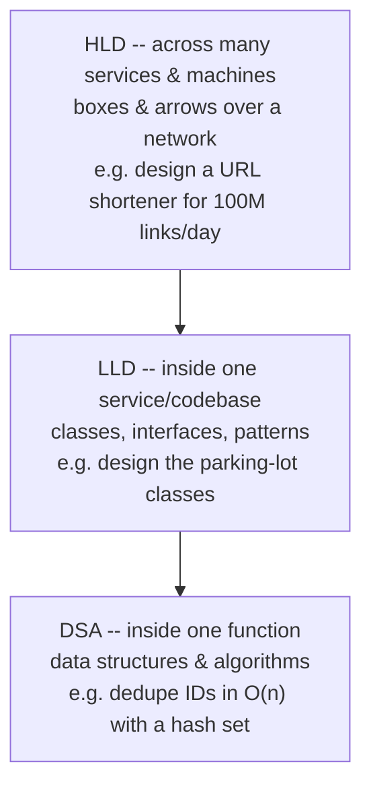

# What System Design Is

*Same features, 10K users vs 10B users -- two completely different systems. That gap is the whole discipline.*

`⏱️ ~6 min · 1 of 13 · System-Design Foundations`

> [!TIP] The gist
> System design is deciding how components (servers, databases, caches, queues) fit together to meet defined goals at a required scale, cost, and reliability. There is no single right answer -- every choice is a trade-off -- so the skill is not memorizing architectures but deriving a defensible one from the requirements, and naming what you gave up.

## Contents

- [Intuition](#intuition)
- [The concept](#the-concept)
- [How it works](#how-it-works)
- [In the real world](#in-the-real-world)
- [Trade-offs](#trade-offs)
- [Remember](#remember)
- [Check yourself](#check-yourself)

## Intuition

Coding is laying bricks: making one wall straight and solid. System design is the **architect's blueprint**: deciding how many walls, where the load-bearing ones go, where the plumbing runs, and how the whole building stays standing in an earthquake.

A perfect brick in the wrong place still gives you the wrong house. Design is reasoning about the *whole* -- how the parts fit -- not the quality of any single part.

## The concept

**Definition.** *System design* is the process of defining a software system's **architecture** -- its **components** (services, databases, caches, queues, load balancers), what each is **responsible** for, how they **communicate**, and how **data flows** between them -- so the system meets its **functional goals** (what it must do) and **non-functional goals** (how well: scale, latency, availability, cost) under real-world constraints.

**The core idea.** A system is *not* its feature list; it is the set of **decisions that let those features run reliably at a required scale and cost.** You choose and arrange **building blocks** to satisfy **requirements** -- and because compute, money, and physics are finite, every arrangement gives up one desirable property to gain another. System design is the discipline of making those trade-offs *on purpose*.

**What it is -- and isn't:**

| It IS | It is NOT |
|---|---|
| Choosing *which* components and *how* they connect | Writing the algorithm inside one function (that's DSA) |
| Sizing them with real numbers (users, QPS, data) | Structuring classes inside one service (that's LLD) |
| Reasoning about failure, growth, and cost | "Picking the trendy database" |

**The terms it rests on** (each is its own upcoming topic -- this lesson is the frame they hang on): **requirements** (functional vs non-functional), **scale** (users, QPS, data size), the core qualities (**availability, reliability, scalability, latency/throughput**), and **trade-offs**.

## How it works

**Three altitudes of "design."** When engineers say "design," they can mean one of three zoom levels. Confusing them is the classic early mistake.

| Altitude | Unit of thought | Question it answers |
|---|---|---|
| **DSA** | code in one process | Is this computation correct and efficient? |
| **LLD** | one well-structured codebase | Are the classes clean, extensible, testable? |
| **HLD** | components across a network | Do the pieces meet the scale/reliability goal together? |

They are nested, not rivals. **This track is mostly HLD** -- how components combine at a given scale, and the trade-offs between arrangements.

---

**Why it's open-ended.** The *requirements*, not the feature list, determine the system. A photo app for 10,000 users can be one server and one database. The "same" app for 10 billion photos needs partitioned storage, a delivery layer, replicated metadata, and async pipelines.

Same features. Different system. Because the numbers changed. That is why an interviewer keeps "Design Twitter" deliberately vague -- they want to see you supply the numbers that shape the answer.

---

**The design mindset -- five habits, in order:**

- **Clarify first.** Don't draw boxes -- ask questions until scope is pinned down. State assumptions out loud so they're corrected cheaply.
- **Requirements drive; numbers size.** *Functional* requirements ("followers can read a post") decide *which* components. *Non-functional* ones ("p99 under 200 ms at 50k QPS") decide *how big and how many*. "It should be fast" is not a requirement.
- **Name the trade-off.** Every non-trivial choice gains something and pays something. A choice stated without its cost is a red flag, not a decision.
- **Start simple, then scale.** Begin with the simplest thing that works (one server, one DB). Add complexity only to relieve a *quantified* bottleneck. Reaching for sharded multi-region up front is premature complexity.
- **Data first.** Access patterns (read-heavy? looked up by which key? must be consistent?) constrain the design more than raw compute. Stateless servers are easy -- you add more. State is the hard part.

## In the real world

Four world-class engineering cultures bake these exact habits into their process:

- **Amazon -- requirements first.** The "Working Backwards" process starts from the customer experience (a mock press release + FAQ) *before* any code, and is explicitly used to decide which products *not* to build.
- **AWS -- name the trade-off by priority.** The Well-Architected Framework treats architecture as continuous trade-offs across pillars, chosen by business context (e.g. trade reliability for lower cost in a dev environment, the reverse for mission-critical).
- **Google -- explicit non-goals.** Design docs include a "Goals / Non-Goals" section, where non-goals are things that *could* be in scope but are deliberately excluded -- making scope-narrowing visible and reviewable before building.
- **Stripe (fintech) -- get the design right first.** A lightweight written API review aims to avoid ever needing versioning; its idempotency-key design makes financial operations safely retryable -- trading implementation complexity for correctness rather than chasing raw throughput.

Sources: [research file -- Real-world & sources](../../../research/backend/L0/01-what-system-design-is.md#real-world--sources)

## Trade-offs

The whole discipline in one sentence pattern:

> *"I'll use **X** because [the priority that matters here], but if **Y** mattered more I'd switch to **Z**."*

Concrete mini-example:

> "I'll use a read-through **cache** because reads dominate and a few seconds of staleness is fine -- but if every read had to be exactly current, I'd drop the cache and read from the primary."

That single sentence proves you know the cost, exposes the assumption, and leaves a clear switch-point for when conditions change.

## Remember

> [!IMPORTANT] Remember
> Understanding here is not reciting "the standard design for X" -- that breaks the moment requirements shift. It's being able to *derive* the design from its requirements: explain why each piece exists, predict what breaks if you remove it, and re-derive the choice when a number changes.

## Check yourself

1. Why does an interviewer keep "Design Twitter" vague instead of handing you exact numbers up front?
2. Fill in the trade-off sentence for adding a message queue between a web request and a slow email-sending task: *"I'll use a queue because ______, but if ______ mattered more I'd ______."*

---

→ Next: Functional vs non-functional requirements
↩ Comes back in: estimation, scalability patterns, applied design
