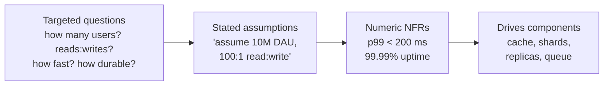

# Functional vs Non-Functional Requirements

_Ten engineers list the same features for a chat app -- then build ten different systems. The difference is never the features._

`⏱️ ~6 min · 2 of 13 · System-Design Foundations`

> [!TIP] The gist
> Functional requirements are what the system does (features: "a user can post a message"). Non-functional requirements are how well it does them (qualities: "p99 under 200 ms, 99.99% uptime, never lose a message"). Features shape the API and data model; the qualities shape the architecture -- and they decide almost everything expensive. Quantify the non-functional ones or you have only named the problem, not scoped it.

## Contents

- [Intuition](#intuition)
- [The concept](#the-concept)
- [How it works](#how-it-works)
- [Trade-offs](#trade-offs)
- [Remember](#remember)
- [Check yourself](#check-yourself)

## Intuition

Think of ordering a house from an architect.

**Functional:** three bedrooms, two bathrooms, a kitchen, a garage, a front door that locks. This is _what the house has_ -- the features you'd ask for by name.

**Non-functional:** it must survive an earthquake, stay warm through winter, cost under a budget, and be built in a year. Nobody "uses" earthquake-resistance the way they use a door -- it's a _quality_ of how the whole thing behaves.

Two families can hand in the **identical room list** and get two structurally unrelated houses -- one a cheap cabin, one a bunker -- purely because the second added "must survive a magnitude-8 quake." The features converged; the qualities diverged; the qualities drove the build.

## The concept

**Definition.** A _requirement_ is a statement the finished system must be true of, agreed **before** you build. It's the contract the design has to satisfy -- you can't call an arrangement "good" or "bad" except relative to what it was supposed to achieve. Requirements come in two fundamentally different kinds.

**Functional requirement (FR)** -- _what the system does_: an observable feature or behavior, usually **actor + verb**. "A user can create an account." "A user can search products by name." "The system sends a notification when a followed user posts."

**Non-functional requirement (NFR)** -- _how well it does it_: a quality attribute or constraint the functions run under. "A search returns in under 200 ms." "The system is up 99.99% of the time." "No committed message is ever lost."

**The quick classifier.** If a user would _ask for it by name_ ("let me upload a photo") it's functional. If it's a _property of how that behaves_ -- speed, uptime, safety, cost, correctness under failure -- it's non-functional. "Upload a photo" is one FR; "the upload finishes under 2 s for a 10 MB file and the photo is never silently corrupted" is two NFRs attached to it.

**The NFR vocabulary** (each becomes its own deep topic later -- learn the names now):

| NFR                               | The question it answers                                                     |
| --------------------------------- | --------------------------------------------------------------------------- |
| **Scalability**                   | What happens when load goes up 10x or 100x?                                 |
| **Availability**                  | How much downtime is acceptable? (99.9% \~ 8.8 h/yr; 99.99% \~ 52 min/yr)   |
| **Latency / performance**         | How long does _one_ request take? (reported as percentiles: p50, p99)       |
| **Throughput**                    | How _many_ requests per second can it sustain?                              |
| **Consistency**                   | Do all readers see the latest write (strong), or converge later (eventual)? |
| **Durability**                    | Once committed, is the data never lost through a crash?                     |
| **Reliability / fault tolerance** | Does it keep working correctly when parts fail?                             |
| **Security / privacy**            | Who may access, change, or see the data?                                    |
| **Cost**                          | What's the money and effort to build and run it?                            |
| **Maintainability**               | How safely can the team understand and change it?                           |

Cost is the one that makes all the others a _trade-off_ rather than a free choice -- with an infinite budget most NFRs are trivial.

## How it works

**FRs shape the interface; NFRs shape the architecture.** They act on different layers, which is exactly why you separate them.

- **Each FR maps to the API surface.** "A user can post a message" becomes an operation: `createMessage(userId, text) -> messageId`. If an FR produces no operation, it isn't really functional -- or you've missed something.
- **Each FR maps to the data model.** The **nouns** become entities, the **verbs** become relationships. "A user follows another user" gives you a `User` entity and a many-to-many `follows` relationship. Writing FRs carefully hands you a first draft of both the schema and the API.
- **NFRs size the architecture.** The feature "send a message" is identical for 100 users or a billion. But "how fast, how many per second, how durable, how available, at what cost" is what forces a single database vs a partitioned cluster, a synchronous write vs a queue, one region vs many. When you reach for a cache, a replica, a shard, or a queue, it's virtually always an **NFR** driving it.

---

**Eliciting requirements: turn a vague prompt into numbers.** A prompt like "design a chat app" gives you rough FRs and almost no NFRs. The move is always the same -- **replace an adjective with a number and a unit**, and where you can't get an answer, state an explicit assumption and move on.

"It should be fast" becomes "p99 read under 200 ms." "Handle a lot of traffic" becomes "sustain 50,000 req/s at peak." "We can't lose data" becomes "durability of committed writes, zero acceptable loss." A requirement you can't measure is one you can't design toward or test -- so quantify relentlessly.

---

**Worked example: a chat app.** Pick a small _core_ subset of FRs to design deeply (send / read messages) and defer the rest (edits, reactions, read receipts) -- naming them so it's clear you scoped on purpose. Then make every NFR numeric:

| Functional requirements (what)              | Non-functional requirements (how well)                          |
| ------------------------------------------- | --------------------------------------------------------------- |
| A user can send a message to a conversation | **Latency:** p99 message delivery &lt; 200 ms                   |
| A user can read a conversation's history    | **Throughput:** sustain 50,000 messages/sec at peak             |
| A user can see who is online                | **Availability:** 99.99% uptime (\~52 min downtime/yr)          |
| A user can create a group conversation      | **Durability:** committed messages never lost                   |
| _(deferred: edits, reactions, receipts)_    | **Consistency:** messages appear in send-order per conversation |
|                                             | **Scale:** 10M daily active users, 100:1 read:write             |

The left column drops out of the product idea in minutes. The right column is where the real design thinking lives -- and every number there is an assumption anyone can challenge.

## Trade-offs

The insight that makes this topic matter: **FRs converge, NFRs diverge.** Ask ten engineers for a chat app's features and you get almost the same list. Ask for its NFRs and you get wildly different answers -- because NFRs encode _scale, quality, and stakes_, which the product idea alone doesn't fix. And since NFRs drive the architecture, divergent NFRs build divergent systems from the **same one-line feature**:

| Same FR: "a user sends a message, others see it" | Best-effort chat (game lobby)           | Never-lose-a-message chat (system of record)                                 |
| ------------------------------------------------ | --------------------------------------- | ---------------------------------------------------------------------------- |
| Delivery                                         | usually within \~1 s; loss/reorder OK   | p99 &lt; 200 ms; exact send-order; delivered even if offline                 |
| Storage                                          | little or none                          | durable, ordered, per-conversation                                           |
| Availability                                     | moderate                                | 99.99% across regions                                                        |
| Resulting build                                  | one service, push over open connections | ack/retry protocol, per-recipient delivery tracking, replication, sequencing |

Same feature, radically different builds -- entirely because the NFRs differ. "What are the non-functional requirements?" is the question that separates a scoped design from a hand-wave.

## Remember

> [!IMPORTANT] Remember
> Features tell you what to build; non-functional requirements tell you what kind of thing it has to be -- and that is the design. Enumerate the FRs to know the what, then pin the NFRs (as numbers) to know the how big and how many. A design decision that can't be traced back to a requirement is either unjustified or is meeting one you forgot to write down.

## Check yourself

1. Classify each as functional or non-functional: (a) "a user can reset their password," (b) "the login page loads in under 1 second," (c) "the system serves 1M concurrent users," (d) "a user can export their data as CSV."
2. Two teams both build a photo-sharing app with the identical feature list, yet one runs on a single server and the other on a partitioned multi-region cluster. What kind of requirement must differ between them, and name two specific ones that could cause the gap?

---

→ Next: Client-server model ↩ Comes back in: estimation, the -ilities, SLA/SLO/SLI, every component choice
