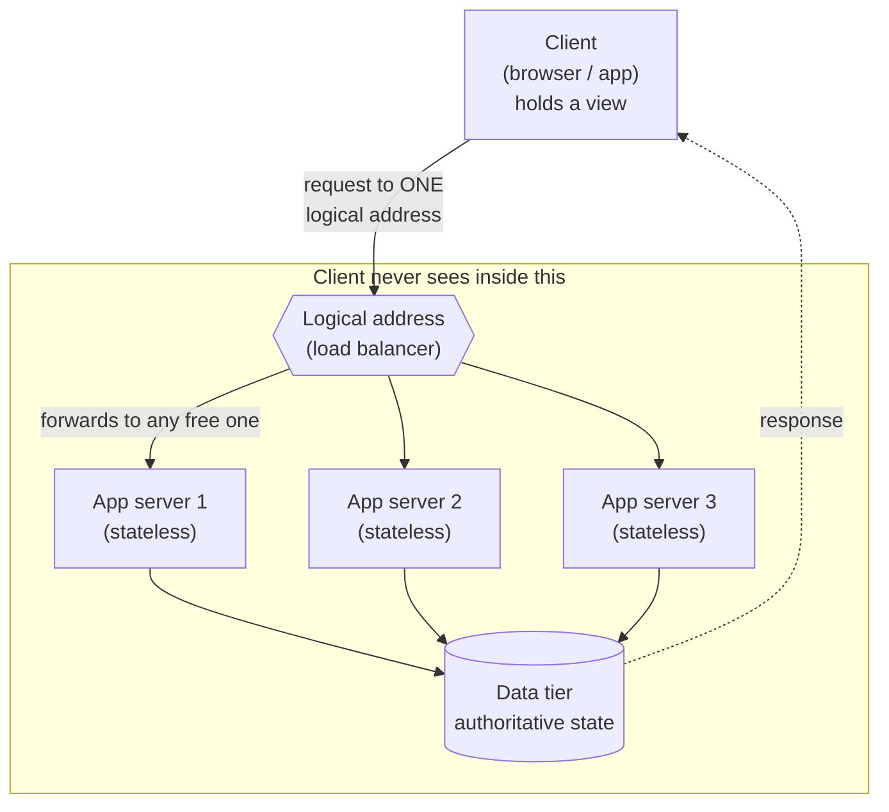

# Client-Server Model

*Your phone doesn't know which of Netflix's thousands of machines answered it -- and that ignorance is the whole trick behind scaling.*

`⏱️ ~5 min · 3 of 13 · System-Design Foundations`

> [!TIP] The gist
> Split a system into two roles: a **client** that *asks* and a **server** that *answers*, talking by passing **request** and **response** messages over a network. The server holds the authoritative truth; the client holds a view. Keep the server **stateless** (it remembers nothing about you between requests) and the client only ever talks to a **logical address**, not a specific box. Those two facts let you hide many identical servers behind one address -- which is where all horizontal scaling comes from.

## Contents

- [Intuition](#intuition)
- [The concept](#the-concept)
- [How it works](#how-it-works)
- [Trade-offs](#trade-offs)
- [Remember](#remember)
- [Check yourself](#check-yourself)

## Intuition

Think of a restaurant.

You (the **client**) decide *when* to order and *what* to order. You call the waiter over -- nothing arrives until you ask. You hold a menu (a view of what's possible), but you don't hold the food or the recipes.

The kitchen (the **server**) waits for orders and prepares them. It holds the ingredients, the recipes, and the final say on what's actually available. It never spontaneously sends you a dish you didn't order.

Now the key part: you don't order from a *specific chef*. You order "table 5, one pasta," hand it to the pass, and **any** available cook can make it. You never know which one did -- and you don't care. The kitchen can add cooks on a busy night without changing a single thing about how you order. That last property is the entire reason this model scales.

## The concept

**Definition.** The client-server model splits a system into two cooperating roles that run as **separate processes** and communicate over a network by exchanging **request** and **response** messages. "Separate processes" means they share no memory -- the *only* way they exchange information is by sending bytes to each other. That separation is the point: the two halves can run on different machines, in different languages, and scale independently.

**Client** -- the process that **initiates** the interaction. It decides *when* to ask and *what* to ask for. It holds no authoritative copy of the data -- only a view, a cache, or a draft -- and defers to the server for the truth. A browser, a mobile app, a `curl` command, and one microservice calling another are all clients *in the moment they send a request*.

**Server** -- the process that **waits** for requests and provides a service in response. It doesn't initiate; it listens on a known address and answers whoever contacts it. It holds the **authoritative state** -- the canonical data and the rules for changing it. When two clients disagree about a value, the server's answer wins.

Two subtleties to internalize now:

- **Client and server are roles, not machines.** The same program can be a server in one interaction and a client in another. A web app server is a *server* to the browser but a *client* to the database it queries. The label describes who is asking and who is answering *for a given request*.
- **The server is a rendezvous point.** Because it has a stable, known address and is always listening, clients that have never heard of each other can coordinate through it. Two phones exchange a message not by finding each other but by both talking to the same server.

**Stateful vs stateless.** *State* is anything the server remembers *about a particular client* across more than one request (who's logged in, what's in the cart). A **stateful** server keeps that in its own local memory -- simple, but it *pins* that client to that one box. A **stateless** server keeps **no** per-client state locally: every request arrives carrying everything needed to handle it, and the server forgets the client the instant it replies. Stateless doesn't mean "no state anywhere" -- the state just moves out of the request-handling process (see below).

## How it works

**The request-response cycle.** The default interaction is one request in, one response out, and the unit of work is done. It is:

- **Client-initiated** -- nothing happens until the client asks; the server can't spontaneously push to a client that hasn't requested.
- **Synchronous from the client's view** -- the client waits for the matching response before considering the operation done.
- **One response per request** -- each request is a self-describing message (what's wanted, who's asking, any input) paired with one response (a status + any data). That self-describing envelope is exactly what makes requests easy to log, cache, retry, and load-balance.

---

**Statelessness: where the state goes.** If the server keeps nothing locally, per-client state moves to one of two places:

1. **A shared store** every server can read/write -- a database, cache, or session store. The server becomes a stateless worker in front of shared, authoritative state.
2. **The token / request itself** -- the client presents a signed credential on every request that encodes who it is and what it may do; the server verifies it without looking anything up locally.

The payoff: because *any* stateless server can handle *any* request, you can put many identical servers behind one address and route each request to whichever is free. Nothing to migrate, no client pinned to a box. That is the causal chain -- **statelessness enables interchangeable servers, which enables horizontal scale.**

---

**Tiers.** A *tier* is a separately deployable layer with a distinct responsibility (a logical separation -- a tier can be one process or many). The two-role idea grows into real systems by adding tiers:

- **2-tier** -- client talks almost directly to a data store. Simple, low-latency; but business rules live near the edge and exposing the data store is a security/coupling problem. Fine for small internal tools.
- **3-tier** (the default) -- **presentation** (the UI the user touches, holds no truth), **application** (servers holding business rules; where request-response and statelessness live), **data** (databases/caches holding authoritative state). You get separation of concerns *and* independent scaling: run many app servers against a smaller data tier; a UI change never touches the database.
- **n-tier / microservices** -- the application tier itself splits into many small services, each owning one capability, each call being its own client-server request-response. Buys independent deploy/scale per capability at the cost of more network hops, failure modes, and harder consistency. Reach for it only when a specific pressure demands it.

Here is the 3-tier shape -- note how **many app servers hide behind one logical address**:

The client sends one request to one address and gets one response back. It has no idea -- and no interest in -- how many machines sit behind that address or which one answered. Add servers, remove servers, replace a crashed one: the client's view never changes.

## Trade-offs

In **peer-to-peer (P2P)** there is no dedicated server role -- every node is both client and server, with no central authority holding the truth. Client-server *centralizes* authority, and that single focal point is both its strength and its cost.

| Dimension | Client-server | Peer-to-peer |
|---|---|---|
| **Authority / consistency** | One authoritative copy -- always a single answer to "what's the current value?" | Same data on many equal peers; must reconcile disagreements (hard) |
| **Security / access control** | One place to authenticate and enforce permissions | Trust spread across nodes you may not control |
| **Updates / operability** | Change rules in one place; every client sees it | Rolling changes across a swarm is far harder |
| **Client complexity** | Clients stay thin; hard logic lives server-side | Every node runs the hard logic |
| **Scaling & availability** | Server is a **focal point** -- load converges on it; if it's down, service is down | Capacity *grows* with the number of participants |
| **Where it wins** | Almost every app needing a single source of truth | Bulk content distribution; deliberate decentralization |

The central bottleneck isn't a flaw to hide -- it's precisely the problem the rest of this track solves (replication, load balancing, caching, redundancy, failover). The trade is deliberate: accept a bottleneck *you control* because it's easier than distributed disagreement you can't. Many real systems are hybrids -- a central server for coordination, P2P for heavy bulk transfer.

## Remember

> [!IMPORTANT] Remember
> A client never talks to a *machine* -- it talks to a **logical address** and expects a response, indifferent to which server answers. Combine that with **stateless** servers (any instance can handle any request) and you can put a load balancer at that address and hide *many* machines behind it. The client's view never changes as you add, remove, or replace servers. That one indirection -- one address, many interchangeable servers -- is the crack through which all horizontal scaling enters.

## Check yourself

1. A web application server is called a "server," yet in the same instant it can also be a "client." Give the two interactions that make both labels true, and explain why the label is per-request, not per-machine.
2. Two consecutive requests from the same logged-in user are handled by two *different* server instances, and the user notices nothing. What must be true about those servers, and where did the per-user state actually live?

---

→ Next: Request lifecycle end-to-end
↩ Comes back in: networking, load balancing, statelessness/scaling
