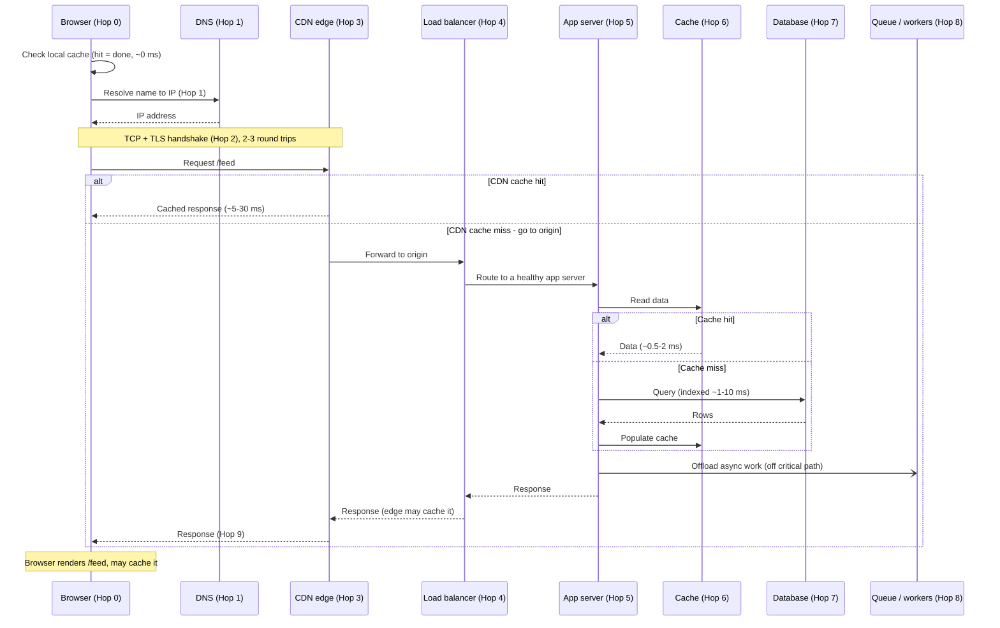

# Request Lifecycle End-to-End

*What feels like an instant click is really a dozen stops -- and each one costs you time, can knock the whole thing over, and is a place you can grow.*

`⏱️ ~7 min · 4 of 13 · System-Design Foundations`

> [!TIP] The gist
> A single request from click to pixels passes through many **hops** -- discrete stops (DNS, TLS, CDN, load balancer, app server, cache, database) where a component does a little work and passes it on. At *every* hop ask three questions: how much **latency** does it add, how can it **fail**, and what **scaling knob** does it expose? The one rule that ties it together: end-to-end latency at p99 is roughly the **sum of the slow hops on the critical path**, so make a system faster by finding the slowest hop and attacking it -- and the cheapest request of all is the one you never make.

## Contents

- [Intuition](#intuition)
- [The concept](#the-concept)
- [How it works](#how-it-works)
- [Trade-offs](#trade-offs)
- [Remember](#remember)
- [Check yourself](#check-yourself)

## Intuition

Think of ordering a package online.

You don't teleport a box from a warehouse to your door. First someone looks up your **address** and turns it into a route. The order gets handed to a nearby **regional depot** -- if that depot already stocks the item, it ships from there and the far-away central warehouse is never touched. If it doesn't, the request travels all the way to the **big warehouse**, which pulls the item off a shelf (fast if it's indexed by aisle, painfully slow if someone has to walk every aisle).

Some steps aren't on your critical path at all: the receipt email and the "recommended for you" update happen *after* your box is already on its way -- they don't make you wait.

Every one of those steps takes time, can go wrong (wrong address, depot closed, item out of stock), and is somewhere the company can add capacity (more depots, more shelf-pickers). A web request is exactly this chain of stops. Naming them is the whole skill.

## The concept

**Definition.** The **request lifecycle** is the ordered chain of **hops** a request passes through from the moment a user acts until the response renders on their screen. A *hop* is one discrete stop where some component receives the request, does a little work, and passes it along. What feels instant is this chain resolving fast.

The entire mental model is three questions asked at **every** hop:

1. **Latency added.** Every hop costs time -- some to do work, often a **round trip** (one message out, one back), bounded by distance and the speed of light. A round trip *inside* one data center is ~0.5 ms; *across a continent* ~40 ms; *across the planet* ~150 ms. Hops that reach a far machine dominate; hops served from local memory are nearly free.
2. **Failure point.** Every hop can be slow, error, or be fully down. A request only succeeds if *every* hop on its path works -- more hops means more ways to fail.
3. **Scaling knob.** Every hop is a place you can add or duplicate a component to handle more load: add a cache, add servers behind a balancer, push content to the edge.

**The key terms**, each a hop you will meet below:

- **DNS** -- the lookup that turns a *name* (`app.example.com`) into a routable *IP address*.
- **TLS handshake** -- the exchange that sets up an encrypted, identity-verified connection before any request data flows.
- **CDN** -- a fleet of edge servers near users that serves cacheable content close by instead of from your distant origin.
- **Load balancer** -- the single front-door address that spreads requests across many healthy app servers.
- **Cache hit / miss** -- *hit*: the data is already in fast memory and returned immediately; *miss*: it's absent, so you fall through to the slower layer below.
- **Replica** -- a copy of the database that serves reads, spreading read load across machines.

**What it is / isn't.** This is the *map* of a request, not the deep mechanics of any one stop -- how DNS packets form, how TCP guarantees delivery, how a load balancer hashes all belong to later levels. The value of the map is that when a system is slow you can locate the slow hop, when it fails you know the blast radius, and when it must grow you know which knob to turn.

The single most useful rule: **end-to-end latency at p99 is roughly the sum of the slow hops on the critical path.** (p99 = the latency 99% of requests finish under -- what your slowest 1% actually feel.) The **critical path** is the hops that must finish *before the response is sent*; anything offloaded or done in parallel does not count.

## How it works

Trace one concrete request: a user opens `https://app.example.com/feed`. It walks these hops in order (approximate latencies shown where useful):

- **Hop 0 -- Client / browser cache.** The browser parses the URL and checks its **local caches** first. A fresh local copy is served with *zero* network cost (~0 ms). The guiding principle of the whole chain: **the cheapest request is the one you never make.**
- **Hop 1 -- DNS.** Turn the name into an IP. Cached answer ~0 ms; a full uncached lookup ~20-120 ms. If DNS is down, the site is unreachable *even though every server is healthy* -- the client never learns where to go.
- **Hop 2 -- TCP + TLS handshake.** Open a connection, then negotiate encryption. A brand-new secure connection costs **2-3 round trips before the request is even sent** (~80-150 ms across a continent) -- pure overhead. **Keep-alive** lets the *next* request skip both handshakes.
- **Hop 3 -- CDN / edge.** The nearest edge server tries to serve cacheable content. **Hit** ~5-30 ms and your origin is never touched; **miss** forwards to the origin and pays the full long-distance trip. Often the single biggest offload in the chain.
- **Hop 4 -- Load balancer.** For anything the CDN can't serve, the origin's front door spreads the request across healthy app servers (~1-5 ms). It's also where **TLS is terminated** so app servers handle plain traffic.
- **Hop 5 -- App server.** Runs the business logic: authenticate, authorize, validate, assemble `/feed`. CPU work is small (~1-10 ms) but it mostly *waits* on the hops below. Being **stateless**, it scales horizontally -- add more identical instances.
- **Hop 6 -- Cache (read path).** Before the database, check fast in-memory cache. **Hit** ~0.5-2 ms, database untouched; **miss** falls through to Hop 7. This is the **number-one lever for read-heavy systems.**
- **Hop 7 -- Database.** The durable **source of truth**, usually the slowest, most contended hop. An **indexed** query ~1-10 ms; an unindexed **full scan** can be far worse. Scale reads with **replicas**, size with **sharding**.
- **Hop 8 -- Async offload.** Work that need not finish before the response -- analytics, notifications, image resizing -- is dropped on a **queue** and done later by **workers**. *Work moved off the critical path stops counting toward the user's latency.*
- **Hop 9 -- Response back.** The result retraces the path outward; the edge may cache it for future users; the browser renders `/feed` and may store it -- so the *next* view skips much of the chain.

Here is the full path -- outbound in order, then the response returning:

## Trade-offs

Where should you optimize? Since p99 tracks the *sum of the slow hops on the critical path*, only the slowest hops move the needle:

| Move | Why it helps | Cost / caveat |
|---|---|---|
| **Attack the slowest hop** (usually DB queries, cross-region round trips) | Shaving a fast hop changes nothing; the slow one dominates | You must *measure* to find it, not guess |
| **Cache at each layer** (browser, CDN, app cache) | The cheapest request is one you never make -- skips latency, load, and failure surface at once | Stale data; invalidation is hard; outage risks a thundering herd |
| **Offload to a queue** | Removes slow work from the critical path so it stops counting | Result isn't ready immediately; needs workers + retries |
| **Add replicas / more servers** | Spreads load across the scaling knob at that hop | Stateful hops (DB) add consistency complexity; stateless ones are easy |
| **Reuse connections, terminate TLS at the edge** | Removes handshake round trips from most requests | Requires keep-alive / pooling and edge infrastructure |

The additive lens is the whole point: don't optimize everywhere -- profile the path, find the one or two hops that dominate p99, and spend your effort there.

## Remember

> [!IMPORTANT] Remember
> A request is a chain of hops, and at every hop ask the same three questions: **latency added, how it fails, what knob scales it.** End-to-end p99 is roughly the **sum of the slow hops on the critical path** -- so to go faster, find the slowest hop and attack it; work you push off the critical path (async) stops counting; and the cheapest request of all is the one a cache lets you never make.

## Check yourself

1. Two requests are slow. In request A the DNS lookup takes 100 ms and everything else is fast; in request B a database query takes 100 ms and everything else is fast. You can only cache one layer -- which fixes which, and why does caching the *fast* hops in either request change nothing?
2. A user reports the site is completely unreachable, yet every application server is healthy and the database is fine. Name two *earlier* hops that could independently cause this, and explain how each makes the client never even reach your servers.

---

→ Next: [Back-of-envelope estimation](05-back-of-envelope-estimation.md)
↩ Comes back in: networking (L1), caching, databases, load balancing, reliability
