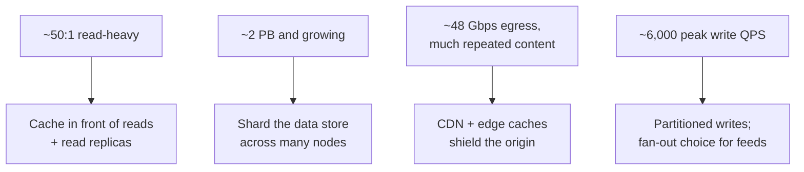

# Back-of-Envelope Estimation

*Before you pour concrete for a road, you count the cars -- one lane or eight is a math question, not a taste question.*

`⏱️ ~7 min · 5 of 13 · System-Design Foundations`

> [!TIP] The gist
> **Back-of-envelope estimation** is rough arithmetic that turns a vague brief ("build a Twitter") into the numbers that actually drive architecture: **QPS** (queries per second), storage in bytes, and bandwidth in bits per second. You chain a few stated assumptions through four stages -- **users -> QPS -> storage -> bandwidth** -- and round hard at every step. Precision is *not* the goal; landing in the right **order of magnitude** (nearest power of ten) is, because that is the granularity at which design decisions flip: one server or a thousand, one disk or a sharded fleet.

## Contents

- [Intuition](#intuition)
- [The concept](#the-concept)
- [How it works](#how-it-works)
- [Trade-offs](#trade-offs)
- [Remember](#remember)
- [Check yourself](#check-yourself)

## Intuition

Imagine you are about to build a road and someone asks: one lane or eight?

You don't need a precise traffic study to answer. You just need a rough count: *maybe* 500 cars an hour points to one lane; *maybe* 50,000 points to a highway. The exact number barely matters -- 480 versus 520 changes nothing. But the difference between hundreds and tens of thousands changes *everything* about what you pour.

That is estimation. A few quick multiplications on the back of an envelope, rounded aggressively, get you to the one thing that matters before you commit: **the scale of the thing you are building.** Guessing the architecture without this is pouring concrete before you count the cars.

## The concept

**Definition.** **Back-of-envelope estimation** is doing rough arithmetic -- the kind that fits on the back of an envelope -- to *size* a system before you design it. You take a few known or assumed inputs (how many users, how often they act, how big each item is) and multiply your way to the quantities that drive architecture: **QPS**, storage in bytes, and bandwidth per second.

**Precision is explicitly not the goal.** Whether the real answer is 8,000 QPS or 11,000 QPS does not change your design -- both say "one beefy server or a small cluster." But 10,000 QPS versus 10,000,000 QPS is the difference between a single node and a globally sharded fleet. Estimation exists to land you in the right **order of magnitude** (the nearest power of ten), because that is where architecture decisions flip.

**The key terms:**

- **DAU** (daily active users) -- the count of distinct users who use the product on a given day. Often the starting input.
- **QPS** (queries per second) -- how many requests hit the system each second. The central rate.
- **Peak vs average** -- traffic clusters around busy hours, so you size for the **peak**, not the flat daily average. Rule of thumb: `peak ~= 2 to 3 x average`.
- **Read:write ratio** -- reads and writes hit different parts of the system (writes go to the primary database; reads can be served from caches and replicas), so you split them. Most consumer systems are strongly read-heavy.
- **Ingress / egress** -- data flowing *into* the system (uploads, writes) vs data flowing *out* to users (feed reads, downloads, media). Usually wildly asymmetric.

**What it is / isn't.** A good estimate is a *chain of clearly labeled assumptions and multiplications ending in a number you can defend* -- not a benchmark and not a promise of accuracy. Its whole worth is that your architecture becomes grounded in a number instead of a hunch. Two habits keep it trustworthy:

- **Round aggressively.** Use 100,000 seconds per day instead of 86,400. Use 1,000 for a kilobyte. Rounding errors are tiny next to the uncertainty in your assumptions, and clean numbers keep the mental math fast and error-free.
- **State every assumption out loud.** "Assume 100M daily users, each posts twice a day, each post is ~1 KB." If an assumption is wrong, a reviewer corrects that one number and reruns the chain. *Hidden* assumptions are the only way estimation actually misleads you.

## How it works

Almost every estimate flows through the same four stages, each feeding the next.

1. **Users to actions.** Start with the population and how busy it is: `daily_actions = DAU x actions_per_user_per_day`. Estimate reads and writes separately -- they behave very differently.
2. **Actions to QPS.** Divide by seconds in a day, then size for the peak: `average_QPS = daily_actions / 100,000`, then `peak_QPS ~= 2 to 3 x average_QPS`. Split read QPS from write QPS.
3. **QPS to storage.** Storage is about what *accumulates*, so it depends on retention, not rate: `storage = bytes_per_item x items_per_day x retention_days`. Then multiply for **replication** (~x3 for durability) and add a fudge factor for **indexes/metadata** (tens of percent to 100%+).
4. **QPS to bandwidth.** Bandwidth is a rate from QPS x payload size: `bandwidth = QPS x bytes_per_payload`. Track **ingress** (write QPS x request size) and **egress** (read QPS x response size) separately.

### The cheatsheets (memorize these)

| Category | Anchor |
|---|---|
| **Time** | 1 day ~= 86,400 s ~= **10^5 s** (round up) |
| **Rate shortcut** | **1M actions/day ~= 12 QPS**; 1B/day ~= 12,000 QPS; inverse: 1 QPS ~= 100,000/day |
| **Data sizes** (each ~1,000x) | 1 KB ~= 10^3 B · MB ~= 10^6 · GB ~= 10^9 · TB ~= 10^12 · PB ~= 10^15 |
| **Item sizes** | tweet ~1 KB · DB row ~100 B-1 KB · thumbnail ~10 KB · web photo ~0.1-1 MB · 1 min video ~5-50 MB |
| **App server** | ~1,000 to 10,000 QPS per node |
| **SQL writes** | ~hundreds to a few thousand writes/s before you scale out |
| **Cache (Redis-like)** | ~100,000+ simple ops/s per node |
| **Network** | **1 Gbps ~= 125 MB/s** (bits / 8); 10 Gbps ~= 1.25 GB/s |

Use the capacity anchors as *ceilings*: divide your required QPS or bandwidth by the per-node anchor to get a rough machine count. Count ~1? Single node. Count in the thousands? Serious distributed territory.

### Worked example: a Twitter-like service at 100M DAU

Users post short messages and read a home feed. Let's size it end to end.

**Assumptions (stated up front):**

- DAU ~= 100M (10^8) · each user **posts** ~2/day · each user **reads** ~100 feed views/day
- A post ~1 KB · a feed view returns ~20 posts ~= 20 KB · peak = 3x average
- Retention: all posts over 5 years · replication x3 · +100% overhead for indexes/metadata

**Write QPS:**

```
daily_writes    = 100M users x 2 posts   = 200M writes/day
avg_write_QPS   = 200M / 10^5 s          ~= 2,000 QPS
peak_write_QPS  = 3 x 2,000              ~= 6,000 QPS
```

~6,000 writes/s at peak -- above a single SQL node's comfortable ceiling, so it points toward sharded or write-optimized storage, but not extreme.

**Read QPS:**

```
daily_reads     = 100M users x 100 views = 10^10 reads/day
avg_read_QPS    = 10^10 / 10^5 s         ~= 100,000 QPS
peak_read_QPS   = 3 x 100,000            ~= 300,000 QPS
```

**Read:write ratio ~= 100,000 : 2,000 = ~50:1** -- strongly read-heavy. This is the single most important number in the whole estimate.

**Storage over 5 years:**

```
raw_per_day    = 200M posts x 1 KB       ~= 200 GB/day
raw_per_year   = 200 GB x 365            ~= 70 TB/year
raw_5_years    = 5 x 70 TB               ~= 350 TB
x3 replication = 350 TB x 3              ~= 1,050 TB ~= 1 PB
+100% overhead = 1 PB x 2                ~= 2 PB total
```

~2 PB of managed storage -- far beyond one machine's disk, so this is inherently a sharded, multi-node problem. (Media would add orders of magnitude more; we sized text only.)

**Egress bandwidth** (reads dominate outbound):

```
egress  = peak_read_QPS x feed_response = 300,000 x 20 KB = 6,000,000 KB/s ~= 6 GB/s
in bits = 6 GB/s x 8                                                       ~= 48 Gbps
```

~48 Gbps at peak -- a single 10 Gbps link can't carry it. **Ingress** by contrast: `6,000 x 1 KB ~= 6 MB/s (~48 Mbps)` -- about 1,000x smaller. Textbook asymmetry.

**The architecture the numbers force:**



Every conclusion traces to a specific number. That is the entire value of the exercise.

## Trade-offs

Estimation is a mindset as much as a method. The rules that make it pay off:

- **Aim within ~10x, not to the decimal.** You want the right order of magnitude; anything finer is false confidence given the input uncertainty.
- **Round aggressively.** 100,000 s/day, 1,000 B/KB, one significant figure. Clean numbers keep the mental math error-free.
- **Always state assumptions.** A labeled chain can be audited and corrected one number at a time; hidden guesses can't.
- **Being roughly right *fast* beats precisely right *slow*.** The estimate exists to unblock a design decision in minutes, not to survive an audit.

## Remember

> [!IMPORTANT] Remember
> The estimate itself dictates most of the architecture. Chain **users -> QPS -> storage -> bandwidth**, round hard, state every assumption -- and each number you land on flips a specific decision: read:write ratio picks caching and replicas, storage volume forces sharding, egress forces a CDN. You are not chasing accuracy; you are finding the order of magnitude at which the design changes.

## Check yourself

1. A service ingests **1 billion events/day**. Roughly how many *average* QPS is that, and if peak is 3x average, what peak QPS do you size for? (Use the cheatsheet.)
2. Your estimate says a system needs ~150 GB of storage total and ~300 peak QPS on stateless app servers. For each number, does it push you toward a single node or a distributed fleet -- and why does knowing *only the order of magnitude* already answer the question?

---

→ Next: [Latency numbers every engineer should know](06-latency-numbers-every-engineer-should-know.md)
↩ Comes back in: caching, sharding, capacity planning, applied design
