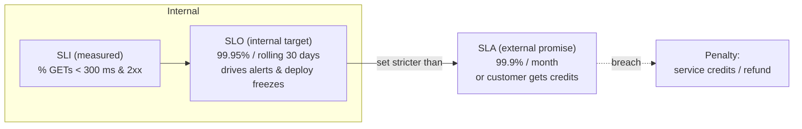

# SLA, SLO, SLI

*"Reliable" is a feeling until you can measure it, aim at it, and put money on it -- three words do exactly that, in that order.*

`⏱️ ~5 min · 8 of 13 · System-Design Foundations`

> [!TIP] The gist
> These three terms turn the fuzzy word "reliable" into something concrete, each broader than the last. **SLI** = what you *measure* (a number, e.g. % of requests fast and successful). **SLO** = the internal *target* you aim for (e.g. 99.95% over 30 days). **SLA** = the external *promise* to a customer, with penalties if you miss it (e.g. 99.9% or you owe service credits). Order it as measurement -> goal -> promise, and keep the SLO stricter than the SLA so ordinary bad days don't become contract breaches.

## Contents

- [Intuition](#intuition)
- [The concept](#the-concept)
- [How it works](#how-it-works)
- [Trade-offs](#trade-offs)
- [Remember](#remember)
- [Check yourself](#check-yourself)

## Intuition

Picture a food-delivery service and follow the same idea through three lenses:

- **SLI** -- you *measure* every order: how many actually arrived within 30 minutes? That number (say 96% this week) is the indicator. It's a measurement, not a judgment yet.
- **SLO** -- internally the team decides "we want 95% of orders inside 30 minutes." That's the target the kitchen and drivers are managed against. Dip below it and someone gets paged.
- **SLA** -- to the customer you *promise* "delivered in 45 minutes or your delivery fee is refunded." Miss that and it costs real money.

Notice the internal target (95% within 30 min) is tougher than the customer promise (45 min or refund). That gap is deliberate: it's the cushion that keeps a slow Friday from turning into a pile of refunds.

## The concept

Three nested definitions, narrowest to broadest:

**SLI (Service Level Indicator)** -- a quantitative metric of how the service is *actually* behaving, chosen to reflect what the *user* experiences. It's a measurement, not a target: an SLI has no "good" or "bad" until an SLO is attached. Good SLIs are ratios or percentiles over a window, e.g. `good requests / total requests`, p99 latency, or the combined "fraction of requests under 200 ms *and* returning 2xx." Measure it as close to the user as possible (at the load balancer or client), because server-side numbers like CPU or *average* latency can look fine while users suffer.

**SLO (Service Level Objective)** -- an internal *target* for an SLI over a defined window, that the owning team commits to hitting. It names a specific SLI, a target percentage, and a time window (a rolling 30 days is the common choice). This is what you *alert on* and make go/no-go deploy decisions against. A well-formed SLO is set from user expectations and past performance, not a round number -- and it should be **stricter than any SLA** it backs.

**SLA (Service Level Agreement)** -- an external, often contractual *promise* about a service level, paired with **consequences** if broken: service credits, refunds, penalty payments, a right to terminate. This is the one feature that separates it from an SLO -- missing an SLO triggers an internal alert and a conversation; missing an SLA triggers a financial or legal penalty. It's a business/legal artifact shaped by sales and negotiation, deliberately set *looser* than the SLO, and usually covers fewer, coarser guarantees (a contract might promise only overall availability while the team internally tracks availability plus several latency and error-rate SLOs).

One-sentence summary: **the SLI is what you measure, the SLO is the goal you set for it, and the SLA is the promise you make about it -- backed by penalties.**

## How it works

### The flow: measure -> target -> promise



The SLI feeds the SLO (you can't set a target without a measurement); the SLO feeds the SLA (you can't credibly promise a level you don't already hit internally). The safety gap lives between the SLO and the SLA.

### Worked example: a cloud storage API

| Term | Statement |
|------|-----------|
| SLI  | Fraction of `GET` requests that complete in under 300 ms *and* return 2xx, measured at the load balancer. |
| SLO  | 99.95% of requests meet that SLI over a rolling 30-day window. *(Internal target -- drives paging and deploy freezes.)* |
| SLA  | 99.9% availability per calendar month, or the customer receives service credits; below 99.0%, larger credits. *(External contract, with finance consequences.)* |

The SLA (99.9%) is deliberately looser than the SLO (99.95%). That ~0.05-point gap is the cushion of normal operational variance the team can absorb before a bad month becomes a revenue-impacting breach. Set the SLO equal to the SLA and you've signed a contract with zero margin for error.

### Error budget: reliability as a currency

The error budget is the allowed "badness" implied by the SLO:

```
error budget = 1 - SLO
```

For a 99.9% SLO over a 30-day month:

```
30 days x 24 h x 60 min      = 43,200 minutes/month
0.1% (1 - 0.999) of 43,200   ~= 43.8 minutes/month
```

So a 99.9% monthly SLO gives you **~43.8 minutes** of allowed failure per month. Reframing it as a spendable budget changes the conversation:

- **Spend it on purpose** -- a risky feature rollout, a schema migration, an aggressive canary all *consume* budget. Some risk is the accepted cost of shipping.
- **Freeze when it's gone** -- if the budget for the window is exhausted, stop taking on new risk: deploys slow or freeze and effort shifts to reliability work, until the rolling window resets.
- **A shared, objective rule** -- "should we ship this risky change?" becomes "is there budget left, yes or no?" -- aligning feature-shippers and stability-keepers against the same number.

## Trade-offs

- **Why SLO < SLA (never equal).** The gap is your early-warning margin. Keep them tight-then-loose so SLO alerts fire *well before* an SLA is at risk; set them equal and any bad week becomes an instant contract breach.
- **Tighter SLO = less room to move.** A stricter SLO shrinks the error budget, which means less headroom for risky deploys and change. Set it too tight and you burn engineering effort chasing reliability no user can perceive, and you slow velocity for no real benefit.
- **The error budget balances reliability vs velocity.** Budget left -> ship boldly. Budget spent -> slow down and stabilize. It's the dial that trades speed of change against risk of failure, using one agreed number instead of an argument.

## Remember

> [!IMPORTANT] Remember
> **SLI = measure, SLO = target, SLA = promise-with-penalty** -- narrowest to broadest. Always keep the **SLO stricter than the SLA** so ordinary variance never breaches a contract, and treat `error budget = 1 - SLO` as a currency: spend it on risky change, freeze when it runs out.

## Check yourself

1. A team sets its internal SLO to exactly the same number as its customer-facing SLA. Why is that dangerous, and what should the relationship be instead?
2. A 99.9% monthly SLO gives roughly how many minutes of error budget? Show the arithmetic.

---

→ Next: [Vertical vs Horizontal Scaling](09-vertical-vs-horizontal-scaling.md)
↩ Comes back in: reliability/SRE, observability, capacity planning
