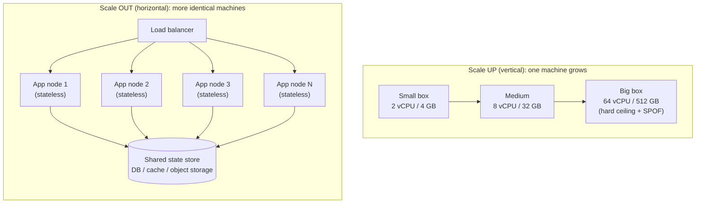

# Vertical vs Horizontal Scaling

*When one machine can't keep up, you have exactly two moves -- make it bigger, or make more of it. Everything else is detail.*

`⏱️ ~6 min · 9 of 13 · System-Design Foundations`

> [!TIP] The gist
> **Scale up (vertical)** = keep one machine, give it more CPU/RAM/disk. Simple, but there's a biggest box money can buy, and one box is a single point of failure. **Scale out (horizontal)** = add more identical machines behind a load balancer. Near-unbounded and fault-tolerant, but it drags in distributed-systems complexity. The trick that makes scale-out easy is **statelessness**: if a server keeps no client-specific data locally, any node can serve any request, so you can add, remove, or replace nodes freely. Rule of thumb: **scale up first, scale out when forced** by ceiling, availability, or cost.

## Contents

- [Intuition](#intuition)
- [The concept](#the-concept)
- [How it works](#how-it-works)
- [Trade-offs](#trade-offs)
- [Remember](#remember)
- [Check yourself](#check-yourself)

## Intuition

Picture a busy shop with one checkout lane getting swamped.

- **Scale up:** train and equip that one cashier to work faster -- a bigger till, a quicker scanner, more hands. One lane, more powerful. Simple, but there's a limit to how fast one person can go, and if that cashier calls in sick the shop stops.

- **Scale out:** open more identical checkout lanes and put a greeter at the door directing each customer to a free one. Now you can add lanes as crowds grow, and if one lane closes the others carry on.

That greeter directing customers is a **load balancer**. And the whole thing only works because any lane can serve any customer -- no lane holds something the others don't. That "any lane serves anyone" property is **statelessness**, and it's the hinge of this entire topic.

## The concept

Every server has finite resources -- CPU, RAM, disk throughput, network bandwidth. When traffic or data grows enough to saturate one of them, requests queue, latency climbs, errors appear. That's the moment you must scale, and there are only two fundamental directions:

**Vertical scaling (scale up)** -- keep one machine but make it more powerful: more vCPUs, more RAM, faster disk, a bigger instance type. The application still runs as a single node on a single box. In the cloud this is often a one-line change to a larger instance and *no code change at all*.

**Horizontal scaling (scale out)** -- keep the machines roughly the same size but add more of them, and spread the work across the fleet with a load balancer in front. Each node runs a copy of the application; together they form a pool of interchangeable workers.

A few terms that thread through both:

- **SPOF (single point of failure)** -- any component whose failure takes down the whole system because nothing else can do its job. A single scaled-up machine *is* a SPOF.
- **Load balancer** -- the component that distributes incoming requests across a fleet so no single node is overwhelmed (and routes around dead ones).
- **Stateless** -- a server keeps *no* client-specific data locally between requests; everything it needs arrives in the request or is fetched from a shared backend. This is what makes nodes interchangeable.
- **Sticky sessions** -- pinning a given user to one specific node (an anti-pattern we'll return to).

Scaling up is *not* about availability -- a bigger box is still one box. Scaling out is *not* automatically fault-tolerant -- that has to be designed in.

## How it works

### The two shapes

Scale-up is one box getting bigger along a line that ends at the largest machine you can buy. Scale-out is a load balancer fanning requests across N identical, disposable nodes -- and all the state they share lives in a separate store behind them.

### Statelessness: where the state goes

Scale-out works cleanly only when *any node can handle any request*. That requires the app tier to hold no local client data. To get there, you push each kind of state out to a shared place:

- **Session and cache data** -> a shared in-memory store (e.g. Redis) or a database, so every node reads the same source.
- **Uploaded files and blobs** -> object storage instead of a node's local disk, so any node can reach them.
- **User identity** -> carried inside the request as a signed token, so any node can verify the caller without a local session lookup.

Now nodes are interchangeable and disposable -- exactly what lets the load balancer send your next request to a different node with an identical result.

The catch: the shared stores you pushed state into -- databases, caches, brokers -- are themselves **stateful**, and scaling *them* out is the genuinely hard part (sharding, replication, consistency). That's why the app tier is the "easy" tier to scale out, and scaling state is deferred to later.

**Anti-pattern -- sticky sessions.** Pinning a user to one node so it can keep their session in local memory looks convenient, but it reintroduces every problem statelessness solved: that node becomes a SPOF for those users, load spreads unevenly, and you can't freely replace nodes without dropping sessions. Prefer shared session state; keep nodes interchangeable.

### The rule: scale up first, scale out when forced

Scaling up is cheap in engineering effort and free of distributed complexity, so it's usually the right first move. Reach for scale-out when one of three forces makes scale-up untenable:

- **Ceiling** -- you've run out of bigger machines.
- **Availability** -- you can't accept one machine as a SPOF.
- **Cost** -- large instances cost super-linearly, so many small boxes are cheaper for the same capacity.

Mature systems do **both at once**, per tier: the **stateless app tier** scales *out* (many nodes behind a load balancer, autoscaled), while the **database tier** scales *up* (bigger primary box) as long as possible, because scaling state out is invasive. "Vertical vs horizontal" is rarely a whole-system verdict -- it's a per-component decision.

## Trade-offs

| Dimension | Vertical (scale up) | Horizontal (scale out) |
|---|---|---|
| Complexity | Simple -- often no code change | Distributed complexity: LB, sharding, replication |
| Capacity ceiling | Hard limit (biggest box) | Near-unbounded -- add nodes |
| Availability / SPOF | One box = SPOF; resize needs downtime | Fault-tolerant if designed; LB routes around dead nodes |
| Cost curve | Super-linear near the top | More linear (commodity machines), elastic/autoscaling |
| Consistency | Trivial -- all state in one place | Hard -- replication lag, partitions, conflict resolution |

**Use vertical when:** early stage or moderate scale where simplicity wins; the workload is hard to distribute (e.g. a single relational DB primary serving strongly consistent writes -- scale it up before the far more invasive step of sharding); or you need a quick capacity win to buy design time.

**Use horizontal when:** scale is large or unpredictable; high availability is a hard requirement; you have a read-heavy web tier of independent requests; or you expect ~10x growth where scaling out early beats a painful re-architecture later.

## Remember

> [!IMPORTANT] Remember
> Make the **app tier stateless** and it scales *out* freely -- interchangeable, disposable nodes behind a load balancer. Push the hard state problem into purpose-built **stateful** systems (databases, caches) and scale those *up* as long as you can. Scale up first for simplicity; scale out when ceiling, availability, or cost forces your hand -- and expect mature systems to do both, per tier.

## Check yourself

1. Your web servers store each logged-in user's session in local memory, and you want to add more servers behind a load balancer. Why will this cause problems, and what change makes the tier scale out cleanly?
2. A team keeps scaling its single database primary to bigger and bigger instances instead of scaling the stateless app servers out. Give one reason that's a reasonable default for the database -- and name the three forces that would finally push them off it.

---

→ Next: [Percentiles and Tail Latency](10-percentiles-and-tail-latency.md)
↩ Comes back in: load balancing, sharding, replication, autoscaling
