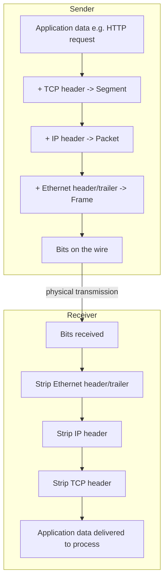

# OSI and TCP/IP Models

*One giant problem -- get bytes from a process here to a process across the planet -- sliced into a stack of small, independent ones. This is the map every other L1 topic hangs on.*

`⏱️ ~7 min · 1 of 17 · Networking`

> [!TIP] The gist
> A network moves data by stacking layers, each with one job and a clean interface to its neighbors. **OSI** is the 7-layer *reference* model that gives the industry its vocabulary ("that's a Layer 3 problem"); **TCP/IP** is the 4-layer *practical* model every real device actually runs. As data goes down the stack each layer wraps it in its own header (**encapsulation**); on arrival each layer strips its header back off (**decapsulation**). Learn where each protocol lives on this map now, and DNS, TCP, HTTP, TLS, and load balancers all have a home before you study them.

## Contents

- [Intuition](#intuition)
- [The concept](#the-concept)
- [How it works](#how-it-works)
- [In the real world](#in-the-real-world)
- [Trade-offs](#trade-offs)
- [Remember](#remember)
- [Check yourself](#check-yourself)

## Intuition

Think about mailing a letter internationally.

You write the note (your words). You seal it in an envelope with a street address. The post office puts that envelope into a labeled mail sack for a city. The airline loads that sack into a container bound for a country.

Each stage **wraps** what came before and only reads *its own* label. The airline never opens your letter; it just moves the container. The mail carrier at the far end never touches the container; they just read the street address. Each layer does one job, trusts the layer above to have packed a valid payload, and hands off through a simple interface.

A network works exactly like this -- nested envelopes, each added on the way out and peeled off on the way in.

## The concept

**Definition.** A **layered network model** decomposes "move application data between two machines" into an ordered stack of **layers**. Each layer (1) has **one responsibility**, (2) exposes a **simple interface** to the layer above and consumes one from the layer below, hiding its internal complexity (**abstraction**), and (3) can be **implemented, replaced, or evolved independently** as long as its interface stays fixed.

**Why layering exists -- the three payoffs:**

- **Separation of concerns.** The chat-app developer never thinks about Wi-Fi signal modulation; the radio engineer never thinks about your app's logic. Each works inside their own layer's contract.
- **Interoperability.** A packet from a Linux server crosses Cisco routers, a home Wi-Fi box, and arrives understood -- because every hop agrees on the same layer boundaries and header formats, *not* the same vendor or OS.
- **Independent evolution.** Wi-Fi replaced Ethernet cable, IPv6 is replacing IPv4, HTTP/1.1 became HTTP/2 became HTTP/3 -- each changed *one* layer without disturbing the others.

**Two models formalize this**, and you need both:

- **OSI (Open Systems Interconnection)** -- a **7-layer reference model** (ISO, early 1980s). Never adopted literally as an implementation, but its layer *numbers* are the vocabulary the whole industry speaks.
- **TCP/IP (the Internet Protocol Suite)** -- a **4-layer practical model** that predates OSI and describes how the real internet is actually built. Every OS's network stack literally implements it in code.

**Key terms it rests on:**

- **Layer** -- one horizontal slice of the stack with a single job.
- **PDU (Protocol Data Unit)** -- the named chunk of data at a given layer, *including that layer's own header* (Segment, Packet, Frame, Bit...).
- **Encapsulation / decapsulation** -- wrapping data in a header on the way down / stripping it on the way up.
- **Addressing** -- each layer identifies its target differently: **port** (which process), **IP address** (which host), **MAC address** (which interface on the local link).

**What it is NOT.** It is *not* a description of separate programs that run one after another -- the layers are conceptual responsibilities, often handled inside the same OS kernel and libraries. And OSI is *not* what runs on the wire; it's the ruler you measure with, while TCP/IP is the thing being measured.

## How it works

### The layers, side by side

`Layers 1-4 move data; layers 5-7 are about what the data means.` Everything below Transport just gets bytes somewhere; Transport and above care what those bytes are *for*.

| OSI # | OSI layer | Job | PDU | Addressing | TCP/IP layer |
|---|---|---|---|---|---|
| 7 | **Application** | The protocol the app speaks; the *meaning* of the message | Data / Message | (uses L4 ports) | Application |
| 6 | **Presentation** | Format on the wire: encoding, serialization, encryption | Data | -- | Application |
| 5 | **Session** | Establish / manage / tear down a logical conversation | Data | session IDs | Application |
| 4 | **Transport** | End-to-end delivery **between processes**; reliability, ordering | **Segment** (TCP) / **Datagram** (UDP) | **Port** | Transport |
| 3 | **Network** | End-to-end delivery **between hosts**; addressing + routing | **Packet** | **IP address** | Internet |
| 2 | **Data Link** | Delivery across **one physical link**; framing, error check | **Frame** | **MAC address** | Link |
| 1 | **Physical** | Raw **bits** as electrical / light / radio signals | **Bit** | -- | Link |

Mnemonic (bottom-up): **"Please Do Not Throw Sausage Pizza Away."**

Notice the squeeze: OSI's top three layers (Application, Presentation, Session) all collapse into TCP/IP's **one** Application layer. That's why Session and Presentation feel abstract -- real protocols like HTTP just do their own framing, keep-alive, and encoding rather than delegating to separate named protocols.

### The three addresses (memorize cold)

- **MAC address** -- burned into a network card; meaningful **only on the local link**. It never survives a router hop -- a router swaps it at every hop.
- **IP address** -- identifies a host; what routers use to pick the next hop. It **survives end-to-end** across the whole path.
- **Port** -- identifies **which process** on that host (443 for HTTPS, 53 for DNS). This is how one IP can run many services at once.

### Encapsulation and decapsulation

This is the mechanical heart of the topic. Going **down** the sender's stack, each layer wraps the data above it in its own header (and at L2, a trailer too) -- treating everything above as an opaque payload. Going **up** the receiver's stack, each layer strips its own header, reads the field that says "hand this up to X next," and passes the rest along.

Every device only decapsulates as deep as its job requires: a switch reads L2, a router reads up to L3, and **only the two true endpoints ever unwrap all the way to L7**. That selective peeking is *why* layering buys interoperability.

### Worked example: one HTTP request down and back up

A browser sends `GET /feed` to a server.

**Down the client's stack (top to bottom):**

1. **L7 Application** -- browser builds the bytes: `GET /feed HTTP/1.1\r\nHost: app.example.com...`. This is the raw **Data**.
2. **L4 Transport** -- OS adds a **TCP header**: source port `54321`, destination port `443`, sequence numbers, flags. Now a **Segment**.
3. **L3 Network** -- OS adds an **IP header**: source IP (client), destination IP (server, already resolved via DNS). Now a **Packet**.
4. **L2 Data Link** -- NIC adds an **Ethernet header**: source MAC (client), destination MAC = **the local router's MAC, not the server's** (the destination is off-link -- this is what the "default gateway" is for), plus a trailer checksum. Now a **Frame**.
5. **L1 Physical** -- NIC turns the frame into signals on the wire. Now **Bits**.

**At every router in between:** the router decapsulates **up to L3 only** -- strips the frame, reads the destination IP, consults its routing table, and re-wraps the *same untouched packet* in a **brand-new L2 frame** for the next hop's MAC. This is exactly why MAC is local-link-only and IP is end-to-end.

**Up the server's stack (the mirror):** L1 rebuilds the frame -> L2 checks the MAC + checksum and strips it -> L3 checks the IP, sees "protocol = TCP," strips it -> L4 uses port `443` to find the web server's socket, reorders bytes, strips it -> L7 reads the HTTP and builds a response, which heads right back down the same five steps.

**The overhead this costs, concretely:** ~14 B Ethernet + ~20 B IPv4 + ~20 B TCP ≈ **~54+ bytes per segment** before a single byte of your payload. That's why tiny, chatty API calls are proportionally expensive and batching/compression matters more as payloads shrink.

### Which layer does X live on

Placing every upcoming L1 topic on the map now -- *before* you learn its internals -- is the whole payoff:

| Topic (coming up) | OSI layer | PDU |
|---|---|---|
| Ethernet, ARP | Data Link (2) | Frame |
| IP, subnets, NAT, Anycast/BGP | Network (3) | Packet |
| TCP, UDP | Transport (4) | Segment / Datagram |
| TLS handshake | Presentation-ish (6) | Data (wraps app data before TCP) |
| DNS | Application (7) | Data (usually over UDP) |
| HTTP/1.1, 2, 3 | Application (7) | Data (QUIC also does transport work) |
| WebSockets / SSE / long-polling | Application (7) | Data |
| Load balancers: **L4 vs L7** | named after Transport (4) vs Application (7) | Segment vs Data |
| Reverse proxies, API gateways, CDNs | Application (7) | Data |

## In the real world

The clearest everyday fingerprint of this model is the phrase **"L4 vs L7 load balancer."** An **L4** balancer reads only as far as the TCP/UDP header (IP + port) to route a packet -- fast, protocol-agnostic, blind to the HTTP path. An **L7** balancer fully decapsulates up to the HTTP request and can route on path, headers, or cookies -- more flexible, more work per request.

Those numbers are a direct, literal borrow from the OSI layers you just learned. Same logic applies to any device: a switch (L2) can't see IP addresses; a router (L3) can't see ports or HTTP paths; a firewall filters at L3/L4 (IP/port) or L7 ("application firewall"). Knowing a device's layer instantly tells you the ceiling of what it can route or filter on.

Sources: [research file -- Real-world and sources](../../../research/backend/L1/01-osi-and-tcp-ip-models.md#real-world-and-sources)

## Trade-offs

**OSI vs TCP/IP -- when to reach for each:**

| | OSI (7 layers) | TCP/IP (4 layers) |
|---|---|---|
| Nature | Reference / teaching model | Implementation model |
| Use it to... | *speak* precisely ("Layer 7 LB") | *understand* how a real stack is built |
| Reality | Never adopted on the wire | What every OS actually runs |
| Granularity | Splits out Session + Presentation | Folds them into Application |

**The cost of layering vs its benefit:**

- ✅ Modularity, interoperability, independent evolution -- swap the physical medium and the app never notices.
- ❌ Per-packet **header overhead** (~54+ B on TCP/IP/Ethernet) and per-layer CPU cost on every packet.

That tension is real enough that modern protocols push back on it: QUIC (HTTP/3) deliberately blurs the Transport/Application boundary to cut overhead and head-of-line blocking -- a design choice you'll meet in the HTTP topic.

## Remember

> [!IMPORTANT] Remember
> This layer model is the **map for the entire networking level**. Every protocol you're about to study -- IP, DNS, TCP, UDP, HTTP, TLS, WebSockets -- and every device -- switch, router, proxy, load balancer, CDN -- has a fixed home on it. Once you know a thing's layer, you know its PDU, its addressing, and the ceiling of what it can see and change.

## Check yourself

1. A router receives a frame, forwards it, and sends it out. Which header does it read, which does it strip, and which brand-new header does it build before retransmitting? Why does the MAC change at every hop while the IP does not?
2. Fill in the blank: a switch operates at Layer __, a router at Layer __, a plain TCP load balancer at Layer __, and an HTTP-aware reverse proxy at Layer __.

---

→ Next: [IP addressing and subnets](02-ip-addressing-and-subnets.md)
↩ Comes back in: load balancers (L4 vs L7), TLS, HTTP, CDN
