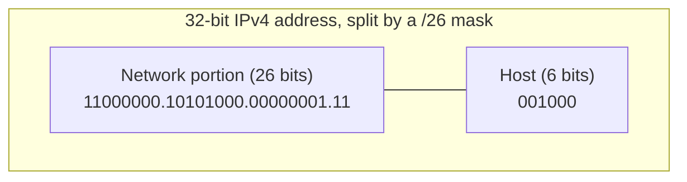

# IP Addressing and Subnets

*You now know IP lives at Layer 3 and carries packets host-to-host. This is the address on the packet -- how it's built, and how one big block gets carved into many.*

`⏱️ ~8 min · 2 of 17 · Networking`

> [!TIP] The gist
> An IP address isn't one flat number -- it's split into a **network portion** (which network) and a **host portion** (which machine on it), like a street address is a street plus a house number. **A mask (or CIDR `/prefix`) decides where that split falls**, and that single boundary is what lets a router answer "is this destination on my network, or do I forward it?" Subnetting is just moving that boundary in bits to slice one block into smaller ones. IPv4 is 32 bits (and ran out); private ranges + NAT + IPv6 are the response.

## Contents

- [Intuition](#intuition)
- [The concept](#the-concept)
- [How it works](#how-it-works)
- [In the real world](#in-the-real-world)
- [Trade-offs](#trade-offs)
- [Remember](#remember)
- [Check yourself](#check-yourself)

## Intuition

Think of a postal address: **`10 Baker Street`**.

`Baker Street` tells the postal system *which street* -- it's shared by every house on that road. `10` tells the carrier *which house* on that street. The mail network routes on the street name (get the letter to the right road), and only the final carrier cares about the house number.

An IP address works exactly the same way. Part of it names the **network** (the street, shared by every host on it), and the rest names the **host** (the specific house). A router routes on the network part; the final delivery uses the host part.

The catch the postal analogy hides: on an IP address, **where the street name ends and the house number begins is not fixed** -- a separate value called the *mask* draws that line. Change the mask and the exact same digits mean a different network.

## The concept

**Definition.** An **IP address** is the Layer 3 identifier assigned to a network interface so routers can decide where to forward a packet and the destination host can be uniquely identified. Every IP address is conceptually two parts:

- **Network portion** -- identifies *which network* the host is on. Every host on the same segment shares it.
- **Host portion** -- identifies *which specific host* within that network.

**The one idea everything else rests on:** an IP address alone is meaningless without knowing where the network/host boundary falls. `192.168.1.5` could be "host 5 of a /24" or something entirely different under a /16. **The mask is not optional metadata -- it is half the address's meaning.**

**IPv4** addresses are **32 bits**, written as four 8-bit **octets** in decimal (0-255) separated by dots -- **dotted-decimal notation**, e.g. `192.168.1.5`. That gives 2^32 ≈ **4.3 billion** addresses, which the internet outgrew.

**CIDR notation** writes a block as `address/prefix-length`, e.g. `10.0.0.0/24`. The number after the slash is how many *leading bits* are the network portion; everything after is host. A **subnet mask** (`255.255.255.0`) is the older, equivalent way to say the same thing -- network bits all `1`, host bits all `0`. `/24` and `255.255.255.0` are identical.

**Private vs public.** **RFC 1918** reserves ranges that are *not* routable on the public internet and can be reused freely inside any private network. A public IP is only needed where the network actually touches the internet.

**IPv6** addresses are **128 bits** (~3.4 x 10^38 addresses), written as eight groups of hex separated by colons. It exists for one reason: **IPv4 exhaustion**. It keeps the same network/host + CIDR-prefix concept, just far more of it.

**What it is NOT.** An IP address is *not* a MAC address -- MAC is flat and local-link-only ("which interface on this wire"); IP is **hierarchical** ("which host on which network"), and that hierarchy is exactly what makes internet-scale routing possible. Private vs public is a *routability* property, **not** a security boundary on its own.

**Key terms:** octet, prefix length, subnet mask, network address, broadcast address, usable host range.

## How it works

### The network|host split (the whole game)

To find which network an address belongs to, a device does a **bitwise AND** of the address with the mask. Where the mask bit is `1`, the address bit is kept; where it's `0`, the result is `0`. What's left is the **network address**.

A `/26` mask draws the network|host boundary 26 bits in, leaving 6 bits for the host:



The bitwise AND that finds the network address:

```
Address:    192.168.1.200  = 11000000.10101000.00000001.11001000
Mask (/26): 255.255.255.192 = 11111111.11111111.11111111.11000000
AND -----------------------------------------------------------------
Network:    192.168.1.192   = 11000000.10101000.00000001.11000000
```

Every host, switch, and router runs this AND to answer one question: *is the destination on my own network, or do I hand it to my gateway?* It costs a handful of CPU cycles -- which is why subnet math lives in binary and decimal is just the human veneer.

### The two reserved addresses

In any block, two addresses can **never** be assigned to a host:

- **Network address** -- all host bits `0` (e.g. `192.168.1.0` for a /24). It's the *name* of the network.
- **Broadcast address** -- all host bits `1` (e.g. `192.168.1.255`). Means "every host on this subnet."

So with `h` host bits: total addresses = `2^h`, but **usable hosts = 2^h - 2**. Forgetting the "-2" is the single most common subnetting mistake -- a /24 has 256 addresses but only **254** usable hosts.

### Worked example: split 192.168.1.0/24 into /26s

You have `192.168.1.0/24` (256 addresses) and need **4 equal subnets** -- one broadcast domain per team.

1. **Borrow bits.** 4 subnets = 2^2, so borrow **2 bits** from the host portion → new prefix `/24 + 2 = /26`.
2. **New block size.** A /26 leaves `32 - 26 = 6` host bits → `2^6 = 64` addresses each, `64 - 2 = 62` usable hosts.
3. **Step by 64** in the last octet:

| Subnet | CIDR | Network | First host | Last host | Broadcast | Usable |
|---|---|---|---|---|---|---|
| 1 | 192.168.1.0/26 | .0 | .1 | .62 | .63 | 62 |
| 2 | 192.168.1.64/26 | .64 | .65 | .126 | .127 | 62 |

Why subnet 2 lands on `.64`, at the bit level:

```
Network #2:  192.168.1.64   = ...00000001.01 000000   <- 2 borrowed bits = 01, host bits all 0
Broadcast #2:192.168.1.127  = ...00000001.01 111111   <- host bits all 1
```

The 2 borrowed bits enumerate `00, 01, 10, 11` → 4 subnets; each owns its 6 host bits (64 values). **The pattern always holds: each bit borrowed doubles the subnet count and halves each subnet's size.**

### Private ranges (RFC 1918)

| Block | CIDR | Typical use |
|---|---|---|
| `10.0.0.0/8` | ~16.7M addrs | Large internal / cloud VPCs |
| `172.16.0.0/12` | ~1M addrs | Medium networks (Docker's default bridge lives here) |
| `192.168.0.0/16` | ~65K addrs | Home / small office (most consumer routers) |

Your network and your neighbor's can both use `192.168.1.1` -- neither is ever routed on the public internet, so there's no conflict. A private host still reaches the internet through **NAT** (an upcoming L1 topic), which rewrites its private source address to a shared public one at the network edge.

## In the real world

This math is the daily reality of cloud networking. A **VPC (Virtual Private Cloud)** is defined with a CIDR block -- commonly a private range like a `/16` -- and then carved into smaller subnets (often `/24`s), typically one or more per availability zone. Picking the VPC size, splitting it into per-subnet blocks, and leaving room to grow is *exactly* the borrow-bits-and-step subnetting you just did by hand -- the console just does the arithmetic for you.

## Trade-offs

| Point | Why it matters |
|---|---|
| **Subnet sizing is a real trade-off** | Too big (a /16 for a 20-host office) wastes addresses and bloats the broadcast domain. Too small (a /28 for a team that grows to 40) forces a disruptive re-subnet later. Cloud VPCs deliberately over-provision up front. |
| **IPv4 exhaustion → three responses** | **CIDR** allocates exactly the block size needed (no wasteful fixed classes); **NAT** lets many private hosts share one public IP; **IPv6** is the real long-term fix with a practically unlimited space. |
| **Bigger prefix = smaller network** | Counter-intuitive: `/8` is huge, `/30` is tiny (4 addresses, 2 usable). More network bits means fewer host bits. |
| **The "-2" gotcha** | Always subtract the network and broadcast addresses for usable host count on any /30-or-larger subnet. |
| **Private ≠ secure** | RFC 1918 addresses aren't "safe" -- they're just unroutable publicly. Real security needs firewalls/ACLs. |

## Remember

> [!IMPORTANT] Remember
> An IP address only has meaning together with its **mask/prefix length**. The mask splits every address into **network | host** via one bitwise AND -- and that single boundary is what makes routing ("is this local?") and subnetting (carve a block by moving the boundary in bits) both work. Every other computation falls out of it.

## Check yourself

1. How many **usable** hosts are in a `/26` subnet? And in a `/24`? (Remember the -2.)
2. Is `10.0.5.3` a public or private address? Which RFC 1918 block does it fall in?
3. Bonus: for `172.16.5.130/27`, find the network address, broadcast, and usable range. (Hint: /27 → 5 host bits → block size 32; which multiple of 32 does 130 fall into?)

---

→ Next: [DNS Deep](03-dns-deep.md) (resolution, records, GeoDNS, caching)
↩ Comes back in: NAT, load balancers, Anycast/BGP, CDN
