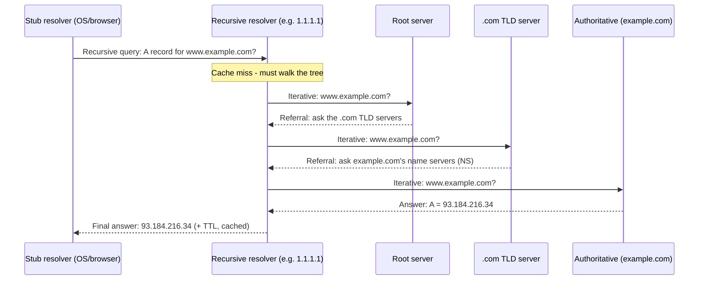

# DNS Deep: Resolution, Records, GeoDNS, Caching

*You know hosts are reached by IP. But you typed a name. DNS is step 0 of nearly every request -- the lookup that turns `www.example.com` into the address the last topic taught you to route by.*

`⏱️ ~8 min · 3 of 17 · Networking`

> [!TIP] The gist
> DNS is the internet's **distributed, hierarchical, heavily-cached** name→IP directory. Your machine asks one **recursive resolver** for a final answer; that resolver walks the tree (**root → TLD → authoritative**) on your behalf and caches everything it learns. A record's **TTL** decides how long every cache may reuse an answer -- the single knob trading *freshness* against *load*. The same machinery also returns *different* answers by location (**GeoDNS**), which is how CDNs and multi-region routing steer your first connection.

## Contents

- [Intuition](#intuition)
- [The concept](#the-concept)
- [How it works](#how-it-works)
- [In the real world](#in-the-real-world)
- [Trade-offs](#trade-offs)
- [Remember](#remember)
- [Check yourself](#check-yourself)

## Intuition

Think of the contacts app on your phone. You know the **name** ("Alex"); you tap it and the app finds the **number** so the call can actually connect. You never dial the digits from memory, and if Alex changes numbers you update one entry -- everyone still just taps "Alex."

DNS is that lookup for the whole internet. You know the name (`www.example.com`); DNS finds the number (the IP). The server can move to a new address and the name stays the same -- you update one record, not every client.

Now scale it. No single contacts app could hold every name on earth, so the directory is **split by authority and asked in stages** -- like calling a national directory that says "for that region, call this local office," and the local office finally gives you the number. That staged, right-to-left hand-off is the DNS hierarchy.

## The concept

**Definition.** The **Domain Name System (DNS)** is a globally distributed, hierarchical, and cached database that maps human-friendly names (`www.example.com`) to machine-usable data -- most often an IPv4/IPv6 address, but also mail servers, service locations, and text metadata.

**Why it exists.** IP addresses are terrible for humans: `93.184.216.34` isn't memorable, isn't stable when infrastructure moves, and says nothing about intent. DNS **decouples the name a human/app uses from the address the network routes by**, so names stay constant while IPs change, one name can map to many IPs, and the mapping is solved once per name instead of hardcoded everywhere.

**Where it sits.** DNS is an **application-layer** protocol (like HTTP) -- but it's *infrastructure* almost every other protocol needs first: a browser must resolve the name to an IP before it can even open the TCP connection (next topic). It runs on **port 53**, primarily over **UDP** (a small query/response, no handshake -- fast, which matters on the critical path), falling back to **TCP** for oversized responses or bulk zone transfers.

**The players** (each does one job):

- **Stub resolver** -- the tiny client in your OS/browser. It can't walk the tree; it just asks a resolver and waits for a final answer.
- **Recursive resolver** -- does the legwork, walks the tree on your behalf, returns one answer, and **caches** everything (e.g. your ISP's, or public `8.8.8.8` / `1.1.1.1`).
- **Root server** -- top of the tree; knows who runs each **TLD**, refers you onward.
- **TLD server** (`.com`) -- knows who's authoritative for `example.com`, refers you onward.
- **Authoritative server** -- the source of truth for the zone; returns the real record.

**Recursive vs iterative** -- the key distinction:

- A **recursive query** means "give me the *final* answer, do whatever work is needed." The stub sends this to the recursive resolver, which is obligated to keep working until it has an answer or a definitive failure.
- An **iterative query** means "give me your *best* answer now, even if it's just a referral." This is how the resolver talks to root, TLD, and authoritative servers -- each replies with the record or "ask them next."

So in the classic flow, exactly **one recursive query** happens (stub → resolver); everything below it is a chain of **iterative** queries with the resolver doing the walking.

**What DNS is NOT.** Not a single central database -- authority is *delegated* outward, no one org runs the whole tree. Not a load balancer -- it's a cached lookup, not an inline traffic cop (more below). And by default it's **not encrypted** -- DNSSEC adds *authenticity*, DoH/DoT add *privacy*; those are later topics.

**Key terms:** zone, delegation, NS record, TTL, authoritative, recursive/iterative, NXDOMAIN.

## How it works

### 1. The resolution walk

On a **cold cache**, resolving `www.example.com` walks the whole tree once:

In practice this full walk is the *worst case*. The resolver usually already has `.com`'s TLD servers cached (long TTLs, rarely change) and often `example.com`'s record too, from another user's recent lookup -- so most queries are served straight from cache.

### 2. Record types

A record isn't always an IP. Each **resource record** has a name, type, TTL, and type-specific data:

| Type | Purpose | Example |
|---|---|---|
| **A** | Name → **IPv4** address | `www.example.com A 93.184.216.34` |
| **AAAA** | Name → **IPv6** address | `www.example.com AAAA 2606:2800:220:1::` |
| **CNAME** | Name → *another name* (alias, resolved again) | `blog.example.com CNAME host-provider.net` |
| **NS** | Delegates a zone to its authoritative servers | `example.com NS ns1.example.com` |
| **MX** | Mail servers for the domain, with priority | `example.com MX 10 mail.example.com` |
| **TXT** | Arbitrary text (domain verification, SPF/DKIM) | `example.com TXT "v=spf1 ..."` |
| **SOA** | Start of Authority -- per-zone metadata + negative-cache TTL | one per zone |

**CNAME can't sit at the apex.** A CNAME says "this name is *entirely* an alias," so it can't coexist with any other record at the same name. The **zone apex** (bare `example.com`) *must* hold NS/SOA records -- so a CNAME is illegal there. `www.example.com` is fine; `example.com` itself is not. (Providers offer an **ALIAS/ANAME** workaround -- resolved server-side into a plain A record -- covered in the real world below.)

### 3. Caching and TTL

Every layer caches -- browser, OS, and the big lever: the **recursive resolver**, which serves one cached answer to thousands of clients until it expires. Without this, a full walk on every lookup would melt the root/TLD infrastructure.

**TTL (Time To Live)** is set by the record's owner and says how many seconds any cache may reuse the answer. It's a direct **staleness vs load** trade-off:

| TTL | Effect |
|---|---|
| **Low** (e.g. 60s) | Changes take effect fast -- but caches expire quickly, so far more queries hit your authoritative servers. |
| **High** (e.g. 86400s / 1 day) | Low load, more cache hits -- but a change (like a failover IP) can be stale in caches worldwide for up to the full TTL. |

**"DNS propagation" is a misnomer.** Nothing propagates outward -- the authoritative record changes instantly. What you wait for is every cache still holding the *old* answer to individually hit its TTL and expire. That's why operators **lower the TTL in advance** of a planned change: fewer long-lived stale copies exist at cutover. (The same applies to failures: a non-existent name returns **NXDOMAIN**, which is also cached -- so a brand-new record can be invisible until a cached "doesn't exist" expires.)

### 4. GeoDNS and location-based routing

**GeoDNS** returns a **different answer to the same query depending on where the asker appears to be**. The authoritative server holds several IPs (one per region/edge) and picks the nearest per-query. This is the DNS-layer half of proximity routing -- it points your very first connection at low-latency infrastructure before any HTTP logic runs, which is how **CDNs and multi-region** setups steer you.

**The catch: DNS sees the resolver, not the client.** The authoritative server only sees the IP of the **recursive resolver** that forwarded the query -- usually a fine proxy for the user's location, but *not* when the user is on a distant public resolver (`8.8.8.8`, `1.1.1.1`) or a VPN. The fix is **EDNS Client Subnet (ECS)**: the resolver forwards a *truncated slice* of the real client's subnet, so the geo-decision reflects the actual user, not the resolver.

## In the real world

**AWS Route 53 -- DNS traffic management as named policies.** Route 53 productizes the mechanisms above: **latency-based routing** answers with the lowest-latency region for the asking resolver, **weighted routing** implements the round-robin/weighted split, and **failover routing** health-checks endpoints and only answers with a healthy one. Its **ALIAS record** solves the CNAME-at-apex problem exactly as described -- an apex ALIAS can point at, say, an ELB's DNS name and Route 53 resolves it server-side into an A record. It even documents combining latency-based (pick the region) with weighted (pick within it) -- the "coarse-then-fine" layering of GeoDNS + a load balancer. ([AWS routing-policy docs](https://docs.aws.amazon.com/Route53/latest/DeveloperGuide/routing-policy.html))

**Cloudflare's 1.1.1.1 -- anycast recursive resolver at scale.** The same IPs (`1.1.1.1` / `1.0.0.1`) are announced from Cloudflare's global network so each query lands at the nearest site -- Cloudflare says it lit up the resolver on 31 new data centers in a single month (March 2018) with zero client reconfiguration, since the anycast address never changes. ([Cloudflare launch post](https://blog.cloudflare.com/dns-resolver-1-1-1-1/))

**Google Public DNS -- ECS in practice.** Google's `8.8.8.8` docs are a live instance of the "resolver, not client" fix: per RFC 7871 it can forward a truncated slice of the client's subnet to authoritative servers so CDNs return geo-accurate answers. Notably it's opt-in per authoritative server and Google monitors correct support -- confirming ECS is *inconsistent* across the ecosystem, not universal. ([Google ECS guidelines](https://developers.google.com/speed/public-dns/docs/ecs))

**The 2016 Dyn DDoS -- why DNS is a systemic target.** On Oct 21, 2016, the Mirai IoT botnet flooded DNS provider Dyn's port 53. Because Twitter, Spotify, GitHub, Netflix and others used Dyn as their *sole* authoritative provider, those sites became unreachable *even though their own servers stayed healthy* -- "the phonebook is down" is as damaging as "the servers are down." Retrying recursive resolvers even compounded the load. ([Krebs on Security](https://krebsonsecurity.com/2016/10/ddos-on-dyn-impacts-twitter-spotify-reddit/))

Full sourcing: [research/backend/L1/03-dns-deep.md](../../../research/backend/L1/03-dns-deep.md#real-world-and-sources).

## Trade-offs

| Point | Why it matters |
|---|---|
| **Low vs high TTL** | Low = changes land fast but higher query load and more cache misses; high = efficient and fast on hits but slow to react (including failover). |
| **DNS-based load balancing vs a real load balancer** | DNS steering is **coarse and slow** -- bounded by the TTL, no real-time client-side health awareness, so clients keep hitting a dead IP until their cache expires. A real L4/L7 load balancer sits **inline** on every request and redirects/drops in milliseconds -- nothing to wait out. Commonly layered: GeoDNS picks the region, a load balancer picks the healthy instance. |
| **UDP vs TCP** | UDP keeps typical lookups fast (no handshake); TCP handles oversized responses and zone transfers where reliability/ordering matter. |
| **Ubiquitous + simple, but a target** | DNS's caching/simplicity is why it scales -- but being the single lookup in front of everything makes it a prime **DDoS target** and, historically, an amplification vector. |
| **CNAME rules** | A CNAME must be the only record at its name and can never sit at the apex (which needs NS/SOA) -- hence ALIAS/ANAME. |

## Remember

> [!IMPORTANT] Remember
> DNS is **step 0 of nearly every request**: a hierarchical, delegated, aggressively-cached lookup -- *not* one central database. The recursive resolver walks root → TLD → authoritative on your behalf (iteratively) and caches what it learns, and each cache's **TTL is the one knob** trading how fresh an answer is against how much load your authoritative servers bear. "Propagation delay" is really just cache expiry.

## Check yourself

1. You lowered a record's TTL to 60s and changed its IP, but a colleague still hits the old address 5 minutes later. Give two reasons this can happen. (Think: when did the TTL change take effect, and what else gets cached?)
2. Why can't you put a CNAME at `example.com`'s apex, and what do providers offer instead?
3. On a **cold** cache, walk through resolving `api.example.com` -- which single query is recursive, and which are iterative?
4. Why can't DNS-based failover pull traffic off a dead server as fast as a real load balancer, even if the authoritative server updates instantly?

---

→ Next: [TCP](04-tcp.md) (handshake, flow control, congestion control)
↩ Comes back in: CDN internals, load balancers, Anycast/BGP, multi-region
