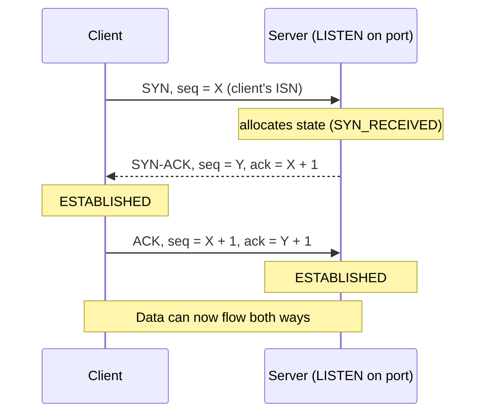
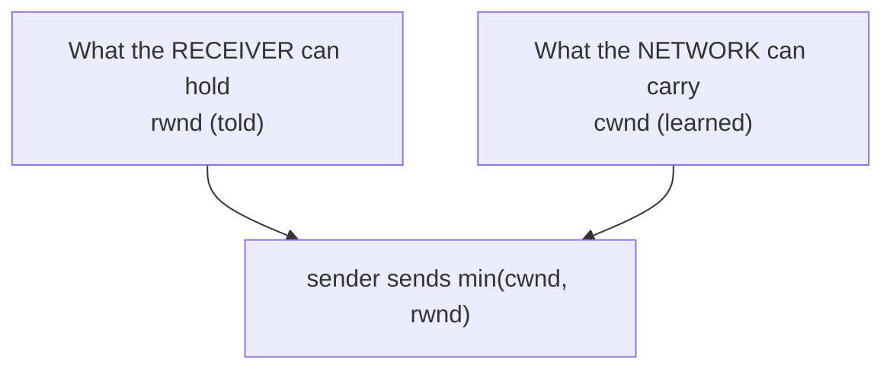

# TCP: Handshake, Flow Control, Congestion Control

*You have an IP and a port. But IP happily drops, reorders, and duplicates packets and never tells you. TCP is the layer that turns that chaos into a reliable, ordered stream you can read like a file.*

`⏱️ ~8 min · 4 of 17 · Networking`

> [!TIP] The gist
> **TCP** manufactures a **reliable, in-order, full-duplex byte stream** on top of best-effort IP. It opens with a **3-way handshake** (SYN / SYN-ACK / ACK) so both sides agree on sequence numbers -- costing one round trip before any data. It numbers every byte and uses **ACKs + retransmission** to guarantee delivery. Two independent limits pace the sender: **`rwnd`** (told by the receiver -- protects *its buffer*) and **`cwnd`** (learned by the sender -- protects the *network path*), and the sender always sends the smaller of the two. The price: latency, per-connection state, and **head-of-line blocking**.

## Contents

- [Intuition](#intuition)
- [The concept](#the-concept)
- [How it works](#how-it-works)
- [In the real world](#in-the-real-world)
- [Trade-offs](#trade-offs)
- [Remember](#remember)
- [Check yourself](#check-yourself)

## Intuition

Think of a careful phone call on a bad line.

First you make sure you're actually connected: "Can you hear me?" -- "Yes, can *you* hear me?" -- "Yes." Only now do you start talking. That opening exchange is the **handshake**: both sides confirm the line works *in both directions* before anyone says anything that matters.

Then you speak, and the listener keeps saying "got it... got it..." -- those are **ACKs**. If you say something and hear nothing back, you assume it was lost in the noise and **repeat it**. If the listener is scribbling notes and falling behind, they say "hold on, slow down" -- that's **flow control**. And if the *line itself* keeps crackling and cutting out, you instinctively talk slower to get through -- that's **congestion control**.

TCP is exactly this discipline, applied automatically to every byte, so the application on top can just read and write and never think about the bad line underneath.

## The concept

**Definition.** **TCP (Transmission Control Protocol)** is a **transport-layer (L4)** protocol that provides a **connection-oriented, reliable, in-order, full-duplex byte stream** between two endpoints, built entirely on top of **best-effort IP** -- which (from topic 2) guarantees none of that: IP datagrams can be dropped, duplicated, reordered, or corrupted, and IP never notices. TCP exists to sit on that unreliable substrate and manufacture the guarantees applications actually want.

**The guarantees, precisely:**

- **Connection-oriented** -- both sides establish shared state (the handshake) before data flows, and tear it down when done. There's a real "connection" with a lifecycle, unlike IP's independent datagrams.
- **Reliable** -- every byte sent arrives, or the sender is told the connection failed. Achieved by ACKs + retransmission.
- **In-order** -- bytes reach the application in the exact order sent, even if the underlying packets arrived scrambled. TCP buffers and re-sequences first.
- **Byte stream** -- TCP does **not** preserve message boundaries. One `send()` does not map to one `recv()`; TCP may coalesce or split your data however it likes.
- **Full-duplex** -- both directions send independently over the one connection (effectively two streams sharing one state block).

**Where it sits -- the 4-tuple.** A TCP connection is identified by a **4-tuple**: `(source IP, source port, destination IP, destination port)`. This is why one server port (say `:443`) serves thousands of clients at once -- each connection is unique by its *full* 4-tuple, not the port alone. The OS keeps a separate state block per 4-tuple. (This same 4-tuple is what an **L4 load balancer** later hashes on -- forward-ref.)

**What TCP is NOT.** Not **message-oriented** -- it's a raw byte stream, so protocols on top (HTTP, etc.) must add their own framing (e.g. `Content-Length`). Not inherently **"fast"** -- it optimizes for correctness and fairness, trading latency for reliability. Not the **only** transport -- the next topic, **UDP**, deliberately drops these guarantees to minimize latency. Nearly every transport decision reduces to: *do I need TCP's guarantees, or can I benefit from UDP's bare-bones model?*

**Key terms:** segment, sequence number, ACK, SYN/FIN, `rwnd` (receive window), `cwnd` (congestion window), RTT, slow start, AIMD, head-of-line blocking.

## How it works

### 1. The 3-way handshake

Before any data, both sides must agree on starting **sequence numbers** and confirm both directions work. That's SYN → SYN-ACK → ACK:

**Why three messages, not two?** Because TCP is full-duplex -- *each direction* needs its own sequence number agreed and confirmed reachable. Two messages would only prove the client can reach the server; they'd leave the server's own starting sequence number (for the reverse direction) unacknowledged. The middle message is a two-in-one: it ACKs the client's SYN *and* carries the server's SYN. Three is the minimum that synchronizes both directions.

**The cost:** a full **round trip (RTT)** is spent before the first useful byte is sent. For a client 150 ms away, that's 150 ms of pure setup -- which is exactly why connection reuse and pooling (later levels) matter so much.

> Each side picks a **randomized Initial Sequence Number (ISN)**, not 0, so a stale or malicious segment can't easily guess valid numbers and inject data.

### 2. Reliability: numbers, ACKs, retransmission

Every byte in the stream is numbered (sequence numbers, set at handshake). That single fact powers everything:

- **Sequence numbers** let the receiver detect gaps, drop duplicates, and reorder scrambled segments before handing bytes up.
- **ACKs** tell the sender what arrived. Classic TCP uses **cumulative ACKs**: "ACK N" means *everything up to byte N-1 arrived contiguously.*
- **Retransmission** -- if no ACK arrives within the **Retransmission Timeout (RTO)**, the sender resends. RTO isn't fixed; it's computed from measured RTT so it adapts to Wi-Fi vs transcontinental fiber.

Two optimizations exist so you don't wait for a full timeout on every loss: **fast retransmit** (three duplicate ACKs signal a likely-lost segment -- resend immediately) and **SACK** (the receiver reports exactly which ranges it has, so only the true gap is resent, not everything after it). Know they exist; the mechanics are secondary here.

### 3. Flow control vs congestion control

This is the single most-confused point in TCP. Hold it precisely: **two independent limits, protecting two different things.**

**Flow control -- `rwnd`, protects the receiver.** Every ACK carries a **receive window** (`rwnd`): "here's how much buffer I have free -- don't send more than this without hearing from me." As the app reads its buffer, later ACKs advertise a bigger window: the **sliding window** slides forward.

> **Worked snippet.** Receiver buffer = 16 KB, empty → advertises `rwnd = 16KB`. Sender fires 16 KB and must stop (window full). The app reads 4 KB out; the next ACK says `rwnd = 4KB`, so the sender may send 4 KB more -- the window slid. If the app stalls, the receiver eventually sends `rwnd = 0` (a **zero window**) and the sender must halt and periodically probe until space frees up.

**Congestion control -- `cwnd`, protects the network.** Even with an infinite `rwnd`, a sender blasting at line rate can overflow a *router's* queue somewhere in the middle -- invisible to flow control, which only knows the receiver's stated capacity. So the sender keeps its own self-estimated **congestion window** (`cwnd`): how much it *believes* the path can absorb. The catch: nobody tells it the network's capacity, so it must **probe** -- and the real limit it obeys is **`min(cwnd, rwnd)`**, whichever is smaller.

How `cwnd` is learned:

- **Slow start** -- begin small, then **double `cwnd` every RTT** (exponential) while ACKs keep arriving cleanly.
- **AIMD** (Additive Increase, Multiplicative Decrease) -- past a threshold, grow **linearly** (+1 segment/RTT), but on loss **cut sharply** (e.g. halve). That asymmetry -- gentle climb, sharp drop -- is what makes many flows sharing a bottleneck converge to a *fair* split.

**Modern angle (one line):** **CUBIC** is the common Linux default -- loss-based, so it fills buffers until a packet drops. **BBR** (Google, model-based) instead estimates the path's actual bandwidth and RTT and paces to match -- tackling **bufferbloat** (latency from over-filled buffers) on high-bandwidth, high-latency links.

### 4. Head-of-line blocking

Because delivery is strictly in-order, **one lost segment stalls every byte sent after it** -- even bytes that already physically arrived sit in the buffer, undelivered, until the gap is retransmitted. This is **head-of-line (HOL) blocking**, a structural consequence of the ordering guarantee, not a bug.

It bites hard once one TCP connection carries *many* logical streams -- exactly what HTTP/2 does. Lose one packet belonging to *any* stream and **all** multiplexed streams stall. That pain is the direct motivation for **QUIC / HTTP/3** (forward-ref), which runs its own multi-stream model over UDP so loss on one stream doesn't block the others.

> Teardown is a **4-way close** (FIN/ACK each direction); the closer lingers in **TIME_WAIT** so a lost final ACK can still be answered and stray old packets don't leak into a new connection reusing the same 4-tuple.

## In the real world

This is settled protocol behavior, so no industry sweep -- just the one live trade-off worth knowing:

**CUBIC vs BBR is an ongoing engineering trade-off, not a settled winner.** Linux has shipped **CUBIC** as its default congestion-control algorithm across most modern kernels (`verify` exact default per distro/version) -- so the classic loss-based, buffer-filling model runs the majority of internet TCP traffic. Google, motivated by the bufferbloat problem, built and deployed **BBR** internally and made it a selectable Linux kernel module: instead of filling buffers until loss, it models the path's bottleneck bandwidth and minimum RTT and paces to that -- better on high-bandwidth-delay links. Neither is a universal replacement for the other.

Full sourcing (RFC 9293, RFC 5681, RFC 8312, the BBR paper, *TCP/IP Illustrated Vol. 1*): [research/backend/L1/04-tcp.md](../../../research/backend/L1/04-tcp.md#real-world-and-sources).

## Trade-offs

| Point | Why it matters |
|---|---|
| **Reliability + ordering ✅** | Every byte arrives, in order -- the app reads a clean stream and ignores the unreliable IP beneath. |
| **Handshake RTT ❌** | A full round trip before the first data byte (plus TLS's rounds on top). Amortized via connection reuse/pooling. |
| **Per-connection state ❌** | Each open connection costs kernel memory (buffers, timers) on both ends -- servers cap total connections, not just request rate. |
| **HOL blocking ❌** | One lost segment stalls all bytes after it; brutal when one connection multiplexes many streams -- the reason for QUIC/HTTP3. |
| **Flow control (receiver)** | `rwnd`, **told** by the receiver every ACK -- protects its buffer. |
| **Congestion control (network)** | `cwnd`, **learned** by the sender via probing -- protects the shared path. Sender obeys `min(cwnd, rwnd)`. |
| **When to reach for UDP** | If you value minimum latency over perfect delivery (real-time voice/video, gaming) or want to build custom reliability (QUIC), UDP's lack of handshake/ordering/congestion overhead is the win -- next topic. |

## Remember

> [!IMPORTANT] Remember
> TCP **trades latency for reliability**: a handshake, ACKs + retransmission, and sliding windows turn best-effort IP into an ordered byte stream. The one distinction to never blur -- **flow control = `rwnd`, told by the receiver, protects its buffer**; **congestion control = `cwnd`, learned by the sender, protects the network** -- and the sender always sends **`min(cwnd, rwnd)`**.

## Check yourself

1. Why does the handshake need **three** messages instead of two, given that TCP is full-duplex? (Hint: what does the middle message do double duty for?)
2. What's the difference between **`rwnd`** and **`cwnd`** -- who sets each, what does each protect, and which one does the sender actually obey?
3. A server advertises a huge, empty `rwnd`, yet the sender still isn't sending at full network speed. What's the likely constraint, and which window is binding?
4. In your own words: why does one lost packet in an HTTP/2 connection stall *every* logical stream on it, not just the one that lost data?

---

→ Next: [UDP](05-udp.md) (fire-and-forget datagrams -- when losing reliability buys speed)
↩ Comes back in: HTTP/2 & HTTP/3, TLS handshake, load balancers (L4), connection pooling
