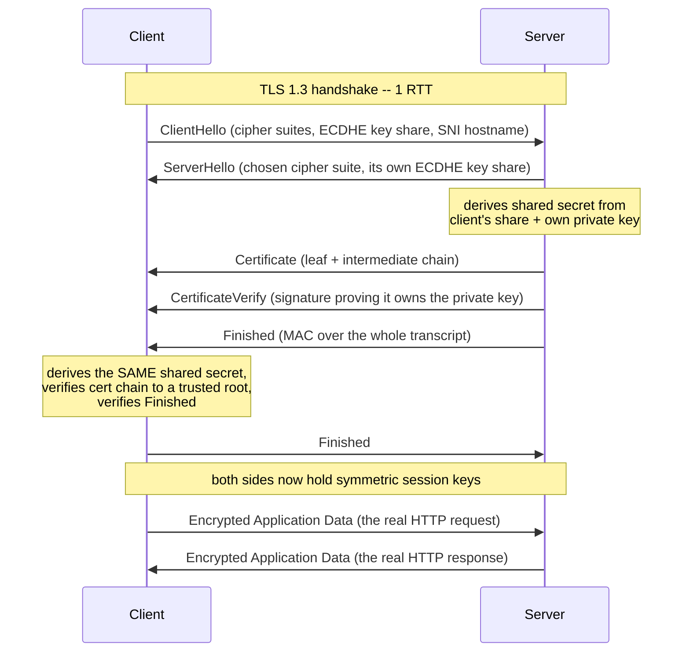
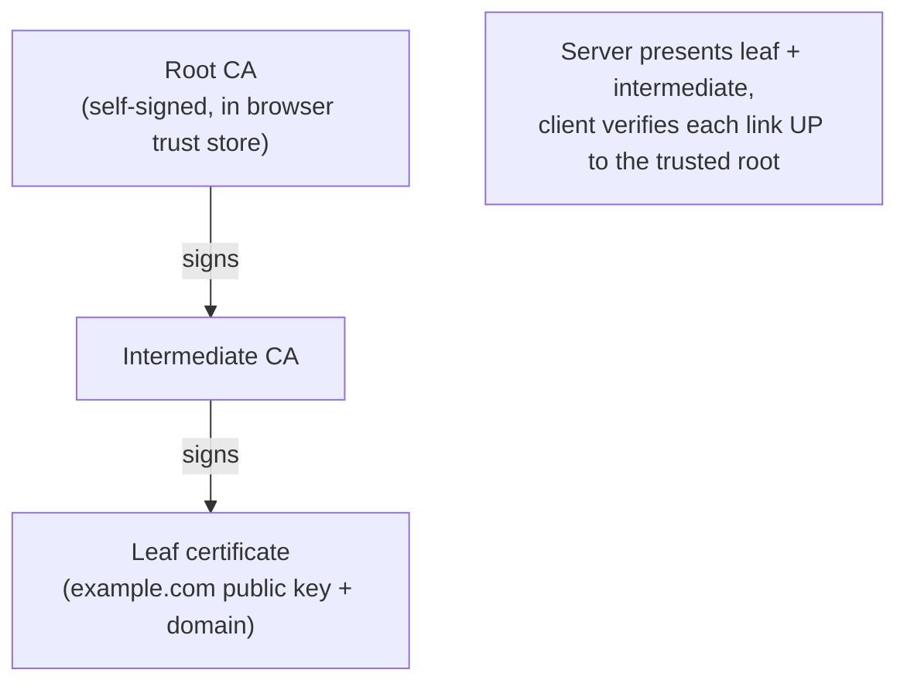

# HTTPS / TLS Handshake

*Two strangers in a crowded room want to speak privately -- and be sure they're talking to the right person. HTTPS is how they pull it off over the open internet.*

`⏱️ ~8 min · 7 of 17 · Networking`

> [!TIP] The gist
> **HTTPS is just HTTP wrapped in TLS.** TLS buys three things: **confidentiality** (nobody reads your bytes), **integrity** (nobody tampers with them undetected), and **authentication** (you're really talking to `example.com`, not an impostor). The single mechanical idea that makes it fast: TLS uses **slow asymmetric crypto once** at the start -- just to agree on a shared secret -- then switches to **fast symmetric crypto** for every byte after. **Certificates + Certificate Authorities** are what let your browser answer "is this really the right server?" TLS 1.3 does this in **1 RTT** (down from TLS 1.2's 2), and QUIC/H3 folds it into the transport handshake. The catch: the handshake costs real round-trips, and a valid padlock proves *identity*, not *safety*.

## Contents

- [Intuition](#intuition)
- [The concept](#the-concept)
- [How it works](#how-it-works)
- [In the real world](#in-the-real-world)
- [Trade-offs](#trade-offs)
- [Remember](#remember)
- [Check yourself](#check-yourself)

## Intuition

Two strangers meet in a noisy, crowded room and want a private conversation.

**The problem:** everyone around can hear them, anyone could tamper with a passed note, and either of them could actually be an impostor.

**The clever trick:** they use an **expensive, slow method exactly once** to agree on a secret code word that no eavesdropper can figure out -- even while listening to the whole exchange. Then they switch to that shared code and talk **fast** in it for the rest of the conversation. Using the slow method for the *entire* chat would be exhausting; using it just to bootstrap a shared secret is cheap.

**The trust part:** but how does stranger A know stranger B is really who they claim? A **mutual friend everyone already trusts** (the Certificate Authority) has signed a note saying "yes, this really is B." A checks the friend's signature -- which they recognize -- and now believes it.

That is TLS: **slow asymmetric crypto once to agree on a key, fast symmetric crypto forever after, and a trusted third party vouching for identity.**

## The concept

**Definition.** **HTTPS** is **HTTP running on top of TLS** instead of directly on a bare transport. The HTTP semantics you already know (methods, status codes, headers) do not change at all -- every byte is simply wrapped in an encrypted, authenticated tunnel before it touches TCP (or, for HTTP/3, before it touches QUIC, which bakes TLS 1.3 into its own handshake -- see [06-http-versions.md](06-http-versions.md#in-the-real-world)).

**TLS (Transport Layer Security)** is the protocol that builds that tunnel. It gives a connection **three guarantees**:

- **Confidentiality** -- eavesdroppers on the wire can't read the data (it's encrypted).
- **Integrity** -- nobody can alter data in transit without both sides detecting it.
- **Authentication** -- the client can cryptographically verify it's talking to the real server, not an impostor.

**The one idea that unlocks everything -- the hybrid model.** Asymmetric (public-key) crypto is far slower than symmetric crypto (a large, consistent gap). So TLS **never** encrypts your bulk data with it. Instead:

1. **Asymmetric crypto, used once at the start**, lets both sides agree on a shared secret *without ever sending that secret in the clear* -- and the certificate's signature proves the server's identity while they do it.
2. That shared secret derives **symmetric session keys**, and every subsequent byte of HTTP data is encrypted with fast symmetric ciphers.

This is why "TLS is slow" is a myth about the *handshake*, not ongoing encryption. Once symmetric keys exist, encrypting traffic is nearly free on modern CPUs.

**Key terms:**
- **Symmetric crypto** -- same secret key encrypts *and* decrypts; fast; used for all session data (e.g. AES-GCM).
- **Asymmetric crypto** -- a linked **public/private key pair**; slow; used once to agree on the key and prove identity (e.g. ECDHE + RSA/ECDSA signatures).
- **Certificate** -- a signed statement binding a public key to a domain name.
- **Certificate Authority (CA)** -- a trusted third party that vouches for that binding.
- **Handshake** -- the opening exchange that authenticates the server and establishes session keys.

**What it is NOT:**
- **A valid certificate proves identity, NOT safety.** A phishing site can hold a perfectly valid cert for its own look-alike domain. The green padlock means "encrypted and this is really `evil-phish.com`" -- not "this site is trustworthy."
- **HTTPS does NOT hide everything.** The **SNI hostname** (which site you're reaching) and the **destination IP** are still visible to network observers; only the HTTP content (path, headers, body) is encrypted.
- **SSL is the deprecated old name.** The protocol running today is TLS; "SSL" survives only as leftover terminology (SSL certificates, `openssl`).

## How it works

### 1. The hybrid handshake (TLS 1.3, 1-RTT)

TLS 1.3 completes in **one round trip** before app data flows -- because the client **guesses ahead** and sends its key share in the very first message, instead of waiting to be told which one to use.



- **ClientHello** proposes ciphers and sends an ECDHE key share upfront.
- **ServerHello** picks a cipher and sends its own key share -- now **both sides independently compute the same shared secret** (the Diffie-Hellman magic: each combines its private half with the other's public share, and neither ever transmits the secret itself).
- The server proves identity with its **Certificate + CertificateVerify** (a signature only the real private-key holder can produce), all already encrypted.
- The client verifies the chain, and app data flows. **Total: 1 RTT.**

**Why TLS 1.2 was slower:** it needed **2 RTTs** -- one round trip just to negotiate *which* key-exchange group to use, *then* a second to actually exchange keys. TLS 1.3's speculative key share removes that entire negotiate-then-react round trip.

### 2. Certificates and the chain of trust

A certificate answers: *how does the client know this public key really belongs to `example.com`?*

- An **X.509 certificate** binds together the **domain name(s)**, the **public key**, a **validity period**, and a **signature** from the issuer -- effectively saying "this key belongs to this domain, and I vouch for it."
- Trust flows through a **chain: root CA -> intermediate CA -> leaf**. A **root CA** cert (self-signed, pre-installed in your OS/browser's **root store**) signs intermediates; an intermediate signs the **leaf** cert your server presents.
- During the handshake the server sends the leaf plus intermediates; the client verifies each signature **link by link up to a root it already trusts**. Any broken link -- expired, wrong domain, untrusted issuer -- triggers the "connection is not private" warning.



Copying a public certificate isn't enough to impersonate a server -- the handshake forces a cryptographic operation only the real **private-key** holder can complete.

### 3. Performance and 0-RTT

For a brand-new HTTPS connection over TCP, the handshakes **stack**:

```
TCP handshake (1 RTT)  +  TLS 1.3 handshake (1 RTT)  =  ~2 RTTs before the first HTTP byte
```

(TLS 1.2 makes it ~3.) On a 60ms link that's real setup latency paid before *any* content is requested. Two things claw it back:

- **Connection reuse / keep-alive** -- pay the handshake once, amortize it over many multiplexed requests.
- **0-RTT resumption** -- a returning client sends its first request **in the very first flight of packets**, using a cached pre-shared key, before any round trip completes.

**QUIC/HTTP-3 collapses the stack:** TLS 1.3 is built into QUIC's handshake, so a fresh connection needs only **~1 RTT total** for transport + crypto combined, and 0-RTT applies to the whole connection.

**The 0-RTT catch -- replay.** Because there's no live round trip confirming freshness before 0-RTT data is processed, an attacker who captures that first flight can **resend it later**, and the server may process it twice (it's a valid replay, not a forgery). So 0-RTT is only safe for **idempotent** requests -- a `GET` that just reads is fine; "charge this card" is not.

(In production, TLS is often **terminated at the edge** -- a load balancer or CDN holds the cert and decrypts, then forwards inward. More on that in the load balancer and CDN topics.)

## In the real world

- **Let's Encrypt / ACME -- automated certs at internet scale.** Let's Encrypt co-created the **ACME protocol (RFC 8555)** to make domain-validated issuance and renewal fully automatable instead of a manual per-server chore. As of its 10-year retrospective (December 2025), it was issuing **over ten million certificates per day** (a milestone first hit late September 2025). Automating the chain-of-trust issuance step -- not eliminating it -- is what made HTTPS the web-wide default. ([letsencrypt.org/2025/12/09/10-years](https://letsencrypt.org/2025/12/09/10-years))

- **Cloudflare -- 0-RTT with replay guarded in production.** Cloudflare serves 0-RTT **only for GET requests without query parameters** (exactly the idempotent case), enforces size and replay-window limits, and tags each 0-RTT request with a unique identifier (`Cf-0rtt-Unique`) so origins can detect duplicates -- "0-RTT only for idempotent operations" enforced as a hard platform rule, not just advice. ([blog.cloudflare.com/introducing-0-rtt](https://blog.cloudflare.com/introducing-0-rtt/))

- **AWS ACM -- certs folded into edge TLS termination.** ACM provisions and **auto-renews** public certs (renewal starts up to 60 days before expiry) and deploys them onto **ALB, CloudFront, and API Gateway** -- the edge components that hold the private key and complete the client handshake, then forward inward. CloudFront's origin-mTLS feature applies the mutual-TLS pattern to the edge-to-origin hop. ([AWS ACM FAQs](https://aws.amazon.com/certificate-manager/faqs/))

Full sourcing (RFC 8446, RFC 8555, Cloudflare, AWS): [research/backend/L1/07-https-tls.md](../../../research/backend/L1/07-https-tls.md#real-world-and-sources).

## Trade-offs

| Decision | ✅ Gains | ❌ Costs |
|---|---|---|
| **Using TLS at all** | Confidentiality + integrity + authentication on every byte | Handshake adds real RTT-bound latency on each fresh connection (amortized by reuse/resumption) |
| **TLS 1.3 over 1.2** | 1-RTT handshake, mandatory forward secrecy, safer cipher set | Requires modern clients/servers; drops legacy compatibility |
| **0-RTT resumption** | Send the first request with ~0 extra RTT | **Replayable** -- safe only for idempotent requests |
| **TLS termination at the edge/LB/CDN** | Offloads handshake CPU, centralizes certs, enables L7 inspection (routing, WAF) | Edge (and any hop to origin) sees plaintext unless a second encrypted hop is added |

**What HTTPS still leaks:** the **SNI hostname**, the **destination IP**, and rough **traffic size/timing** -- even though the content itself is sealed.

## Remember

> [!IMPORTANT] Remember
> TLS = use **slow asymmetric crypto exactly once** to agree on a shared key, then **fast symmetric crypto** for everything after -- that hybrid is what makes encrypted-everywhere practical. And **certificates + CAs** are what make "is this really the right server?" answerable: **encryption without authentication is worthless**, because a perfectly encrypted channel to an impostor gives you nothing.

## Check yourself

1. Why does TLS use *both* asymmetric and symmetric crypto instead of just one? What would go wrong if it used asymmetric for the whole session -- or symmetric from the very first byte?
2. You see a green padlock and a valid certificate for a site. Does that mean the site is trustworthy? Why or why not?
3. A payments API wants 0-RTT. Which is safe to serve over it -- "resend my receipt" or "charge my card" -- and why is the other one dangerous?

---

→ Next: [WebSockets, SSE, Long-Polling](08-websockets-sse-long-polling.md) (three ways to push server data to a client in near-real-time)
↩ Comes back in: load balancers & CDN (TLS termination), REST vs gRPC (mTLS), L9 Security (authN, key management, mTLS)
