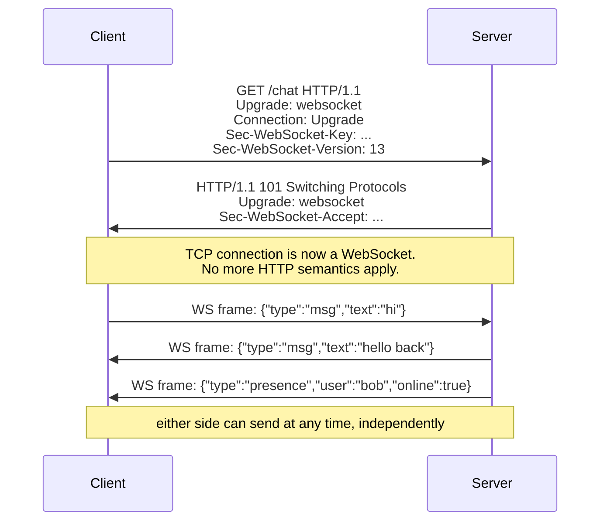

# WebSockets, SSE, Long-Polling

*Plain HTTP has one unbreakable rule: the client must ask before the server can answer. This lesson is the ladder of tricks built to break it -- so the server can push data the instant it exists.*

`⏱️ ~8 min · 8 of 17 · Networking`

> [!TIP] The gist
> Chat, live feeds, tickers, presence, collaborative editing -- they all need the **server to push** data the moment it happens. But plain HTTP is **request/response**: the server can only ever reply to a request the client already sent. So we climb a ladder of workarounds. **Short polling** asks on a timer (simple, wasteful, laggy). **Long polling** holds the request open until there's data (near-real-time over plain HTTP, but reconnects per message). **SSE** streams events down one long-lived response -- **one-way, server → client**, with free auto-reconnect. **WebSocket** upgrades the connection into a **full-duplex** channel where both sides send frames anytime. Rule of thumb: **one-way updates → SSE, true two-way → WebSocket, must-work-everywhere fallback → long polling.** The catch on every rung above short polling: persistent connections are **stateful**, which is the real scaling cost.

## Contents

- [Intuition](#intuition)
- [The concept](#the-concept)
- [How it works](#how-it-works)
- [In the real world](#in-the-real-world)
- [Trade-offs](#trade-offs)
- [Remember](#remember)
- [Check yourself](#check-yourself)

## Intuition

Picture a kid in the back seat of a car, and the four techniques as four ways of asking "are we there yet?"

- **Short polling** -- the kid asks "are we there yet?" every 30 seconds, the whole drive. Simple, but mostly the answer is "no," and if you *do* arrive right after an answer, the kid doesn't find out until the next ask.
- **Long polling** -- the kid asks once and the parent stays silent, only answering *the moment* they actually arrive. As soon as they get an answer, the kid immediately asks again for the next leg.
- **SSE** -- the parent just narrates the trip out loud, one-way: "highway now... exit coming up... two minutes away." The kid only listens.
- **WebSocket** -- both are handed walkie-talkies. Either can talk at any time, no asking required.

Each rung gets closer to true, low-latency push -- and pays a different price for it.

## The concept

**The one problem.** Every version of HTTP is **request/response**: the client sends a request, the server replies to *that* request, done. The server has **no native way** to spontaneously say "hey, something changed." But the events that matter in real-time apps -- a new chat message, a price tick, a live score, a notification -- originate on the *server* at an unpredictable time, and the receiving client has no way to know when to ask. Every technique here is a way to simulate or genuinely achieve **push** on top of a substrate that fundamentally lacks it.

**Key terms, since they get conflated constantly:**

- **Pull** -- the *client* initiates ("give me an update if there is one"). This is all plain HTTP natively does.
- **Push** -- the *server* initiates ("here is an update"), without the client asking again first. HTTP has no native concept of this.
- **Server-initiated** -- a synonym for push, stressing *who* starts the exchange.
- **Half-duplex** -- only one side "talks" per exchange (classic HTTP request/response).
- **Full-duplex** -- both sides send **independently and simultaneously**, no turn-taking. This is what WebSocket adds that HTTP structurally lacks.
- **Real-time (as used here)** -- *low-latency best-effort push* (milliseconds to a few seconds). This is **not** hard real-time (a guaranteed enforced deadline) -- no delivery-time guarantee is being made.

**What these are NOT (the classic mix-ups):**

- **SSE is one-way, server → client only** -- NOT bidirectional. Needing the client to send data back over the same channel means SSE is the wrong tool. This is the single most common confusion.
- **A WebSocket after the upgrade is NOT speaking HTTP anymore.** Once the connection switches over, no HTTP status codes, methods, or per-message headers apply to its traffic.
- **Long polling is NOT streaming.** Each cycle is a discrete, complete request/response; the connection closes and reopens per message.

The four techniques are a **ladder of answers** to the same question, each closer to native push and each paying a different cost.

## How it works

### Rung 1 — Short polling: ask on a timer

The client just issues a normal `GET` every few seconds ("anything new?"). The server answers immediately -- usually with "nothing."

**Fixes:** nothing structurally -- it just resells *pull* at a finer granularity.
**Costs:** **latency is bounded by the interval** (poll every 5s → updates can sit 5s stale), and **load scales with clients × frequency, almost entirely wasted**. 10,000 clients polling every 3s = ~3,333 req/s even when nothing changed -- the server does real work to answer "no" far more often than "yes."

Still genuinely fine for infrequent, low-stakes checks (build status every 30s).

### Rung 2 — Long polling: hold the request open

Instead of replying "nothing yet" instantly, the server **parks the request** and delays the response until data actually exists (or a timeout, commonly ~20-60s, fires). The instant the client gets any response, it immediately opens a fresh long-poll.

```
Client                                  Server
  |--- GET /messages/poll -------------->|
  |         (server holds it open, no reply yet)
  |         ... new message arrives! ...
  |<-- 200 [{msg}] -----------------------|   <- replies the instant data exists
  |--- GET /messages/poll -------------->|   <- client immediately reconnects
```

**Fixes:** near-real-time delivery over **nothing but plain HTTP** -- which is why it's the universal fallback that works through every proxy/firewall ever built.
**Costs:** a **held connection per client** (real server-side resource pressure), and a **full reconnect per message** (new request, headers resent, maybe fresh TLS). It also needs careful buffering for the gap *between* one response completing and the next poll arriving, or messages get dropped.

### Rung 3 — SSE: a one-way stream over plain HTTP

The first *real* streaming channel here. The client opens one HTTP request (the browser's built-in `EventSource`), and the server responds with `Content-Type: text/event-stream` and **never closes the body** -- it just keeps writing text events onto that same open response as they occur.

```
data: {"price": 187.32}

data: {"price": 187.41}

```

**Auto-reconnect and resumption are built into `EventSource` for free:** if the connection drops, the browser reconnects automatically, and -- if the server tagged events with an `id:` -- it sends a `Last-Event-ID` header so the server resumes exactly where it left off. No hand-rolled reconnect logic.

**Fixes:** clean, simple one-way push for feeds, notifications, live scores, log tailing -- over ordinary HTTP infrastructure.
**Costs:** **one-way only** (client→server still needs a separate request), and **text-only** (binary must be base64'd first).

### Rung 4 — WebSocket: a real full-duplex channel

When you genuinely need **both sides talking anytime, with tiny per-message overhead** -- chat, multiplayer games, collaborative editing, trading UIs. A WebSocket *starts* as an ordinary HTTP request, then **upgrades** into a different, lightweight, message-framed protocol on the *same* TCP connection. After the upgrade, it's not HTTP anymore -- just small **frames**, and either side can send one at any moment.



1. The client sends a `GET` with `Upgrade: websocket`, `Connection: Upgrade`, and a random `Sec-WebSocket-Key`.
2. The server replies **`101 Switching Protocols`** (a status code that exists for exactly this) instead of `200`.
3. From that point the socket carries raw WebSocket **frames** -- a few bytes of framing vs a full set of HTTP headers per exchange -- and **either side writes anytime, without being asked**. That's what makes push native, not simulated.
4. **`wss://`** is WebSocket over TLS (like `https://` -- see [07-https-tls.md](07-https-tls.md)); **ping/pong heartbeats** detect a silently-dead connection.

**Fixes:** true bidirectionality, near-zero per-message overhead, lowest latency.
**Costs:** it's a **long-lived, stateful connection** (sticky load balancing, hard to drain/failover), and you build **reconnect, heartbeat, and auth yourself** -- the raw protocol gives you a bare pipe and nothing else.

### The centerpiece: choosing the right rung

| | **Short polling** | **Long polling** | **SSE** | **WebSocket** |
|---|---|---|---|---|
| **Direction** | Client pull only | Client pull, held open (near-push) | Server → client (one-way) | Bidirectional (full-duplex) |
| **Real-time-ness** | Bounded by interval (seconds) | Near-instant (reconnect gap) | Near-instant | Near-instant, lowest overhead |
| **Overhead per update** | High (mostly-empty full requests) | Medium (full reconnect per msg) | Low (tiny text on open stream) | Very low (few bytes of framing) |
| **Complexity** | Trivial | Moderate (timeout/gap handling) | Low-moderate (auto-reconnect free) | Higher (build reconnect/heartbeat/auth) |
| **Auto-reconnect** | N/A | Manual | Built into `EventSource` | Manual |
| **Binary** | Yes | Yes | No (UTF-8 text only) | Yes (native binary frames) |
| **Typical use** | Infrequent checks (build status) | Legacy universal fallback | Notifications, feeds, tickers, logs | Chat, games, collab editing, trading |

**How to choose, in one breath:**

- **Bidirectional / low-latency / high-frequency** → **WebSocket**.
- **Server → client only, never binary** → **SSE** (simpler, free auto-reconnect, no stateful bidirectional complexity).
- **Must work absolutely everywhere**, near-real-time is enough → **long polling**.
- **Infrequent, staleness of seconds is fine** → **short polling** -- don't over-engineer.

### The scaling reality (one chunk)

Everything above is the *protocol*. Running millions of these surfaces a different problem: persistent connections are **stateful**. A stateless HTTP request finishes in milliseconds; a WebSocket/SSE connection is held open for a whole session, so:

- **Sticky load balancing** -- every frame on a connection must route to the *same* backend that holds it (forward-ref: load balancers). "Just retry any healthy server" no longer works.
- **A pub/sub backplane for fan-out** -- if Alice's socket lives on server A and Bob's on server B, server B can't write to a socket it doesn't own. The fix: a shared broker (e.g. Redis pub/sub) that every server subscribes to -- server A publishes "message for Bob," and whichever server holds Bob's live socket picks it up and writes it (forward-ref: message queues).

## In the real world

- **Discord — pub/sub-backplane fan-out at massive scale.** Discord's WebSocket **Gateway** is exactly the scaling pattern above: each client holds one persistent socket, and an event in a "guild" must fan out to every subscribed session wherever it lives in the cluster. At **~5 million concurrent users**, fanning an event to one huge guild (30,000+ members) originally took 900ms-2.1s; their fix (a batching library, *Manifold*, that makes at most one call per remote *node* instead of one per process) cut that dramatically. By 2020-2021 they reported crossing **12M concurrent users and ~26M WebSocket events/sec**. ([Discord Engineering](https://discord.com/blog/how-discord-scaled-elixir-to-5-000-000-concurrent-users))

- **Slack — Gateway Servers + Channel Servers split.** Every Slack client keeps one WebSocket open to a stateful **Gateway Server** (the sticky, pinned connection). A separate tier of **Channel Servers** holds message state and, on a new message, pushes it to every Gateway worldwide subscribed to that channel -- a two-hop pub/sub fan-out delivering messages worldwide in roughly **500ms**. ([Slack Engineering](https://slack.engineering/real-time-messaging/))

- **Cloudflare Durable Objects — WebSocket Hibernation.** Tackles the per-connection state cost head-on: their **Hibernatable WebSockets** API lets the compute object be evicted from memory while the socket itself stays open at the edge; when a message finally arrives, the runtime re-instantiates the object and delivers it -- so a quiet chat room overnight stops billing idle compute. ([Cloudflare docs](https://developers.cloudflare.com/durable-objects/best-practices/websockets/))

- **Honest note on fintech:** real-time push for payment events (e.g. **Stripe**) is done with **webhooks** -- a *server-to-server* callback, a different pattern from the client-facing transports here, so it isn't forced into this topic.

Full sourcing: [research/backend/L1/08-websockets-sse-long-polling.md](../../../research/backend/L1/08-websockets-sse-long-polling.md#real-world-and-sources).

## Trade-offs

| Technique | ✅ Buys you | ❌ Costs you |
|---|---|---|
| **WebSocket** | True bidirectional, low-overhead, low-latency messaging | Stateful connections: sticky LB, hard to scale/drain/failover; you build reconnect/heartbeat/auth |
| **SSE** | Simple robust one-way push, free auto-reconnect + resumption | One-way only; text-only (no native binary) |
| **Long polling** | Near-real-time over plain HTTP; universal compatibility | Held connection per client + full reconnect per message; tricky gap handling |
| **Short polling** | Trivial, works everywhere, zero infrastructure | Latency bounded by interval; load scales with clients × frequency, mostly wasted |

**When polling is still fine:** infrequent, low-stakes updates where a few seconds of staleness doesn't matter. Don't add persistent-connection complexity to a trivial need.

## Remember

> [!IMPORTANT] Remember
> This whole ladder exists for one reason: **HTTP can't push** -- the server can only reply to a request. Pick the **lightest tool that meets the need**: one-way updates → **SSE**, true two-way → **WebSocket**, must-work-everywhere → **long polling**, trivial/infrequent → **short polling**. And the deal you sign every time you go persistent: **you trade statelessness for real-time** -- that stateful connection (sticky routing + a pub/sub backplane to fan out) is the scaling cost.

## Check yourself

1. You need to push live notifications **one-way** to a browser (a notification bell, a stock ticker). SSE or WebSocket -- and why? What do you get "for free" with the right one?
2. Why are WebSockets structurally **harder to scale** than plain HTTP requests? (Hint: what happens to "just retry against any healthy server," and how does a message reach a user whose socket lives on a *different* backend?)
3. A teammate proposes short polling every 500ms for 50,000 concurrent users. What's the concrete problem, in requests/second and wasted work?

---

→ Next: [REST vs gRPC vs GraphQL](09-rest-grpc-graphql.md) (three API styles and the trade-offs that decide between them)
↩ Comes back in: load balancers (sticky sessions), message queues (pub/sub fan-out), WebRTC (peer-to-peer), applied designs (chat, live feed)
