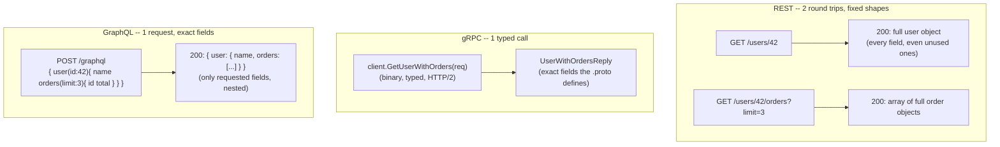

# REST vs gRPC vs GraphQL

*You know how bytes travel safely and fast. This lesson is a different question, one layer up: once the pipe exists, what SHAPE does the conversation take -- and who decides what data comes back?*

`⏱️ ~8 min · 9 of 17 · Networking`

> [!TIP] The gist
> TCP/HTTP/TLS settle *how bytes move*. They say nothing about *how a client asks for "a user and their last 3 orders."* That's the API style, and there are three big answers. **REST** = resources as URLs + HTTP verbs, JSON; simple, ubiquitous, and **cacheable for free** -- but the server fixes the response shape, so clients **over-fetch** (too much) or **under-fetch** (need extra round trips). **gRPC** = call a typed method as if it were local, **binary protobuf over HTTP/2**, with streaming built in; fast and type-safe, the go-to for **internal service-to-service** calls -- but not browser/`curl`-friendly and gets no free HTTP caching. **GraphQL** = the **client** picks exactly the fields it wants in one query against one endpoint; kills over/under-fetch, great for diverse mobile/web clients -- but it **breaks HTTP caching** and **moves the complexity to the server**. They're not rivals to pick one of forever -- big systems run **all three at once**: REST/GraphQL at the edge, gRPC between internal services.

## Contents

- [Intuition](#intuition)
- [The concept](#the-concept)
- [How it works](#how-it-works)
- [In the real world](#in-the-real-world)
- [Trade-offs](#trade-offs)
- [Remember](#remember)
- [Check yourself](#check-yourself)

## Intuition

Think of ordering food.

- **REST** -- a **fixed menu**. Each dish is an endpoint (`/users/42`, `/users/42/orders`), and each comes as a **set plate**: you get everything on it, even the garnish you won't eat. Want a user *and* their orders? That's two dishes -- two trips to the counter.
- **gRPC** -- a **kitchen ticket in the chef's own shorthand**, passed between staff. Terse, precise, typed, blazing fast -- because everyone in the kitchen already agreed on exactly what the codes mean. Perfect *inside* the restaurant; useless to a customer off the street who can't read it.
- **GraphQL** -- a **build-your-own-plate** counter. You write one order listing exactly the items you want ("name, and the last 3 orders with just id and total"), hand it over once, and get back precisely that -- nothing more, nothing less.

Same hunger, three ways to order. Each pays a different price for the convenience.

## The concept

**The framing.** Transport is settled: you know reliable byte streams (TCP, [04-tcp.md](04-tcp.md)), request framing and multiplexing (HTTP/1.1/2/3, [06-http-versions.md](06-http-versions.md)), and encryption (TLS, [07-https-tls.md](07-https-tls.md)). All of that answers *"how do bytes move safely and fast?"* None of it answers a **separate** question: *once the pipe exists, what shape does a single client-server conversation take?*

That shape is the **API (Application Programming Interface)** -- the agreed way a client asks a server to do or return something without knowing its internals. Choosing a style pins down three things:

- **The contract / schema** -- is there a *machine-checkable* definition of the requests, fields, and types (an OpenAPI spec, a `.proto` file, a GraphQL schema)? Or just docs and convention?
- **The payload shape** -- is the client stuck with whatever the server sends, or can it influence what comes back?
- **Who controls the response** -- the **server** (fixed responses), the **client** (exact field selection), or **per-method** negotiation (typed RPC calls)?

**The two problems every style is measured against:**

- **Over-fetching** -- the response has *more* than the client needs (a `GET /users/42` returns 40 fields when you wanted name + avatar). Wastes bandwidth and parse time, painful on mobile.
- **Under-fetching** -- the response has *less* than the client needs, forcing extra round trips (get a user, then a call per order, then a call per line item -- the classic **N+1 problem**, worse on high-latency networks where every trip pays a full round-trip time).

**The three paradigms** -- three lenses on the same request:

| Lens | Organized around | Example |
|---|---|---|
| **Resource-oriented** (REST) | **Nouns** (data entities) with URLs + generic verbs | `GET /users/42` |
| **RPC** (gRPC) | **Actions** -- call a named method | `GetUser(id: 42)` |
| **Query-oriented** (GraphQL) | A **declarative query** of exactly what you want | `{ user(id:42){ name } }` |

**What each IS, in one line:** REST = resources addressed by URL, acted on by HTTP verbs. gRPC = call a typed remote method as if it were a local function. GraphQL = the client declares the exact fields it wants and the server assembles them.

**What they are NOT (the classic mix-ups):**

- **REST is a *style*, not a protocol.** It's Roy Fielding's set of architectural constraints (statelessness, cacheability, uniform interface, ...). Most APIs called "REST" skip the strict parts and are really just **HTTP + JSON** -- know the difference, don't die on the hill of correcting it.
- **gRPC is NOT universally "faster."** It wins for **internal, typed, high-volume** calls. For a **cacheable public read**, a REST `GET` served from a CDN edge -- *zero* origin round trip -- beats a gRPC call that must hit the origin every time.
- **GraphQL does NOT eliminate complexity -- it moves it.** Over-fetching becomes a *server-side* query-cost problem; the N+1 problem moves from "N+1 client round trips" to "N+1 resolver calls in one request"; and the single-endpoint, mostly-`POST` design **breaks the free HTTP caching** REST enjoys.

## How it works

### REST -- resources + verbs, riding HTTP

Resources are **nouns in URLs** (`/users/42`, `/users/42/orders`); the **HTTP verb** is the action (`GET` read, `POST` create, `PUT` replace, `PATCH` update, `DELETE` remove). Responses are usually **JSON** with a standard **status code** (`200`, `201`, `404`, ...). It's **stateless** -- each request carries everything needed.

Because it rides plain HTTP, REST inherits **HTTP caching for free**: `GET` responses carry `Cache-Control` / `ETag`, so browsers, CDNs, and proxies reuse them *without touching the origin* -- a win no binary RPC gets automatically.

- ✅ **Headline strengths:** dead simple and ubiquitous (every language has an HTTP client), human-readable JSON you can `curl`, and **free HTTP caching**.
- ❌ **Headline weakness:** **over/under-fetching** -- the server fixes the response shape, so clients get too much, or need **N+1 round trips** for nested data.

### gRPC -- typed method calls in binary over HTTP/2

**Contract-first RPC.** You define the service in a `.proto` file, and `protoc` **generates typed client + server code** in dozens of languages -- the client calls a real `GetUser(request)` function, not a URL string.

```protobuf
service UserService {
  rpc GetUser(GetUserRequest) returns (UserReply);
}
```

Messages serialize to **compact binary protobuf** (field *numbers*, no repeated field names, no quotes -- far smaller and faster to parse than JSON) and ride **HTTP/2**, which gives multiplexing and **native streaming**. Four call shapes, all declared in the `.proto`: **unary** (1 request → 1 response), **server streaming**, **client streaming**, and **bidirectional streaming** (both sides stream at once -- like a typed WebSocket).

- ✅ **Headline strengths:** **fast, compact, strictly typed** (client and server literally can't disagree on a field's type), with **native streaming** -- ideal for chatty **internal service-to-service** traffic.
- ❌ **Headline weakness:** **not browser/`curl`-friendly** (needs gRPC-Web + a proxy) and **weak HTTP caching** (binary `POST`-like calls, no `GET` foothold).

### GraphQL -- the client picks the fields

**One typed endpoint** (usually `POST /graphql`) against a strongly typed **schema**. The client sends a **query** naming exactly the fields and nesting it wants; the server runs a **resolver** per field to fetch each piece (from a DB, a REST service, another API -- which is why GraphQL makes a great **aggregation layer**). Three operation types: **queries** (read), **mutations** (write), **subscriptions** (server-push, usually over WebSockets -- see [08-websockets-sse-long-polling.md](08-websockets-sse-long-polling.md)).

```graphql
{ user(id: "42") { name, orders(limit: 3) { id, total } } }
```

- ✅ **Headline strengths:** **kills over/under-fetching** -- exact fields, nested to any depth, in **one round trip** -- perfect for diverse **mobile/web clients** and **BFF** aggregation.
- ❌ **Headline weakness:** **caching is hard** (single endpoint, mostly `POST`) and **server complexity rises** -- the **N+1 resolver problem** (batched with **DataLoader**) and the need for **query depth/cost limits** so a client can't ask for unbounded work.

### The same request, three ways

**Task:** get a user and their last 3 orders -- the canonical over-fetch / under-fetch test.



- **REST** -- **two** requests. `GET /users/42` returns the *whole* user (address, settings, timestamps -- over-fetch); `GET /users/42/orders?limit=3` returns full order objects (more over-fetch). Two logical round trips.
- **gRPC** -- **one** typed method (`GetUserWithOrders`) returns exactly the message the `.proto` defines. One round trip, compact binary -- but the shape is **fixed by whoever wrote the service**; a client needing a different combination needs a new method/field.
- **GraphQL** -- **one** query naming exactly `name` plus the 3 orders' `id` and `total`. Exactly those fields, one round trip, and **no server change** if the next client wants a different subset.

### The decision table

| Dimension | REST | gRPC | GraphQL |
|---|---|---|---|
| **Paradigm** | Resource-oriented (nouns + verbs) | RPC (call a named method) | Query-oriented (client declares fields) |
| **Payload** | Text, typically JSON | Binary (Protocol Buffers) | Text, typically JSON |
| **Transport** | HTTP/1.1 or HTTP/2, any verb | HTTP/2 only | HTTP (usually POST, one endpoint) |
| **Schema/typing** | Optional (OpenAPI bolted on) | Strict, mandatory (`.proto`) | Strict, mandatory (SDL schema) |
| **Streaming** | Not native (add SSE/WebSocket) | Native (unary + server/client/bidi) | Subscriptions (via WebSockets) |
| **Browser-friendly** | Yes, natively | Limited (gRPC-Web + proxy) | Yes, natively |
| **HTTP caching** | Strong (free `GET` caching) | Weak/none (app-level only) | Weak (single endpoint, mostly POST) |
| **Over/under-fetch** | Common (fixed shapes) | Fixed per method by server | Eliminated by design |
| **Best fit** | Public/third-party, cache-heavy reads | Internal, low-latency, streaming | Diverse clients, BFF aggregation |

## In the real world

- **Stripe -- REST + JSON as the canonical public API (fintech).** Stripe's own reference says its API is "organized around REST," with "predictable resource-oriented URLs," JSON responses, and "standard HTTP response codes, authentication, and verbs." It's the textbook cache-heavy, third-party-facing sweet spot: broad client reach, human-debuggable JSON, HTTP semantics every SDK already speaks. ([Stripe API Reference](https://docs.stripe.com/api))

- **GitHub -- REST v3 → GraphQL v4 to kill over-fetching.** GitHub frames the move in exactly these terms: a REST call for org members "returns far more information than needed," while "a GraphQL query returns only what you specify." Their canonical under-fetching example: assembling a pull request with its commits, comments, and reviews takes **four REST calls** but **one GraphQL query**. Both APIs still run side by side -- proof the styles aren't mutually exclusive. ([About the GraphQL API](https://docs.github.com/en/graphql/overview/about-the-graphql-api), [Migrating from REST to GraphQL](https://docs.github.com/en/graphql/guides/migrating-from-rest-to-graphql))

- **Netflix -- internal gRPC + protobuf for low-latency service-to-service.** Netflix Studio Engineering describes heavy use of **gRPC for backend-to-backend** calls, and hit the exact fixed-response cost this lesson flags: some response fields are expensive to compute even when a caller doesn't need them. Their fix -- a **protobuf FieldMask** letting a caller name which fields it wants per RPC -- is a narrow, RPC-level answer to the same over-fetching problem GraphQL solves at the schema level. (Netflix TechBlog, "Practical API Design at Netflix, Part 1: Using Protobuf FieldMask," 2021 -- `verify` by opening the post directly; direct fetch was blocked at research time.)

- **UPI / NPCI (India) -- huge fintech scale, *none* of the three.** UPI, run by NPCI, is the world's largest real-time retail payments system -- roughly **23.2 billion transactions in May 2026** (hundreds of millions/day). Yet it's not REST, gRPC, or GraphQL: it uses **XML message payloads over HTTPS** with an async request/callback pattern (`ReqXxx` → ack → separate `RespXxx` callback), translated into **ISO 8583** for bank-to-bank settlement. A real reminder that enormous systems often run **domain/legacy-interop protocols**, not the trendy three. ([NPCI UPI API Description PDF](https://s3-ap-southeast-1.amazonaws.com/he-public-data/NPCI%20API%20Descriptionsb9bceb7.pdf), [UPI 23.2B txns May 2026](https://openthemagazine.com/business/upi-hits-record-232-billion-transactions-in-may-2026-what-the-latest-npci-data-reveals))

Full sourcing: [research/backend/L1/09-rest-grpc-graphql.md](../../../research/backend/L1/09-rest-grpc-graphql.md#real-world-and-sources).

## Trade-offs

| Need | Reach for | Why |
|---|---|---|
| **Public / third-party / cache-heavy reads** | **REST** | Ubiquitous clients; free CDN/proxy HTTP caching does real work |
| **Internal, low-latency, high-volume + streaming** | **gRPC** | Binary + HTTP/2 + typed contracts prevent bugs and cut cost at scale |
| **Diverse clients (mobile/web), aggregate many backends, avoid over-fetch** | **GraphQL** | Client picks exact fields; one query fans out over many services (BFF) |

**They're routinely combined, not either/or.** A common real architecture: **GraphQL or REST at the edge** (flexible, client-friendly, cacheable), fanning out to a mesh of **gRPC services internally** (fast, typed, between services that share `.proto` contracts). The core tension in one line: **caching + simplicity (REST) vs performance + typing (gRPC) vs client flexibility (GraphQL).**

## Remember

> [!IMPORTANT] Remember
> All three are just different **shapes** of the same client-server call over HTTP. The choice is about the **contract**, the **payload**, and **who controls the response shape** -- so pick by your **clients, caching needs, and coupling**, not by hype. REST for cacheable public APIs, gRPC for fast typed internal calls, GraphQL for diverse clients that need exactly-shaped data. And it's completely normal -- often ideal -- to use **all three in one system**.

## Check yourself

1. Your mobile app **over-fetches** from a REST API on slow networks (huge responses, extra round trips). Which style is designed to fix this -- and what **new problem** does adopting it introduce that REST didn't have?
2. Why is gRPC a **poor fit for a public, browser-facing** API but a **great fit between internal services**? Name at least two concrete reasons on each side.
3. A teammate says "gRPC is always faster than REST, switch everything." What's wrong with that, and under what workload does a cacheable REST endpoint actually **beat** an equivalent gRPC call?

---

→ Next: [Sockets](10-sockets.md) (the programming interface where the network stack meets your code)
↩ Comes back in: API gateway, L7 load balancers, L10 API & Service Design (versioning, idempotency), service mesh (mTLS)
