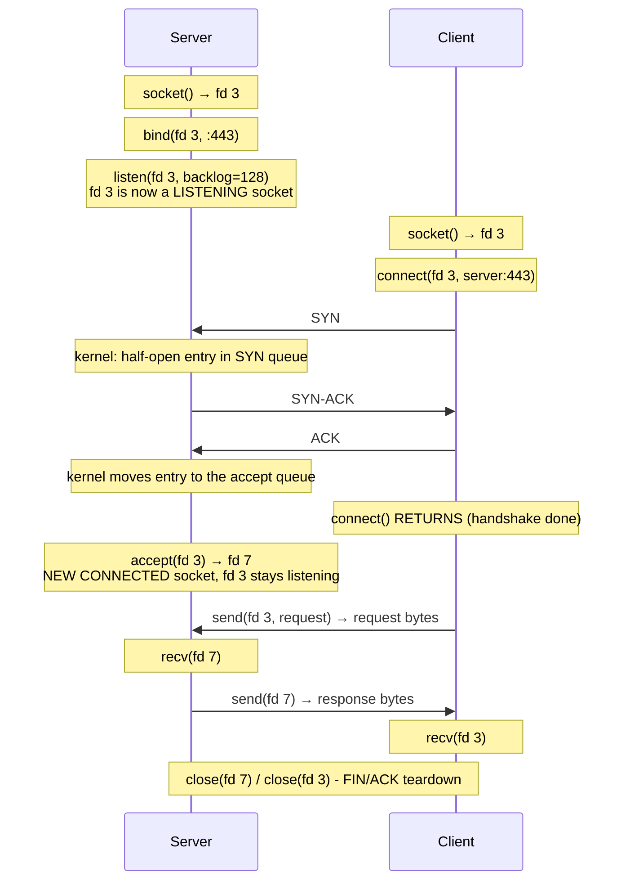

# Sockets

_You've studied TCP handshakes, TLS, WebSockets, and the C10K problem. This lesson pulls back the floor: all of it is your program calling a handful of decades-old OS functions on one object -- the socket._

`⏱️ ~7 min · 10 of 17 · Networking`

> [!TIP] The gist
> A **socket** is the operating system's handle for a network endpoint -- the thing your code reads and writes to talk to the network. On Unix it's a **file descriptor** (a small integer), because "everything is a file." Don't confuse the trio: a **port** is a number, a **socket** is the endpoint object, a **connection** is the 4-tuple pairing two sockets. The structural key: a **listening socket** only _accepts_ new connections -- it never carries data; `accept()` manufactures a brand-new **connected socket** per client, each unique by its 4-tuple. That's _how_ one port (`:443`) serves 50,000 clients at once. And the scaling key: a blocking `recv()` parks a thread, so thread-per-connection can't reach millions -- non-blocking sockets + an **event loop** (`epoll`/`kqueue`) let one thread watch thousands of sockets. That's the direct answer to C10K, and it's what nginx, Redis, and Node.js do.

## Contents

- [Intuition](#intuition)
- [The concept](#the-concept)
- [How it works](#how-it-works)
- [In the real world](#in-the-real-world)
- [Trade-offs](#trade-offs)
- [Remember](#remember)
- [Check yourself](#check-yourself)

## Intuition

Picture a busy office reception.

There's **one phone at the front desk** with a published number. Its only job is to answer _new_ incoming calls -- it never handles the actual conversation. When a call comes in, the receptionist hands it off to a **fresh handset** in a private booth, and the front desk phone is instantly free for the next caller.

- The **front desk phone** = the **listening socket**. One published number (`:443`), takes new calls only, never carries a conversation.
- Each **private handset** = a **connected socket**. One per caller, carries all the back-and-forth for that _one_ person.

One number, many simultaneous calls -- because every conversation moved to its own handset. That's exactly how a single server port serves thousands of clients at once.

## The concept

**Definition.** A **socket** is the operating system's abstraction for a network communication endpoint -- the handle your program holds to send and receive bytes to/from a remote peer, using ordinary read/write operations, _without_ touching IP headers, TCP segments, or the network card directly. Everything in this level -- the TCP handshake ([04-tcp.md](04-tcp.md)), UDP datagrams ([05-udp.md](05-udp.md)), HTTP ([06-http-versions.md](06-http-versions.md)), TLS ([07-https-tls.md](07-https-tls.md)), WebSocket frames ([08-websockets-sse-long-polling.md](08-websockets-sse-long-polling.md)) -- is, underneath, bytes moving through a socket.

**A socket is a file descriptor.** In Unix-like systems (Linux, macOS, BSD) the ruling idea is _"everything is a file"_: a single small integer -- the **file descriptor (fd)** -- refers to any open resource the kernel manages (a disk file, a pipe, a terminal, or a socket). Create a socket and the kernel hands back an fd (e.g. `3`, `7`); every later operation uses that integer -- `read()`/`write()` or the socket calls `send()`/`recv()`. This isn't cosmetic: because a socket _is_ an fd, it plugs into any OS facility that works on fds -- crucially the multiplexing calls (`select`/`poll`/`epoll`/`kqueue`) below.

**Disambiguate the trio** (the most common confusion in all of networking):

| Term           | What it is                                                                                                                                                          |
| -------------- | ------------------------------------------------------------------------------------------------------------------------------------------------------------------- |
| **Port**       | Just a 16-bit **number** -- a coordinate on a host. No state, no buffers, no lifecycle.                                                                             |
| **Socket**     | A live in-kernel **object** with an address family, a type, buffers, and (once connected) local + remote addresses. The thing your program manipulates via an fd.   |
| **Connection** | Not a thing either side "has" alone -- the **pairing of two sockets** via TCP's shared state, identified by the **4-tuple** `(src IP, src port, dst IP, dst port)`. |

**The one structural distinction that matters most:**

- A **listening socket** is in a passive mode: not connected to any peer, no fixed remote address, does _one_ job -- accept incoming connection attempts and hand each off as a brand-new socket. Exactly one per address:port a server binds.
- A **connected socket** is created _from_ a listening socket, one per client, and it -- and only it -- has a full 4-tuple and carries actual application data.

**What a socket is NOT:** it is **not** a port (a port is a number; a socket is an object bound _to_ a port). The **listening socket does NOT carry client data** -- `accept()` never touches it; it only keeps manufacturing new connected sockets.

**Key terms:** file descriptor (fd), Berkeley/BSD sockets API, `SOCK_STREAM` (TCP) vs `SOCK_DGRAM` (UDP), backlog / accept queue, blocking vs non-blocking, event loop, `epoll`/`kqueue`.

## How it works

### The socket lifecycle

The **Berkeley sockets API** (from 4.2BSD, early 1980s) is the standard set of syscalls every OS and language exposes -- directly (C, Go's `net`, Python's `socket`) or wrapped (Node's `net`/`http`, Java's `Socket`). A server walks five calls in order; a client's path is shorter because it never listens or accepts.

**Server:** `socket()` → `bind()` (claim `0.0.0.0:443`) → `listen()` (open the backlog queue) → `accept()` (**returns a NEW connected socket** per client) → `recv()`/`send()` on that connected socket → `close()`.

**Client:** `socket()` → `connect()` (**this triggers the TCP three-way handshake**, [04-tcp.md](04-tcp.md#the-three-way-handshake)) → `send()`/`recv()` → `close()`.

Note _where the handshake happens_: entirely **inside `connect()`** on the client, and **inside the kernel, before `accept()` is even called**, on the server. `accept()` performs _no part_ of the handshake -- it only dequeues a connection the kernel already completed. (That's why a slow app that isn't calling `accept()` fast enough can still have its backlog fill up with fully-handshaked, waiting connections.)

### One port, many clients

Here's the payoff. One server listening on a single port serves thousands of clients because each connected socket has a **distinct 4-tuple** -- the server's own IP:port is identical every time, but each client brings a different source IP and/or source port. The port was never the limit; the 4-tuple is, and it has vastly more room.

Trace one browser hitting a server whose listening socket is fd `3` on `0.0.0.0:80`:

1. **Before connect:** open fds are `0` (stdin), `1` (stdout), `2` (stderr), `3` (listening socket). Fd 3 has no remote peer.
2. **Client `connect()`** sends a SYN. The server's _kernel_ (not the app) does the handshake and drops a fully-established connection into fd 3's accept queue.
3. **`accept(3)` returns `fd 7`** -- a brand-new connected socket for this one client. Fd 3 is unchanged, ready for the next handshake.
4. **`recv(7, ...)`** reads the raw request bytes (`GET /index.html HTTP/1.1\r\n...`) off fd 7.
5. **`send(7, ...)`** writes the response (`HTTP/1.1 200 OK\r\n...`) back on fd 7.
6. **`close(7)`** releases fd 7; TCP's FIN teardown runs for that one connection.

The takeaway: **fd 3 (listening) never carries a single byte of HTTP; fd 7 (connected) carries all of it for one client.** A hundred concurrent clients means fds 8, 9, 10, ... -- all fanned out from that same one listening socket on port 80.

### Blocking vs event loops -- the C10K answer

By default socket ops are **blocking**: `recv()` on a socket with no data yet **parks the calling thread** until data arrives. Simple to read top-to-bottom -- but it collides with the **C10K/C10M problem** from [08-websockets-sse-long-polling.md](08-websockets-sse-long-polling.md#the-c10k-and-c10m-problem).

**Why thread-per-connection can't reach millions:** spawn one OS thread per connected socket and let each block on `recv()`, and it works for hundreds -- but breaks well before a million for two compounding costs. (1) **Memory** -- each thread carries a stack (hundreds of KB to a few MB, `verify`), so 100k threads eat gigabytes before storing one byte of data. (2) **Context switches** -- the scheduler time-slicing across thousands of threads burns CPU on register-saving and cache-flushing. Long-lived connections (WebSockets, SSE, keep-alive) make it acute: threads sit blocked forever relative to the tiny data exchanged.

**The fix -- non-blocking sockets + an event loop.** Put sockets in non-blocking mode (`recv()` returns "would block" instead of parking), then use an **event loop**: one thread that asks the kernel, in a single call, _"which of these thousands of sockets is ready right now?"_ and works only on those. The multiplexing call evolved through three generations:

- **`select()`** / **`poll()`** -- you hand the kernel the whole watched set every call; it's an **O(n) scan** in both kernel and userspace. Dies past a few thousand sockets (and `select` historically caps at 1024 fds).
- **`epoll()` (Linux)** / **`kqueue()` (BSD/macOS)** -- register interest **once** per socket; the kernel keeps a persistent ready-list and hands back _only the sockets that are actually ready_ -- cost proportional to ready events, not to the watched population. This is what lets one thread watch hundreds of thousands of mostly-idle long-lived connections.

That last pair -- `epoll`/`kqueue` + an event loop on non-blocking sockets -- **is** the concrete, industry-standard answer to C10K.

## In the real world

Sockets are a settled OS primitive, so there's no shifting "current practice" here -- just the canonical designs built on top.

**nginx, Redis, and Node.js are the textbook event-loop-on-`epoll`/`kqueue` servers.** All three run a small, fixed number of threads (often one event-loop thread per worker) using **non-blocking sockets + `epoll` (Linux) / `kqueue` (BSD/macOS)** to serve tens of thousands to hundreds of thousands of concurrent connections per process -- the direct answer to the C10K problem from the previous topics. Netty (the JVM networking framework under many high-throughput Java services) follows the same model.

Full sourcing (UNIX Network Programming, the POSIX man pages, Kegel's C10K essay): [research/backend/L1/10-sockets.md](../../../research/backend/L1/10-sockets.md#real-world-and-sources).

## Trade-offs

| Axis                  | Option A                                                                                                                                    | Option B                                                                                                                                                      |
| --------------------- | ------------------------------------------------------------------------------------------------------------------------------------------- | ------------------------------------------------------------------------------------------------------------------------------------------------------------- |
| **Concurrency model** | **Blocking + thread-per-connection** -- ✅ dead simple, linear code · ❌ hard wall well before a million (thread memory + context switches) | **Non-blocking + event loop** (`epoll`/`kqueue`) -- ✅ scales to hundreds of thousands per process on few threads · ❌ callback/async code is harder to write |
| **Transport**         | **TCP socket** (`SOCK_STREAM`) -- reliable ordered byte stream; needs `listen`/`accept`/`connect`, `send`/`recv`                            | **UDP socket** (`SOCK_DGRAM`) -- connectionless; **no `accept`/`connect` needed**, uses `sendto`/`recvfrom`, one socket talks to many peers                   |
| **Locality**          | **Network socket** (`AF_INET`/`AF_INET6`) -- full IP/TCP stack, works across machines                                                       | **Unix domain socket** (`AF_UNIX`) -- **same API**, addressed by a filesystem path, local-only IPC, skips the network stack (faster than `localhost` TCP)     |

**Scaling gotchas** (all trace back to [04-tcp.md](04-tcp.md#connection-termination)): every socket is an fd, so **`ulimit -n`** caps concurrent connections regardless of how good your event loop is; the side that closes first accumulates **`TIME_WAIT`** sockets; and a client hammering one destination can hit **ephemeral port exhaustion** (each new outbound connection needs a free source port) -- which is exactly why connection pooling matters.

## Remember

> [!IMPORTANT] Remember
> A **socket is the file-descriptor handle your code reads and writes to talk to the network** -- everything in L1 (TCP, UDP, HTTP, TLS, WebSockets) rides on it. Two facts carry the topic: **one listening socket fans out to one connected socket per client** (each unique by its 4-tuple -- that's how a single port serves thousands at once), and the **blocking-vs-event-loop choice** decides whether a server handles hundreds or millions of connections.

## Check yourself

1. A server serves **10,000 clients at once on port 443** with a single `bind()`/`listen()`. How? What makes each client's connection distinct at the OS level -- and which socket carries the data, the listening one or the connected one?
2. Why can't a **thread-per-connection** server reach a million concurrent connections? Name the two costs that compound -- and what architecture fixes it.
3. Where exactly does the **TCP three-way handshake** happen relative to the client's `connect()` and the server's `accept()`? Does `accept()` perform any part of it?

---

→ Next: [Forward and reverse proxies](11-forward-and-reverse-proxies.md) (intermediaries that front for clients or servers)
↩ Comes back in: load balancers (juggling client + backend sockets), connection pooling (caching connected sockets), service mesh (sidecars over Unix domain sockets)
