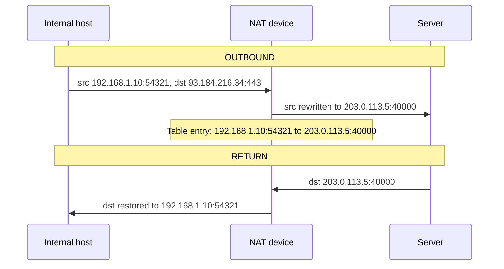

# NAT (Network Address Translation)

*Your laptop is `192.168.1.10` -- an address that never appears anywhere on the public internet. Yet it browses the web fine. Something at your network's edge stamps a new address on every packet going out, and remembers exactly how to undo it on the way back.*

`⏱️ ~7 min · 12 of 17 · Networking`

> [!TIP] The gist
> **NAT** is a router **rewriting the IP address (and usually the port)** in packet headers as they cross the boundary between your private network and the public internet -- so many private-IP hosts can share **one** public IP. It records each rewrite in a **translation table** so return traffic finds its way back. The **port is the disambiguator**: a dozen devices behind one public IP are told apart by the distinct public port each gets. NAT exists because IPv4 ran out of addresses (topic 2). Two things it is NOT: it is **not a firewall** (it drops unsolicited inbound only as a side effect, not as policy) and it is **not a proxy** (the connection stays end-to-end; NAT never terminates or reads payload). Its cost: it breaks direct reachability, which is why peer-to-peer needs traversal tricks (STUN/TURN/ICE).

## Contents

- [Intuition](#intuition)
- [The concept](#the-concept)
- [How it works](#how-it-works)
- [In the real world](#in-the-real-world)
- [Trade-offs](#trade-offs)
- [Remember](#remember)
- [Check yourself](#check-yourself)

## Intuition

Picture an office with **one public phone number** and a **receptionist**.

Every employee has an internal extension. When someone dials out, the call leaves through the *one* published number -- the person they called sees only that number, never the extension. The receptionist jots a note: *"extension 214 is calling ACME on line 3."*

When ACME calls back on line 3, the receptionist checks the note and routes the call to extension 214. Nobody outside ever learns the extensions exist.

That's NAT exactly. The **one public number** is your public IP. The **extension** is the internal host's private IP and port. The **receptionist's note** is the NAT translation table. And the trick that makes it scale: the receptionist can juggle many simultaneous calls by tracking *which line* each is on -- the **line number is the port.**

## The concept

**Definition.** **NAT (Network Address Translation)** is a technique -- almost always run by a router sitting at the boundary between a private network and the public internet -- that **rewrites the IP addresses (and usually the port numbers) in packet headers** as packets cross that boundary. This lets many privately-addressed hosts share a small number of public IP addresses, often just one.

**Why it exists -- IPv4 exhaustion.** Topic 2 ([IP addressing and subnets](02-ip-addressing-and-subnets.md)) set this up: IPv4 has only ~4.3 billion addresses -- nowhere near enough for every device on earth. RFC 1918 carved out **private ranges** (`10.0.0.0/8`, `172.16.0.0/12`, `192.168.0.0/16`) that any network can reuse internally, precisely because they're never routable on the public internet. NAT is what makes those private addresses *usable* for reaching the internet at all.

**The private/public boundary.** A NAT device (home router, corporate firewall, cloud NAT gateway) sits on the seam between two worlds: **inside**, hosts use private, non-routable addresses; **outside**, every packet must carry an address the internet can route back to. NAT is the translator at that seam.

**"Translation," precisely.** It means rewriting fields in the IP header (source/destination address) and, in the common case, the transport header (source/destination port) -- done transparently, in-flight, with **neither application aware** it happened. The real endpoints of the TCP/UDP connection are still the original client and server. NAT does **not** terminate the connection or open a new one.

**What it is NOT** (the two big ones):

- **NAT is not a firewall.** It creates a table entry only when an *inside* host sends outbound. A packet arriving from the internet with no matching entry has nowhere to go, so it's dropped. That *looks* like a firewall blocking unsolicited inbound -- but it's a **side effect of how the table is built**, not an access-control decision. A port forward, a static mapping, or a compromised inside host phoning out can all still expose you. Never rely on NAT *as* security.
- **NAT is not a proxy.** A proxy (topic 11) *terminates* one connection and opens a second, and can read/modify payload. NAT only rewrites header address/port fields and never touches payload; the connection stays conceptually end-to-end.

**Key terms:** translation table, private/public boundary, SNAT (source rewrite), DNAT (destination rewrite), PAT/NAPT, CGNAT, port forwarding, NAT traversal.

## How it works

### The translation table

The heart of NAT is a table mapping an internal `(private IP, port)` to an external `(public IP, port)`, kept in sync both directions.

**Outbound:** rewrite the *source* to the router's public IP and a chosen public port, and record the mapping.
**Return:** look up the public `(IP, port)` the reply arrived at, and rewrite the *destination* back to the original private `(IP, port)`.

**Why the port matters so much.** This is the payoff of the 4-tuple from topics 4/5. A single public IP has 65,536 ports, and NAT uses the **port** as the disambiguator that lets many internal `(IP, port)` pairs share one public IP. Without ports to multiplex on, one public IP could serve only one inside host at a time -- the port is what makes many-to-one sharing possible at all.

### PAT -- two devices, one public IP (worked example)

The ubiquitous home case. One router with public IP `203.0.113.5`, two devices browsing at once:

- **Device A** `192.168.1.10` -> from local port `54321` to `93.184.216.34:443`
- **Device B** `192.168.1.11` -> from local port `54321` (same local port -- fine, it's a *different* private IP) to `172.217.14.206:443`

The router's translation table after both connect:

| Private IP:Port | Public IP:Port | Remote destination |
|---|---|---|
| `192.168.1.10:54321` | `203.0.113.5:40000` | `93.184.216.34:443` |
| `192.168.1.11:54321` | `203.0.113.5:40001` | `172.217.14.206:443` |

Both appear to the outside as `203.0.113.5` -- but each gets a **distinct public port** (`40000` vs `40001`), even though their internal ports collided. A reply to `203.0.113.5:40000` unambiguously routes back to Device A; `:40001` to Device B. That's how a home network of a dozen devices all browse "simultaneously" through one public IPv4 address.

This many-to-one, port-disambiguated form is **PAT** (Port Address Translation, a.k.a. NAPT or "NAT overload") -- and it's what "NAT" means in almost every real deployment. When ISPs run out of even that, they add **CGNAT (Carrier-Grade NAT)**: PAT one level higher, NAT-ing *many customers'* routers behind a shared public-IP pool.

### NAT traversal -- why P2P is hard

**The problem:** the table is populated only by *outbound* traffic. An unsolicited inbound packet with no matching entry gets dropped. Fine for client-to-server (the client always initiates) -- but it breaks two peers, **each behind their own NAT**, trying to talk *directly* (a video call, a file transfer). Neither has a public address the other can dial, and neither NAT has an entry yet for the other peer.

The standard fixes, at concept level:

- **STUN** (Session Traversal Utilities for NAT) -- a peer asks a public STUN server "what do I look like from outside?" and learns its own public `(IP, port)` mapping. Both peers discover theirs, exchange them via a signaling channel, then try to send directly (often via **hole punching**: both send outward at once so each NAT opens a matching entry).
- **TURN** (Traversal Using Relays around NAT) -- the fallback when direct fails: both peers send to a public **relay** that forwards between them. Always works (it's just client-to-server both ways), at the cost of an extra hop and the relay operator's bandwidth.
- **ICE** (Interactive Connectivity Establishment) -- the framework that ties it together: gather *candidate* addresses (local, STUN-discovered, TURN relay), exchange them, and systematically try each until one works -- preferring a direct path, falling back to TURN only if nothing direct succeeds.

This exact chain is what **WebRTC** (topic 17) uses under the hood to connect two browsers that are both very likely behind NAT.

## In the real world

Settled, universal infrastructure -- no company-specific claims needed:

- **Every home and small-office router runs PAT by default**, sharing one ISP-assigned public IPv4 address across every device on the network. The mechanism above is running, right now, on essentially every residential IPv4 connection in the world.
- **ISPs add CGNAT** to stretch a shrinking pool of public IPv4 across a larger customer base -- at the cost of making unsolicited inbound to any one customer harder.
- **WebRTC uses STUN/TURN/ICE** to punch through NAT for browser-based real-time audio, video, and data.

Full sourcing (RFCs 2663, 3022, 4787, 6888, 8445, 8489, 8656): [research/backend/L1/12-nat.md](../../../research/backend/L1/12-nat.md#real-world-and-sources).

## Trade-offs

| Axis | ✅ Benefit | ❌ Cost |
|---|---|---|
| **Address conservation** | Many private hosts share one public IP -- PAT is the workhorse of the entire consumer internet | It's a **stopgap** for IPv4 scarcity, not an architectural ideal |
| **Inbound obscurity** | Internal topology hidden; unsolicited inbound dropped by default | This is **incidental**, NOT real security -- do not treat it as a firewall |
| **End-to-end reachability** | -- | Broken by design: an inside host can't be dialed directly without port forwarding, or STUN/TURN/ICE for P2P |
| **Table state** | Transparent to applications | Finite: max table size, limited public ports, idle timeouts -- CGNAT can genuinely exhaust these under load |

**NAT vs proxy vs firewall -- one row each:**

| Term | What it actually does |
|---|---|
| **NAT** | Rewrites L3/L4 addresses **in flight**, transparently; connection stays end-to-end |
| **Proxy** | **Terminates** and re-originates the connection at L4/L7; can inspect/modify payload |
| **Firewall** | Makes deliberate **allow/deny** decisions on traffic per rules; needn't rewrite anything |

**IPv6 aims to make NAT unnecessary** -- topic 2 noted its 2^128 address space is vast enough for every device to hold a globally routable address, removing the *scarcity* reason NAT exists (some networks may still hide addresses by choice, but the *forced* translation goes away).

## Remember

> [!IMPORTANT] Remember
> NAT lets many private hosts share one public IP by **rewriting the address + port** in packet headers and tracking each rewrite in a **translation table** so return traffic routes back -- and the **port is the disambiguator** that makes many-to-one sharing work. It's an **IPv4-conservation stopgap**, NOT a firewall (dropping unsolicited inbound is a side effect of table lookup, not policy) and NOT a proxy (the connection stays end-to-end). Its price is broken end-to-end reachability -- which is exactly why peer-to-peer needs traversal (STUN/TURN/ICE).

## Check yourself

1. Two laptops behind one home router both open `google.com` at the same time. How does the router send each response to the *right* laptop? What field makes that unambiguous?
2. True or false: "We have NAT, so our network is secure." Explain what's wrong, and name one thing that could still reach an inside host despite NAT.
3. Two friends each behind their own home router want a direct video call. Why does simply sending a packet to the other's public IP fail the first time -- and what do STUN and TURN each contribute?

---

→ Next: [Load Balancers](13-load-balancers.md) (L4/L7, algorithms, health checks -- and DNAT under the hood)
↩ Comes back in: WebRTC (NAT traversal with STUN/TURN/ICE), load balancers (DNAT), IPv6 (removing the reason NAT exists)
