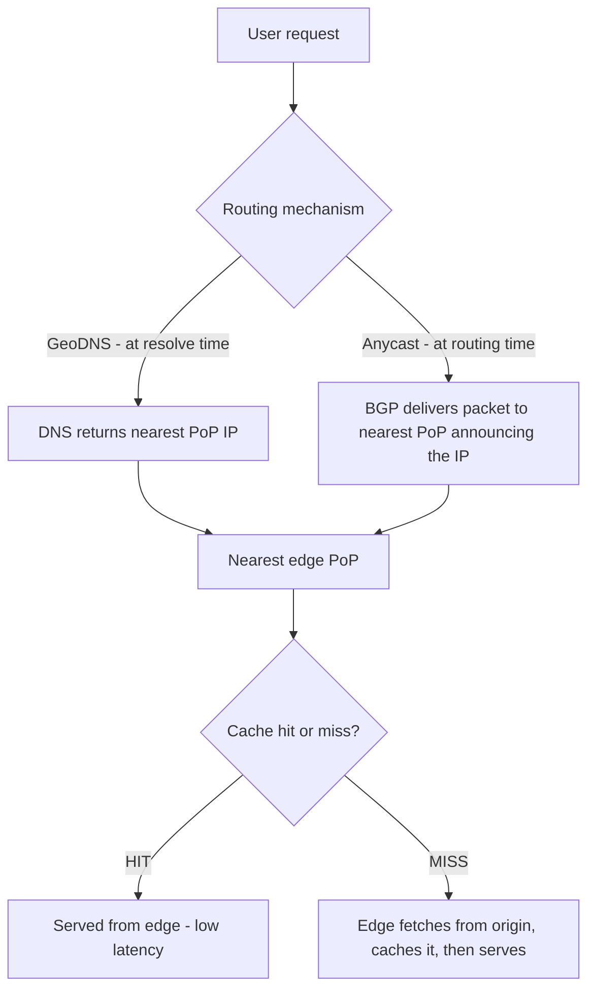
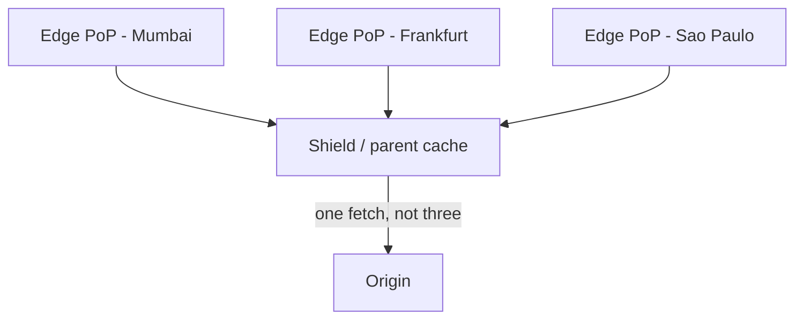

# CDN Internals (Serving Content From the Edge)

*Every trick from this level, applied geographically: a reverse-proxy cache (topic 11), cloned across the planet, that DNS or anycast points you at the nearest copy of.*

`⏱️ ~8 min · 15 of 17 · Networking`

> [!TIP] The gist
> A **CDN (Content Delivery Network)** is a **geographically distributed network of edge caches** that serve content from *near the user* instead of from one distant **origin**. It's a **reverse-proxy cache (topic 11) cloned across hundreds of locations**, and GeoDNS (topic 3) or anycast (topic 16) routes each user to the nearest one. The payoff is four wins from one mechanism -- **lower latency** (physics: closer = fewer/shorter round trips), **origin offload** (a cached hit never touches the origin), **spike/DDoS absorption**, and **bandwidth savings**. Success is measured by **cache hit ratio**; the perennial hard problem is **invalidation** -- keeping copies scattered across every PoP correctly fresh.

## Contents

- [Intuition](#intuition)
- [The concept](#the-concept)
- [How it works](#how-it-works)
- [In the real world](#in-the-real-world)
- [Trade-offs](#trade-offs)
- [Remember](#remember)
- [Check yourself](#check-yourself)

## Intuition

Imagine everyone on Earth ordering from **one central warehouse**. It's far away, so every package takes days; and on a busy day the warehouse is buried under orders it can't possibly fill fast enough.

Now put a **local corner shop in every neighborhood**. Each shop stocks the popular items. You walk in and grab what you need *instantly* -- the warehouse never hears about your purchase at all. The warehouse only restocks the shops occasionally, and only for things the shops don't already have.

The warehouse is the **origin**. The corner shops are **edge PoPs**. A CDN is that network of shops: content lives close to you, so requests are answered nearby instead of from a distant, overwhelmed source.

## The concept

**Definition.** A **CDN** is a geographically distributed network of **edge servers** that cache and serve content from a location physically close to the requesting user, instead of every request traveling all the way to a single distant **origin**.

**Key vocabulary:**

- **Origin** -- the server (or cluster) that holds the authoritative, original copy of the content. The CDN sits *in front* of it; it doesn't replace it.
- **Edge server** -- a server at the "edge" of the network, close to end users, that caches and serves content on the origin's behalf.
- **PoP (Point of Presence)** -- a physical facility (a cluster of edge servers) at one geographic location. A large CDN runs hundreds of PoPs worldwide; a Mumbai user should hit a Mumbai PoP, not one in Virginia.

**It's a distributed reverse-proxy cache at the edge.** Topic 11 established the reverse-proxy pattern -- sit in front of an origin, terminate the client connection, add cross-cutting capability (caching, TLS termination, hiding the origin) without the client knowing. A CDN takes that *exact* pattern and clones it across hundreds of physical locations, so "the reverse proxy nearest you" answers instead of one central instance.

**The four wins (all from one mechanism -- serving from nearby cache):**

1. **Latency (pure physics).** Round-trip time is bounded by distance / speed of light through fiber (back-ref L0). Mumbai to a Virginia origin is ~150-200ms RTT *per round trip* -- and a connection pays it on the TCP handshake (topic 4), the TLS handshake (topic 7), *and* the request. A nearby PoP is 5-20ms away, so you save that gap on *every* round trip, not once.
2. **Origin offload.** Every request an edge answers from cache is one the origin never sees. The origin can be sized for "cache misses only," not "all global traffic."
3. **Availability / shock absorption.** Spikes (a viral post, a launch, a live event) and even DDoS floods hit the edge first, spread across hundreds of PoPs with huge aggregate capacity -- the origin is structurally insulated (forward-ref DDoS/WAF, L9).
4. **Bandwidth cost.** Serving from a nearby PoP over cheap local peering beats shipping the same bytes across a long-haul link on every request: N requests become 1 long-haul transfer (the miss) + N-1 cheap local ones.

**What it is NOT.** The myth "a CDN is just for images" is wrong. Modern CDNs also do **video streaming** (the majority of internet CDN traffic), **dynamic-content acceleration**, **TLS termination** near the user, **DDoS/WAF** shielding, and **edge compute** (running code at the PoP). Static files are the historical starting point, not the ceiling.

## How it works

### 1. Getting to the nearest edge

Routing a user to the *nearest healthy* PoP happens *before* any HTTP logic runs. Two canonical mechanisms (large CDNs combine both):

- **GeoDNS / latency-based DNS** (back-ref [topic 3](03-dns-deep.md#geodns-and-location-based-answers)) -- the CDN's authoritative DNS returns a *different* edge IP depending on where the resolver is. Decided once, at resolve time; subject to DNS TTL, so reacting to a PoP outage waits for the record to expire.
- **Anycast** (forward-ref [topic 16](16-anycast-bgp.md)) -- the *same* IP is announced from every PoP, and internet routing (BGP) delivers each user's packets to the topologically nearest one. Failover is a routing event, not a TTL wait.



This is the same "route by geography and health" idea as GSLB in [topic 13](13-load-balancers.md) -- just at a finer grain (hundreds of PoPs, not a handful of regions).

### 2. Hit vs miss, and freshness

Once a request lands at a PoP, it behaves exactly like the reverse-proxy cache from topic 11:

- **Cache HIT** -- the object is present and still fresh; served straight from the edge, no origin trip at all.
- **Cache MISS** -- absent or expired; the edge fetches from the origin (or a shield -- see below), stores a copy, *then* serves it. Only this first fetch pays full origin latency.
- **Freshness** is governed by the *same* HTTP headers from [topic 6](06-http-versions.md): `Cache-Control: max-age=N` (how long a response may be reused), `s-maxage` (for shared/proxy caches like a CDN), and `ETag` (revalidate a stale copy cheaply). The origin tells the edge how long it may reuse a response.

**Worked example -- first request (miss) vs. cached (hit).** Mumbai user, nearest PoP is 8ms away, origin is in Virginia (~190ms RTT from that PoP).

```
Request 1 (cold cache, MISS):
  user -> Mumbai PoP        ~8ms
  PoP cache lookup          MISS
  PoP -> Virginia origin    ~190ms RTT + origin processing
  PoP stores copy (max-age=86400), serves user
  Total: ~200ms+   (dominated by the one trip to Virginia)

Request 2, minutes later, different Mumbai user, same URL (HIT):
  user -> Mumbai PoP        ~8ms
  PoP cache lookup          HIT  (max-age not elapsed)
  PoP serves cached bytes   no origin trip
  Total: ~8ms
```

That's a **>20x** latency win for every user after the first -- and the origin saw *one* request no matter how many thousands ask within the TTL window. Origin offload and latency both fall out of the same mechanism. (Eviction, stampede handling, and deep caching strategy get their full treatment in L3.)

### 3. The hard part -- invalidation and protecting the origin

*"There are only two hard things in Computer Science: cache invalidation and naming things."* A CDN is exactly where invalidation gets hard, because cached copies are scattered across every PoP that served the object -- not sitting in one place.

Three mechanisms, passive to active:

- **TTL expiry (passive)** -- the copy just goes stale when `max-age` elapses; the next request refetches. No action needed; the trade-off is baked into the TTL you chose.
- **Purge / invalidation (active)** -- explicitly tell the CDN to discard a copy *before* TTL: **by URL** (one object), **by tag / surrogate key** (everything tagged, e.g. "all pages for product 4821," in one call), or **purge-all** (nuclear, used sparingly). Purges must propagate to every PoP -- itself a distributed-systems problem that takes real time.
- **Versioned / fingerprinted URLs** -- ship new content under a *new* URL (`app.js` -> `app.a1b2c3.js`). Old copies become irrelevant instead of needing a purge, and the new URL can have a near-infinite TTL. The standard approach for build-generated assets.

**The TTL trade-off:** long TTL = higher hit ratio and less origin load, but staler content; short TTL = fresher, but lower hit ratio and more origin traffic. There's no universal right answer -- a versioned JS bundle can live nearly forever; a live leaderboard cannot. (`stale-while-revalidate` is the modern middle ground: serve the stale copy instantly while refreshing in the background.)

**Origin shielding / tiered caching.** When a popular object's TTL expires at once across many PoPs, all of them miss simultaneously and slam the origin -- an **origin stampede**. A **shield** (parent/regional) cache between the PoPs and the origin fixes this: PoPs fetch from the shield, only the shield talks to the origin, and it collapses many simultaneous misses into *one* origin fetch.



Same "add a tier to reduce fan-in" idea as tiered load balancing in topic 13, applied to caching. The headline metric across all of this is **cache hit ratio** -- the fraction of requests served from cache -- because it drives *both* lower latency and lower origin load at once.

## In the real world

- **Netflix Open Connect -- push model, origin offload at video scale.** Netflix runs its own CDN. Its Open Connect appliances are shipped free to partner ISPs (**1,000+** of them) and embedded *inside* the ISP's own network, pre-filled with content during off-peak hours so the "push" happens before demand -- serving a large fraction of global evening traffic without touching a central origin. ([Open Connect](https://openconnect.netflix.com/en/))
- **Cloudflare -- anycast at global scale.** Cloudflare's network spans **337 cities**, with **95%** of the internet-connected population within **~50ms** of a data center (as of July 2026). The same IP is announced from every city and BGP -- not DNS -- decides which PoP your packets hit. The network-layer half of "nearest PoP." ([Cloudflare network](https://www.cloudflare.com/network/))
- **Fastly -- instant purge via surrogate keys.** Tag many objects with one key, then purge them all in a single API call. Fastly's engineering blog reports purges start at the nearest PoP within ~5ms and complete worldwide in about **~150ms** -- near the physical limit for a light-speed trip around the globe. Active invalidation at production speed. ([Fastly blog](https://www.fastly.com/blog/is-purging-still-the-hardest-problem-in-computer-science))
- **AWS CloudFront Origin Shield -- tiered caching as a product.** An explicit extra caching tier between all edge locations and the origin; AWS states it consolidates requests so that **"as few as one request"** reaches the origin per object -- the exact origin-stampede-collapsing mechanism above. ([AWS docs](https://docs.aws.amazon.com/AmazonCloudFront/latest/DeveloperGuide/origin-shield.html))

Full sourcing: [research/backend/L1/15-cdn-internals.md](../../../research/backend/L1/15-cdn-internals.md#real-world-and-sources).

## Trade-offs

| Axis | ✅ Benefit | ❌ Cost |
|---|---|---|
| **CDN overall** | Lower latency (physics), origin offload, spike/DDoS absorption, bandwidth savings | Added complexity + cost; stale-content risk; invalidation is genuinely hard |
| **Static vs dynamic** | Static assets cache trivially (same bytes for everyone) | Dynamic/personalized content is trickier -- needs careful cache-key design or connection-only acceleration |
| **Long vs short TTL** | Long = high hit ratio, low origin load | Long = slower to reflect updates; short = fresher but more origin traffic |
| **Origin shielding** | Collapses many simultaneous misses into one origin fetch; higher hit ratio | An extra tier and an extra hop on a true miss |

**Push vs pull, in one line:** *pull* (dominant, simplest) populates the cache lazily on the first request per PoP; *push* uploads content ahead of time to guarantee a warm cache, at the cost of an explicit publish step.

## Remember

> [!IMPORTANT] Remember
> A CDN moves content to **edge caches near users** so requests are answered close by instead of from a distant origin -- cutting latency (physics: fewer/shorter round trips) and shielding the origin (a hit never reaches it). GeoDNS or anycast routes you to the nearest PoP; that PoP serves on a **hit** or fetches-and-caches on a **miss**, governed by the same `Cache-Control`/`ETag` rules as plain HTTP. The payoff is measured by **cache hit ratio** -- the one number that drives both latency *and* origin-load wins -- and the perennial hard problem is **invalidation / freshness**: TTL handles it passively, purge actively, and versioned URLs sidestep it by giving new content a new name.

## Check yourself

1. Serving from a nearby edge cuts latency dramatically -- what *physical* thing changes, and why does it help on *every* round trip of a connection rather than just once?
2. You deploy a bug fix to `app.js` but users keep getting the old version for hours. Which CDN mechanism caused this, and what's the standard fix going forward so it can't happen again?
3. What does origin shielding protect against, and how does adding one middle tier accomplish it?

---

→ Next: [Anycast / BGP Basics](16-anycast-bgp.md) (how one IP lives in many places, and how the internet routes between networks)
↩ Comes back in: caching strategies & eviction (L3), object storage (L3), edge compute (cloud), DDoS/WAF (security), video-streaming design
