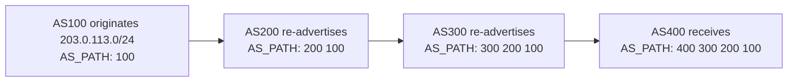
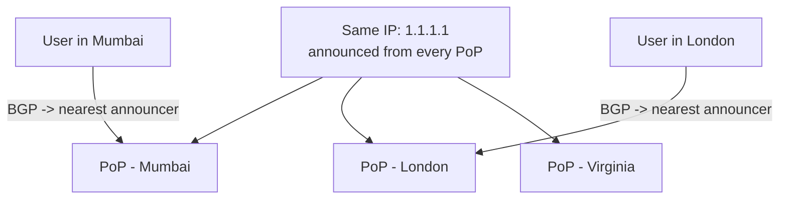

# Anycast / BGP Basics (How the Internet Routes Between Networks)

*The payoff for every "we'll explain anycast later" you've hit in DNS, load balancers, and CDNs -- how 1.1.1.1 answers from wherever you are, and how a packet crosses dozens of strangers' networks to get home.*

`⏱️ ~8 min · 16 of 17 · Networking`

> [!TIP] The gist
> The internet has **no central router** -- it's tens of thousands of independently-run networks (**autonomous systems**), and **BGP** is the trust-based, policy-driven protocol they use to tell each other *"I can reach these IP prefixes, via this path."* That's how a packet crosses networks nobody co-owns. **Anycast** rides on top: announce the **same IP from many locations at once**, and ordinary BGP routing delivers each user to the **nearest** one automatically. That single trick is the mechanism under anycast DNS (1.1.1.1, 8.8.8.8), CDN edge routing, and load-balancer failover -- nearest-edge routing and fast failover, essentially for free. The catch: BGP is trust-based (a bad announcement can break things), and anycast fits stateless traffic far better than long-lived connections.

## Contents

- [Intuition](#intuition)
- [The concept](#the-concept)
- [How it works](#how-it-works)
- [In the real world](#in-the-real-world)
- [Trade-offs](#trade-offs)
- [Remember](#remember)
- [Check yourself](#check-yourself)

## Intuition

**BGP is the internet's postal system.** There's no single post office that knows every address on Earth. Instead, each country's postal service tells its neighbors: *"Mail for these postcodes? Hand it to me."* Each neighbor passes that word along, stamping *"...and it came through us"* on the way. Nobody has the whole map -- but by every office announcing what it can deliver to whoever it's connected to, a letter from Mumbai reliably finds a house in Virginia.

**Anycast is a chain of branches with one phone number.** Dial that one number and you're always connected to the *nearest* branch -- same number everywhere, closest location answers. You never chose a branch; the network did it for you. If your nearest branch closes, the same number just rings the next-nearest, and you never notice.

## The concept

**Definition.** **BGP (Border Gateway Protocol)** is the protocol that independently-operated networks use to tell each other which IP ranges they can reach and by what path -- it's the glue that stitches the whole internet together. **Anycast** is a routing technique where the *same* IP address is announced from many physical locations at once, and normal routing delivers each user to the topologically nearest one.

**The internet is a network of networks.** A packet leaving a phone in Mumbai for a server in Virginia crosses many separately-owned networks -- a home ISP, a regional carrier, a transit backbone, a cloud provider -- none under common ownership. Each such network is an **Autonomous System (AS)**, identified by a globally unique **AS Number (ASN)** (e.g. Google is `AS15169`). There is no "the internet router"; global reachability *emerges* from thousands of AS-to-AS agreements.

**BGP is a path-vector protocol.** An AS advertises *"I can reach prefix X"* along with the full **AS_PATH** -- the list of ASes the route has already crossed. Every AS that passes the route on prepends its own ASN. That path is used both to avoid loops (see your own ASN in the path -> reject it) and to pick a best route.

**The four delivery modes** -- distinguished by *how many recipients one packet is meant for*:

| Mode | Delivery | Typical use |
|---|---|---|
| **Unicast** | one-to-**one** | The default -- a normal client-to-server TCP connection |
| **Broadcast** | one-to-**all on the local segment** | ARP, DHCP -- stays local, doesn't cross routers |
| **Multicast** | one-to-a-**subscribed group** | IPTV-style live-stream distribution |
| **Anycast** | one-to-**nearest** | DNS resolvers (1.1.1.1, 8.8.8.8), CDN edges, LB VIPs |

**What it is NOT.** BGP is *not authenticated* -- an AS announces what it *claims* to reach, with no protocol-level proof. That trust is why the internet scales without a central authority, and also why hijacks and route leaks are possible. And **anycast is NOT "one server"** -- it's the *same IP in many places*; there's no special packet, no new header, just ordinary routing choosing the nearest announcer.

## How it works

### 1. BGP: how routes propagate

An AS *originates* a prefix, then each hop that re-advertises it prepends its own ASN to the AS_PATH. Routers pick a "best" route -- often (but not only) the shortest AS_PATH; in practice operator **policy** (cost, contracts) usually wins first.

By the time it reaches AS400, the route carries a full breadcrumb trail back to the origin. BGP's job is only to *build the routing table*; moving each packet is still the **longest-prefix match** from [topic 2](02-ip-addressing-and-subnets.md#longest-prefix-match) -- BGP just populates the entries that match gets to choose from.

### 2. Anycast: one IP, many locations

Announce the *identical* IP from multiple PoPs. Every router just sees several routes to the same prefix and applies its normal best-path selection -- which usually favors the closest announcer. So two users hitting the same IP land on different physical servers, and neither device knows anything special happened.

This is exactly how CDNs ([topic 15](15-cdn-internals.md)) and anycast DNS resolvers ([topic 3](03-dns-deep.md)) find your nearest edge -- no DNS decision needed, the *same address* simply routes differently depending on where you are.

### 3. Why it's powerful (and the one caveat)

Anycast buys three things from one trick:

- **Automatic nearest-edge routing** -- the routing fabric picks the closest PoP, no GeoIP lookup in your app.
- **Built-in failover** -- a dead PoP stops announcing; BGP notices the withdrawn route and reconverges onto the next-nearest survivor in *seconds*, not a DNS-TTL wait of minutes (the LB-HA mechanism forward-referenced in [topic 13](13-load-balancers.md#high-availability-of-the-load-balancer-itself)).
- **DDoS dilution** -- a flood aimed at one anycast IP gets spread across *every* PoP instead of crushing one machine.

**The caveat, in one line:** anycast's "nearest wins" is a *per-packet* decision, not a *per-connection* promise -- great for short/stateless traffic (DNS queries, CDN cache hits), but a routing change mid-connection can land packets at a PoP that has never heard of your long-lived TCP/WebSocket session, which then resets it.

Two ways to route to the nearest edge, side by side: **anycast** decides at the **network layer** (every packet, fast BGP failover) while **GeoDNS** ([topic 3](03-dns-deep.md)) decides at the **DNS layer** (more control, but bounded by cache TTL). Large edge networks layer both.

## In the real world

- **Cloudflare -- 1.1.1.1 and the whole CDN on anycast.** The same prefixes are announced from *every* data center via BGP, so best-path selection lands each user on their nearest PoP -- no GeoIP in the app. Cloudflare says they can "take an entire data center offline and traffic will automatically flow to the next closest," and that a botnet's DDoS traffic gets "absorbed by each of our data centers." Nearest-edge routing + auto-failover + DDoS dilution, all three. ([Anycast primer](https://blog.cloudflare.com/a-brief-anycast-primer/))
- **Google Public DNS (8.8.8.8) -- anycast at trillion-query scale.** Google's FAQ states plainly: "Anycast routing directs your queries to the closest Google Public DNS server." Independent confirmation that "one IP, nearest machine answers" is standard, not a Cloudflare trick. ([Google DNS FAQ](https://developers.google.com/speed/public-dns/faq))
- **The 13 DNS root-server letters -- the canonical anycast deployment.** Each root "letter" (A-M) is one logical IP, but the system runs **~2,003 anycast instances** worldwide (as of 2026-07-09). The textbook illustration of "same IP, many physical locations, BGP decides which wins" -- predating CDN-style anycast by years. ([root-servers.org](https://root-servers.org))
- **The October 2021 Facebook outage -- BGP's fragility, self-inflicted.** During maintenance, Facebook's network *accidentally withdrew* the BGP routes to its own DNS prefixes and vanished from the global routing table -- every resolver on Earth returned errors for facebook.com, WhatsApp, and Instagram for ~5.5 hours. Not a hijack: reachability is purely a function of what's currently announced, with no independent verification, so a route withdrawal (accidental or deliberate) is believed instantly and globally. ([Cloudflare postmortem](https://blog.cloudflare.com/october-2021-facebook-outage/))

Full sourcing: [research/backend/L1/16-anycast-bgp.md](../../../research/backend/L1/16-anycast-bgp.md#real-world-and-sources).

## Trade-offs

| Axis | ✅ Benefit | ❌ Cost |
|---|---|---|
| **Anycast overall** | Automatic nearest-edge routing, BGP-speed failover (seconds), DDoS dilution | Coarser control than GeoDNS; risky for long-lived stateful TCP; you must run BGP + multiple PoPs |
| **Anycast vs GeoDNS** | Network-layer, no DNS-cache lag, fast failover | DNS-layer GeoDNS gives finer control but failover is TTL-bounded (can be minutes) |
| **BGP overall** | Lets tens of thousands of independent networks interoperate with no central authority | Trust-based -- no built-in check on who may announce what, so hijacks/leaks/withdrawals can break things |

**One-liner:** anycast shines for short, stateless, cache-servable traffic; long-lived stateful connections need extra care because a mid-connection re-route can strand packets at a PoP that doesn't know the connection exists.

## Remember

> [!IMPORTANT] Remember
> **BGP** is how independent networks tell each other what IP prefixes they can reach and by what path -- it stitches the internet together, and it's **trust-based**, so a bad (or withdrawn) announcement can break things globally. **Anycast** rides on BGP to put the *same IP in many places*, so every user is routed to the **nearest** one automatically -- that's the mechanism under anycast DNS, CDN edge routing, and geo-failover, giving nearest-edge routing and fast failover essentially for free, at the cost of being coarser and unfriendly to long-lived stateful connections.

## Check yourself

1. `1.1.1.1` is a single IP, yet it's answered by servers on multiple continents. How is that possible, and what decides which physical machine *you* reach -- at which layer?
2. Why is anycast a great fit for a DNS resolver but risky for a long-lived WebSocket connection?
3. How can one company accidentally take *itself* (or another network) offline through BGP -- what structural property makes BGP fragile?

---

→ Next: [WebRTC](17-webrtc.md) (peer-to-peer media and data straight between browsers)
↩ Comes back in: DDoS/WAF & BGP security / RPKI (security), multi-region failover (reliability)
