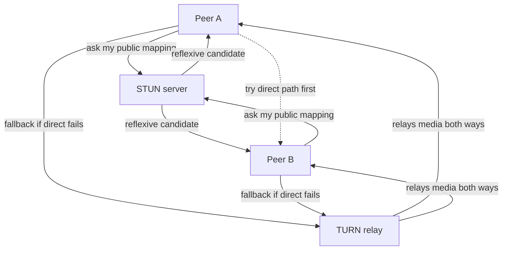
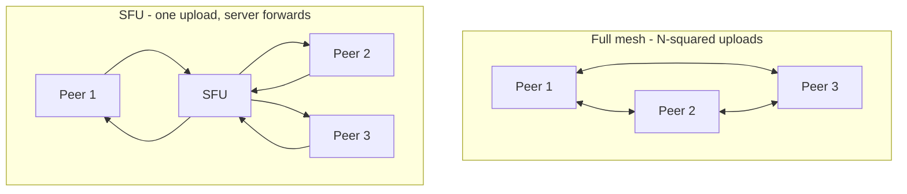

# WebRTC (Peer-to-Peer Media and Data Straight Between Browsers)

*Everything else in L1 kept a server in the middle. This is where that finally breaks -- two browsers, each behind their own NAT, learn to talk directly.*

`⏱️ ~8 min · 17 of 17 · Networking`

> [!TIP] The gist
> **WebRTC** is a browser-native open standard for **real-time, low-latency, peer-to-peer** audio, video, and data -- no plugin. The key departure from every other L1 real-time mechanism (WebSockets, SSE): when it can, media flows **directly between two clients**, not through a server. But two peers behind NAT can't just dial each other, so WebRTC leans on the NAT-traversal toolkit from topic 12: they swap **SDP offer/answer + ICE candidates** over a **signaling** channel you build yourself (usually a WebSocket), use **STUN** to discover their own public address for a cheap direct path, and fall back to a **TURN** relay only when direct fails. Encryption is **mandatory** (DTLS-SRTP). The catch: pure P2P only holds for **1:1** -- group calls route through an **SFU** because a full mesh's uploads explode as N-squared.

## Contents

- [Intuition](#intuition)
- [The concept](#the-concept)
- [How it works](#how-it-works)
- [In the real world](#in-the-real-world)
- [Trade-offs](#trade-offs)
- [Remember](#remember)
- [Check yourself](#check-yourself)

## Intuition

Everyone else in L1 was **mailing letters through a post office** -- your browser hands a message to a server, and the server relays it. Client-server, always a middleman.

WebRTC is two people who want a **direct phone line** run straight between their houses. Faster, cheaper, more private -- but there's a problem: both have **unlisted numbers behind a switchboard** (that's NAT). Neither can dial the other cold.

So they need help getting set up:

- A **mutual friend** to introduce them and pass numbers back and forth -- that's **signaling**.
- A **directory-assistance service** that tells each of them what their own callable number is -- that's **STUN**.
- And if a direct line genuinely can't be run, a **relay operator** who forwards the whole call -- that's **TURN** (works almost always, but you pay them by the minute).

Once introduced, the two talk **directly** -- the mutual friend hangs up.

## The concept

**Definition.** **WebRTC (Web Real-Time Communication)** is an open standard (W3C for the browser APIs, IETF for the protocols) that lets two clients -- typically two browsers, but also native apps via the same library -- exchange **real-time audio, video, and arbitrary data directly with each other**, secured by default, with no plugin installed.

**The one departure that defines it.** [Topic 08](08-websockets-sse-long-polling.md) built a whole ladder of real-time mechanisms -- long polling, SSE, WebSockets -- and every one is **client-server**: two browsers that need each other still relay every byte through a server. WebRTC breaks that. When it can, media flows **peer-to-peer** -- browser to browser, no application server in the data path. That's why it earns lowest-latency (shortest path) and zero server bandwidth cost for the media.

**The three APIs, in one line each:**

| API | What it's for |
|---|---|
| `getUserMedia()` | **Capture** -- grab the local camera/mic (or screen) as a media stream to send. |
| `RTCPeerConnection` | **The connection** -- where ICE, the SDP offer/answer, and the encrypted transport all live. The heart of WebRTC. |
| `RTCDataChannel` | **Arbitrary data** -- game state, file chunks, chat text, anything non-media, sent directly peer-to-peer. |

**What it is NOT -- three traps:**

- **WebRTC does NOT include signaling.** This is the #1 surprise. It defines the *format* of the setup messages (SDP, ICE candidates) but deliberately leaves *how you deliver them* to you -- almost always a WebSocket server you build.
- **WebRTC is NOT "just video calling."** `RTCDataChannel` is a general P2P data pipe -- multiplayer games, file transfer, low-latency sync, no audio/video at all.
- **Pure P2P is NOT how group calls work.** Direct browser-to-browser holds cleanly only for **1:1**. Groups route through a server (an SFU).

**Key terms.** *SDP* = a text blob describing what each side wants to send (media, codecs, data channels). *ICE candidate* = one address (IP:port) a peer might be reachable at. *STUN/TURN* = the servers that discover a public address / relay media (from [topic 12](12-nat.md)). *SFU* = the forwarding server groups use instead of a mesh.

## How it works

### 1. Signaling + the connectivity problem

Two browsers behind NAT ([topic 12](12-nat.md#nat-traversal-the-hard-part-for-peer-to-peer)) can't just connect -- a NAT only opens a hole for *outbound* traffic, so an unsolicited inbound packet from a never-seen peer is dropped. Before any direct path exists, the two must exchange an **SDP offer/answer** plus **ICE candidates**.

Those setup messages have to travel from one browser to the other *somehow* -- and WebRTC leaves that channel entirely up to you. In practice almost everyone uses a **WebSocket server** ([topic 08](08-websockets-sse-long-polling.md#websockets-a-real-full-duplex-channel)): both peers hold an open connection to it, and it relays the blobs between them.

The crucial part: the signaling server **brokers the introduction, but media does NOT flow through it** (in P2P). Its whole job is done the moment both peers have enough info to try a direct connection.

```mermaid
sequenceDiagram
    participant A as Peer A browser
    participant Sig as Signaling server WebSocket
    participant B as Peer B browser

    Note over A,B: Neither peer can reach the other directly yet
    A->>Sig: SDP offer
    Sig->>B: relay SDP offer
    B->>Sig: SDP answer
    Sig->>A: relay SDP answer
    A->>Sig: ICE candidates as gathered
    Sig->>B: relay candidates
    B->>Sig: ICE candidates as gathered
    Sig->>A: relay candidates
    Note over A,B: Both sides try candidate pairs
    A->>B: direct media and data path DTLS-SRTP over UDP
    Note over A,Sig,B: Signaling server now out of the media path
```

### 2. ICE / STUN / TURN (the topic 12 payoff)

**ICE (Interactive Connectivity Establishment)** is the framework: it **gathers every plausible address** a peer might be reachable at, exchanges the lists via signaling, then **tries candidate pairs** in priority order until one works -- cheapest first.

Three candidate types, in the order ICE prefers them:

1. **Host** -- the device's own local IP. Works only if both peers are on the same LAN (rare across the internet).
2. **Server-reflexive (via STUN)** -- the peer asks a public **STUN** server "what address did my packet arrive from?" and learns its own public NAT-mapped IP:port. Cheap (no relaying, no per-call state) and enables a **direct** P2P path for most NAT types.
3. **Relay (via TURN)** -- if no direct pair works (often a **symmetric NAT** that uses a different port per destination), both peers send media to a **TURN** relay that forwards it. Works almost universally, but every byte flows through it -- bandwidth-expensive, so it's the **last resort**.



### 3. What flows + scaling

Once ICE picks a working pair, two kinds of traffic can flow -- on different stacks, on purpose:

- **Media -- SRTP over UDP.** Audio/video rides UDP because real-time media is **loss-tolerant, latency-intolerant** ([topic 05](05-udp.md)): a video frame retransmitted late is worthless. **SRTP** is RTP with mandatory encryption -- there is no unencrypted option.
- **Data -- RTCDataChannel over SCTP-over-DTLS.** Arbitrary data runs SCTP tunneled in **DTLS** ("TLS for datagrams," [topic 07](07-https-tls.md)) over UDP, with **tunable reliability**: fully reliable/ordered (like TCP) or fire-and-forget (like raw UDP), per channel.
- **Encryption is mandatory** -- every WebRTC connection is DTLS-SRTP; there is no insecure mode.

**Then scaling breaks the P2P ideal.** A group call as a **full mesh** -- everyone directly connected to everyone -- forces each of N peers to **upload its stream N-1 times**, and total connections grow as N-squared. That collapses past a handful of people. The fix is an **SFU (Selective Forwarding Unit)**: each peer sends **one** upstream, and the server **forwards** it (selectively) to the others -- no decoding or mixing, so it's cheap. At which point media **does** go through a server. (An **MCU** goes further -- it decodes and mixes everyone into one composite stream, lightest on clients but heavy CPU on the server.)



Designing a full video-calling system end to end (SFU placement, simulcast, recording, scaling the fleet) is an applied problem for **L15**.

## In the real world

- **Google -- the reference implementation everyone runs.** Google built and open-sourced **`libwebrtc`**, the engine powering Chrome, Firefox, Safari, and Edge, and the backend of **Google Meet**. The standard defines message formats, not one required implementation -- yet the industry converged on this shared codebase anyway. ([webrtc.org](https://webrtc.org/))
- **Discord -- the N-squared-mesh answer in production.** Discord runs a custom C++ **SFU** that forwards, never mixes. Their own reasoning matches this lesson exactly: "peer-to-peer networking becomes prohibitively expensive as the number of participants increases." As of Sept 2018 it served **2.6M concurrent voice users** across **850+ servers** in 13 regions. ([Discord engineering](https://discord.com/blog/how-discord-handles-two-and-half-million-concurrent-voice-users-using-webrtc))
- **Cloudflare Calls -- the SFU at the anycast edge.** Instead of one central SFU, each participant connects to their nearest Cloudflare data center, and the anycast network ([topic 16](16-anycast-bgp.md)) stitches those edges into one distributed "super peer" -- the plain SFU idea, spread globally to cut cross-continent latency. ([Cloudflare](https://blog.cloudflare.com/cloudflare-calls-anycast-webrtc/))
- **mediasoup / LiveKit -- canonical open-source SFUs.** Both are vendor-neutral references for what an SFU is: mediasoup "cannot transcode or decode media -- it only manages packet forwarding," and LiveKit forwards per-subscriber copies of only the tracks with active subscribers. "Forward, never transcode." ([mediasoup](https://mediasoup.org/documentation/v3/scalability/), [LiveKit](https://docs.livekit.io/reference/internals/livekit-sfu/))

Full sourcing: [research/backend/L1/17-webrtc.md](../../../research/backend/L1/17-webrtc.md#real-world-and-sources).

## Trade-offs

| Axis | ✅ Benefit | ❌ Cost |
|---|---|---|
| **P2P (1:1)** | Lowest latency (shortest path); zero server bandwidth for media | Needs full NAT-traversal machinery -- signaling + STUN + often TURN -- just to connect |
| **STUN** | Cheap, no per-call state; enables a direct path for most NATs | Useless against symmetric NAT -- direct still fails |
| **TURN** | Makes connectivity work almost universally | Relays every byte -- expensive bandwidth, extra hop, no longer P2P |
| **Media (SRTP/UDP)** | Loss-tolerant, low latency -- right for real-time A/V | No delivery guarantee; a lost frame is just skipped |
| **Data (SCTP/DTLS)** | Tunable -- reliable/ordered *or* fire-and-forget per channel | More setup than raw media path |
| **Mesh vs SFU** | Mesh: no media server at all (1:1 ideal) | Mesh explodes at N-squared -- groups need an SFU (media through a server) |

## Remember

> [!IMPORTANT] Remember
> WebRTC gives browsers **direct P2P real-time media and data** -- but two peers behind NAT need **signaling** to introduce them (a channel WebRTC deliberately leaves you to build, usually a WebSocket) and **ICE/STUN/TURN** to find a path (host -> STUN-reflexive -> TURN relay, in that order of preference). Media rides **SRTP over UDP**, data rides **SCTP-over-DTLS**, and **encryption is mandatory** -- there is no insecure mode. The pure-P2P ideal holds only for **1:1**; group calls route through an **SFU** because a full mesh's uploads scale as N-squared.

## Check yourself

1. WebRTC is called "peer-to-peer" -- so why do you still end up needing servers? Name the roles (signaling, STUN, often TURN, and an SFU for groups) and say which of them touch the media.
2. A 5-person mesh call strains each participant's uplink. Why -- in terms of how many streams each person uploads -- and what does an SFU change?
3. What part of setting up a WebRTC call does the standard deliberately **not** define, and what do people almost always use to fill that gap?

---

→ Next: [L2 -- Storage and relational databases](../L2/) (the backend track continues)
↩ This closes L1 · Networking.

*L1 traced a complete arc: how bytes get named (DNS), addressed (IP), transported (TCP/UDP), given meaning (HTTP), secured (TLS), and routed across the internet (NAT, anycast/BGP) -- through the edge machinery (proxies, load balancers, gateways, CDNs) that makes it fast, and finally straight between two peers (WebRTC). You now have the full networking foundation every later system is built on.*
