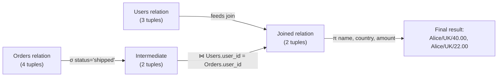
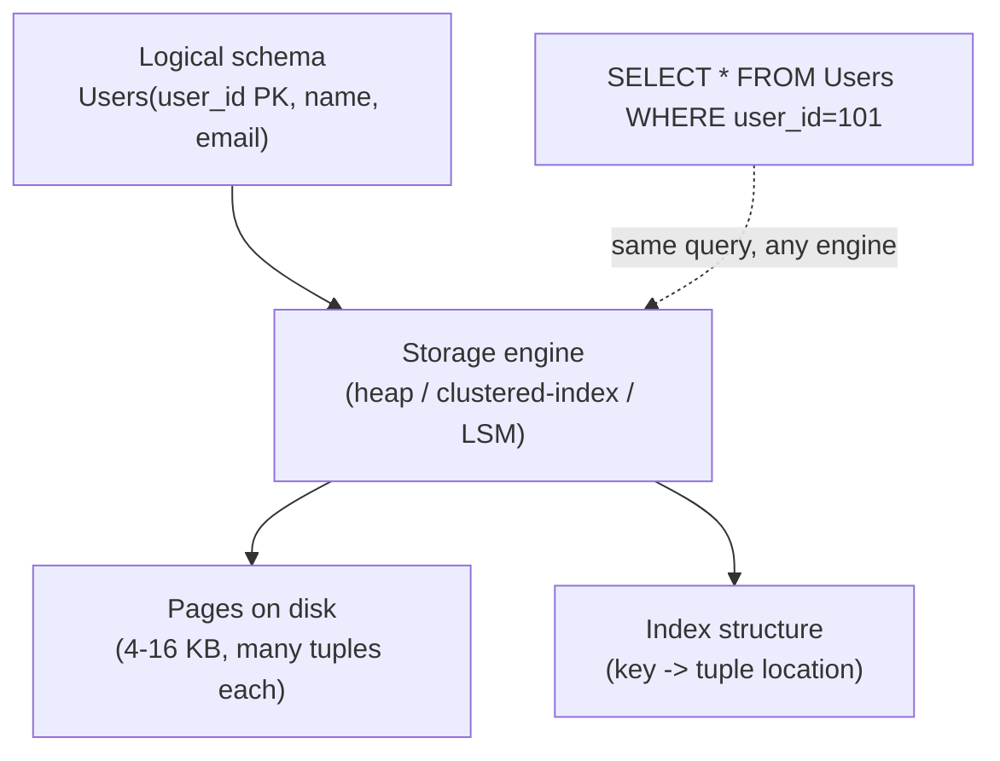

# The Relational Model

*A mathematical way of saying "data is just sets of rows with columns" -- rigid enough that a machine can prove queries correct and optimize them automatically, and that rigidity is exactly why it won.*

`⏱️ ~8 min · 1 of 13 · Storage and Relational Databases`

> [!TIP] The gist
> A **relation** is a set of tuples (rows) that all share the same named, typed attributes (columns) -- formally a subset of the Cartesian product of the attributes' domains. **Relational algebra** is a small, closed set of operators (selection, projection, join, ...) that map almost one-to-one onto SQL clauses, and because every operator's output is itself a relation, they **compose** -- which is exactly what lets a query optimizer rewrite your query into a cheaper, provably equivalent one. **Keys** (primary, candidate, foreign, composite) identify tuples and connect relations; **integrity constraints** (entity, referential, domain) are rules the database itself refuses to let you break. Codd's real innovation wasn't the table -- it was separating *what data you want* from *how it's physically stored*, so your query never has to change when the storage underneath does.

## Contents

- [Intuition](#intuition)
- [The concept](#the-concept)
- [How it works](#how-it-works)
- [In the real world](#in-the-real-world)
- [Trade-offs](#trade-offs)
- [Remember](#remember)
- [Check yourself](#check-yourself)

## Intuition

Imagine two ways of organizing a company's filing cabinet.

In the old way, every folder physically points to other folders -- "Customer Smith's folder is stapled to Order #4021's folder, which is stapled to Invoice #88's folder." To find anything, a clerk has to walk the staples, one folder at a time, and if you ever restaple the cabinet differently, every clerk's instructions break.

In the new way, you just keep flat lists: a list of customers, a list of orders, a list of invoices, each row with the same columns as every other row in its list. Want "Smith's orders"? Describe *what* you want ("orders where customer = Smith") and let a librarian figure out the fastest way to fetch it. Restaple the shelves however you like behind the scenes -- the request never changes.

That flat-list-plus-declarative-request idea is the relational model. The rows are **tuples**, the lists are **relations**, and the librarian who decides the fastest fetch path is the **query optimizer**.

## The concept

**Definition.** A **relation** is a set of **tuples** that all share the same set of named, typed **attributes** — formally, a subset of the Cartesian product of the attributes' **domains** (`R ⊆ D1 × D2 × ... × Dn`). Informally: a relation is a table, a tuple is a row, an attribute is a column.

**Core vocabulary you need cold:**

- **Attribute** -- a named slot with a declared domain (the legal, **atomic** values it may hold — one value, never a list or nested record).
- **Tuple** -- one assignment of a value to every attribute. A row.
- **Degree** -- how many attributes (columns) a relation has. **Cardinality** -- how many tuples (rows) it currently holds.
- **Relation schema** -- the structural description (name + attributes + domains), e.g. `Users(user_id: int, name: varchar, email: varchar)`. This is what `CREATE TABLE` declares.
- **Schema vs instance** -- the schema is the stable contract (changes rarely, via migrations); the **instance** is the actual tuples present right now (changes on every `INSERT`/`UPDATE`/`DELETE`). Every constraint you'll meet below is a rule about which instances are *legal* for a given schema.

**What it is NOT:**

- It is **not** called "relational" because tables have relationships via foreign keys. The name comes from the mathematical term *relation* (a set of tuples) — straight out of set theory, and it predates the "tables reference each other" usage entirely. Foreign keys are real and important, just not where the name comes from.
- A formal relation has **no duplicate tuples** (it's a *set*) and **no inherent row or column order** — SQL tables relax both (duplicates allowed unless constrained; result order is undefined without `ORDER BY`). SQL is a pragmatic engineering realization of the model, not a literal implementation of the math.

## How it works

### Relational algebra: a small, closed toolkit that maps onto SQL

**Relational algebra** is a handful of operators that take one or two relations as input and produce a relation as output. Because the output is *always* a relation, operators **compose** — selection feeds projection feeds join, building an arbitrarily complex query as a tree.

| Operator | Symbol | Does | SQL |
|---|---|---|---|
| Selection | σ | Keep tuples matching a predicate | `WHERE` |
| Projection | π | Keep only certain columns | `SELECT <cols>` |
| Join | ⋈ | Cartesian product filtered by a match condition | `JOIN ... ON` |
| Union / Difference / Intersection | ∪ / − / ∩ | Set ops on two union-compatible relations | `UNION` / `EXCEPT` / `INTERSECT` |
| Rename | ρ | Rename a relation/attribute | `AS` |

The one worth internalizing: a **join is really just a filtered Cartesian product** — `A ⋈θ B = σθ(A × B)`. Pair every row of A with every row of B, then keep only the pairs satisfying the condition. No real engine actually builds the full product; a query optimizer exploits this *proven equivalence* to run a cheaper hash join or merge join instead, knowing the result is provably identical. That's the entire point of a closed, mathematical algebra: it gives the optimizer a legal license to rewrite your query without changing its meaning.

### Worked example: selection, projection, and join in one query

Two relations:

```
Users(user_id PK, name, country)
101 | Alice | UK
102 | Ben   | US
103 | Chidi | NG

Orders(order_id PK, user_id FK -> Users.user_id, amount, status)
5001 | 101 | 40.00 | shipped
5002 | 102 | 15.50 | pending
5003 | 101 | 22.00 | shipped
5004 | 103 | 9.99  | cancelled
```

**Goal:** names, countries, and amounts of shipped orders.

1. **Select** shipped orders: `σ(status='shipped')(Orders)` → rows 5001, 5003.
2. **Join** with Users on `user_id`: `Users ⋈(Users.user_id=Orders.user_id)` that result → both rows pick up `name='Alice', country='UK'` (both shipped orders happen to be Alice's).
3. **Project** down to the columns we actually want: `π(name, country, amount)` → final answer.

```sql
SELECT u.name, u.country, o.amount
FROM Users u
JOIN Orders o ON u.user_id = o.user_id
WHERE o.status = 'shipped';
```



Each arrow's output feeds the next operator unmodified — that's algebraic closure, made concrete.

### Keys: how a tuple gets identified, and how relations connect

- **Superkey** -- any attribute set guaranteed unique (can have redundant extras).
- **Candidate key** -- a *minimal* superkey (drop any attribute and uniqueness breaks). A relation can have several.
- **Primary key** -- the one candidate key the designer picks as the main identifier; the DBMS enforces entity integrity specifically on it.
- **Composite key** -- a key made of more than one attribute together (e.g. `(order_id, line_number)`).
- **Foreign key** -- attribute(s) in one relation whose values must match a primary/unique key in another relation (or be `NULL`) — the actual mechanism that connects two relations.
- **Surrogate vs natural key** -- a surrogate key (auto-increment / UUID) has no business meaning and stays stable forever; a natural key (email, national ID) is business-meaningful but can change or turn out not to be as unique as assumed. Most production schemas default to surrogate primary keys, plus a `UNIQUE` constraint on whichever natural attribute still needs uniqueness enforced.

### Integrity constraints: rules the database itself refuses to break

| Constraint | Rule | Example |
|---|---|---|
| **Domain** | Every value belongs to its declared type/range | `CHECK (age >= 0)` |
| **Entity** | Primary key can never be `NULL` or duplicated | Every `Users` row has a unique, non-null `user_id` |
| **Referential** | Every foreign key matches an existing row (or is `NULL`) | No `Orders.user_id` points at a nonexistent user (no dangling reference) |
| **User-defined** | Arbitrary business rules | `NOT NULL`, `UNIQUE`, custom `CHECK` |

The unifying idea: **the database refuses to enter a state that violates a declared rule**, no matter which application or script is writing — a guarantee that holds the moment more than one program shares the same database, and directly foreshadows why ACID treats "consistency" as a first-class transactional property (next-but-one topic in this level).

### Why this design won: logical and physical data independence

Before Codd's 1970 paper, the dominant models (**hierarchical** — IBM IMS, and **network** — CODASYL) were **navigational**: application code walked pointer chains record-by-record, hardcoding one specific physical access path.

Codd's actual innovation was separating **what data you want** from **how to physically get it**:

- **Logical data independence** -- queries target the logical schema and survive unrelated schema extensions.
- **Physical data independence** -- storage layout (pages, indexes, row order) can change completely and the query never changes, because it only ever names relations and describes conditions declaratively. A **query optimizer**, not the programmer, picks the actual access path.

This is the exact gap the worked example above lives in: `JOIN ... WHERE` states *what* is wanted; a network-model program would have had to explicitly walk pointers to *get* that same answer, breaking the moment the physical structure changed underneath it.

### From logical relation to physical storage (a quick preview)

A relation is stored as pages/blocks holding packed tuples; each tuple has an internal row ID separate from any logical key you declared. Different **storage engines** (heap-organized, clustered/index-organized, LSM-tree) make genuinely different physical choices for the *same* logical schema — and physical data independence is exactly the promise that your query never has to know which one is underneath.



Indexes, the write-ahead log, and locking/MVCC (all upcoming in this level) exist precisely so this physical storage can be mutated safely and concurrently while every constraint above keeps holding as a *logical* guarantee.

## In the real world

- **Stripe's Ledger** applies relational-model discipline — typed accounts, a composite identifying key `(business, id)`, and a schema-level invariant (debits must balance credits) — even though its underlying storage is a custom document database, not a classic SQL engine. The modeling discipline is treated as essential regardless of which physical engine sits underneath, echoing this lesson's logical-vs-physical split. ([Stripe engineering blog](https://stripe.dev/blog/ledger-stripe-system-for-tracking-and-validating-money-movement))
- **Figma** scaled its database layer roughly 100x and explicitly *rejected* moving off the relational model: "We have a very complex relational data model built on top of our current Postgres architecture and NoSQL APIs don't offer this kind of versatility." They sharded Postgres horizontally while deliberately preserving joins and full transactions within a shard, rather than abandoning relational guarantees to scale. ([Figma blog](https://www.figma.com/blog/how-figmas-databases-team-lived-to-tell-the-scale/))
- **AWS**, describing core-banking ledgers, notes that getting full tamper-evident auditability *on top of* a relational schema traditionally required bolting on a separate journal and extra verification machinery by hand — which is exactly why some banking teams now reach for a purpose-built ledger database instead, for that one narrow use case. Double-entry, keys, and integrity-style thinking remain the backbone either way. ([AWS Industries blog](https://aws.amazon.com/blogs/industries/building-a-core-banking-system-with-amazon-quantum-ledger-database/))

Full sourcing: [research/backend/L2/01-relational-model.md](../../../research/backend/L2/01-relational-model.md#real-world-and-sources).

## Trade-offs

| Relational model | ✅ Benefit | ❌ Cost |
|---|---|---|
| Fixed, declared schema + constraints | DBMS-enforced consistency for every writer | Schema changes need explicit migrations |
| Declarative algebra/SQL | Optimizer picks an efficient plan; queries survive storage changes | Optimizer choices can be opaque without inspecting the actual plan |
| Normalization-friendly structure | Minimizes redundancy and update anomalies | Reconstructing one real-world object often needs several joins |
| Set-based, no built-in navigation | No hand-coded access paths | Historically harder to scale horizontally than some purpose-built NoSQL designs |
| Vs. hierarchical/network (historical) | Natural many-to-many representation, no pointer-chasing | Loses an experienced navigational programmer's direct physical control |

## Remember

> [!IMPORTANT] Remember
> A relation is a set of same-shaped tuples; relational algebra's operators are closed (output is always a relation), which is *why* they compose and *why* a query optimizer can safely rewrite your query into something cheaper. Codd's real win wasn't "tables" — it was **logical and physical data independence**: your query describes *what* you want, and the engine, not you, decides *how* to physically get it.

## Check yourself

1. A colleague says "it's called the relational model because tables have relationships via foreign keys." What's precisely wrong with that, and where does the name actually come from?
2. Given `Orders(order_id PK, user_id FK, amount, status)` and `Users(user_id PK, name, country)`, write the relational-algebra expression (σ, π, ⋈) for "names and amounts of every UK customer's cancelled orders," then the equivalent SQL.
3. Why does the closure property of relational algebra (every operator's output is itself a relation) matter for query optimization, concretely?

---

→ Next: [Normalization forms](02-normalization-forms.md)
↩ Comes back in: L4 (NoSQL and Data at Scale), where the relational model is the baseline every NoSQL family is defined in contrast to
