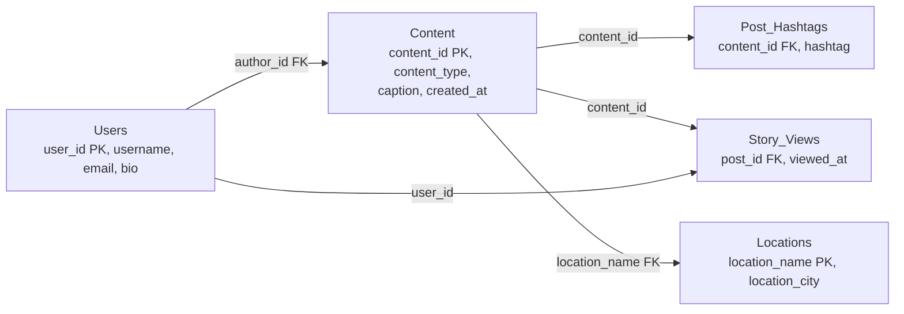

# Normalization Forms

*A step-by-step discipline for making sure every fact lives in exactly one place -- so that fixing one typo can never leave your database quietly contradicting itself.*

`⏱️ ~8 min · 2 of 13 · Storage and Relational Databases`

> [!TIP] The gist
> **Normalization** is the process of decomposing one messy relation into several smaller ones, each describing exactly one kind of real-world thing (a user, a piece of content, a location...), connected back together via keys. Doing this eliminates three concrete **anomalies** -- update, insertion, deletion -- that show up whenever unrelated facts get crammed into one table. Each **normal form** (1NF → 2NF → 3NF → BCNF) is a precisely defined, checkable rule built on the idea of a **functional dependency**, and each one closes off one more specific category of redundancy. **Denormalization** is the deliberate, controlled reversal of this -- trading some of that safety back for faster reads.

## Contents

- [Intuition](#intuition)
- [The concept](#the-concept)
- [How it works](#how-it-works)
- [Trade-offs](#trade-offs)
- [Remember](#remember)
- [Check yourself](#check-yourself)

## Intuition

Imagine someone modeling Instagram who writes every fact about a post on one sticky note: the author's username, email, and bio, plus the caption, the hashtags, and where it was taken -- all crammed onto that single note.

Publish a second post from the same account, and the note gets copied again -- because that's all a sticky note can do, repeat itself. Now that account's email is written down twice. Change it, and only one note gets updated unless someone remembers to hunt down every other note mentioning that account.

Normalization is what happens when you stop using sticky notes and start using an index-card system instead: one card per account, one card per location, and the post note just *points at* the right cards by id instead of rewriting their contents. Change the account's email once, on its one card, and every post that references it picks up the change automatically.

## The concept

**Definition.** **Normalization** is the systematic decomposition of a relation into smaller relations, each describing exactly one kind of real-world fact, connected via the keys from the [relational model](01-relational-model.md#keys) -- done specifically so that redundancy, and the anomalies it causes, become structurally impossible rather than something you promise to be careful about.

**Anomaly** -- one of three concrete symptoms caused by mixing unrelated facts into one relation:

- **Update anomaly** -- the same fact is stored in more than one row; change it and you must find and update *every* copy, or the table now silently disagrees with itself.
- **Insertion anomaly** -- you cannot record a fact (e.g. "this account's email and bio") until some *unrelated* fact (a published post) happens to exist to carry it.
- **Deletion anomaly** -- deleting one row accidentally destroys a second, unrelated fact that had no other row to live in.

**Functional dependency (FD)** -- the theoretical backbone every normal form above 1NF is defined against. For a relation `R`, `X → Y` ("X determines Y") means: any two rows that agree on `X` must also agree on `Y`. Informally, `X` is a lookup key for `Y`, even if `X` isn't the table's overall primary key. Two special shapes of FD matter here:

- A **partial dependency** -- `Y` depends on only *part of* a composite key, not the whole thing. This is what **second normal form (2NF)** eliminates.
- A **transitive dependency** -- `X → Y → Z`, so `Z` depends on `X` only indirectly, through `Y`. This is what **third normal form (3NF)** eliminates.

**The normal forms, in one line each:**

| Form | Requires | Fixes |
|---|---|---|
| **1NF** | Every value is atomic (no lists/nested data in a cell) | Un-queryable, un-typed multi-values crammed into one field |
| **2NF** | 1NF, and every non-key attribute depends on the *whole* key | Partial dependencies |
| **3NF** | 2NF, and no non-key attribute depends on another non-key attribute | Transitive dependencies |
| **BCNF** | Every determinant of any FD is a superkey, full stop | A rarer redundancy from overlapping composite candidate keys |

## How it works

### Start with one flat table, and watch the anomalies appear

```
Content_Unnormalized
content_id | content_type | username  | email        | bio        | caption      | hashtags                  | created_at
5001       | post         | ava.codes | ava@mail.com | "iOS dev"  | "sunset run" | "#run, #sunset, #fitness" | 2026-06-01
5002       | reel         | ava.codes | ava@mail.com | "iOS dev"  | "coffee tour"| "#coffee, #travel"        | 2026-06-02
5003       | story        | ben.makes | ben@mail.com | "3D artist"| "wip render" | "#blender, #3d"           | 2026-06-02
```

This one relation -- an Instagram-style table of posts, stories, and reels -- mixes two different real-world things (a piece of content, an account) into one row, plus a multi-valued `hashtags` cell. Ava's email is already duplicated (rows 5001, 5002); a brand-new account that hasn't posted yet can't be represented at all; deleting content 5003 -- if it's the only row mentioning `ben.makes` -- would wipe out Ben's entire profile at the same time. That's all three anomalies, live, in three rows.

### Step 1 -- 1NF: make sure every cell is atomic

The `hashtags` column stuffs several tags into one string, so you can't `WHERE hashtag = '#fitness'`, count posts per tag, or index individual tags -- the shape of the data is smuggled into a string instead of fixed by the schema. Pull the repeating group into its own relation, one row per (content, hashtag) pairing:

```
Content (1NF)
content_id PK | content_type | username  | email        | bio        | caption      | created_at

Post_Hashtags (1NF)  -- composite key {content_id, hashtag}
content_id | hashtag
5001       | #run
5001       | #sunset
5001       | #fitness
```

Every cell is now atomic, so this is a valid relation -- but `Content` is still riddled with the anomalies from the opening section (Ava's email and bio still duplicated across every row she authors). 1NF is a floor, not a fix for redundancy.

### Step 2 -- 2NF: split off anything that depends on only *part* of the key

`Content`'s key is the single column `content_id`, so it can't violate 2NF at all -- there's no partial key to depend on part of. To see a genuine partial dependency, look at the table recording who viewed each story, whose candidate key is composite: `{post_id, viewer_user_id}`.

```
Story_Views (violates 2NF)
post_id | viewer_user_id | viewer_username | viewed_at
5003    | 88             | om.travels      | 2026-06-02 09:15
5003    | 91             | lia.paints      | 2026-06-02 09:20
5010    | 88             | om.travels      | 2026-06-03 20:01
```

`viewed_at` genuinely needs both parts of the key -- fine, it stays. But `viewer_username` depends only on `viewer_user_id` -- a **partial dependency**. `om.travels` is repeated on every story that account views; change the username and every one of those rows must update together.

Split the partially-dependent attribute out, keyed by the part it actually depends on:

```
Story_Views (2NF)                          Users (2NF)
post_id | viewer_user_id | viewed_at       user_id PK | username
5003    | 88             | 09:15           88         | om.travels
5003    | 91             | 09:20           91         | lia.paints
5010    | 88             | 20:01
```

`viewer_user_id` is now a foreign key into `Users`, and each username lives exactly once. Notice `Users` describes the same real-world thing as the `username`/`email`/`bio` fields still sitting inside `Content` -- that's the hint 3NF makes precise next.

### Step 3 -- 3NF: split off anything depending on a *non-key* column

Suppose each post can also be tagged with a location, so `Content` gains `location_name` and `location_city`. The key is still `content_id`. But within it: `content_id → location_name` (each post is tagged at one place) **and** `location_name → location_city` (a place sits in one city). So `content_id → location_city` only holds *transitively*, through `location_name` -- the city doesn't actually depend on the post, it depends on the location. `Baker Beach → San Francisco` ends up duplicated on every post tagged there.

Split it out, keyed by the thing it actually depends on:

```
Content (3NF)                                          Locations (3NF)
content_id PK | ... | location_name FK    location_name PK | location_city
5001          | ... | Baker Beach         Baker Beach      | San Francisco
5002          | ... | Blue Bottle Cafe    Blue Bottle Cafe | San Francisco
```

`Content` carries a *second* transitive dependency for exactly the same reason: `content_id → username → {email, bio}`. Those profile fields describe the account, not the piece of content, so they fold into the `Users` relation that already emerged in the 2NF step, and `Content` keeps just an `author_id` foreign key. Every relation now has exactly one theme, and every non-key attribute depends on "the whole key, and nothing but the key":



All three original anomalies are gone: a location's city is stored once and corrected in one place; a new account or location can be inserted before it appears on any content; deleting a story no longer risks silently deleting a user's profile along with it.

### BCNF and beyond, briefly

**BCNF** tightens 3NF further for one rare edge case: two *overlapping* composite candidate keys, where 3NF's rules still let a determinant slip through that isn't itself a superkey. The classic shape -- a table tracking which instructor teaches which subject to which student, where "each instructor teaches only one subject":

```
Teaching
student  | subject | instructor
Priya    | Math    | Dr. Lee
Priya    | Physics | Dr. Rao
Omar     | Math    | Dr. Lee
Omar     | Math    | Dr. Singh
```

Both `{student, subject}` and `{student, instructor}` are candidate keys. The FD `instructor → subject` holds (each instructor teaches exactly one subject), but `instructor` alone isn't a superkey -- `Dr. Lee` appears on two different students' rows. This table is already in 3NF (`subject` is part of a candidate key, so 3NF's exception clause forgives it), yet `Dr. Lee → Math` is still stated twice. Split out the dependency whose determinant isn't a superkey:

```
Instructor_Subject (BCNF)          Teaching_Assignments (BCNF)
instructor PK | subject            student | instructor FK
Dr. Lee       | Math               Priya   | Dr. Lee
Dr. Rao       | Physics            Priya   | Dr. Rao
Dr. Singh     | Math               Omar    | Dr. Lee
                                    Omar    | Dr. Singh
```

It's uncommon enough that most real schemas stop at 3NF and only reach for BCNF when they can point at concrete overlapping-key redundancy in their own data. **4NF** and **5NF** exist further up the same ladder (multi-valued and join dependencies) but are rarely needed in everyday schema design -- worth knowing by name, not worth deep study for most work.

### The deliberate reversal: denormalization

Every step above trades write-side simplicity for read-side cost -- reconstructing "one post, with its author and location" now needs several joins instead of one row lookup. **Denormalization** is the professionally-accepted decision to reintroduce some of that redundancy on purpose, and the decision is made *per access pattern* -- the same app normalizes some data hard and denormalizes other data deliberately.

Consider a system like WhatsApp, mixing both. **Where normalization stays right** -- one message delivered to many recipients, each reaching "delivered" and "read" at their own time, is a genuine many-to-many relationship, and its correct home is a junction table:

```
Message_Recipients  -- composite key {message_id, recipient_id}
message_id | recipient_id | delivered_at        | read_at
9001       | ava          | 2026-06-01 10:00:02 | 2026-06-01 10:03:11
9001       | ben          | 2026-06-01 10:00:04 | (null)
```

Both columns depend on the *whole* key -- already 2NF/3NF, no further splitting needed. Cramming "delivered to Ava+Ben, read by Ava" into one column on the message row would reintroduce a multi-valued attribute (a 1NF violation) and an update anomaly on every read-receipt tick.

**Where denormalization is right** -- a WhatsApp-style video call's metadata (`call_id`, participants, `started_at`, `ended_at`, average bitrate, packet-loss rate) is written once when the call ends and thereafter only *read*, in bulk, by analytics dashboards scanning huge numbers of calls. That **write-once, read-many** shape is exactly when a wide, deliberately denormalized record beats forcing every scan to re-join participant and network tables.

The general reasoning: denormalize when a specific joined shape is read far more often than the underlying facts change, and especially once tables are large or sharded enough that a join would cross partition boundaries -- usually via a **materialized view**, a **denormalized reporting schema on a read replica**, or an **application cache kept in sync via CDC/triggers/background jobs**, rather than hand-duplicating data everywhere. The anomaly risk doesn't disappear -- it moves into whichever of those mechanisms you chose to keep it in sync.

## Trade-offs

| | Normalized (3NF/BCNF) | Denormalized |
|---|---|---|
| **Redundancy** | Minimal -- each fact stored once | Deliberate duplication |
| **Anomalies** | Structurally prevented | Reintroduced; must be actively managed |
| **Write cost** | Low -- one row per fact | Higher -- every copy must update, or go stale |
| **Read cost** | Higher -- often needs joins | Lower -- often a single lookup |
| **Storage** | Smaller | Larger |
| **Best fit** | OLTP, correctness-critical data (billing, per-recipient message status) | Read-heavy workloads at scale, reporting, precomputed feeds, write-once/read-many event logs |

> [!IMPORTANT] Remember
> Every normal form exists to make one specific category of functional dependency -- partial (2NF) or transitive (3NF) -- structurally impossible, so that a single fact can never be stored in two places that might drift apart. Normalize until anomalies are gone; denormalize back on purpose, and only through a controlled mechanism, once read performance demands it.

## Check yourself

1. A single `Employees` table has columns `employee_id, department_id, department_name, department_budget`. Name the functional dependency causing a transitive-dependency problem, name the violated normal form, and show the decomposition that fixes it.
2. In the `Story_Views` example, explain why `viewer_username` is a partial dependency but `viewed_at` is not, using the composite key `{post_id, viewer_user_id}`.
3. A team keeps call-metadata records wide and denormalized even though the same participant appears across many rows. Give the concrete reason that's the right call, and name one mechanism that would keep a similarly denormalized copy in sync if it lived elsewhere.

---

→ Next: SQL depth (joins, aggregation, subqueries, window functions)
↩ Comes back in: L4 (NoSQL and Data at Scale), L12
