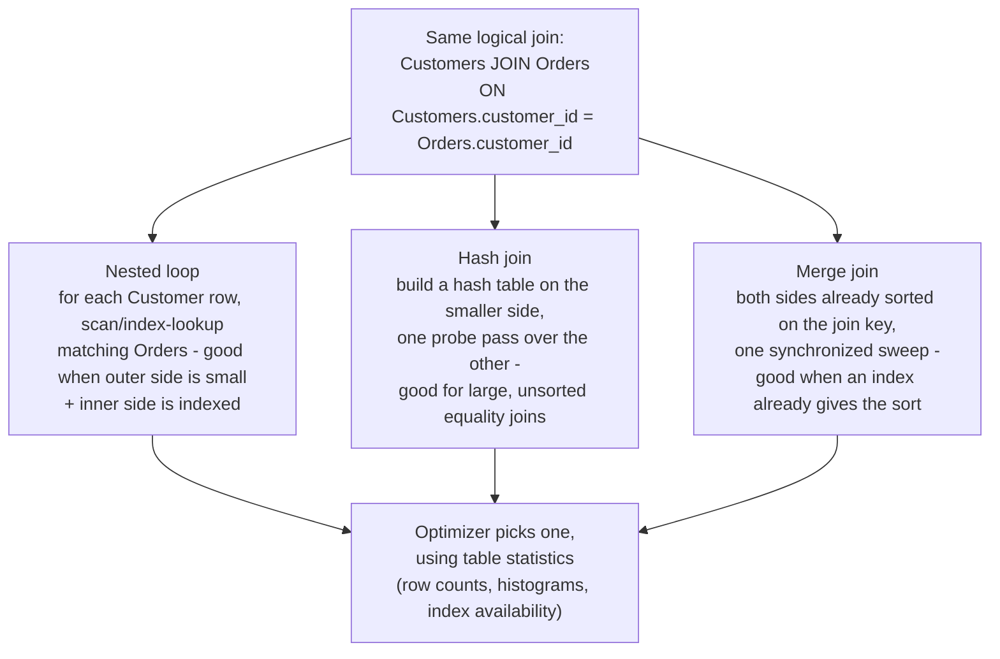

# SQL Depth: Joins, Aggregation, Subqueries, Window Functions

_The relational model gave you select, project, and join as a closed algebra - this is the everyday SQL built on top: how to combine rows, collapse them into summaries, nest one query inside another, and compute per-row running numbers without losing a single row._

`⏱️ ~7 min · 3 of 13 · Storage and Relational Databases`

> [!TIP] The gist
> A **join** combines rows from two relations that match a condition. **Aggregation** (`GROUP BY`) collapses many rows into one summary row per group. A **subquery** nests one query inside another - its cost hinges entirely on whether it's _correlated_ (re-run per outer row) or not. A **window function** computes an aggregate per row while keeping every row - the one thing plain `GROUP BY` structurally can't do.

## Contents

- [Intuition](#intuition)
- [The concept](#the-concept)
- [How it works](#how-it-works)
- [Trade-offs](#trade-offs)
- [Remember](#remember)
- [Check yourself](#check-yourself)

## Intuition

Picture a spreadsheet of customers and a spreadsheet of orders sitting side by side.

A **join** is stapling matching rows from the two sheets together by customer ID. **Aggregation** is then crushing a stapled stack down into one summary card per customer ("3 orders, $102 total"). A **subquery** is a sticky note with a mini-calculation on it, tucked inside a bigger calculation - sometimes computed once and reused, sometimes recomputed for every single row (expensive). A **window function** is writing a running total in the margin of every row _without_ throwing any row away - you still see every order, each one annotated with "and the total-so-far is...".

## The concept

**Definition.** SQL layers four tools on top of the relational algebra's core operators to handle everyday queries the original algebra never covered:

| Tool                         | What it does                                                                                                                                                           |
| ---------------------------- | ---------------------------------------------------------------------------------------------------------------------------------------------------------------------- |
| **Join**                     | Combines rows from two (or more) relations where a condition matches - usually a foreign key equalling the key it references                                           |
| **Aggregation** (`GROUP BY`) | Partitions rows into groups, then computes one summary value per group - the group becomes the output unit, individual rows are gone                                   |
| **Subquery**                 | A complete `SELECT` nested inside another query, standing in for a value, a set, or a whole table                                                                      |
| **Window function**          | Computes an aggregate over a set of related rows ("a window") _without_ collapsing anything - one output row per **input** row, each annotated with its computed value |

**Core knowledge everyone needs:**

- **NULL breaks equality, including in joins and subqueries.** SQL uses three-valued logic (`TRUE`/`FALSE`/`UNKNOWN`), and `NULL = NULL` is `UNKNOWN`, never `TRUE`. Two rows that both have `NULL` in a join column never "match" each other - and this exact fact is what makes `NOT IN` dangerous (below).
- **`WHERE` runs before grouping; `HAVING` runs after.** `WHERE` can only see raw column values because no aggregate exists yet at that point; `HAVING` is the only place you can filter on an aggregate's result, because that value doesn't exist until grouping has already happened.
- **Correlated vs non-correlated is the single biggest cost lever for subqueries.** A subquery that references no column from the outer query is evaluated once, period. One that _does_ reference an outer column can, conceptually, be re-evaluated once per outer row - the same cost shape as an unindexed nested loop join.
- **A window function is "aggregation that refuses to throw rows away."** `GROUP BY` collapses N rows into (at most) N groups' worth of rows. A window function keeps all N rows and attaches the group's computed value to each one alongside it.

## How it works

### Joins: which rows survive, and how the engine finds them

| Join type           | Returns                                                                                                                               |
| ------------------- | ------------------------------------------------------------------------------------------------------------------------------------- |
| **Inner join**      | Only rows matching on _both_ sides                                                                                                    |
| **Left join**       | Every left row, `NULL`-padded on the right where unmatched                                                                            |
| **Full outer join** | Every row from _both_ sides, `NULL`-padded wherever unmatched                                                                         |
| **Cross join**      | Every combination, no condition - `\|A\| × \|B\|` rows; almost always a bug when it happens _accidentally_ from a missing `ON` clause |
| **Self-join**       | A table joined to itself via two aliases - e.g. "who is this employee's manager?"                                                     |

The join _type_ only decides which logical rows come back. Underneath, the query optimizer physically executes that same logical join with one of three algorithms, chosen from table statistics - and the choice can swing cost by orders of magnitude:



The SQL you write states _what_ to join; the plan actually run depends on whether a helpful index exists and whether statistics are fresh - which is exactly why the same `JOIN` can regress from milliseconds to seconds after an index is dropped.

### Aggregation: `WHERE` vs `HAVING`, worked

A small dataset: `Customers(1 Ava UK, 2 Ben US, 3 Eve UK - never ordered)`, and `Orders`:

```
order_id | customer_id | order_date | amount | status
101      | 1           | 2026-01-05 | 40.00  | shipped
102      | 1           | 2026-03-15 | 40.00  | shipped   -- ties order 101
103      | 1           | 2026-02-01 | 22.00  | shipped
104      | 2           | 2026-01-15 | 15.50  | pending
105      | 2           | 2026-03-01 | 60.00  | shipped
106      | (null)      | 2026-03-10 | 5.00   | pending   -- guest checkout
```

**Inner join** (`Customers JOIN Orders`) returns 5 rows - Ava's 3, Ben's 2 - and drops Eve entirely (no matching order) plus the guest order (no matching customer). A **left join** keeps every customer, adding `Eve | NULL | NULL` - 6 rows.

Now aggregate:

```sql
SELECT customer_id, COUNT(*) AS num_orders, SUM(amount) AS total
FROM Orders
WHERE status <> 'pending'
GROUP BY customer_id
HAVING SUM(amount) > 70;
```

`WHERE status <> 'pending'` removes orders 104 and 106 _before_ grouping happens at all. Grouping what's left: Ava → 3 orders / $102.00, Ben → 1 order / $60.00. `HAVING SUM(amount) > 70` then drops Ben's group - only Ava survives, because that predicate needed the aggregate to exist first, which is why it couldn't live in `WHERE`.

### Subqueries: correlated cost, and the `NOT IN` trap

A **non-correlated** subquery references nothing from the outer query, so it's evaluated once: `WHERE amount > (SELECT AVG(amount) FROM Orders)`. A **correlated** one references an outer column, so its result differs per outer row - structurally the same cost shape as a nested loop join, one re-evaluation per outer row (though many optimizers can rewrite/"decorrelate" it - check with `EXPLAIN` rather than assuming).

The classic pitfall - pending orders are 104 (`customer_id = 2`) and 106 (`customer_id = NULL`):

```sql
-- BUGGY: returns zero rows for every customer
SELECT name FROM Customers
WHERE customer_id NOT IN (SELECT customer_id FROM Orders WHERE status = 'pending');

-- CORRECT: returns Ava, Eve
SELECT name FROM Customers c
WHERE NOT EXISTS (
  SELECT 1 FROM Orders o WHERE o.customer_id = c.customer_id AND o.status = 'pending'
);
```

The subquery's result set is `{2, NULL}`. Because it contains a `NULL`, `x NOT IN (2, NULL)` evaluates `x <> 2 AND x <> NULL` - and `x <> NULL` is `UNKNOWN`, which poisons the whole `AND` to `UNKNOWN` for _every_ customer, not just Ben. `NOT EXISTS` never compares a value against `NULL` at all - it just checks presence - so it correctly excludes only Ben (who genuinely has a pending order) and returns Ava and Eve.

### Window functions: ranking and running totals, worked

Ava's three orders, ranked by amount:

```sql
SELECT order_id, amount,
  ROW_NUMBER() OVER (ORDER BY amount DESC) AS rn,
  RANK()       OVER (ORDER BY amount DESC) AS rnk,
  DENSE_RANK() OVER (ORDER BY amount DESC) AS drnk
FROM Orders WHERE customer_id = 1;
```

```
order_id | amount | rn | rnk | drnk
101      | 40.00  | 1  | 1   | 1
102      | 40.00  | 2  | 1   | 1
103      | 22.00  | 3  | 3   | 2
```

`ROW_NUMBER` breaks the tie arbitrarily but stays unique. `RANK` gives both tied rows rank 1, then **skips** to 3. `DENSE_RANK` gives both rank 1 too, but the next row gets 2 - **no gap**. That skip-vs-no-skip is the entire difference, visible only once there's an actual tie.

Same orders, running total and day-over-day change, ordered by date:

```sql
SELECT order_id, order_date, amount,
  SUM(amount) OVER (ORDER BY order_date) AS running_total,
  amount - LAG(amount) OVER (ORDER BY order_date) AS change
FROM Orders WHERE customer_id = 1;
```

```
order_id | order_date | amount | running_total | change
101      | 2026-01-05 | 40.00  | 40.00         | (null)
103      | 2026-02-01 | 22.00  | 62.00         | -18.00
102      | 2026-03-15 | 40.00  | 102.00        | +18.00
```

All 3 input rows are still present - nothing collapsed - and notice the final `running_total`, 102.00, is exactly the same number `SUM(amount) ... GROUP BY` produced for Ava earlier. Same total, reached two structurally different ways: one keeps every row, one collapses to a single summary row.

## Trade-offs

| Construct               | Right tool when                                                         | Common pitfall                                                                                                   |
| ----------------------- | ----------------------------------------------------------------------- | ---------------------------------------------------------------------------------------------------------------- |
| Join                    | Reconstructing one real-world object from normalized relations          | Physical algorithm depends on indexes/statistics - same `JOIN`, wildly different cost                            |
| `GROUP BY` / `HAVING`   | You want one row per group as the final answer                          | Putting an aggregate-dependent filter in `WHERE` instead of `HAVING` (illegal - the aggregate doesn't exist yet) |
| Non-correlated subquery | Inner value is genuinely independent of the outer row                   | None specific - a single extra query, evaluated once                                                             |
| Correlated subquery     | Small outer row counts, or a shape your optimizer reliably decorrelates | The "N+1 pattern" - same cost shape as an unindexed nested loop join                                             |
| `NOT IN` / `NOT EXISTS` | `IN`/`EXISTS` are safe defaults                                         | `NOT IN` silently returns zero rows if the subquery result contains any `NULL`                                   |
| Window function         | You need a per-row value derived from a group, while keeping every row  | Using one when you actually wanted a collapsed summary (extra rows in the output)                                |

> [!IMPORTANT] Remember
> These four tools differ in exactly one dimension: what happens to the rows afterward. A join keeps matched rows side by side, `GROUP BY` collapses rows into one per group, a correlated subquery risks re-running per outer row, and a window function is the one tool that computes a group-level answer while keeping every single row intact.

## Check yourself

1. Rewrite `SELECT * FROM t WHERE x NOT IN (SELECT y FROM u)` to be safe against `NULL` values in `u.y`, and explain precisely why the original can silently return zero rows.
2. Given `Orders(order_id, customer_id, amount)`, write a query returning every order alongside what percentage of its customer's total spend it represents - and explain why this needs a window function rather than `GROUP BY` alone.
3. Using the tie in the ranking example above (orders 101 and 102, both $40.00), explain in one sentence why `RANK()` gives the next row a 3 while `DENSE_RANK()` gives it a 2.

---

→ Next: ACID
↩ Comes back in: L4 (NoSQL and Data at Scale), L5, indexing/query-planning topics later in L2
