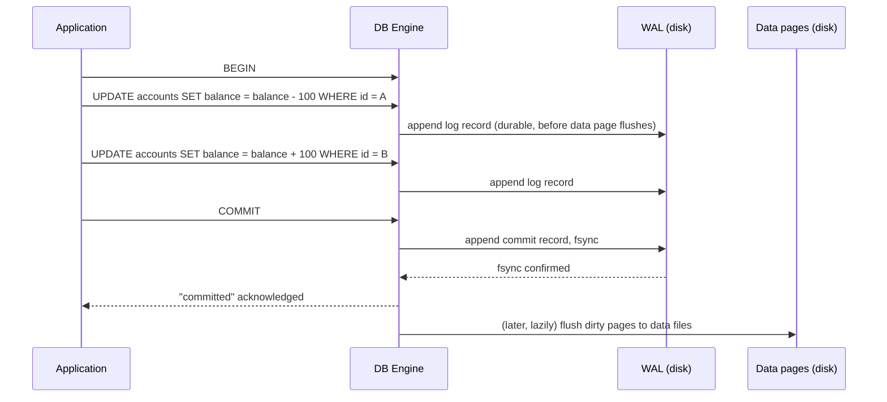
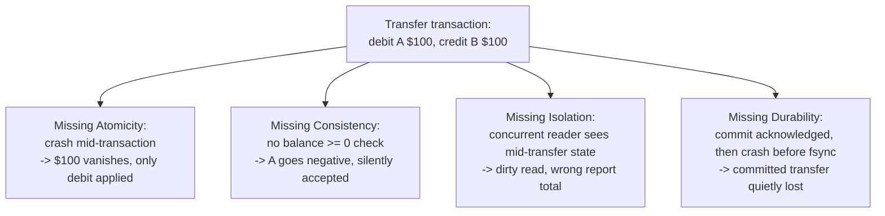

# ACID: Atomicity, Consistency, Isolation, Durability

_Four promises a database makes about every transaction - that it happens completely or not at all, that it never leaves declared rules broken, that it doesn't leak partial work to other transactions running at the same time, and that once it says "done," that's permanent even if the machine loses power a millisecond later._

`⏱️ ~8 min · 4 of 13 · Storage and Relational Databases`

> [!TIP] The gist
> A **transaction** is a group of reads/writes the database treats as one unit, ending in exactly `COMMIT` or `ROLLBACK` - never half-done. **ACID** is the engine's contract that every transaction gets four guarantees at once: **Atomicity** (all-or-nothing), **Consistency** (declared rules always hold), **Isolation** (concurrent transactions can't see each other's in-progress work), and **Durability** (once committed, a crash can't undo it). Atomicity and Durability share one mechanism - the **write-ahead log** - while Isolation and Consistency are separate subsystems (locking/MVCC, and constraint checking).

## Contents

- [Intuition](#intuition)
- [The concept](#the-concept)
- [How it works](#how-it-works)
- [In the real world](#in-the-real-world)
- [Trade-offs](#trade-offs)
- [Remember](#remember)
- [Check yourself](#check-yourself)

## Intuition

Picture a bank transfer: debit $100 from account A, credit $100 to account B.

Neither step alone is a meaningful, safe action - only both together (or neither) is. Now imagine everything that could go wrong between those two steps: the process gets killed after the debit but before the credit (money vanishes), a report reads A's balance mid-transfer and sees the debit but not yet the credit (money looks vanished, temporarily), the transfer would leave a balance negative when the business rule says it can't, or the machine loses power right after telling the client "done."

ACID is the database's way of making all four of those failure modes structurally impossible, so the application never has to hand-roll its own crash recovery, its own locking, or its own "did that actually stick?" bookkeeping.

## The concept

**A transaction** is a sequence of reads/writes the database treats as a single logical unit of work, bounded by `BEGIN` and ending in exactly one of two outcomes - `COMMIT` (make every change permanent) or `ROLLBACK`/abort (discard every change as if none of it happened). There is no third outcome and no partial commit.

**ACID**, coined by Härder and Reuter in 1983 (building on Jim Gray's earlier work), names four independent guarantees a transaction must have simultaneously to be trustworthy - independent because a database _can_ satisfy any subset of them without the others, which is exactly why each needs to be reasoned about on its own:

| Letter          | Formal                                                                                                                                               | Plain language                                                                                            |
| --------------- | ---------------------------------------------------------------------------------------------------------------------------------------------------- | --------------------------------------------------------------------------------------------------------- |
| **Atomicity**   | Either every operation in the transaction is reflected in the database, or none are - no state exists where only a prefix of the writes is permanent | A transaction is indivisible: if the credit fails after the debit succeeded, the debit gets undone too    |
| **Consistency** | The database moves from one state satisfying all declared integrity rules to another state satisfying them too                                       | A transaction can never leave a `CHECK`/`NOT NULL`/foreign-key rule broken                                |
| **Isolation**   | Concurrent transactions produce a result equivalent to _some_ serial (one-at-a-time) ordering of them (**serializability**)                          | Two transactions running "at once" can't see each other's uncommitted, in-progress writes                 |
| **Durability**  | Once a commit is acknowledged, its effects survive any subsequent failure                                                                            | "Committed" is a promise, not a suggestion - the database never gets to say "done" and then lose the work |

## How it works

### Atomicity + Durability: one log, two directions

Nearly every engine implements both with the same mechanism: the **write-ahead log (WAL)**. The rule: before a change to a data page is flushed to disk, the log record describing that change must already be durably written first. That ordering is what makes crash recovery possible at all - the log always knows about a change before the data file does.

On restart, engines following the **ARIES** recovery algorithm run three phases: **analysis** (find which transactions were still in-flight at the crash), **redo** (replay the _entire_ log forward, committed or not, restoring data pages to exactly their pre-crash state - "repeating history"), then **undo** (roll back only the transactions that never reached a commit record, using before-images from an undo log, or - in PostgreSQL's MVCC design - simply never making the uncommitted versions visible in the first place).



The reason Atomicity and Durability are taught together: **redo restores everything that _did_ commit (Durability); undo reverses everything that _didn't_ (Atomicity)** - one log, read once at recovery, answers both questions in a single pass.

### Consistency: it depends on the other three, not a subsystem of its own

Consistency has two layers:

- **Schema-declared, DB-enforced** - a `CHECK (balance >= 0)`, a foreign key, `NOT NULL`. The engine checks these automatically and, if one fails, forces the whole transaction to roll back rather than commit a broken state - Atomicity re-entering to make the rejection clean.
- **Application-level invariants the schema never declared** - "debits must equal credits across a ledger," "a seat can't sell twice." The database has no idea these rules exist unless they're expressed as an explicit constraint; if the application's own logic is wrong, the database will faithfully and durably commit a business-invalid result.

Put differently: **Consistency is best understood as an outcome the other three properties make possible, not a fourth independent mechanism** - Atomicity lets a violated constraint be fully undone, Isolation stops another transaction from acting on a temporarily-broken intermediate state, Durability keeps a valid committed state valid. (This is a well-known observation - see Martin Kleppmann's _Designing Data-Intensive Applications_, which calls Consistency "the odd one out.")

One disambiguation worth fixing early: **ACID's "C" is not CAP's "C."** ACID consistency is about one database's declared rules holding for a single transaction's before/after states. CAP's "Consistency" (much later in this curriculum) is about whether every replica in a distributed system agrees on the latest write - a completely different property that just happens to share an English word.

### Isolation, briefly (the next two topics own this in full)

Isolation's target is **serializability**: whatever interleaving the engine actually used to run transactions concurrently, the observable result must match _some_ non-overlapping, one-at-a-time ordering. Engines reach this one of two ways - **locking** (acquire shared/exclusive locks, hold them until commit) or **MVCC** (each transaction reads a consistent snapshot; writes create new row versions instead of overwriting in place, so readers and writers don't block each other). The anomalies this prevents (dirty reads, non-repeatable reads, phantoms) and the standard isolation-level ladder are the very next topic's job - the one thing to carry forward here is that Isolation specifies _what must never be observable_, not _how_ the engine achieves it.

### Worked example: what breaks without each letter

The same $100 transfer, A starting at $500, B at $200, with `CHECK (balance >= 0)` declared on both:

```sql
BEGIN;
UPDATE accounts SET balance = balance - 100 WHERE account_id = 'A'; -- A: 500 -> 400
UPDATE accounts SET balance = balance + 100 WHERE account_id = 'B'; -- B: 200 -> 300
COMMIT;
```



- **Without Atomicity:** the engine crashes after the first `UPDATE` lands on a data page but before the second runs, and recovery doesn't undo it. A sits at $400, B still at $200 - $100 has simply vanished. Correct behavior: the undo phase reverses A's debit because no commit record was ever written.
- **Without Consistency** (imagine the `CHECK` didn't exist, and A only had $50): `balance - 100` leaves A at `-50`, and nothing stops the commit. With the constraint enforced, the check fails and - because of Atomicity - the whole transaction rolls back, leaving A untouched.
- **Without Isolation:** a "total balance" report reads A _between_ the two `UPDATE`s - after the debit ($400) but before the credit and commit. It reports A+B as $100 short of reality: a **dirty read** of a transaction still in progress.
- **Without Durability:** the client hears "COMMIT successful," but the commit's log record hadn't been fsynced yet when the machine loses power. On restart, recovery has nothing to redo - the transfer the client was told succeeded is simply gone.

## In the real world

- **Stripe** builds its idempotency-key system directly on top of a database's Atomicity: a retried `POST` request with the same `Idempotency-Key` returns the cached result of the first attempt, and Stripe's own write-up ties the safety of that retry to the fact that "the previous operation was successfully rolled back by way of an ACID database" - the idempotency layer handles an application-level invariant ("don't double-charge on retry") that no schema constraint alone could express. Keys are retained for at least 24 hours. ([Stripe blog](https://stripe.com/blog/idempotency); [Stripe API reference](https://docs.stripe.com/api/idempotent_requests))
- **Uber's** engineering write-up on its Postgres-to-MySQL migration confirms the shared-machinery point directly, stating that "the WAL allows the atomicity and durability aspects of ACID" in production - the same single log serving both letters at real scale, even as the underlying operational trade-offs (replication lag, sharding a single strongly-consistent primary) pushed them toward a different storage system. ([Uber Engineering blog](https://www.uber.com/en-US/blog/postgres-to-mysql-migration/))

Full sourcing (including a UPI/NPCI example flagged as directionally accurate but not verified against a primary NPCI source): [research/backend/L2/04-acid.md](../../../research/backend/L2/04-acid.md#real-world--sources).

## Trade-offs

Full ACID isn't free - locking/MVCC bookkeeping, synchronous fsyncs, and cross-node coordination all cost latency and throughput. This is exactly what motivates **BASE** (**B**asically **A**vailable, **S**oft state, **E**ventually consistent), which many NoSQL systems build around instead:

|                       | Full ACID                                                                                                 | Relaxed / BASE-style                                                                                                             |
| --------------------- | --------------------------------------------------------------------------------------------------------- | -------------------------------------------------------------------------------------------------------------------------------- |
| **Guarantee**         | Every transaction is atomic, respects declared invariants, is isolated, survives crashes once committed   | Stays available during partial failures; data may be briefly inconsistent across replicas but converges eventually               |
| **Typical mechanism** | WAL + undo/MVCC, lock manager or snapshots, synchronous commit/replication                                | Asynchronous replication, conflict resolution on read, no cross-partition locking                                                |
| **Cost**              | Coordination overhead grows with nodes involved; synchronous fsync/replication adds commit latency        | Applications must tolerate stale/conflicting reads; business-invariant correctness shifts onto application logic                 |
| **Right for**         | Money movement, inventory counts - anything where a half-applied or silently-lost write is a real problem | High-write-throughput, partitioned workloads where a few seconds of staleness is an acceptable cost - a like-count, a view count |

The deeper point: **ACID vs BASE is a per-workload decision, not a company-wide one** - the same organization commonly runs strict ACID for billing/ledger tables and BASE-style storage for an activity feed, because the cost of a stale read is completely different in each case.

> [!IMPORTANT] Remember
> ACID isn't four unrelated rules - Atomicity and Durability are the _same_ WAL mechanism read in two directions (undo what didn't commit, redo what did); Consistency is an outcome the other three make possible, not its own subsystem; Isolation is a separate guarantee (locking/MVCC) about what concurrent transactions can never observe. If any one of the four is missing, "committed" stops meaning anything reliable.

## Check yourself

1. A transaction debits account A and, before it can credit account B, the process is killed. Walk through what ARIES-style recovery does on restart, and name which ACID letter each phase (redo, undo) is restoring.
2. A colleague says "our system is CP under CAP, so it's basically ACID." What's wrong with that claim, using the specific difference between what each "C" refers to?

---

→ Next: Transactions and isolation levels
↩ Comes back in: L4 (NoSQL and Data at Scale), L5 (distributed systems theory), L12 (scalability patterns)
