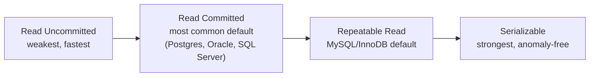
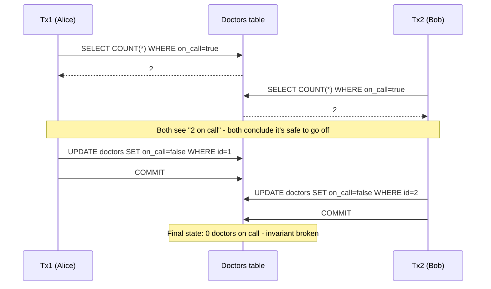

# Transactions and Isolation Levels

_ACID's "Isolation" letter said concurrent transactions can't see each other's in-progress work - this is the menu of exactly how strictly a database enforces that, and the specific bugs that leak through at each weaker setting._

`⏱️ ~7 min · 5 of 13 · Storage and Relational Databases`

> [!TIP] The gist
> Hundreds of transactions run against the same data at the same wall-clock time, yet the database has to make it *look* like they ran one at a time - that's **serializability**, the gold standard. Achieving it fully costs throughput (more blocking or more forced retries), so every engine also offers weaker **isolation levels** - **Read Uncommitted, Read Committed, Repeatable Read, Serializable** - each one a deliberate, named trade: fewer guarantees for more concurrency. The skill is knowing exactly which bug ("anomaly") each weaker level still allows through, so you can pick the right level per transaction instead of trusting the database-wide default to protect everything.

## Contents

- [Intuition](#intuition)
- [The concept](#the-concept)
- [How it works](#how-it-works)
- [In the real world](#in-the-real-world)
- [Trade-offs](#trade-offs)
- [Remember](#remember)
- [Check yourself](#check-yourself)

## Intuition

Imagine a single-lane bridge where cars enter from both ends. The safe rule is "only one car on the bridge at a time" - but if you enforced that literally, traffic would crawl. So instead you invent looser rules: cars can enter together as long as they don't actually collide, or as long as no one changes lanes mid-crossing. Each looser rule lets more cars through per minute, but each one also opens the door to a specific new way collisions can sneak in.

Isolation levels are exactly that: a menu of "how loose can the traffic rule be" options, each with a named failure mode it accepts in exchange for speed.

## The concept

A [transaction](04-acid.md#what-a-transaction-is) is a `BEGIN`...`COMMIT`/`ROLLBACK` unit of work. **Isolation** governs one narrow question: *what is this transaction allowed to see and be affected by, given that other transactions are reading and writing the same data at the same time?*

The gold-standard answer is **serializability**: the result of running transactions concurrently must be equivalent to *some* serial (one-after-another) ordering of them - not necessarily the order issued, just *some* valid order. A serializable database is immune to every concurrency bug by definition, because none of those bugs can occur in a purely serial execution.

**Every isolation level weaker than Serializable is a deliberate, named exception to that standard**, traded for concurrency - because true serializability has a real cost: locking approaches must hold locks (including locks on rows that don't exist yet) for the whole transaction, and MVCC/optimistic approaches must detect conflicts at commit time and abort-and-retry transactions that can't be proven safe. Most transactions don't share enough data with other concurrent transactions to ever need the full guarantee, so paying for it everywhere would be wasteful.

**Isolation level is chosen per transaction** (`SET TRANSACTION ISOLATION LEVEL ...`), not database-wide - a single instance routinely runs different transactions at different levels side by side.

## How it works

### The anomalies, from mild to severe

Weaker isolation lets specific, named bugs leak through. Each is strictly a superset problem of the one before it:

| Anomaly | What happens |
| --- | --- |
| **Dirty write** | Tx B overwrites Tx A's *uncommitted* write; if A rolls back, chaos. **Prevented by every level, always.** |
| **Dirty read** | Tx B reads a value Tx A wrote but hasn't committed yet; if A rolls back, B acted on data that never existed. |
| **Non-repeatable read** | Same transaction reads the same row twice, gets two different values, because another transaction committed a change in between. |
| **Phantom read** | Same transaction re-runs the same filter/count twice, gets a different *set of rows*, because another transaction inserted/deleted a matching row in between. |
| **Lost update** | Two transactions read the same row, each computes a new value independently, each writes back - one write silently clobbers the other with no error. |
| **Write skew** | The generalization of lost update to *different* rows: two transactions each read an overlapping set of rows to check a shared invariant, each writes to a *different* row, both commits succeed - yet together they violate the invariant. No single row was ever touched by both, so nothing detects a literal conflict. |



### The four standard levels

The SQL standard defines each level purely by which anomalies it still permits:

| Isolation level | Dirty read | Non-repeatable read | Phantom read | Lost update / write skew |
| --- | --- | --- | --- | --- |
| **Read Uncommitted** | Possible | Possible | Possible | Possible |
| **Read Committed** | Prevented | Possible | Possible | Possible |
| **Repeatable Read** | Prevented | Prevented | *Officially* possible (many real engines exceed this) | Possible |
| **Serializable** | Prevented | Prevented | Prevented | Prevented |

Read Committed (Postgres/Oracle/SQL Server default) is the practical "eliminate the worst anomaly cheaply" choice. Repeatable Read (MySQL/InnoDB default) fixes a transaction to one consistent snapshot for its whole duration. **Serializable is the only level that is anomaly-free by construction** - it's the only one that stops write skew.

### Worked example: write skew - the on-call doctors

A hospital requires **at least one doctor on call at all times** (a multi-row invariant no `CHECK` constraint can express). Alice and Bob are both on call and both want to go off, running concurrently under Repeatable Read / Snapshot Isolation:

```sql
-- Tx1 (Alice)                                  -- Tx2 (Bob), concurrently
BEGIN;                                          BEGIN;
SELECT COUNT(*) FROM doctors                    SELECT COUNT(*) FROM doctors
  WHERE on_call = true;  -- reads 2                WHERE on_call = true;  -- reads 2
-- 2 >= 2, safe to go off call                   -- 2 >= 2, safe to go off call
UPDATE doctors SET on_call = false              UPDATE doctors SET on_call = false
  WHERE id = 1;                                   WHERE id = 2;
COMMIT;                                          COMMIT;
```



Both transactions read `COUNT = 2`, both independently conclude "safe," both write to a **different row**, so no row-level conflict is ever detected - yet the combined result breaks the rule. Row locks on the rows each transaction *writes* don't help, because the read that made the (wrong) decision never touched those rows first. Only locking the *read* (`SELECT ... FOR UPDATE`, forcing Bob's read to block until Alice's transaction finishes) or true **Serializable** isolation - which would force whichever transaction runs "second" in the equivalent serial order to see `COUNT = 1` and correctly abort - actually prevents this.

### How real engines diverge

The standard says *what* must be true, not *how*. **PostgreSQL**'s Repeatable Read is snapshot isolation (already blocks phantoms, but not write skew); its Serializable uses optimistic **Serializable Snapshot Isolation (SSI)** - detect a dangerous pattern at commit time, abort one side, force a retry. **MySQL/InnoDB** defaults to Repeatable Read and uses **next-key locking** (record lock + gap lock) to close phantom gaps; its Serializable takes the opposite, pessimistic route - converting every plain `SELECT` into a locking read. Same named guarantee, two structurally different mechanisms - which the next two topics (MVCC, then Locking) explain in full.

## In the real world

- **Stripe-pattern idempotency keys.** A widely-referenced implementation writeup shows the "atomic phase" of processing an idempotency key (check for an existing key, insert if none) wrapped in a Postgres `SERIALIZABLE` transaction: "If two different transactions both try to lock any one key, one of them will be aborted by Postgres." Two concurrent retries of the same request race to insert the same key row - Serializable turns that race into a clean "one wins, one retries" outcome instead of a duplicate charge. The default level (Read Committed) is deliberately not strong enough for this - Serializable is opted into for this one narrow, low-volume transaction, not the whole app. ([brandur.org](https://brandur.org/idempotency-keys); concept context: [Stripe Engineering Blog](https://stripe.com/blog/idempotency))
- **Uber's LedgerStore**, the system of record for tens of billions of financial events, deliberately offers two consistency modes for secondary indexes: **strongly consistent** (2-phase commit, index write fails the whole record write on any index-intent failure) versus **eventually consistent** (built async, isolated from the write path) - the same "guarantee vs throughput" trade-off, applied to picking which indexes on a financial ledger need it. ([Uber Engineering Blog](https://www.uber.com/blog/how-ledgerstore-supports-trillions-of-indexes/))
- **CockroachDB** runs Serializable as its *only* isolation level (no weaker option), the opposite default choice from Postgres/MySQL/Oracle - proof that "weaker-by-default" is a common engineering choice, not a universal law. Its engineering blog walks through the exact write-skew mechanics above and how its SSI implementation tracks read-write dependency cycles to decide which side to abort. ([Cockroach Labs Blog](https://www.cockroachlabs.com/blog/what-write-skew-looks-like/))

## Trade-offs

| | Weaker isolation (Read Uncommitted / Read Committed) | Stronger isolation (Repeatable Read / Serializable) |
| --- | --- | --- |
| **Throughput** | Higher - little blocking, little bookkeeping | Lower - more blocking (locking) or more forced abort-and-retry (MVCC/SSI) |
| **Guarantee** | Application must tolerate or guard against dirty/non-repeatable/phantom reads, lost updates, write skew | Progressively fewer anomalies; Serializable alone is provably anomaly-free |
| **Application burden** | Higher - logic must defensively re-check, or use `SELECT ... FOR UPDATE` | Lower guarantee-wise, but must handle serialization-failure retries at Serializable |
| **Typical use** | High-volume, low-contention reads - dashboards, most single-row CRUD | Multi-row invariants that must hold exactly - inventory counts, seat allocation, ledger balances |

> [!IMPORTANT] Remember
> Serializable is the only level that's anomaly-free by construction; every weaker level is a deliberate, named bet that a specific bug (dirty read, non-repeatable read, phantom, lost update, or write skew) won't actually collide in practice for most transactions - the engineering skill is spotting the *few* transactions in your system (multi-row invariants like the doctors example) that need an explicit upgrade, rather than trusting the default to cover them.

## Check yourself

1. A transaction reads `balance = 500`, then later in the same transaction reads it again and gets `450`, with no error in between. Name the anomaly, and name the weakest standard isolation level that would have prevented it.
2. Explain precisely why the on-call-doctors write-skew example can't be fixed by ordinary row-level locking on the rows each transaction *writes* - what would need to be locked instead?

---

→ Next: MVCC
↩ Comes back in: L5, L12
