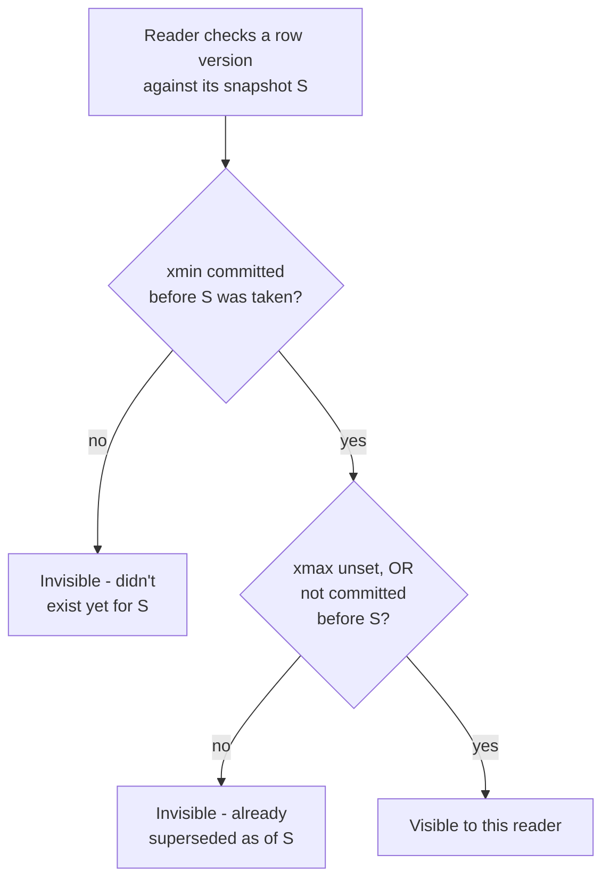

# MVCC: Multi-Version Concurrency Control

*The previous topic named the guarantees - "snapshot," "Repeatable Read sees one fixed view" - without explaining how a database actually produces that snapshot while dozens of other transactions read and write the same rows. This is the mechanism.*

`⏱️ ~7 min · 6 of 13 · Storage and Relational Databases`

> [!TIP] The gist
> A write never overwrites a row in place for other transactions to see - it creates a **new version** and keeps the old one around. Every transaction is handed exactly the version that's correct for its own point in time (its **snapshot**). The payoff: readers never block writers, and writers never block readers. This is the actual machinery behind everything the last lesson called "snapshot isolation" - and it's the default concurrency control in Postgres, MySQL/InnoDB, Oracle, and most serious OLTP engines.

## Contents

- [Intuition](#intuition)
- [The concept](#the-concept)
- [How it works](#how-it-works)
- [In the real world](#in-the-real-world)
- [Trade-offs](#trade-offs)
- [Remember](#remember)
- [Check yourself](#check-yourself)

## Intuition

Think of a shared Google Doc with "version history" turned on. If you're reading a document while someone else edits it, you don't see half-typed sentences flash in front of you - you keep looking at the last saved version until you explicitly refresh. Meanwhile the editor doesn't have to wait for you to stop reading before they can keep typing.

That's MVCC: instead of one shared, mutable copy that readers and writers fight over, the system keeps multiple **versions** of the same row, and hands each transaction the version consistent with "the state of the world at the moment I started looking."

## The concept

**Multi-Version Concurrency Control (MVCC)** is a concurrency-control mechanism in which an `UPDATE` never modifies a row in place for other transactions to immediately see. Instead, the engine keeps **multiple versions of the same logical row** simultaneously, and each transaction reads the specific version that is correct for its own **snapshot** - a record of exactly which other transactions' writes count as "already happened" as of that transaction's own start.

MVCC is not a new isolation guarantee - it's the mechanism that *delivers* the guarantees [Read Committed and Repeatable Read](05-transactions-isolation-levels.md#the-standard-isolation-levels) promise by name, and the concrete form of "optimistic concurrency control" [previewed under ACID's Isolation letter](04-acid.md#isolation-concurrent-transactions-behave-as-if-run-one-at-a-time).

**The problem it solves:** under pure lock-based (pessimistic) concurrency control, a reader takes a shared lock and a writer takes an exclusive lock, and the two are mutually incompatible - so a long-running writer blocks every reader, and a long-running reader blocks every writer, even though a reader wanting a point-in-time view and a writer producing a *new* value don't need to fight over the same bytes at all. MVCC's insight: if a write creates a new version instead of destroying the old one, the reader can keep reading the old version undisturbed while the write proceeds independently. Two guarantees follow:

- **Readers never block writers** - a `SELECT` never waits on an in-progress `UPDATE`/`INSERT`/`DELETE`; it just reads whichever version was current as of its own snapshot.
- **Writers never block readers** - an `UPDATE` doesn't wait for concurrent readers, because they're looking at a version the writer isn't touching.

This is why reader/writer contention - dashboards reading while orders are written, reports running while inventory updates - simply isn't a source of blocking in an MVCC engine, which is why it's the default in almost every serious relational database.

## How it works

### Snapshots decide what's visible

A **snapshot** is a small record a transaction takes - at a moment set by its isolation level - of which transaction IDs count as "already committed" from its point of view. **Read Committed** takes a fresh snapshot at the start of *each statement*; **Repeatable Read** takes one snapshot at the start of the *transaction* and reuses it for every statement, which is exactly why the same row read twice always returns the same answer under that level.

### Visibility: xmin/xmax

PostgreSQL makes this concrete. Every row version ("tuple") carries two hidden columns: **`xmin`** (the transaction that created this version) and **`xmax`** (the transaction that superseded it, if any - an `UPDATE` internally means "insert a new version, then stamp the old one's `xmax`"). A version is visible to a reader if its `xmin` committed before the reader's snapshot was taken, **and** its `xmax` is either unset or didn't commit before that snapshot:



This single test is the entire mechanism behind "a transaction only sees committed data" - there's no separate code path that ever exposes an uncommitted row to another transaction.

### Worked example: two transactions, two correct answers

Row `id='A'`, `balance=500`, created long ago by transaction 100 (committed). **Tx150** begins under Repeatable Read and reads `balance=500`. Concurrently, **Tx151** runs `UPDATE ... SET balance=400` and commits - this does **not** overwrite the row; it creates a second version and stamps the first one's `xmax=151`.

```mermaid
sequenceDiagram
    participant Tx150 as Tx150 (Repeatable Read)
    participant Table as accounts row A
    participant Tx151 as Tx151
    participant Tx152 as Tx152

    Tx150->>Table: snapshot S150 taken; SELECT balance
    Table-->>Tx150: reads v1, balance=500
    Tx151->>Table: UPDATE balance=400 (new v2, v1.xmax=151)
    Tx151->>Table: COMMIT
    Tx150->>Table: SELECT balance (same snapshot S150)
    Table-->>Tx150: v2 invisible (151 not in S150) -> still 500
    Tx152->>Table: fresh snapshot S152 (after 151 committed)
    Table-->>Tx152: v1 now dead -> reads v2, balance=400
```

Tx150 re-reads and still gets **500** - not because Tx151 was blocked (it wasn't), but because Tx150's snapshot says version 2 "hasn't happened yet." A brand-new Tx152, taking its snapshot *after* Tx151 committed, reads **400**. Same row, same instant, two different, both-correct answers - correctness is always relative to each transaction's own snapshot.

### Writer-vs-writer still blocks

MVCC removes reader/writer contention, but **not** writer-vs-writer contention on the same row - two transactions can't both create the "next" version of the same row without one knowing about the other. If Tx A is mid-update on a row and Tx B tries to update the *same* row, B blocks until A commits or aborts. This is the direct handoff into the next lesson on locking.

Two engines implement all of the above with different physical tricks: **PostgreSQL** appends brand-new tuples into the table itself, leaving old versions to be reclaimed later by `VACUUM`. **MySQL/InnoDB** updates the row in place but pushes the prior value onto an **undo log** first, so a reader needing an older view reconstructs it by walking the undo chain backward. Same contract (versions instead of overwrites), two different storage strategies - which is why "InnoDB doesn't really do MVCC because it updates in place" is a common but incorrect claim.

## In the real world

- **Uber** documented MVCC's version-chain cost as a real driver behind moving core datastores off Postgres: every `UPDATE` forces a new physical row version *plus* a new entry in every index on that table (a single-field update on a row covered by 12 indexes touches all 12) - "write amplification" that cascades into a heavier WAL stream and replication lag. ([Uber Engineering Blog](https://www.uber.com/en-US/blog/postgres-to-mysql-migration/), accessed 2026-07-10)
- **GitLab's production runbook** shows the garbage-collection cost isn't theoretical: their vacuum-to-prevent-wraparound threshold gets hit in under 3 days on average, and they've directly attributed a production performance incident to bloated tables/indexes from insufficient vacuuming. ([GitLab Runbooks](https://runbooks.gitlab.com/patroni/postgresql-vacuum/), accessed 2026-07-10)
- **Fintech angle:** a widely-referenced Postgres implementation of Stripe-style idempotency keys wraps the "check or create" step in a `SERIALIZABLE` transaction, so two concurrent requests racing on the same idempotency key can't both win - one gets a serialization-failure error (the writer-vs-writer conflict this lesson describes) and the app maps it to a retry or `409`, instead of double-charging. ([brandur.org](https://brandur.org/idempotency-keys), accessed 2026-07-10)

## Trade-offs

| | MVCC (Postgres, InnoDB, Oracle, most modern OLTP) | Pure lock-based only |
| --- | --- | --- |
| **Reader vs writer** | Never block each other | Shared/exclusive locks directly block each other |
| **Writer vs writer (same row)** | Still blocks | Still blocks |
| **Storage cost** | Extra - old versions stored until garbage-collected | None extra |
| **Cleanup required** | Yes - `VACUUM`/autovacuum (Postgres) or purge thread (InnoDB); neglect it and you get bloat, or worse, transaction-ID wraparound | Not needed |
| **Serializable "for free"?** | No - plain snapshot isolation still allows write skew; true Serializable needs extra conflict detection (SSI) on top | Yes, with strict two-phase locking fully applied |
| **Best fit** | Read-heavy or mixed OLTP where reads and writes shouldn't stall each other - most production workloads | Small, short, disjoint transactions, or where provable serializability matters more than avoiding abort-and-retry |

> [!IMPORTANT] Remember
> MVCC's whole trick is "write a new version, don't destroy the old one" - that's what lets readers and writers stop fighting over the same bytes. It doesn't eliminate locking (writer-vs-writer on the same row still blocks), and it doesn't give you full serializability for free (write skew slips through plain snapshot isolation). And every version it keeps around has to be cleaned up eventually - a long-idle transaction pinning an old snapshot is the single most common way production Postgres/InnoDB databases end up bloated.

## Check yourself

- A row's tuple has `xmin=200` (committed) and `xmax=205` (committed). Transaction 203's snapshot was taken while transaction 205 was still in progress. Is this tuple visible to 203? Walk through both halves of the visibility test.
- A production Postgres table has ballooned to 10x its live row count, and a query that used to take 5ms now takes 200ms. What's the most likely root cause, and what application habit typically causes it?
- Why does plain snapshot isolation (Repeatable Read) stop phantom reads but not write skew, when both are "the query's result changed because of a concurrent transaction"?

---

→ Next: Locking (row/table, optimistic/pessimistic)
↩ Comes back in: L5, L12
