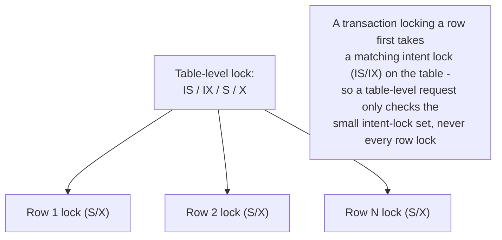
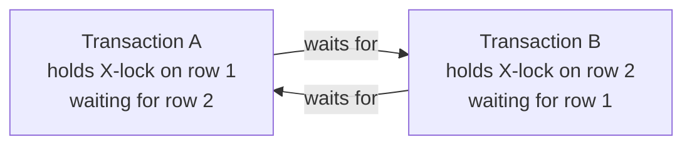

# Locking: Row/Table Granularity, Pessimistic vs Optimistic

*MVCC solved reader-vs-writer contention by never making one wait on the other - but it explicitly punted on writer-vs-writer contention and phantom prevention. This is the other mechanism: the one MVCC engines still reach for underneath, and the one some engines use instead of MVCC entirely.*

`⏱️ ~8 min · 7 of 13 · Storage and Relational Databases`

> [!TIP] The gist
> **Locking** makes a transaction ask permission before touching data, and blocks anyone else who wants an incompatible permission on the same thing - the opposite bet from MVCC's "let everyone proceed, reconcile versions." Locks come in **shared (S)** vs **exclusive (X)** modes, at **row/table** granularity, and get used either **pessimistically** (take the lock upfront, hold it to commit) or **optimistically** (don't lock at all, just check a version number at write time). Every mainstream engine - even MVCC-based ones - still runs a lock manager for the parts MVCC can't cover: same-row writer conflicts and phantom-row prevention.

## Contents

- [Intuition](#intuition)
- [The concept](#the-concept)
- [How it works](#how-it-works)
- [Trade-offs](#trade-offs)
- [Remember](#remember)
- [Check yourself](#check-yourself)

## Intuition

Think of a single bathroom key hanging on a hook outside a shared office bathroom. To use the bathroom, you take the key first - if someone else already has it, you wait outside until they hang it back up. Nobody can walk in "optimistically" and hope no one else is inside.

That's pessimistic locking: get permission before acting, block if you can't. Optimistic locking is the opposite bet - like editing a shared spreadsheet cell without asking anyone, then, right before you hit save, checking "did anyone change this since I opened it?" If not, save goes through. If so, you find out only at that last moment, not before.

## The concept

**Locking is a concurrency-control mechanism in which a transaction must acquire a lock - permission to access a piece of data - before operating on it, and any other transaction requesting an incompatible lock on the same data must wait until it's released.**

It's the pessimistic counterpart to MVCC's optimistic, version-based approach: instead of letting transactions proceed unimpeded and reconciling conflicts after the fact, a lock manager prevents the conflicting access from happening at all, by making one side block.

[The previous topic](06-mvcc.md#mvcc-still-needs-locks-writer-writer-conflicts) already flagged why MVCC alone isn't the whole story. Two problems it doesn't solve, that locking does, in every mainstream engine - MVCC-based or not:

- **Writer-vs-writer contention on the same row.** Two transactions can't both independently compute the "next" version of one logical row - the second one must find out about the first before proceeding. PostgreSQL and InnoDB both make the second writer **block** on a row-level lock.
- **Phantom prevention via range locks.** MVCC's snapshot test only answers "is this specific row visible" - it can't lock "the rows that don't exist yet but would match this predicate." That needs a genuinely lock-based mechanism (next-key locking, below), bolted onto MVCC.

So even a fully MVCC engine is, underneath, always also running a lock manager - just with its scope narrowed to what MVCC can't avoid. Some engines instead use locking as the *primary* mechanism for reads too, not just writes - the "other way to control concurrent access" this topic is named for.

**Key terms every learner needs:**

- **Shared lock (S)** - held by a reader; multiple transactions can hold S on the same object at once (reads don't conflict with reads).
- **Exclusive lock (X)** - held by a writer; incompatible with *every* other lock on the object, including another X or an S.
- **Granularity** - the size of what a lock covers: a row, a page, or a whole table.
- **Pessimistic locking** - take the lock before touching data, assuming conflict is likely.
- **Optimistic locking** - don't lock at all; check for conflict only at write time, assuming conflict is rare.

## How it works

### Shared vs exclusive, and the compatibility matrix

The two foundational lock modes exist because reads and writes have fundamentally different requirements:

| Requested \ Held | S (shared) | X (exclusive) |
| --- | --- | --- |
| **S (shared)** | Granted | Blocks |
| **X (exclusive)** | Blocks | Blocks |

Readers can share the same object; a writer needs sole access, full stop.

### Granularity: row, page, table

Granularity trades **concurrency** against **overhead**:

- **Row-level** - finest common granularity (InnoDB row locks, Postgres tuple locks). Maximizes concurrency - two transactions touching two different rows never contend - at the cost of one lock-manager entry per locked row.
- **Page-level** - a lock covers a whole disk page (many rows). Modern InnoDB/Postgres don't use this as their transactional row-locking mechanism today; it survives mainly as an internal, much shorter-held **latch** protecting a page's in-memory structure, not the transactional lock manager.
- **Table-level** - covers the whole table, cheapest to track but collapses concurrency to nothing. Real engines still use it deliberately for schema changes (`ALTER TABLE`), bulk loads, and `TRUNCATE`.

The rule this produces: default to the finest granularity that's still cheap to track, and reach for coarser locks only when an operation's semantics genuinely need exclusivity over the whole object.

### The intent-lock hierarchy: letting coarse and fine locks coexist cheaply

If transaction A holds row-level X locks on 200 rows, and transaction B wants a table-level X lock (say, for `ALTER TABLE`), scanning all 200 of A's individual row locks on every table-lock request would be far too slow.

**Intent locks** fix this: a transaction announces its intent at the *table* level before it locks a row underneath. **IS** ("about to hold S locks on some rows") and **IX** ("about to hold X locks on some rows") mean a table-level request only ever has to check a small, fixed set of table-level locks - never the (potentially huge) set of individual row locks.



Two transactions can both hold IX on the same table (each free to X-lock *different* rows underneath) - that's what lets thousands of concurrent single-row writes proceed without ever fighting over the table. But an actual table-level **X** request (e.g. `ALTER TABLE`) correctly blocks against *any* IS/IX/S/X already held.

### Pessimistic locking: SELECT FOR UPDATE and two-phase locking

Pessimistic locking assumes conflicts are likely enough to prevent outright: take the lock before touching data, hold it until safe to release.

- **`SELECT ... FOR UPDATE`** - takes an X-equivalent row lock on every row read, so any other transaction trying to update/delete those rows must block until this one commits or rolls back. This is exactly the fix for the write-skew problem the MVCC lesson deferred: forcing a second transaction to block on the rows an invariant depends on, instead of both reading a stale snapshot independently.
- **Two-Phase Locking (2PL)** - the classical protocol for full serializability via locking. Every transaction has exactly two phases: a **growing phase** (may acquire locks, never release) and a **shrinking phase** (may release, never acquire). If every transaction obeys this, the resulting schedule is provably **conflict-serializable**.
- **Strict 2PL** - what every real database actually implements: all locks (at minimum every exclusive lock) are held until **commit or abort**, none released early. This closes the gap plain 2PL leaves open - a **cascading abort**, where a transaction releases a lock early, someone else reads/writes the now-unlocked data and commits, then the first transaction aborts - leaving the second transaction's committed work based on data that logically never existed.

### Optimistic locking: version checks at commit time

A different bet: assume conflicts are *rare*, so pay no locking cost during the transaction at all - just check at write time whether the data changed since it was read.

This is typically implemented at the **application/ORM layer** with a version column:

```sql
-- Read (no lock taken):
SELECT id, name, price, version FROM products WHERE id = 42;
-- app reads: price = 19.99, version = 7
-- ... user thinks for 30 seconds, edits price in a form ...

-- Write, guarded by the version read earlier:
UPDATE products
SET price = 21.99, version = version + 1
WHERE id = 42 AND version = 7;
-- If another transaction already updated this row (version is now 8),
-- this UPDATE matches zero rows -> application detects the conflict
-- and retries or surfaces an error, instead of silently overwriting.
```

This is the pattern behind Hibernate/JPA's `@Version`, ActiveRecord's optimistic locking, and Django's equivalent. It's worth being precise about a common mix-up: MVCC's internal version chains (xmin/xmax, undo logs) are the *database engine's own* mechanism for lock-free snapshot reads. **This application-level version-column pattern is a separate, coarser technique layered on top** - typically guarding long, human-paced read-modify-write cycles (a user editing a form) where holding an actual row lock for the entire time someone is looking at a screen would be a serious liability.

### Worked example: a classic deadlock, step by step

Two rows in `accounts`: `id=1` (balance 500) and `id=2` (balance 300). Two transactions each need both rows, but acquire locks in **opposite order**:

```sql
-- Tx A                                          -- Tx B, concurrently
BEGIN;                                           BEGIN;
UPDATE accounts SET balance = balance - 50       UPDATE accounts SET balance = balance - 20
  WHERE id = 1;   -- Tx A now holds X lock on 1     WHERE id = 2;   -- Tx B now holds X lock on 2

UPDATE accounts SET balance = balance + 50       UPDATE accounts SET balance = balance + 20
  WHERE id = 2;   -- BLOCKS: Tx B holds X on 2      WHERE id = 1;   -- BLOCKS: Tx A holds X on 1
```

Neither statement can ever complete: Tx A waits on a lock Tx B holds, and Tx B waits on a lock Tx A holds - a **circular wait**, the defining condition of deadlock.



This is the textbook, single most common production deadlock: two code paths (a "transfer" and a "refund", say) updating the same two rows in a different order.

### Detecting and breaking deadlocks

A lock manager conceptually maintains a **wait-for graph**: a node per transaction, an edge `A -> B` meaning "A is blocked on a lock B holds." A cycle in that graph *is* a deadlock.

- **InnoDB** checks the wait-for graph the instant a transaction is about to block, picks a **victim** (by default, the transaction that's modified the fewest rows), and rolls it back with a deadlock error.
- **PostgreSQL** waits until a transaction has been blocked for `deadlock_timeout` (default 1 second) before paying the cost of a graph walk - a bet that most lock waits resolve on their own well before that.
- **Prevention beats detection**: always acquire locks on multiple rows in a single, consistent order (e.g. always lock the lower `id` first) - this makes a circular wait structurally impossible, no detector needed. This is the single most reliable fix for the worked example above.
- **Timeouts** are a blunter fallback (`innodb_lock_wait_timeout`, default 50s) - cruder than graph detection since it can abort a merely-slow transaction, not a truly deadlocked one, but cheap and always available as a safety net.

### Phantom prevention: gap locks and next-key locking

Ordinary row locks only protect rows that **already exist** - they say nothing about the space *between* rows, exactly where a phantom `INSERT` sneaks in.

- **Gap lock** - a lock on the gap between two consecutive index records; it doesn't block modifying existing rows on either side, only inserting a *new* row into that gap.
- **Next-key lock** - InnoDB's actual mechanism: a record lock on an index row *combined with* a gap lock on the gap immediately before it. Together they cover "this row, plus the range up to the previous indexed value" - closing exactly the gap a phantom insert would otherwise slip into. This is a locking mechanism doing work MVCC's snapshot alone cannot.

## Trade-offs

| | Pessimistic locking (2PL, `SELECT ... FOR UPDATE`) | Optimistic locking (version/timestamp check) |
| --- | --- | --- |
| **When conflict cost is paid** | Upfront - blocks at the moment of contention | Late - only discovered at write time |
| **Best fit** | High-contention data, short transactions (ledgers, inventory decrement, seat allocation) | Low-contention data, long "think time" between read and write (form edits, collaborative docs) |
| **Failure mode under misuse** | Blocking, lock waits, deadlocks if lock order isn't disciplined | Explicit conflict at write time - app must handle "0 rows affected" and retry |
| **Resource held during wait** | An actual lock (often an open connection) for the whole hold duration | Nothing - no lock, no held connection |
| **Where it lives** | Inside the database engine's own lock manager | Usually application/ORM layer, on top of whatever locking/MVCC the DB already does |
| **Interacts with isolation level** | Directly - 2PL is *how* lock-based `SERIALIZABLE` is achieved | Independent - an app-level guard layered on top of whatever level is in effect |

> [!IMPORTANT] Remember
> Locking makes a transaction ask first and blocks if it can't have exclusive access; MVCC lets everyone proceed and reconciles versions after the fact. They aren't rivals so much as a division of labor: even MVCC engines still use real locks for writer-vs-writer conflicts and phantom prevention (next-key locks). Pessimistic locking pays its cost upfront and prevents conflict outright, at the risk of blocking and deadlock; optimistic locking pays nothing until commit, at the risk of discovering the conflict late and having to retry.

## Check yourself

- Two transactions each need to update rows 1 and 2, but Tx A locks 1-then-2 while Tx B locks 2-then-1. Walk through why this produces a deadlock, and name the one discipline that prevents it structurally, without relying on the engine's deadlock detector.
- A colleague says "our ORM's optimistic locking is basically the same thing as the database's MVCC." Explain precisely what's different: who implements each one, and what problem each is actually solving.
- Why can't an ordinary row-level exclusive lock, by itself, prevent a phantom read? What does InnoDB's next-key lock add on top of a plain record lock to close that gap?

---

→ Next: Indexing (B-tree, hash, LSM-tree)
↩ Comes back in: L4, L5, L12
