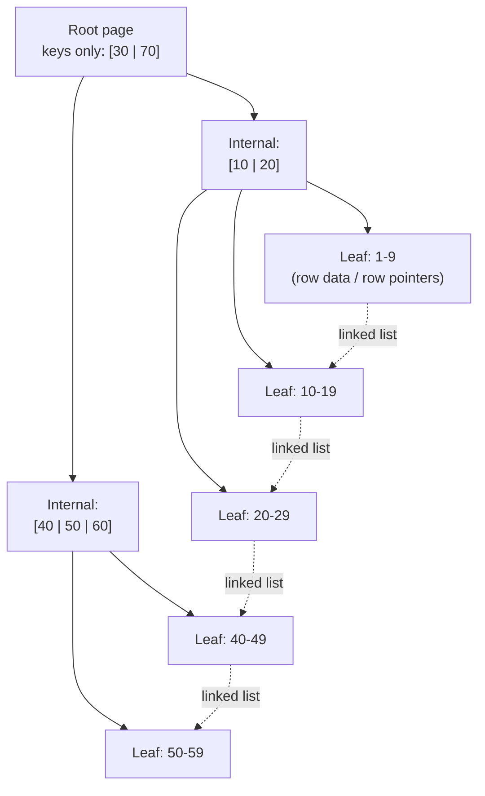
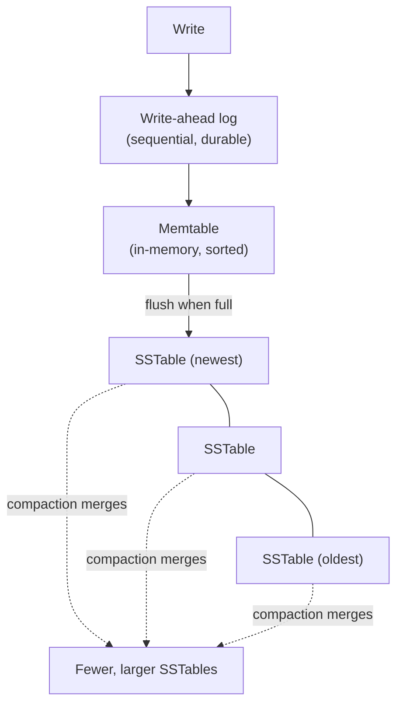

# Indexing: B-tree, Hash, LSM-tree

*Every topic so far in L2 has quietly assumed a query can find the rows it needs. This is the one where that assumption gets built from scratch.*

`⏱️ ~8 min · 8 of 13 · Storage and Relational Databases`

> [!TIP] The gist
> Without an index, `WHERE email = 'a@b.com'` means reading *every* row until one matches - a **full table scan**. An **index** is an auxiliary structure that pre-sorts or pre-hashes a column so a query can jump straight to the matching rows instead. Three families do this differently: a **B-tree** (the default almost everywhere) balances fast reads *and* fast writes via a wide, shallow disk-page tree; a **hash index** gives the fastest possible equality lookup but no range/sort support at all; an **LSM-tree** buffers writes in memory and flushes them sequentially, trading some read cost for very high write throughput. None of this is free - reads get faster, but every write now has to update the index too, and it costs disk space of its own.

## Contents

- [Intuition](#intuition)
- [The concept](#the-concept)
- [How it works](#how-it-works)
- [In the real world](#in-the-real-world)
- [Trade-offs](#trade-offs)
- [Remember](#remember)
- [Check yourself](#check-yourself)

## Intuition

A phone book with no order would force you to read every entry to find "Smith" - a full table scan. The actual phone book sorts by last name, so you flip straight to the "S" section: that's a B-tree, a sorted structure you can jump into.

A hash index is more like a coat-check system: hand over a ticket number, get the exact coat back instantly - but you can't ask for "everyone's coat between ticket 100 and 200," because the tickets were never stored in any order relative to each other.

An LSM-tree is like a busy inbox: instead of filing every incoming letter into its exact alphabetical folder the instant it arrives (slow, one folder at a time), you drop letters into a tray, and periodically a clerk sorts the whole tray and merges it into the filing cabinet in one efficient batch.

## The concept

**An index is an auxiliary data structure, stored alongside a table, that maps column values to the physical location of the rows that hold them - built so a query can find matching rows without scanning the whole table.**

Every index makes the same three-way trade, just tuned differently by structure:

- **Reads get faster** - a query that filters, sorts, or joins on an indexed column can skip straight to the relevant rows.
- **Writes get slower** - every `INSERT`/`UPDATE`/`DELETE` on an indexed column has to update *every index* built on it, not just the table.
- **Storage grows** - each index is its own structure on disk, sometimes larger than the table itself.

This is why indexing is a deliberate decision, not a default: **index what your read patterns actually filter, join, or sort on, and no more.** An unused index is pure write cost and storage with no read benefit in return.

**Key terms:**

- **Full table scan** - reading every row to find matches; what happens with no usable index.
- **Fanout / branching factor** - how many children a tree node has; the whole reason B-trees are fast on disk.
- **Clustered index** - the table's rows are physically stored inside the index itself (InnoDB's primary key).
- **Write amplification** - one logical write ends up physically rewritten to disk multiple times over its life (LSM-tree compaction is the classic source).

## How it works

### B-tree: wide and shallow, built around disk pages

The dominant cost of a disk-backed lookup isn't comparing keys - it's how many separate **pages** get fetched from disk. A classic binary tree, one key per node, needs dozens of levels for millions of rows: dozens of separate page reads per lookup. A **B-tree** fixes this by packing *many* keys and child pointers into each node - as many as fit in one disk page (8KB in Postgres, 16KB in InnoDB) - which makes the tree wide instead of deep.

**Worked example - why this collapses tree height:** if roughly 1,000 keys fit in one page, a tree with branching factor 1,000 needs only:

| Tree height | Rows addressable (1,000ʰ) |
|---|---|
| 1 level | 1,000 |
| 2 levels | 1,000,000 |
| 3 levels | 1,000,000,000 |

A **billion-row table** needs a tree only **3-4 levels deep** - so a point lookup costs 3-4 page reads, almost all served from cache after the first access, regardless of whether the table holds a million rows or a billion.

Real engines use the **B+ tree** refinement: internal nodes hold *only* keys and pointers (maximizing fanout), all actual row data lives in the leaves, and the leaves are chained together in sorted order - so a range scan finds the starting leaf once, then just walks sideways.



Two real engines make opposite physical choices here: **InnoDB** stores the table's rows *inside* the primary key's B+ tree (a **clustered index**) - so every secondary index has to store a primary-key value, not a direct pointer, meaning a secondary lookup costs **two** tree traversals (a "bookmark lookup"). **PostgreSQL** stores rows in an unordered heap, and every index (including the primary key's) just points at a physical location - no clustering by default.

### Hash indexes: the fastest possible equality lookup, nothing else

A hash index computes `hash(key)` and jumps straight to a bucket - **O(1)** lookup, no multi-level traversal at all. The cost: a good hash function deliberately scatters similar keys to unrelated buckets, so there's no way to answer "everything between X and Y" - `WHERE price > 100` or `ORDER BY name` simply cannot use a hash index. This is why relational engines use B-trees as the default and hash indexes rarely: a warm B-tree is already close to O(1) in practice, and giving up range/sort for a marginal gain isn't usually worth it. Hash indexing shows up more in purpose-built key-value stores instead - Bitcask (Riak) and Redis's core keyspace both lean on exactly this trade.

### LSM-tree: defer the expensive part to a background process

A B-tree write means finding the right page and modifying it in place - a **random** disk write. An **LSM-tree (Log-Structured Merge-tree)** avoids that entirely: buffer writes in memory, flush them to disk sequentially, and clean up later in the background.

- **Memtable** - all writes land first in an in-memory sorted structure. Fast, pure memory, no disk I/O.
- **SSTable (Sorted String Table)** - once the memtable fills up, it's flushed to disk as an **immutable**, sorted file. A new empty memtable takes over.
- **Compaction** - a background process merges multiple SSTables into fewer, larger ones, keeping only the newest version of each key and dropping deleted ones (tombstones).



This is why LSM-trees are the default for write-heavy systems (Cassandra, HBase, RocksDB, ScyllaDB): writes become append-only and sequential, and sequential I/O is far cheaper than random I/O. The bill comes due elsewhere, in three named costs:

- **Read amplification** - a read may need to check the memtable *and* several SSTables before finding (or ruling out) a key. Mitigated with a **Bloom filter** per SSTable, which can say "definitely not here" without an actual disk read.
- **Write amplification** - the same logical write gets physically rewritten every time compaction merges it into a bigger SSTable - commonly 10-30x in RocksDB-style deployments (`verify` exact figures, workload-dependent).
- **Space amplification** - obsolete versions and not-yet-purged tombstones sit on disk until compaction catches up, so disk usage exceeds the logical data size at any given moment.

The memtable itself isn't durable until flushed - which is why every LSM-tree pairs it with a **write-ahead log**, the same durability mechanism a B-tree engine uses for its buffer pool (full mechanics next topic).

### Composite indexes: order is not a suggestion

A **composite index** on `(a, b)` sorts first by `a`, then by `b` within each value of `a` - like a phone book sorted by last name, then first name. This produces the **leftmost-prefix rule**: the index can serve a filter on `a` alone, or `a` and `b` together, but **not** `b` alone - because rows with a given `b` value are scattered across every value of `a`, not grouped anywhere.

```sql
CREATE INDEX idx_status_created ON orders (status, created_at);

-- Efficient: equality on the leading column, range on the second
SELECT * FROM orders WHERE status = 'pending' AND created_at > '2026-07-01';

-- Efficient: uses only the leading column, still a valid prefix
SELECT * FROM orders WHERE status = 'pending';

-- Cannot use this index at all: created_at isn't the leftmost column
SELECT * FROM orders WHERE created_at > '2026-07-01';
```

Rule of thumb: **put equality-filtered columns before range-filtered ones.** Once the tree hits a range condition, nothing after it stays usefully sorted for that query.

A **covering index** takes this further - it carries every column a query needs directly in its leaf entries, so the engine never has to fetch the underlying row at all (eliminating InnoDB's bookmark lookup for that query specifically).

## In the real world

**Stripe** treats index migrations themselves as a first-class reliability problem: its open-source `pg-schema-diff` tool always builds new indexes with `CREATE INDEX CONCURRENTLY` (writes keep flowing during the build) and does online index *replacement* - build the new one under a temp name, then swap - so a hot query never loses its backing index mid-migration.

**Uber's** engineering blog on moving core services from Postgres to MySQL walks through the exact clustered-vs-heap trade-off above: InnoDB's secondary-index lookups cost two tree traversals (a real downside versus Postgres), but because InnoDB points to rows via a stable primary key rather than a physical location, an `UPDATE` only has to touch the indexes on columns that actually changed - a real write-side win that cuts the other way.

**Discord's** message store grew from 12 Cassandra nodes to 177 by 2022, and LSM-tree compaction became the operational bottleneck - falling behind on it degraded read latency badly enough that nodes had to be pulled out of rotation just to let compaction catch up. Migrating to ScyllaDB (same LSM/SSTable model, no GC pauses, shard-per-core) cut p99 message-fetch latency from 40-125ms to a steady 15ms, on a cluster shrunk to 72 nodes - a direct, at-scale demonstration that an LSM-tree's write-friendliness only holds up if compaction keeps pace.

Source: [stripe/pg-schema-diff](https://github.com/stripe/pg-schema-diff) · [Uber: Postgres to MySQL](https://www.uber.com/en-US/blog/postgres-to-mysql-migration/) · [Discord: How Discord Stores Trillions of Messages](https://discord.com/blog/how-discord-stores-trillions-of-messages)

## Trade-offs

| | B-tree | Hash | LSM-tree |
|---|---|---|---|
| **Point lookup** | O(log_B N), ~3-4 page reads even at billions of rows | O(1) average case - the fastest of the three | Slower - may check memtable + several SSTables |
| **Range / sort / `ORDER BY`** | Yes - the whole reason it's the default | No - structurally impossible | Yes, but reads more structures to get there |
| **Write pattern** | Random (find the page, modify in place) | Random | Sequential (append + background merge) |
| **Best fit** | General-purpose OLTP: lookups, ranges, joins, sorting | Pure equality lookup, no range ever (KV stores) | Write-heavy, append-mostly at scale (time-series, event logs, wide-column stores) |
| **Main cost paid** | In-place random writes; page splits on insert | Total loss of range/sort support | Read/write/space amplification, compaction I/O |

> [!IMPORTANT] Remember
> An index turns "scan every row" into "read a handful of pages" - but every index is a second structure that has to be kept in sync on every write, and costs disk space of its own. B-tree is the safe general default because it's the only one of the three with native range and sort support; hash trades that away for the fastest possible equality lookup; LSM-tree trades read simplicity for write throughput by deferring the expensive part - random writes - to background compaction.

## Check yourself

- A table has 1 billion rows and a B+ tree with branching factor ~1,000. Why does a point lookup cost about 3-4 page reads regardless of whether the table has 1 million or 1 billion rows?
- Why can't a hash index serve `WHERE price > 100` or `ORDER BY name`, no matter how good the hash function is?
- You have a composite index on `(customer_id, order_date)`. Explain why a query filtering only on `order_date` can't use it, and why a query filtering on `customer_id` with a range on `order_date` can.
- Why is an LSM-tree write close to O(1) regardless of dataset size, while a B-tree's in-place update isn't? What cost does the LSM-tree defer, and to which background process?

---

→ Next: Write-ahead log (WAL)
↩ Comes back in: L3, L4, L12
