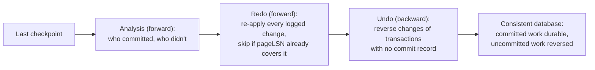

# Write-Ahead Log (WAL)

*ACID promised a crash never loses committed work or leaves half-finished work behind - this is the mechanism that actually delivers on that promise.*

`⏱️ ~8 min · 9 of 13 · Storage and Relational Databases`

> [!TIP] The gist
> A **write-ahead log (WAL)** is an append-only, sequential, durable record of every change a database makes, written *before* that change is applied to the actual data pages on disk. It exists because a data page is large and modifying it isn't atomic with respect to a crash - a small, sequential log record is far cheaper to make durable and far easier to recover from than a large, randomly-located page. Commit only means "the log record made it to disk" - the data page itself can be flushed lazily, whenever convenient. After a crash, recovery replays the log to redo committed work and undo uncommitted work, restoring exactly the state that existed the instant before the crash.

## Contents

- [Intuition](#intuition)
- [The concept](#the-concept)
- [How it works](#how-it-works)
- [In the real world](#in-the-real-world)
- [Trade-offs](#trade-offs)
- [Remember](#remember)
- [Check yourself](#check-yourself)

## Intuition

Imagine renovating a house room by room, but keeping a notebook where you write down exactly what you're about to do to each room *before* you touch a single wall. If the power goes out mid-renovation, you don't need to inspect every half-painted wall to figure out what happened - you just read the notebook. Anything it says was finished, you finish for real (redo). Anything it says was started but never marked "done," you undo back to how the room looked before.

The notebook is small, sequential, and quick to write in. The rooms themselves are big, scattered around the house, and slow to inspect. That's the entire reason the notebook exists separately from the rooms it describes.

## The concept

**A write-ahead log (WAL) is an append-only, sequential, durable record of every change a database makes, written before the corresponding change is applied to the actual data pages on disk.**

The precise rule it enforces - the **write-ahead invariant** - is: a log record describing a change to page P must be durable before page P itself, carrying that change, is allowed to reach stable storage. This is a partial order, not "log everything, then write pages" - data pages are still flushed lazily in the background; the invariant only constrains the relative order of *one* log record versus the *one* page it describes.

**Key terms:**

- **LSN (log sequence number)** - a monotonically increasing identifier (often literally a byte offset into the log stream) that gives every log record an unambiguous position and ordering.
- **pageLSN** - a hidden field on every data page recording the LSN of the last log record that modified it; this is how recovery knows whether a page already reflects a given change.
- **Steal / no-force** - the buffer-pool policy nearly every real engine uses: dirty pages *can* be written to disk before commit (steal), and committed pages *don't have* to be flushed before commit is acknowledged (no-force). Fast, but it needs the WAL to be safe.
- **Checkpoint** - a periodic marker that bounds how far back recovery ever needs to replay the log.

Without a WAL, a crash mid-write leaves no way to tell whether a page reflects a completed change, a half-completed change, or a change that should never have committed at all. The WAL exists purely to answer that question, cheaply, at recovery time.

## How it works

### The log buffer, fsync, and group commit

Log records aren't flushed to disk one at a time - they're appended to an in-memory **log buffer** and only forced to stable storage (`fsync`) at deliberate points, the most important being **commit**: a transaction isn't acknowledged as committed until its commit record has been fsynced.

One `fsync` per commit would be brutally expensive under load, so engines use **group commit**: a transaction appends its commit record and waits; the engine issues a single `fsync` that flushes the log buffer up to whatever LSN is currently at its tail; every transaction whose commit record was covered by that flush is released as committed simultaneously. A lightly-loaded system pays a full fsync's latency per commit; a heavily-loaded one amortizes that same fsync across dozens of transactions at once - which is why WAL-based commit latency is highly load-dependent.

### Steal + no-force: why the WAL has to exist at all

Buffer-pool policy is described on two axes: can a dirty (uncommitted) page be written to disk before commit (**steal**), and must every touched page be flushed *before* commit is acknowledged (**force**)? Nearly every real engine picks **steal + no-force** - the fastest combination, but also the riskiest: steal means an uncommitted change might already be on disk when its transaction aborts (needs **undo**); no-force means a committed change might *not yet* be on disk when the machine crashes (needs **redo**). The WAL is precisely what makes steal + no-force safe: because every change is durably logged first, both problems reduce to "replay the log correctly," instead of "never allow the risky scenario to occur."

### Checkpointing

If recovery always replayed the log from the database's entire history, recovery time would grow without bound. A **checkpoint** periodically records "everything before this point is provably safe on disk," giving recovery a much more recent starting line. Real engines use a **fuzzy checkpoint**: it flushes currently-dirty pages in the background *without* pausing new transactions, then writes a checkpoint record recovery can start from. More frequent checkpoints mean shorter recovery but more background I/O; less frequent checkpoints mean the opposite, plus more WAL that must stay on disk in the meantime.

### Crash recovery: analysis, redo, undo

Recovery (the ARIES design nearly every modern engine descends from) runs three passes starting from the last checkpoint:

1. **Analysis** - scan forward, rebuilding which transactions were still active (no commit record) versus committed, purely from what the log says.
2. **Redo** - replay forward, re-applying *every* logged change for *every* transaction, committed or not - it's cheaper to redo everything and undo the losers after than to figure out winners first. A page's `pageLSN` decides whether a given record is already reflected on that page (skip it) or not (apply it).
3. **Undo** - walk backward, reversing every change made by transactions with no commit record, using the before-images stored in their log records. Each reversal is itself logged (a **compensation log record**), so a second crash mid-undo can't cause undo to be redone incorrectly.



### Worked example: recovering LSN by LSN

A log fragment, with the crash occurring right after LSN 1042:

```text
LSN 1000  CHECKPOINT
LSN 1010  BEGIN   txn 501
LSN 1020  UPDATE  txn 501, page P1, balance 500 -> 400
LSN 1030  BEGIN   txn 502
LSN 1035  UPDATE  txn 502, page P2, status 'pending' -> 'shipped'
LSN 1040  COMMIT  txn 502
LSN 1042  UPDATE  txn 501, page P3, balance 200 -> 300
--- CRASH ---
```

**Analysis** finds txn 502 has a COMMIT record (a winner) and txn 501 doesn't (a loser). **Redo** replays 1010→1042 forward for *both* transactions regardless: P1's balance becomes 400, P2's status becomes `'shipped'`, P3's balance becomes 300 - the database transiently looks exactly as it did the instant before the crash. **Undo** then walks backward only for txn 501: reverses LSN 1042 (P3: 300→200) and LSN 1020 (P1: 400→500).

**Result:** P1 = 500, P2 = `'shipped'`, P3 = 200 - txn 502's committed change survives intact (Durability), and txn 501's half-finished transfer is fully reversed, as if it never happened (Atomicity).

## In the real world

**PostgreSQL** ships the WAL byte stream itself as the replication protocol: a standby issues `START_REPLICATION [SLOT slot_name] ... XXX/XXX` to receive WAL from a given LSN and runs the identical redo machinery, forever, against a live stream. A registered **replication slot** tells the primary "don't recycle WAL a replica hasn't consumed yet" - which is exactly why a replica left offline for hours with a live slot can fill the primary's disk with retained WAL. ([PostgreSQL docs - Streaming Replication Protocol](https://www.postgresql.org/docs/current/protocol-replication.html))

**Amazon Aurora** pushes the same idea further than any single-node engine: its compute layer never sends data pages over the network at all, only log records - "one of the reasons Amazon Aurora can write so much faster than other engines is that it only sends log records to the storage nodes," which independently turn that log into pages themselves, acknowledging a write once 4 of 6 storage replicas confirm. ([AWS Database Blog - Introducing the Aurora Storage Engine](https://aws.amazon.com/blogs/database/introducing-the-aurora-storage-engine/))

**CockroachDB** is a useful cautionary tale: its storage layer originally ran both its Raft consensus log *and* its underlying storage engine's own WAL for the same write, effectively logging it durably twice. Its own GitHub issue states the redundancy plainly - "a write-ahead log is meant to provide control over durability and atomicity of writes, but the Raft log already serves this purpose" - a reminder that the write-ahead invariant doesn't say *how many* logs a layered system should have, and stacking two independently-durable logs on one write path silently doubles flush cost without doubling safety. ([cockroachdb/cockroach issue #38322](https://github.com/cockroachdb/cockroach/issues/38322))

`verify` No fintech- or UPI-specific engineering write-up on WAL/durable-logging internals turned up in this sweep - Stripe's public engineering content covers idempotency and ledger design rather than storage-engine WAL mechanics, and UPI's public write-ups focus on the payment-switch/settlement layer rather than storage internals, so neither is forced in here.

## Trade-offs

| Dimension | Cost | What it buys | The lever |
| --- | --- | --- | --- |
| **Commit latency** | Every commit waits on at least one (possibly shared) `fsync` | Durability that survives a crash | Group commit batches concurrent commits; `synchronous_commit=off` / `innodb_flush_log_at_trx_commit != 1` skip the wait, risking a small window of data loss |
| **Throughput ceiling** | The log is one ordered, append-only stream - every commit's position in it serializes at least the log-append step | A total order over all changes, which is what makes deterministic recovery possible | Group commit and a tuned log buffer reduce but don't remove this; often cited as why a single primary has a hard write-throughput ceiling |
| **Disk space / retention** | WAL can't be deleted until a checkpoint proves it's not needed - and until no replica/replication slot still needs it | Bounded recovery time, and a replayable stream for replicas | Tune checkpoint frequency; monitor slots so a disconnected replica doesn't pin WAL retention indefinitely |
| **Checkpoint I/O** | Flushing accumulated dirty pages is a background I/O burst; the first touch to a page after a checkpoint re-logs its full image | Bounds recovery to "since the last checkpoint," not "since the database began" | More frequent checkpoints trade steadier, smaller I/O for shorter recovery; less frequent trades the opposite |

> [!IMPORTANT] Remember
> Commit means "the log record is durable," not "the data page is durable" - the WAL is what lets an engine write pages lazily (steal + no-force) while still surviving a crash, because recovery only ever has to replay a small sequential log, never inspect large scattered pages to guess what happened.

## Check yourself

- State the write-ahead invariant precisely - not "log before writing," but exactly what must be durable before what.
- A page's `pageLSN` is 1035, and a redo-pass log record for that page has LSN 1030. Should recovery re-apply it? Why - what would go wrong for a non-idempotent operation like "increment this counter"?
- In terms of steal/no-force: why does "steal" create a need for undo, and "no-force" create a need for redo - and why does the WAL let an engine safely use the fastest policy instead of a slower, simpler one?

---

→ Next: Storage engines
↩ Comes back in: L4 (replication), L5, and distributed-systems levels where the WAL underlies replication and CDC
