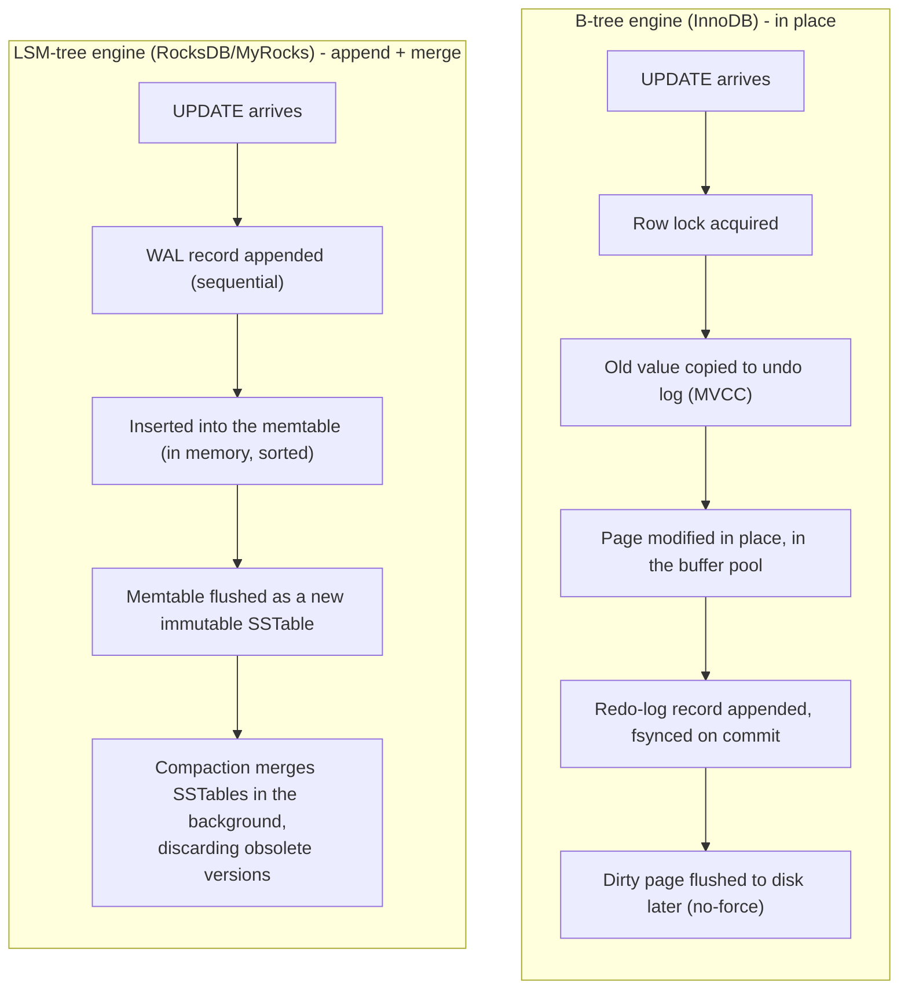

# Storage Engines

*Indexing, WAL, MVCC, and locking have all been described as things "the database" does - this is the actual component underneath all of them that decides how rows get laid out on disk and what a write physically costs.*

`⏱️ ~8 min · 10 of 13 · Storage and Relational Databases`

> [!TIP] The gist
> A **storage engine** is the layer inside a database that decides how rows are physically arranged on disk, how a write actually reaches durable storage, and how a read actually finds bytes. There are two dominant physical designs: a **B-tree engine** (InnoDB, PostgreSQL's built-in engine) updates pages **in place**, keeping read cost low and predictable at the price of a random write per update. An **LSM-tree engine** (RocksDB, Cassandra, MyRocks) never touches old data - it **appends** new writes sequentially and merges the mess later, in the background, via **compaction**, buying much higher write throughput at the price of extra background rewrite work and higher read cost. Everything above the storage engine - SQL, the relational model, query planning - is (in principle) the same regardless of which one is running underneath.

## Contents

- [Intuition](#intuition)
- [The concept](#the-concept)
- [How it works](#how-it-works)
- [In the real world](#in-the-real-world)
- [Trade-offs](#trade-offs)
- [Remember](#remember)
- [Check yourself](#check-yourself)

## Intuition

Imagine two ways of managing returned library books.

**Way one:** every returned book is walked straight back to its exact shelf slot, right now, before the next patron is helped. Finding any book later is fast and predictable - it's always exactly where it belongs. But every single return costs a trip across the library.

**Way two:** every returned book is dropped in a bin by the front door - fast, no walking required. Once the bin fills up, a librarian sweeps it in one batch and merges it into the shelves in sorted order. Returns are cheap. But a patron looking for a book might have to check the newest bin, then the last few merged batches, before finding it on a proper shelf - and someone has to keep running those merges, or the bins pile up faster than they can be cleared.

Way one is a **B-tree engine**. Way two is an **LSM-tree engine**. Neither is "better" - they're optimized for opposite things, and a real database has to pick one (or, in MySQL's case, pick per table).

## The concept

**A storage engine is the software layer inside a database that decides how data is physically represented on disk and how it is read from and written to that representation - it sits directly below the query executor and directly above the raw filesystem.** The query planner reasons about *what* to fetch ("scan this index, then get these rows"); the storage engine is the only layer that knows *how* those bytes are actually arranged and retrieved.

A storage engine owns:

- **The on-disk layout** - fixed-size **pages** holding rows in place (B-tree family), or immutable, sorted, append-only files merged over time (LSM-tree family).
- **The write path** - what happens between "a transaction issues an `UPDATE`" and "that change is durable."
- **The read path** - what happens between "a query asks for a row" and "the bytes come back," including which caches get checked first.
- **Durability and concurrency plumbing** - [WAL](09-write-ahead-log.md), [MVCC](06-mvcc.md), and [the lock manager](07-locking.md) are all engine-owned subsystems, not separate services - which is exactly why MVCC's implementation differs so sharply between PostgreSQL and InnoDB: each engine bakes its own strategy into its own page format.

**Key terms:**

- **Page** - the fixed-size unit of I/O (8 KB in PostgreSQL, 16 KB in InnoDB by default); an engine never reads or writes less than one whole page.
- **Heap file** - an unordered collection of pages holding a table's rows in no particular order (PostgreSQL's only mode); every index, including the primary key's, is a separate structure pointing back into it.
- **Index-organized / clustered table** - rows stored directly in the leaf nodes of the primary key's B+ tree, in key order, with no separate heap at all (InnoDB's only mode).
- **Memtable / SSTable** - an LSM-tree engine's in-memory sorted write buffer (memtable) and the immutable, sorted, on-disk files it periodically flushes into (SSTables).
- **Compaction** - the background process that merges SSTables, discarding obsolete versions and deleted keys, so reads don't have to check an ever-growing pile of files.
- **Write / read / space amplification** - how many extra bytes get physically written, read, or held on disk per logical byte of data - [first introduced under indexing](08-indexing.md#read-amplification-write-amplification-space-amplification); this topic restates it at the whole-engine level.

## How it works

### Two physical write paths, side by side

The B-tree path pays a small, steady cost on **every** write (undo-log copy, in-place page edit) and eventually one random write per dirty page flushed. The LSM-tree path pays almost nothing at write time - the memtable insert is pure memory, the only disk I/O is a sequential WAL append - and defers the real cost to compaction, which happens later, in bulk, off the write's critical path.

### The read path differs the same way

- **B-tree read:** traverse the B+ tree (checking the buffer pool first, disk on a miss) straight to the one current physical copy of the row - fast and predictable, [3-4 page reads for a point lookup](08-indexing.md#why-a-b-tree-not-a-binary-tree-for-disk-backed-storage), regardless of how many times that row has ever been updated.
- **LSM-tree read:** check the memtable first (newest data), then each SSTable newest-to-oldest, using a **Bloom filter** per file to skip ones that provably don't contain the key. A single logical read can still touch several physical files before resolving - the mirror image of the B-tree's single-copy guarantee.

### Heap vs. clustered: the same split, one level up

[Indexing already drew this line for secondary indexes](08-indexing.md#clustered-vs-non-clustered-secondary-indexes) - here it's the whole table's layout. PostgreSQL always uses a **heap file**: rows sit wherever there's free space, and every index (even the primary key's) is a separate structure pointing back in via a tuple ID. InnoDB always **clusters** the table by primary key: the rows themselves *are* the primary-key B+ tree's leaves, so a PK lookup is one traversal, while a secondary-index lookup costs two (index → PK value → clustered index, the "bookmark lookup"). This is also why InnoDB requires every table to have a primary key, synthesizing a hidden one if none is declared - a table has to be clustered by *something*.

### Pluggable vs. fixed: one engine per table, or one engine total

**MySQL's storage layer is pluggable** - different tables in the same instance can run different engines: **InnoDB** (B+ tree, full ACID, the default), **MyISAM** (no transactions, table-level locks only, faster for read-mostly no-transaction workloads precisely because it skips all transactional bookkeeping), and **MyRocks** (RocksDB-backed, storing MySQL tables as an LSM-tree). `ALTER TABLE ... ENGINE=InnoDB` swaps one table's physical engine without touching anything above it. **PostgreSQL has exactly one built-in engine** - every table is a heap plus B-tree indexes, with no engine-swapping mechanism in mainstream production use. In MySQL, "B-tree or LSM-tree?" is a per-table configuration choice; in PostgreSQL, it's a choice of which database product to run.

## In the real world

**Meta: MyRocks to shrink the social graph's flash footprint.** Facebook built MyRocks - RocksDB wired into MySQL as a storage engine - specifically to cut storage and flash-write volume for its sharded MySQL fleet holding the social graph (the UDB tier). Migrating that tier from compressed InnoDB to MyRocks used **50% less storage for the same data**, and Facebook's own LinkBench benchmarks showed a MyRocks instance **3.5x smaller than uncompressed InnoDB and 2x smaller than compressed InnoDB**, with MyRocks writing "orders of magnitude" less to flash than InnoDB (the commonly cited industry figure is roughly a **10x reduction in bytes written to flash**; treat the exact multiplier as `verify` since Meta's post doesn't pin one precise number). The trade Meta accepted: better write/space efficiency at some cost to read latency and to InnoDB's more mature read-path tooling - exactly this lesson's B-tree-for-reads-vs-LSM-tree-for-writes split, at whole-fleet scale.
Source: [Migrating a database from InnoDB to MyRocks - Engineering at Meta](https://engineering.fb.com/2017/09/25/core-infra/migrating-a-database-from-innodb-to-myrocks/); [MyRocks: A space- and write-optimized MySQL database - Engineering at Meta](https://engineering.fb.com/2016/08/31/core-infra/myrocks-a-space-and-write-optimized-mysql-database/).

**Uber: the same migration, and where it didn't pay off.** Uber migrated Schemaless (its MySQL-backed append-only datastore) and parts of Docstore from InnoDB to MyRocks, reporting **over 30% disk space savings** on Schemaless. Uber is candid about the other side of the trade: the migration brought **higher CPU usage and increased disk I/O utilization** on some instances, so MyRocks wasn't a blanket win - it only paid off for storage-bound workloads, not CPU- or IOPS-bound ones. That's the amplification table below playing out operationally: LSM-tree space savings are bought with background compaction work that has to be actively managed, not received for free.
Source: [MySQL to MyRocks Migration in Uber's Distributed Datastores - Uber Engineering Blog](https://www.uber.com/us/en/blog/mysql-to-myrocks-migration-in-uber-distributed-datastores/).

**Fintech angle: Stripe's DocDB runs on a document database, not a classic B-tree/LSM SQL engine.** Stripe's DocDB - a MongoDB-Community-based, custom-built database layer - serves over 5 million queries per second across 5,000+ collections and 2,000+ database shards for Stripe's core financial data. `verify` the specific underlying storage engine (MongoDB's default, WiredTiger, is itself a B-tree-based engine with document-level MVCC) isn't confirmed in Stripe's own post, so that detail is flagged rather than asserted - the scale figures themselves are as Stripe states them.
Source: [How Stripe's document databases supported 99.999% uptime with zero-downtime data migrations - Stripe Dot Dev Blog](https://stripe.dev/blog/how-stripes-document-databases-supported-99.999-uptime-with-zero-downtime-data-migrations).

## Trade-offs

| Metric | B-tree engine (InnoDB) | LSM-tree engine (RocksDB/Cassandra) |
| --- | --- | --- |
| **Write amplification** | Moderate, constant: one WAL append plus, eventually, one page rewrite per dirty page flushed - repeated updates to a still-cached page cost one write-back, not one per update | Can be large and workload-dependent: the same byte is rewritten on every compaction pass that merges it up a level - RocksDB deployments commonly report **10-30x** write amplification with leveled compaction (`verify` exact figures vary by workload/config) |
| **Read amplification** | Low, predictable: 3-4 page reads for a point lookup, regardless of update history - there's only one current physical copy of a row | Structurally higher: may need to check the memtable plus several SSTables, mitigated but not eliminated by Bloom filters and leveled compaction |
| **Space amplification** | Low: an in-place update overwrites the old value directly | Can spike transiently: obsolete versions and tombstones occupy disk until compaction reclaims them |
| **Best fit** | General OLTP, read-heavy, latency-sensitive workloads | Extremely high sustained write throughput, storage-constrained, large-scale ingestion |

The underlying reason: a B-tree engine pays a small, steady cost on every single write; an LSM-tree engine defers its cost and pays it in bursts (compaction) - which is exactly why synthetic write-only benchmarks favor LSM-trees, while real LSM-tree deployments live or die on whether compaction can keep pace with the write rate.

> [!IMPORTANT] Remember
> A B-tree engine pays a small, predictable cost on every write (undo copy, in-place edit) to keep reads fast and space tight. An LSM-tree engine pays almost nothing at write time and defers the real cost to background compaction, buying much higher write throughput at the price of read amplification and compaction work that has to be actively managed - it's the same three-way trade-off (write / read / space amplification) resolved in opposite directions.

## Check yourself

- A single `UPDATE` runs against an InnoDB table. Walk through it step by step - where do the lock manager, the undo log, the buffer pool, and the WAL each get involved, and in what order?
- Why does an LSM-tree engine's write path look "free" compared to a B-tree engine's, and where does that deferred cost actually get paid?
- A colleague says "PostgreSQL doesn't really have a storage engine, only MySQL does." What's the more precise way to state the actual difference between the two systems?

---

→ Next: Query planning and optimization
↩ Comes back in: L4 (NoSQL storage engines built on LSM-trees), L13 (OLTP vs OLAP storage layouts)
