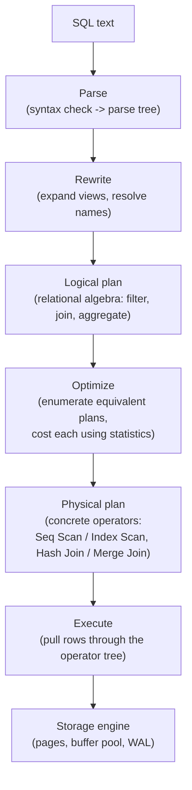

# Query Planning and Optimization

*Every mechanism covered so far in L2 was physical machinery a database *could* use to answer a query - this is the component that decides which pieces to actually use, and in what order.*

`⏱️ ~8 min · 11 of 13 · Storage and Relational Databases`

> [!TIP] The gist
> SQL only says *what* you want, not *how* to get it. The **query planner (optimizer)** searches every logically equivalent way to compute that result - different scans, different join algorithms, different orders - estimates a cost for each using table statistics, and picks the cheapest one. Get the statistics wrong and the optimizer confidently picks a terrible plan without changing a single line of your SQL.

## Contents

- [Intuition](#intuition)
- [The concept](#the-concept)
- [How it works](#how-it-works)
- [Worked example: same table, same index, opposite choice](#worked-example-same-table-same-index-opposite-choice)
- [Reading a real plan](#reading-a-real-plan)
- [In the real world](#in-the-real-world)
- [Trade-offs](#trade-offs)
- [Remember](#remember)
- [Check yourself](#check-yourself)

## Intuition

Imagine asking a taxi driver "get me to the airport." You didn't say which route. A good driver checks current traffic (statistics), compares a few routes (candidate plans), and picks the fastest one *right now* - not the route that was fastest last week.

A bad driver either always takes the same route regardless of traffic (a rule-based approach) or has stale traffic data and picks a route that's actually jammed (a cost-based approach working from bad statistics). The query planner is that driver, deciding fresh for every query.

## The concept

**SQL is declarative**: it states the desired result (`SELECT name FROM users WHERE country = 'IN'`), not the steps to produce it. Because there's almost always more than one **semantically equivalent** way to get that result - scan everything and filter, or jump straight to matches via an index; join by nested loop, hash table, or merge - all of which return identical rows but at wildly different costs, something has to choose among them.

**The query planner (optimizer)** is that component. It searches the space of equivalent plans, assigns each a numeric estimated **cost** from table/index statistics, and keeps the cheapest one it finds. This is only possible - and only necessary - *because* SQL is declarative; an imperative loop already commits to one execution strategy, so there'd be nothing left to choose between.

Two core terms underpin everything that follows:

- **Cardinality** - how many rows a step is expected to produce. The single most consequential number in the whole model, because it feeds into every cost estimate above it.
- **Selectivity** - the fraction of a table's rows a predicate matches (`estimated_rows = total_rows × selectivity`). Selectivity is what decides which scan or join strategy wins.

## How it works

**1. The pipeline: SQL text to executable plan.**



The logical plan says *what* (a join, a filter); the optimizer decides *how* by picking a physical operator for each logical step. `EXPLAIN` shows you the physical plan - the tree that actually runs.

**2. Rule-based vs cost-based optimization.**

- **Rule-based (RBO)** - fixed heuristics like "always use an index if one exists." Cheap and predictable, but provably wrong when the data doesn't match the assumption - a rule that's great at 0.1% selectivity is terrible at 60%.
- **Cost-based (CBO)** - every candidate plan gets a numeric cost from real statistics, and the cheapest wins. Every mainstream engine (PostgreSQL, MySQL, SQL Server, modern Oracle) does this today - it adapts to the actual data instead of guessing with a static rule.

CBO's weakness mirrors RBO's strength: it's only as good as its statistics. Stale or wrong statistics can make a cost-based optimizer confidently pick a bad plan.

**3. Where the cost comes from: statistics and selectivity.**

The optimizer doesn't inspect your data live (that would defeat the purpose - decide *before* paying execution cost). Instead it consults pre-collected statistics per column:

- **Most-common-values list** - exact frequencies for the top N values (captures skew precisely).
- **Histogram** - equi-depth buckets for everything else, so range predicates can be estimated.
- **Null fraction / distinct count** - for `IS NULL` and equality on values outside the MCV list.
- **Correlation** - how closely physical row order matches value order (affects how "clustered" an index scan's heap fetches will be).

For a single predicate, selectivity comes straight from these. For `AND`-ed predicates, the default assumption is **independence** - multiply selectivities together - which is exactly right for unrelated columns and badly wrong for correlated ones (e.g. `city = 'Mumbai' AND country = 'IN'` badly *underestimates*, since almost every Mumbai row is already an India row).

Statistics also **go stale**: they're refreshed only after a configurable fraction of rows change (PostgreSQL's `autovacuum_analyze_scale_factor`, default 0.1, i.e. roughly 10%). A table just bulk-loaded, or one whose value distribution has drifted, can leave the optimizer working from an outdated picture.

**4. Picking access paths and join algorithms.**

For a single table, common choices are a **sequential scan** (read everything), an **index scan** (traverse the index, fetch matching heap pages - often random I/O), an **index-only scan** (skip the heap entirely if the index covers every needed column), or a **bitmap scan** (build a bitmap of matching pages, then fetch them in sorted physical order - a middle ground for a moderate number of matches).

For joins between two tables:

| Algorithm | Best suited for |
| --- | --- |
| **Nested loop** | Small outer relation, especially with an index on the inner join column |
| **Hash join** | Large, unsorted equi-joins with no useful index |
| **Merge join** | Both sides already sorted, or the result needs sorting anyway |

For joins across many tables, the number of possible orderings grows factorially (`N!` for left-deep trees alone - 8 tables already means 40,320 orderings). Since finding the truly optimal order is NP-hard, engines either use **dynamic programming** (memoize the cheapest plan per subset of tables - tractable up to a dozen or so tables) or switch to **heuristic search** (e.g. PostgreSQL's genetic algorithm, GEQO) once the table count crosses a threshold.

Before any of this, the optimizer also applies **logical rewrites** that don't change the result but reduce downstream work: **predicate pushdown** (filter as early as possible), **projection pushdown** (carry only needed columns), and **subquery flattening** (turn a correlated subquery into a join the optimizer can reorder freely).

## Worked example: same table, same index, opposite choice

Table `orders` has 100,000,000 rows on 2,500,000 pages. An index exists on `status`. Sequential-scan cost is fixed at **3,500,000 cost units** regardless of the query (it always reads every page).

**Query A** - `WHERE status = 'refunded'`, 0.1% selectivity → 100,000 matching rows:

```
index descent + heap fetches (worst case, one page per row)
  ~ 100,000 rows x random_page_cost(4.0) + small CPU cost
  ~ 401,516 cost units
```

Index scan (~401,516) beats sequential scan (3,500,000) by ~8.7x - **optimizer picks the index.**

**Query B** - `WHERE status = 'shipped'`, 90% selectivity → 90,000,000 matching rows:

```
heap fetches are capped by total pages (2,500,000), not matching rows,
since at 90% selectivity virtually every page has a match anyway
  ~ 2,500,000 x random_page_cost(4.0) + CPU cost for 90M rows
  ~ 11,350,000 cost units
```

Sequential scan (3,500,000) beats the index path (~11,350,000) by ~3.2x - **optimizer picks the sequential scan**, even though the same index exists and is usable.

Same table, same index, same query shape - the optimizer flips its decision purely because the estimated selectivity changed. This is exactly why "always use the index if one exists" (a rule-based heuristic) is unsound, and why stale statistics that mis-estimate this selectivity can silently flip the choice without anyone touching the SQL.

## Reading a real plan

- **`EXPLAIN`** shows the estimated plan without running the query - safe on anything, including destructive statements.
- **`EXPLAIN ANALYZE`** actually executes the query and shows estimated vs. **actual** rows and time at every node - the single most useful diagnostic for performance, because it exposes exactly where the optimizer's model diverged from reality.

A large gap between estimated and actual row counts at any node is the fingerprint of stale or wrong statistics - and it compounds upward, since a bad estimate at one scan feeds a bad join-algorithm choice above it.

## In the real world

- **CockroachDB** ran a rule-based/heuristic planner through v2.0 and found the rule set itself became the bottleneck - every new rule had to be checked against every rule already in place. Starting with v2.1 they rebuilt a genuine cost-based optimizer around a "memo" data structure (a compact forest of equivalent plan trees) plus 160+ transformation rules, driven by real table statistics. Source: [Cockroach Labs - How we built a cost-based SQL optimizer](https://www.cockroachlabs.com/blog/building-cost-based-sql-optimizer/).
- **Citus (Postgres)** documented a concrete numeric case of the independence-assumption blind spot: on a 10-million-row table where one column was functionally derived from another, Postgres's default statistics multiplied selectivities independently and estimated 100 rows when the real answer was 10,000 - a 100x underestimate that pushed the optimizer into a slower disk-based sort instead of a hash aggregation, roughly doubling runtime. `CREATE STATISTICS` (extended stats) fixed it. Source: [Citus Data - The Postgres 10 feature you didn't know about](https://www.citusdata.com/blog/2018/03/06/postgres-planner-and-its-usage-of-statistics/).
- **pganalyze** documented a customer case where the planner estimated 2 million matching rows on a generic `IS NOT NULL` filter when only 42 actually matched, driving a 20-second query. Rewriting the query (rather than reaching for a query hint) cut it to ~100ms - a ~200x improvement. Source: [pganalyze - 5mins of Postgres E1](https://pganalyze.com/blog/5mins-postgres-statistics-bad-query-plans-pghintplan).
- A fintech- or UPI-specific query-optimizer war story was searched for but not found - this is a single-node planner topic where that angle doesn't naturally fit, and no genuine source surfaced, so it's flagged rather than forced.

## Trade-offs

| Approach | Strength | Weakness |
| --- | --- | --- |
| Rule-based optimization | Cheap, fully predictable | Provably wrong once data doesn't match the assumed shape |
| Cost-based optimization | Adapts to real data distribution | Only as good as its statistics and cost model |
| Query hints (force a plan) | Fixes a provably-wrong plan fast | Freezes a decision that can become wrong as data grows; masks the real problem; accumulates maintenance debt |
| Fixing statistics/schema first | Self-correcting, benefits every query on the table | Requires diagnosing *why* the plan is wrong, not just forcing a fix |

> [!IMPORTANT] Remember
> The optimizer's entire decision rests on estimated selectivity from statistics - not on your data as it actually is right now. When a query "usually runs fine and occasionally runs catastrophically slowly," suspect a cardinality misestimate before suspecting anything else, and check with `EXPLAIN ANALYZE` (estimated vs. actual rows) before reaching for a hint.

## Check yourself

- Using the worked example's numbers, explain why "always prefer an index scan when one exists" is unsound as a fixed rule.
- You run `EXPLAIN ANALYZE` and see `rows=200` estimated but `rows=850,000` actual at a nested loop join's outer side. What likely went wrong, and what join algorithm would probably have been chosen if the estimate had been accurate?
- A table was just bulk-loaded with 50 million rows and `autovacuum` hasn't run `ANALYZE` yet. What kind of plan might the optimizer wrongly pick in that window, and why?

---

→ Next: Connection pooling
↩ Comes back in: L3, L4/L12, L15
