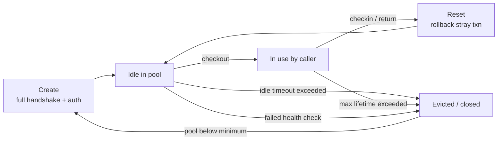
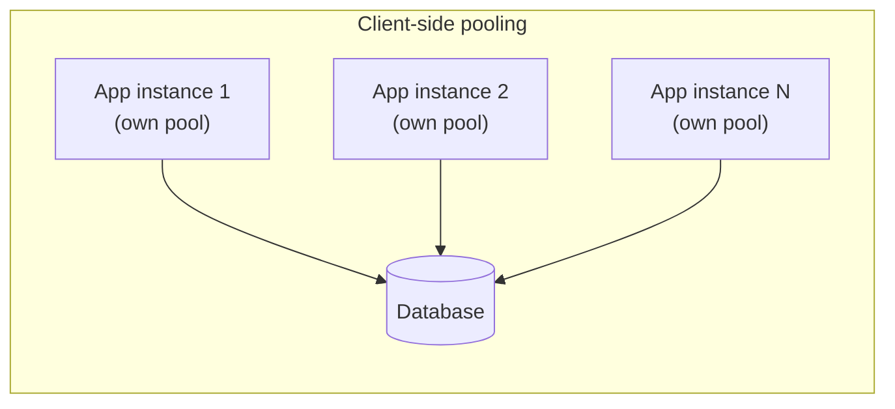
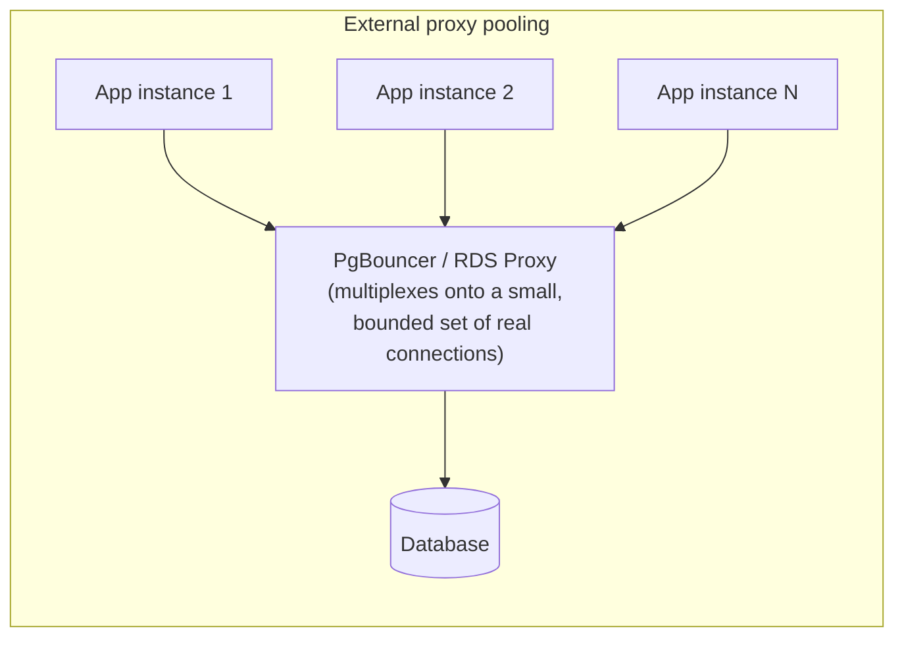

# Connection Pooling

*Every earlier L2 topic quietly assumed a connection to the database already existed - this is the layer underneath that assumption.*

`⏱️ ~8 min · 12 of 13 · Storage and Relational Databases`

> [!TIP] The gist
> Opening a database connection is expensive - a network handshake, an encryption handshake, a login handshake, and (in PostgreSQL's case) forking a whole new OS process on the server. Do that per request and the overhead of *connecting* dwarfs the cost of the query itself. A **connection pool** keeps a set of already-open connections around and hands them out on demand, so that cost is paid once per connection's lifetime instead of once per request.

## Contents

- [Intuition](#intuition)
- [The concept](#the-concept)
- [How it works](#how-it-works)
- [Worked example: sizing a pool for a real deployment](#worked-example-sizing-a-pool-for-a-real-deployment)
- [In the real world](#in-the-real-world)
- [Trade-offs](#trade-offs)
- [Remember](#remember)
- [Check yourself](#check-yourself)

## Intuition

A database connection is like an international phone call: before either side can say a word, both ends have to dial, verify who they're talking to, and establish a private line. That setup takes real time and effort, on both ends.

A connection pool is a bank of lines that are already dialed, verified, and sitting on hold. You grab whichever free line is available, say what you need, hang up the *conversation* but not the line itself, and it's instantly ready for the next caller. Nobody redials from scratch for every single sentence.

## The concept

**A connection pool is a managed set of already-established, already-authenticated database connections that are held open and handed out to callers on demand, then returned to the pool - rather than closed - so the next caller reuses the same open connection instead of paying the full setup cost again.**

That setup cost is real and multi-step, and it's what the pool exists to amortize:

1. **TCP handshake** - roughly one network round-trip before any data can flow.
2. **TLS handshake** (almost every production connection is encrypted) - roughly one to two more round-trips.
3. **Database login/auth handshake** - the wire protocol's own challenge-response exchange (e.g. PostgreSQL's SCRAM-SHA-256), plus password-hashing CPU work.
4. **Server-side allocation** - PostgreSQL literally `fork()`s a dedicated OS process per connection; MySQL/InnoDB spins up a dedicated thread. Either way, real memory and scheduler overhead, not a free handle.

None of these four steps is huge alone - a fresh connection might come up in single-digit to double-digit milliseconds - but paying all four **per request**, at hundreds or thousands of requests per second, means the database spends more effort standing up and tearing down connections than answering queries. That's the concrete reason "open a connection, run one query, close it" collapses under real load, independent of anything about the query itself.

## How it works

**1. A connection's life inside a pool.**

Once a physical connection exists, it cycles through a small set of states every time it's reused:



Two details matter beyond the obvious loop: pools **validate on borrow** (a quick `SELECT 1` before handing a connection out, to catch one that's silently died), and they retire connections after a **max lifetime** even if nothing's wrong with them - partly to avoid every connection expiring at the exact same instant (a self-inflicted reconnect storm).

**2. Pool exhaustion is backpressure, not a crash.**

Every pool has a **minimum size** (kept warm so a burst of traffic doesn't pay handshake cost on the hot path) and a **maximum size** (a hard ceiling protecting the database from one app instance opening unlimited connections). When every connection is checked out and a new request arrives, the caller **queues** up to a configurable timeout rather than being rejected instantly or the pool growing without bound - graceful backpressure, at the cost of added latency for whoever's waiting.

**3. Client-side pools vs. an external proxy.**

Pooling happens at one of two structurally different points:





**Client-side / in-process pools** (HikariCP for Java, Go's `database/sql`, SQLAlchemy's `QueuePool`, `pg-pool` for Node) live inside the app - simple, no extra hop, but every instance's pool is invisible to every other instance's.

**External / proxy pools** (PgBouncer, ProxySQL, AWS RDS Proxy) sit between the app and the database as a shared chokepoint, multiplexing many logical client connections onto a small, bounded set of real backend connections. The mode that makes this work is **transaction pooling** - a real connection is handed to a client only for the duration of one transaction, then returned to the shared pool for someone else's next transaction. The trade-off: features tied to a persistent session (prepared statements, `SET` session variables, advisory locks, `LISTEN`/`NOTIFY`, temp tables) can silently break, because two statements from the same client might land on two *different* physical connections.

**4. Sizing: the database's concurrency, not the app's thread count.**

A widely-cited starting heuristic (popularized by HikariCP) is:

```
connections ≈ (core_count × 2) + effective_spindle_count
```

The idea: once every CPU core on the database server has an active query, more concurrently-active connections don't do more useful work in parallel - they just add contention while queries wait behind each other anyway. It's cheaper to make that wait happen *in the pool* than inside the database itself. But this formula sizes **one** instance - and that's exactly where the next problem starts.

**A pool size that's sensible per instance stops being sensible once the app is horizontally scaled**, because client-side pool sizes are per-instance while `max_connections` is per-database-server, shared across every instance. Ten replicas each opening 20 connections is 200 physical connections demanded - and an autoscaler adding more replicas right when the database is already under load makes it worse exactly when it matters most. An external proxy is the structural fix: every replica connects *through* it, so it's the one place that can see and bound the *total* demand, no matter how many replicas exist upstream.

## Worked example: sizing a pool for a real deployment

A service runs **10 application replicas** against a PostgreSQL database with `max_connections = 200` (raised from the default 100) on an **8-core**, all-SSD machine.

**Step 1 - per-instance size from the heuristic:**

```
connections per instance = (core_count x 2) + spindle_count
                         = (8 x 2) + 0     (SSD, so spindle term ~0)
                         = 16
```

**Step 2 - the multiplication problem, made concrete:**

```
total demanded = 10 replicas x 16 = 160        (fits under 200, barely)

...but autoscale to 20 replicas under load:
total demanded = 20 replicas x 16 = 320        (blows past 200)
```

At 10 replicas it just barely fits, with only 40 connections of headroom for migrations or admin tools. At 20 replicas - which is exactly when the database is *also* under the most load - the naive per-instance sizing has no mechanism to notice the sum across replicas exceeded the ceiling, and the database starts rejecting connections outright.

**Step 3 - the fix:** place PgBouncer in front of the database in transaction pooling mode, configured with a bounded backend pool of, say, **40 real connections to Postgres**. Every replica can still keep its own client-side pool for low-latency local reuse, but all of that logical connection demand gets multiplexed onto PgBouncer's fixed 40 - comfortably under 200 whether there are 10 replicas or 50. Replica count can now scale up or down without ever renegotiating the database's connection budget.

## In the real world

- **Figma outgrew PgBouncer and built its own pooler.** Running PgBouncer in front of its sharded Postgres fleet, Figma hit PgBouncer's own architectural ceilings: single-threaded design capping vertical scaling, no way to prioritize critical traffic over background jobs during overload, and no protection against reconnection storms re-overwhelming the database during incident recovery. Their replacement, "PGKeeper" (multi-threaded, Go-based, with priority admission control and rate-limited connect/disconnect), reportedly prevented 20+ incidents in a single quarter while holding a 99.99% database SLO. Source: [Figma - PGKeeper: Building the Bouncer We Needed for Postgres](https://www.figma.com/blog/pgkeeper-building-the-bouncer-we-needed-for-postgres/).
- **Notion hit the same multiplication problem one layer up.** While re-sharding Postgres from 32 to 96 logical databases, Notion had ~100 PgBouncer instances each opening up to 6 connections per shard. Naively mapping 96 new shards onto the same physical databases during migration would have tripled per-shard connection demand, risking saturating the database - the exact multiplication problem this lesson covers, just between the pooler fleet and the database instead of between app replicas and one pooler. Their fix: split one large PgBouncer cluster into four smaller ones, capping connection growth and shrinking blast radius. Source: [Notion - The Great Re-shard](https://www.notion.com/blog/the-great-re-shard).
- **Neon runs transaction-mode PgBouncer in front of every database by default.** Neon's serverless Postgres accepts up to 10,000 client connections while sizing the real backend pool at roughly 90% of `max_connections` - the standard fix for serverless/edge workloads (Lambda-style functions, edge workers) that would otherwise each open a fresh, short-lived connection and exhaust Postgres's connection ceiling under concurrent invocations. True to the mode's trade-offs, Neon tells users to use a separate, unpooled connection string for migrations and other session-dependent work. Source: [Neon Docs - Connection pooling](https://neon.com/docs/connect/connection-pooling).

## Trade-offs

| | Client-side / in-process pool | External / proxy pool (PgBouncer, RDS Proxy) |
| --- | --- | --- |
| **Extra network hop** | None | Yes - typically sub-millisecond, but real |
| **Multiplexing across instances** | None - scales linearly with replica count | Yes - many logical connections onto a bounded backend set |
| **Operational footprint** | Zero extra infrastructure | Another service to deploy, monitor, and keep highly available |
| **Session-scoped features** (prepared statements, `LISTEN`/`NOTIFY`, advisory locks) | Fully supported | Break or need special handling under transaction/statement pooling |
| **Fit for serverless/FaaS** | Poor - no persistent process to hold the pool | Good - the standard fix |
| **Who bounds total DB connections** | Nobody, structurally | The proxy itself, by construction |

> [!IMPORTANT] Remember
> A connection is a real, expensive-to-create resource - handshakes plus a dedicated OS process or thread on the server - not a free handle. Pooling amortizes that cost, but a pool sized sensibly per instance can still blow past the database's connection ceiling the moment you add more instances; an external proxy is what lets the total stay bounded no matter how many replicas exist upstream.

## Check yourself

- Walk through the four costs paid when opening a brand-new connection, and explain why PostgreSQL's one-process-per-connection model makes the last one qualitatively different from MySQL's thread-per-connection model.
- A pool sized at 16 connections per instance works fine at 10 replicas but starts failing once an autoscaler adds more during a traffic spike. What's happening, and why does adding an external pooler fix it structurally rather than just by picking a smaller number?
- Why does transaction pooling mode break `LISTEN`/`NOTIFY` and session-level advisory locks, but not an ordinary `BEGIN ... UPDATE ... COMMIT` transaction?
- Why does client-side, in-process connection pooling provide little benefit in a high-concurrency serverless (Lambda-style) deployment, and what's typically added to fix it?

---

→ Next: OLTP vs OLAP
↩ Comes back in: L12 (Scalability and Performance Patterns), L14 (Cloud and Serverless)
