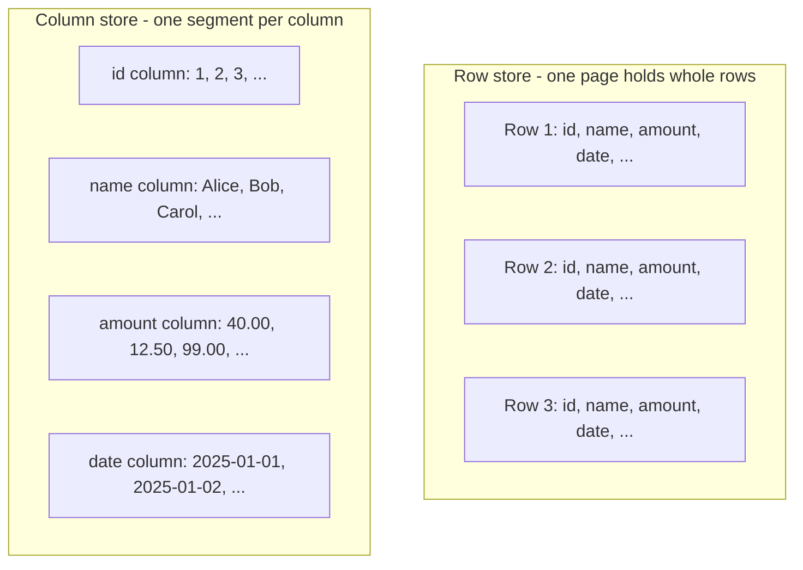
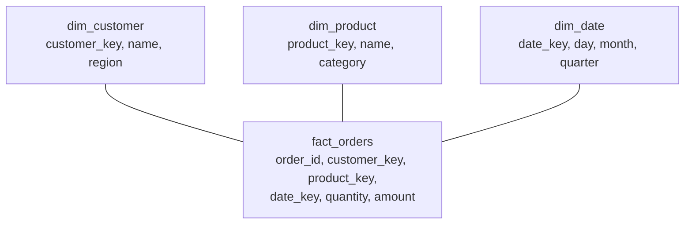

# OLTP vs OLAP

*Every prior L2 topic was quietly describing one shape of workload - this lesson names it, contrasts it with the opposite shape, and shows why that difference in shape forces different answers to nearly every design question this level has raised.*

`⏱️ ~8 min · 13 of 13 · Storage and Relational Databases`

> [!TIP] The gist
> **OLTP** (Online Transaction Processing) is many small, concurrent reads/writes against the live, current state of the business - "what's this customer's balance right now." **OLAP** (Online Analytical Processing) is fewer, much larger queries that scan and aggregate huge volumes of historical data - "what was total revenue by region, last two years." Different workload shapes force different physical designs: row-oriented storage and normalized schemas for OLTP, column-oriented storage and star schemas for OLAP - the same L2 primitives (pages, indexes, engines), recombined for the opposite job.

## Contents

- [Intuition](#intuition)
- [The concept](#the-concept)
- [How it works](#how-it-works)
- [Worked example: one query, row store vs column store](#worked-example-one-query-row-store-vs-column-store)
- [In the real world](#in-the-real-world)
- [Trade-offs](#trade-offs)
- [Remember](#remember)
- [Check yourself](#check-yourself)

## Intuition

Think of a bank teller counter versus a bank's year-end auditor.

The teller handles one customer at a time, fast: check this account, update that balance, next customer - hundreds of times an hour, every transaction correctness-critical, always against *today's* numbers.

The auditor doesn't care about any single customer's transaction. They pull a whole year of records at once and ask "what was our total interest paid, by branch, by quarter?" One query touches millions of rows, but the auditor only actually needs two or three columns out of every wide customer record - and they're fine if the data is a day old.

Same bank, two completely different jobs - and a filing system built for the teller's counter (quick access to one whole customer folder) is a terrible fit for the auditor's job (scan every folder's interest-paid column), and vice versa.

## The concept

**OLTP (Online Transaction Processing)** is a database workload of **many concurrent, short-lived transactions, each reading or writing a small amount of data, against the current, authoritative state of the business.** This is the workload every earlier L2 topic was built around: [ACID](04-acid.md) guarantees, [MVCC](06-mvcc.md) snapshots, [row/gap locking](07-locking.md), B-tree/LSM [indexes](08-indexing.md), and the [write-ahead log](09-write-ahead-log.md) all exist to make many small, concurrent, correctness-sensitive transactions against shared mutable state both fast and safe.

**OLAP (Online Analytical Processing)** is a database workload of **fewer, much larger queries that scan and aggregate over large volumes of historical or derived data** - "total revenue by region, by month, for two years." OLAP queries typically touch millions to billions of rows and reduce that volume down to a small result, rather than pinpointing one row.

The core distinction is **workload shape**, and everything else below follows from it:

| | OLTP | OLAP |
| --- | --- | --- |
| Query count | Very high (thousands-millions/sec) | Low (seconds-minutes apart, or scheduled) |
| Rows touched per query | A handful | Millions to billions |
| Columns touched per query | Usually the whole row | Usually a small subset of a wide table |
| Operation type | Point lookup, small range scan, single-row write | Full/partial scan, `SUM`/`COUNT`/`GROUP BY`, joins |
| Data currency | Current, live, single source of truth | Historical/derived copy, often minutes-hours behind |
| Concurrency shape | Many concurrent writers and readers | Mostly read-only; writes arrive in bulk |

Note that "historical or derived data" is doing real work in OLAP's definition: an OLAP system is very often *not* the system of record - it's a reshaped copy of data that originated in one or more OLTP systems.

## How it works

**1. One access-pattern difference cascades into every physical decision.**

OLTP needs to find and mutate a small number of specific *rows*, cheaply, over and over, concurrently, correctly. OLAP needs to read a small number of specific *columns* across a huge number of rows, as fast as raw I/O and CPU throughput allow, and rarely mutates anything at query time. That single difference forces different answers on storage layout, indexing, schema shape, and engine design - covered next.

**2. Storage layout: row-oriented vs column-oriented.**

A **row store** lays data out one full row at a time - all of a row's columns physically adjacent in a page. Fetching one whole record (OLTP's shape) costs about one page read, because everything needed is already sitting together.

A **column store** lays data out one column at a time - every value of a given column, across all rows, stored contiguously in its own segment. Fetching one column across many rows (OLAP's shape) is now a cheap sequential read of exactly that data and nothing else; fetching one whole row becomes expensive, since its values are scattered across every column's segment.



Running the "wrong" layout against a workload means paying for I/O it didn't ask for: a row store aggregating one column still reads every other column sitting in the same page; a column store fetching one full record has to stitch it back together across every column segment.

Column layout also unlocks three further speedups that compound: **compression** (a column of one type/narrow value range compresses far better than a mixed row - dictionary encoding, run-length encoding, delta encoding, bit-packing), **data skipping via zone maps** (per-block min/max metadata lets the engine skip whole blocks that can't match a filter, with no row-level index needed), and **vectorized execution** (processing a batch of ~1,000-4,000 values from one column in one tight, SIMD-friendly loop, instead of one row at a time).

**3. Schema shape: normalized OLTP vs star schema OLAP.**

OLTP [normalizes](02-normalization-forms.md) to eliminate update anomalies on frequent small writes - a customer's address lives in one row, referenced by foreign key everywhere else.

OLAP commonly uses a **star schema**: one large **fact table** (one row per business event - an order, a page view - mostly foreign keys plus numeric measures like quantity or amount) surrounded by small **dimension tables** holding descriptive, mostly-static attributes (`dim_customer`, `dim_product`, `dim_date`).



Dimension tables stay small and rarely change, so normalization's anomaly-avoidance benefit there is minor - while avoiding joins at query time (a billion-row fact table against a handful of small dimensions - the "star join" most analytical engines specifically optimize for) is large. A **snowflake schema** further normalizes dimension tables, trading some storage back for extra joins.

**4. Engine design and getting data from OLTP to OLAP.**

[B-tree and LSM-tree engines](10-storage-engines.md) are both write-optimized, row-oriented designs built around individual rows being inserted/updated/looked-up constantly. Column stores are a third, scan-optimized family: writes arrive in large, infrequent batches, so storage organizes around large, immutable, sorted column segments - which makes a single point update expensive (rewriting compressed segments), the mechanical reason a column store is a poor OLTP engine.

Since OLAP data usually isn't the live system of record, something moves it there: **ETL** transforms data before loading it; **ELT** loads raw data first and transforms it using the (typically abundant, elastic, columnar) destination compute; **CDC** (change data capture) tails the OLTP database's own [write-ahead log/binlog](09-write-ahead-log.md) to stream every committed change continuously, shrinking the OLTP-to-OLAP freshness gap from hours down to seconds.

## Worked example: one query, row store vs column store

A 20-column `orders` table holds **100 million rows**, average row width **200 bytes** (~20 GB raw). The query only needs two columns:

```
SELECT SUM(amount) FROM orders WHERE order_date >= '2025-06-01';
```

**Row store (full table scan, no covering index):**

```
bytes read = 100,000,000 rows x 200 bytes/row = 20,000,000,000 bytes  (~20 GB)
```

Every one of the 20 columns is read for every row, because a row store's pages hold whole rows - there's no way to read just `amount` and `order_date` without also reading the other 18 columns packed into the same page.

**Column store, same query:**

```
amount column:     100,000,000 x 8 bytes (double) = 800,000,000 bytes  (~800 MB)
order_date column: 100,000,000 x 4 bytes (date)    = 400,000,000 bytes (~400 MB)
raw bytes touched (2 of 20 columns only)           = ~1.2 GB
```

Already roughly **17x less data read**, purely from skipping the 18 untouched columns. Layer on compression (a realistic 2-4x further reduction on well-suited columns) and zone-map skipping (whole blocks whose `order_date` max falls before the filter can be skipped without decompressing them), and actual bytes read land somewhere in the **300 MB-600 MB** range.

Net effect: a query reading ~20 GB in a row store reads a few hundred MB to low GB in a column store for the identical result - one to two orders of magnitude difference, before even counting vectorized execution's throughput advantage on top. This is the concrete, mechanical reason "just run analytics against the production database" scales poorly, and why OLAP exists as a physically different engine rather than "the same database, bigger box."

## In the real world

- **Stripe (fintech) - closing the freshness gap with streaming, not batch.** Stripe Billing's original analytics gave dashboards a 24-hour lag from batch recomputation. Its rebuild uses **Apache Flink** consuming a stream of subscription/invoice change events to incrementally maintain state (with **Apache Spark** used once to backfill history), feeding an **Apache Pinot** OLAP store. Result: most updates visible in under a minute, dashboard queries return in under 300ms - CDC-style ingestion plus a purpose-built real-time OLAP engine replacing nightly batch ETL. Source: [Stripe - Real-time analytics for Stripe Billing](https://stripe.dev/blog/how-we-built-it-real-time-analytics-for-stripe-billing).
- **Uber - OLTP MySQL fleet + separate OLAP warehouse, connected by CDC.** Uber's OLTP layer is 2,300+ (`verify`, self-reported) independent MySQL clusters serving live traffic; row-level changes are captured off each cluster's binlog by an in-house tool (Storagetapper), streamed through Kafka, and landed in Hive for analytics. Uber's own writeup traces the OLAP side evolving from ad hoc queries against scattered OLTP databases, to a dedicated **Vertica** columnar warehouse, to a Hadoop-based lake serving 100+ petabytes through Presto/Spark/Hive - entirely isolated from the OLTP clusters. Sources: [MySQL at Uber](https://www.uber.com/en/blog/mysql-at-uber/), [Uber's Big Data Platform](https://www.uber.com/us/en/blog/uber-big-data-platform/).
- **The Postgres + ClickHouse pattern as today's de facto default.** ClickHouse frames the industry's converged pattern as a transactional store (commonly Postgres) paired with a columnar OLAP engine, synchronized by CDC, with replication latency down to roughly 10 seconds (from hours-long batch windows). Named customers include Ashby (Postgres read replicas to ClickHouse via CDC, moving analytics from minutes to under a second) and Syntage (CDC-migrated a 30 TB Aurora Postgres database). Source: [ClickHouse - Unifying OLTP and OLAP](https://clickhouse.com/resources/engineering/unifying-oltp-and-olap) (vendor-published; included as a third, differently-sourced perspective).
- **On UPI/NPCI:** no first-party NPCI engineering source describing an explicit OLTP-vs-OLAP split was found. A secondary write-up describes NPCI's fraud-detection platform running transactional Kafka streams alongside parallel stream/batch analytics into object storage - figures like 240,000 requests/sec and 24 billion transactions/month are flagged `verify` since the source is third-party, not NPCI's own documentation.

## Trade-offs

| | OLTP | OLAP |
| --- | --- | --- |
| **Consistency needs** | Strong - full ACID, MVCC/locking to serialize many concurrent writers | Looser - single-writer bulk loads; freshness matters more than serializability |
| **Query pattern** | Point lookups, small range scans, single-row writes | Full/partial scans, `GROUP BY`, fact-vs-dimension joins |
| **Latency target** | Milliseconds, at very high query rates | Seconds-minutes, at low query rates |
| **Storage layout** | Row-oriented (heap/B-tree/LSM) | Column-oriented - per-column locality, compression, zone maps |
| **Schema shape** | Normalized (3NF) | Star/snowflake - denormalized fact + dimension tables |
| **Indexing** | Heavy B-tree/LSM indexes on PK/FK/predicates | Minimal row-level indexing; block-level zone maps instead |
| **Write pattern** | Many small, concurrent, low-latency writes | Infrequent large batch loads (ETL/ELT/CDC-fed) |
| **Scale characteristic** | Read replicas, sharding, connection pooling | MPP scan/compute nodes, partitioning large fact tables |
| **Typical technology** | PostgreSQL, MySQL/InnoDB, Oracle, DynamoDB | Redshift, Snowflake, BigQuery, ClickHouse, Druid, Pinot |

> [!IMPORTANT] Remember
> OLTP and OLAP aren't "one is better" - they're answers to two different questions (find/mutate a few rows fast and safely, vs. scan/aggregate huge volumes of columns fast). Every physical difference - row vs column storage, normalized vs star schema, write-optimized vs scan-optimized engine - is a direct consequence of that one workload-shape difference, and a system tuned for one answers the other badly.

## Check yourself

- A table has 30 columns and a query aggregates just one of them across every row. Explain, in terms of physical page/segment layout, why a row store must read all 30 columns' worth of bytes while a column store reads roughly 1/30th as much - and name two further column-store mechanisms that shrink that further.
- Why does a star schema's fact table get denormalized while its dimension tables stay small and separate, instead of normalizing everything (OLTP-style) or flattening everything into one giant table?
- A column store's writes typically arrive as large, infrequent batches rather than continuous single-row writes. Why does this make column stores a poor fit for OLTP's point-update workload?
- Explain the difference between ETL and ELT in terms of *where* the transform step's compute happens, and why CDC closes the OLTP-to-OLAP freshness gap further than either.

---

→ Next: Caching layers and strategies (L3. Caching and Data Access)
↩ Comes back in: L4 (real-time OLAP, NoSQL & data at scale), L11 (data pipelines / lakehouse), L13 (real-time analytics)
