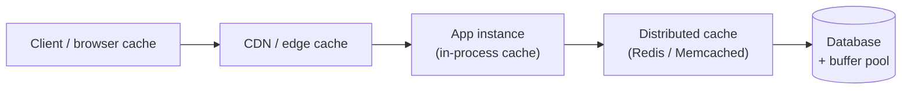
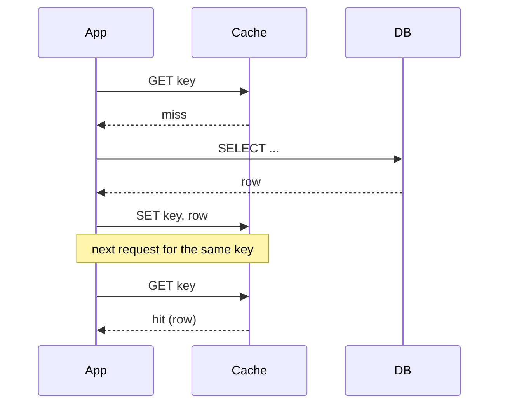
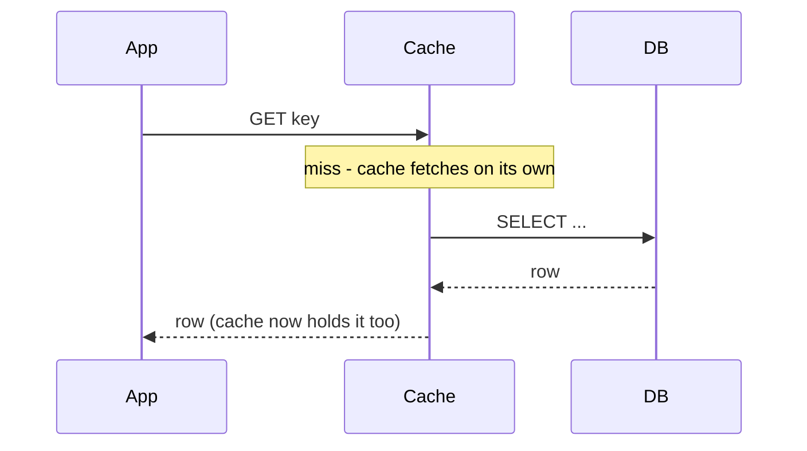
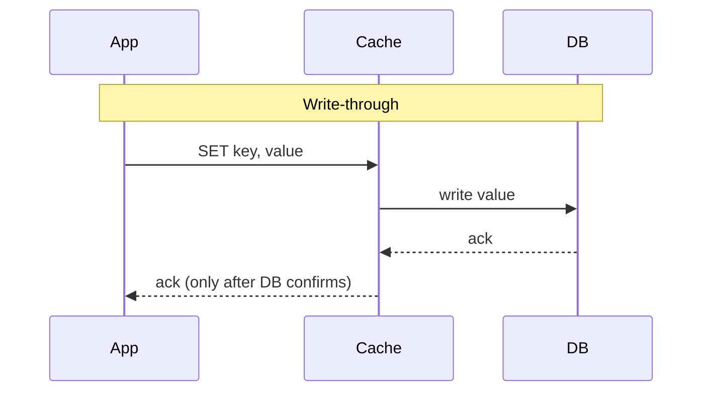
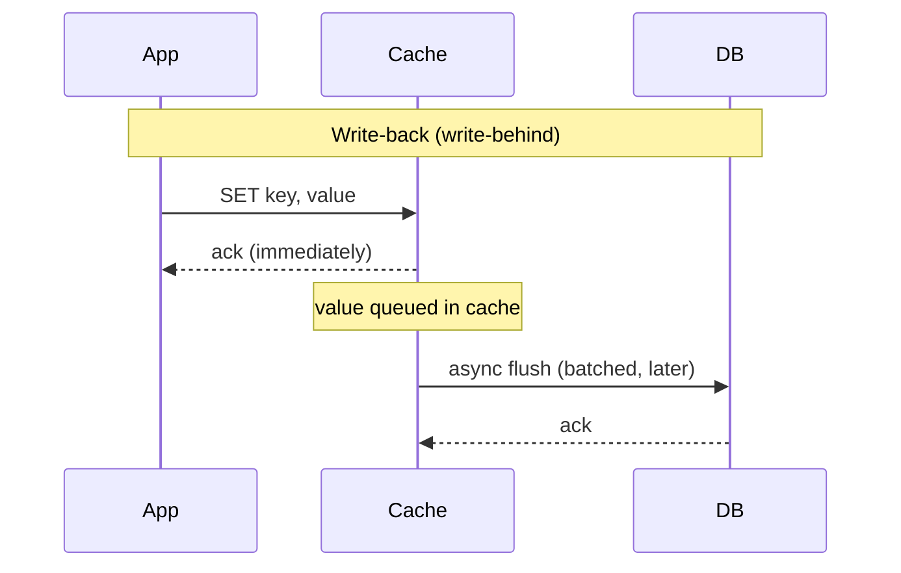

# Caching Layers and Strategies

*Making the fast path fast: where you park a copy of the data, and who's responsible for keeping that copy honest.*

`⏱️ ~8 min · 1 of 8 · L3`

> [!TIP] The gist
> A cache is a small, fast copy of data sitting closer to where it's needed, so most requests never touch the slow source of truth. The engineering isn't "add a cache" — it's **where** you put it (client, CDN, app process, distributed store, database) and **who keeps the cache and the source of truth in sync, and when**: cache-aside, read-through, write-through, or write-back.

## Intuition

Think of a cook's kitchen counter versus the pantry down the hall.

Salt, oil, and the knives you use every five minutes live on the counter — fast to grab, but small, and it goes stale or runs out. Everything else lives in the pantry: complete, authoritative, but a walk away.

The four caching strategies are really just answers to one question: **when the counter runs low, who restocks it, and when does the pantry get told about changes?** Do you (the cook) notice it's empty and walk over yourself? Does an assistant hand you what you need, quietly fetching it if it's not already out? Do you update the counter and the pantry in the same motion? Or do you stock the counter now and let someone update the pantry later?

## The concept

A **cache** is a smaller, faster storage layer holding a copy of data from a slower **backing store** (the source of truth — usually a database), used to cut latency and reduce load on that backing store.

Three terms you'll see constantly:

- **Cache hit** — the requested data was found in the cache. Fast path.
- **Cache miss** — the data wasn't in the cache. The system falls back to the backing store (and usually uses the chance to populate the cache for next time).
- **Hit ratio** — `hits / (hits + misses)`. The single most important number for judging whether a cache is earning its keep. A cache with a low hit ratio is adding complexity and a failure mode for little benefit.

### Where a cache can live (the layers)

Caching isn't one thing bolted on in one place — it can sit at almost every hop between a client and the data:

- **Client-side** — browser or mobile app cache; avoids a network round-trip entirely.
- **CDN / edge** — caches at points-of-presence near the user (its own topic later in this level).
- **Application-level (in-process)** — an in-memory map/cache library living inside each app instance. Fastest possible cache (no network hop), but private to that one instance — 50 instances mean 50 separate, possibly-inconsistent copies.
- **Distributed cache** — a shared service (Redis, Memcached) that every app instance talks to over the network. Slower than in-process, but one shared, consistent copy across all instances.
- **Database-level** — the buffer pool / page cache built into the database engine itself (covered in L2's storage engine lesson), plus optional query result caches.

### The four strategies

These describe **who does the work of moving data between cache and backing store, and when** — independent of which layer you're in.

- **Cache-aside (a.k.a. lazy loading, look-aside)** — the application code owns the logic. On a read, the app checks the cache itself; on a miss, the app reads the backing store and writes the result into the cache itself. The cache has zero knowledge of the database — it's just a dumb key-value store the app manages.
- **Read-through** — the cache sits directly in the read path. The application only ever talks to the cache; on a miss, the *cache itself* (not the app) fetches from the backing store and populates. Same net effect as cache-aside, but the population logic lives in the caching layer instead of scattered through application code.
- **Write-through** — every write goes to the cache, and the cache synchronously writes it to the backing store before acknowledging the app. Cache and store are never out of sync, at the cost of write latency (you pay for both writes, every time).
- **Write-back (write-behind)** — the write hits the cache and is acknowledged immediately; the cache asynchronously flushes to the backing store later, often batched. Lowest possible write latency — but if the cache crashes before flushing, that data is gone.

In production these are frequently **mixed**: cache-aside reads paired with a write path that invalidates or updates the cache synchronously (a write-through-*shaped* write bolted onto a cache-aside read) — you'll see exactly this combination in Uber's example below.

## How it works

**1. The layers, top to bottom**

A request typically passes through several of these before it ever reaches disk:

Each hop you can satisfy without going further right is a request that never touches the slowest, most contended layer: the database itself.

**2. Cache-aside — the app does the work**

Nothing happens in the cache unless the app explicitly makes it happen. This is the default, general-purpose choice — simple, and the cache is fully disposable (lose it, and reads just get slower until it warms back up).

**3. Read-through — the cache does the work**

Same outcome as cache-aside, but the app never sees the miss — the caching layer/library hides the backing-store call entirely. Useful when you want that logic out of application code and centralized in one place (a library or sidecar).

**4. Write-through vs. write-back — the write-side trade-off**

Same write, two very different risk profiles: write-through never lets the cache get ahead of the database; write-back lets it get ahead on purpose, trading a real chance of data loss for much lower write latency.

## In the real world

- **Uber — cache-aside reads + synchronous write-invalidation (CacheFront).** Uber's CacheFront layer fronts MySQL (via Docstore) with Redis using textbook cache-aside on reads: the query engine tries Redis first, and on a miss reads the storage engine and writes the row back into Redis. The write side is the interesting part — Uber's storage engine was modified to return the exact row keys it changed, using strictly monotonic transaction timestamps, so the query engine can synchronously invalidate the matching Redis entries as part of the write itself — closing the staleness window a simple "invalidate and hope" delete leaves open. Result: Uber went from ~40M to **over 150M reads/sec** on the same underlying databases, with cache hit rates **above 99.9%** on many tables. ([Uber Engineering Blog](https://www.uber.com/en-IN/blog/how-uber-serves-over-150-million-reads/))
- **Netflix — cache-aside via EVCache, with async cross-region replication.** EVCache (built on Memcached, tens of thousands of instances) is explicit cache-aside: the app checks the cache and, on a miss, fetches from the backing store and populates the cache itself — the library has no built-in knowledge of the database. For its multi-region footprint, a write also publishes key metadata to Kafka, which a Replication Relay uses to asynchronously push the value to other regions' caches — deliberately eventual consistency across regions to keep the local hot path fast. This handles roughly **30M requests/sec** at peak, just under **2 trillion requests/day** globally. ([Netflix Technology Blog](https://netflixtechblog.com/caching-for-a-global-netflix-7bcc457012f1))
- **Stripe — cache-aside-shaped idempotency caching.** Stripe's idempotency-key mechanism follows the same read-repopulate shape, applied to write-safety instead of read latency: a client-supplied idempotency key lets the server correlate a retry with a prior request, and on a retry "the server simply replies with a cached result of the successful operation" instead of re-executing the charge. Populate on first success, serve the cached response on every identical retry after that. (Stripe's post doesn't confirm the backing store or TTL — included here for the strategy pattern, not as confirmation of specific infrastructure.) ([Stripe Engineering Blog](https://stripe.com/blog/idempotency))

## Trade-offs

| Strategy | Read path | Write path | Consistency risk | Data-loss risk | Best for |
|---|---|---|---|---|---|
| Cache-aside | App checks cache; on miss, app reads DB and populates | App writes DB directly, then invalidates/updates cache | Staleness window between DB write and cache update | Low — cache is disposable | Default, general-purpose read-heavy workloads |
| Read-through | App only talks to cache; cache fetches on miss | Usually paired with write-through/cache-aside writes | Same as cache-aside, just centralized in the cache layer | Low | Keeping caching logic out of application code |
| Write-through | Served from cache once populated | Every write hits cache **and** DB before ack | Strong — cache never ahead of DB | Low — DB always has it | Correctness-critical writes needing fresh reads |
| Write-back | Served from cache once populated | Write acked from cache; DB updated async/batched | Cache can be briefly ahead of DB | Higher — crash before flush loses data | Write-heavy paths needing very low write latency |

> [!IMPORTANT] Remember
> Every caching strategy is just an answer to one question: **who keeps the cache and the source of truth in sync, and when do they do it?** Cache-aside and read-through answer that question for reads; write-through and write-back answer it for writes — and production systems almost always mix one of each.

## Check yourself

1. An application has 50 instances behind a load balancer, each with its own in-process cache of the same lookup table. Describe the specific problem this creates that a distributed cache does not have, and name one mechanism that could mitigate it without giving up the in-process cache entirely.
2. A payment API needs to guarantee that once a charge succeeds, a retried request never re-runs it — even if the cache blips right after. Which write strategy fits this requirement, and why would write-back be a risky choice here?

→ Next: eviction policies (LRU, LFU, TTL)
↩ comes back in: L4, L7
