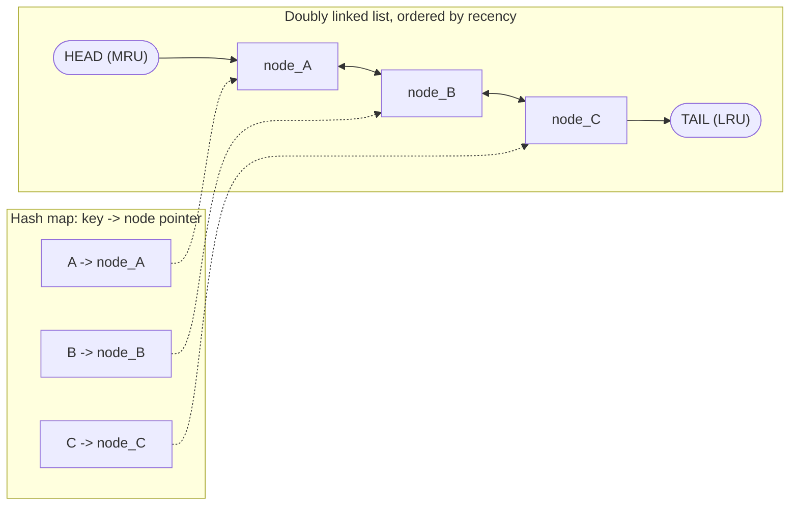
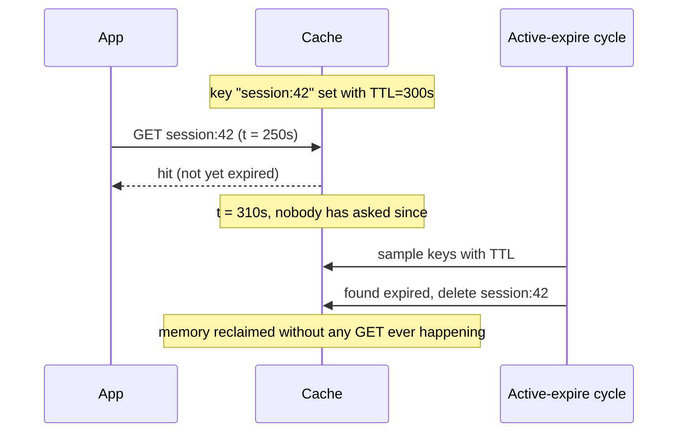

# Cache Eviction Policies

*Every cache in [topic 01](01-caching-layers-strategies.md) is finite — this is the rule that decides who loses their slot when it fills up.*

`⏱️ ~7 min · 2 of 8 · L3`

> [!TIP] The gist
> A cache is smaller than the backing store it fronts, so it fills up and stays full — evicting roughly one entry per new one, forever. **LRU** evicts by recency (longest since last use), **LFU** evicts by frequency (fewest total uses), and **TTL** evicts by an explicit deadline (correctness, not popularity). They aren't three alternatives to pick one of — TTL composes *with* LRU or LFU, answering a different question entirely.

## Intuition

Picture a full nightclub with a strict one-in-one-out door policy. The bouncer needs a rule for who gets asked to leave every time someone new wants in.

One bouncer sends home whoever's been standing quietly by the wall longest without ordering anything — that's **LRU**, judging by *recency*. Another tracks who's ordered the fewest drinks all night and sends *that* person home, no matter how long they've been there — that's **LFU**, judging by *frequency*. And separately, some guests just have a wristband that expires at midnight regardless of how much they've been dancing — that's **TTL**, and it has nothing to do with popularity at all.

## The concept

**Eviction** is removing an existing entry from a full cache to make room for a new one. An **eviction policy** is the rule that decides which entry loses its slot.

This isn't an edge case — it's the *normal steady state*. A cache reaches its memory limit and stays there, evicting continuously, which makes the eviction policy one of the single biggest levers on **hit ratio** (from [topic 01](01-caching-layers-strategies.md)) short of buying more memory.

Every eviction policy is really answering the same question with a different heuristic: **which entry is least likely to be needed again soon?** No policy can know the true future access pattern — that would need an oracle (Belady's optimal algorithm exists only as an offline benchmark to grade real policies against, never as something you can run live). Three real, approximate signals show up everywhere:

- **Recency** — LRU
- **Frequency** — LFU
- **An explicit expiration deadline** — TTL

(One legitimate alternative to picking a policy at all: Redis's actual default, `noeviction`, simply rejects new writes with an out-of-memory error once full, rather than silently dropping anything — a valid choice when losing data silently is worse than a write failing loudly.)

## How it works

**1. LRU — evict whoever's gone longest without being touched**

LRU's trick is combining two structures so both `get` and `put` run in **O(1)**:

- A **hash map** from key → node pointer, for O(1) lookup (but no sense of order).
- A **doubly linked list** ordered by recency — most-recently-used at the head, least-recently-used at the tail — for O(1) reordering *given* a pointer to the node (but no O(1) way to find that node by key alone).

Neither alone gets you O(1) for both operations. Together: the hash map finds the node instantly, and the node's own pointers let the list reorder instantly.

- **`get(key)`**: hash map finds the node → unlink it → re-insert at the head. "Used" always means "move to the front."
- **`put(key, value)`**: if new and the cache is full, evict the **tail** node (least-recently-used) from both structures, then insert the new key at the head.

**Weakness:** a one-time scan over many keys touched exactly once (a batch export, a full-table backup) pushes every one of those cold keys to the head, evicting the genuinely hot working set to make room for data that will never be asked for again. LRU can't tell "just used, about to be used again" apart from "just used, once, forever."

**2. LFU — evict whoever's been used the fewest times, period**

LFU fixes exactly that scan-pollution weakness: a one-time scan touches each key once, so every scanned key sits at the *lowest possible* frequency and gets evicted first — it never displaces the genuinely popular entries sitting at a much higher count.

A production-grade O(1) design keeps a hash map from key → `(value, frequency)`, plus a second hash map from *frequency count* → a linked list of keys currently at that count, plus a tracked minimum-frequency pointer. Eviction pulls from the minimum-frequency list directly — no scanning.

Two catches worth knowing: **ties** are common (many keys can share the lowest count), so real LFU breaks ties with LRU *within* the tied bucket — frequency picks the candidate pool, recency picks within it. And a raw counter never forgets: a key that was viral last month keeps squatting on a high count long after it's gone cold, unless the cache **decays** counts over time (Redis, covered in topic 03, uses a probabilistic 8-bit counter that decays on a schedule for exactly this reason).

**3. TTL — evict by deadline, not by usage**

TTL answers a different question entirely: not "is this still wanted?" but **"is this still correct?"** A session token, a price quote, a rate-limit window — all need to disappear at a specific moment no matter how recently or often they were read.

Two mechanisms usually run together:

- **Lazy expiration** — checked only on access; if the deadline's passed, treat it as a miss and delete it. Zero background cost, but a key that expires and is *never looked up again* just leaks memory forever.
- **Active expiration** — a background process samples keys with a TTL and deletes any already past their deadline, whether anyone asked or not. Closes the lazy-only leak, at the cost of ongoing background CPU.

**TTL composes with LRU/LFU — it doesn't replace them.** A key can be evicted by LRU pressure long before its TTL fires (the deadline never gets a chance). A key can expire via TTL while it's still the most-recently-used entry in the whole cache (its deadline has nothing to do with recency). A cache almost always runs one memory-pressure policy *and* TTL, because they enforce two independent constraints: "still fits, given how hot everything else is" and "hasn't hit its correctness deadline."

One sharp edge worth naming here: because TTL is tied to wall-clock time, many keys can expire at once (a batch job sets 100,000 keys with the same TTL) and trigger a synchronized wave of cache misses hitting the database simultaneously — a **cache stampede**. The fixes (jitter, request coalescing, stale-while-revalidate) get their own lesson later in this level.

**Worked example — a size-4 cache, requests `A, B, C, D, A, E, B, F`**

Trace LRU (recency, most-recently-used first) against LFU (`key(freq)`, all start at frequency 1) side by side:

| Step | Request | LRU state after (MRU → LRU) | Evicted (LRU) | LFU state after | Evicted (LFU) |
|---|---|---|---|---|---|
| 1 | A | A | — | A(1) | — |
| 2 | B | B, A | — | A(1), B(1) | — |
| 3 | C | C, B, A | — | A(1), B(1), C(1) | — |
| 4 | D | D, C, B, A | — | A(1), B(1), C(1), D(1) | — |
| 5 | A (hit) | A, D, C, B | — | A(2), B(1), C(1), D(1) | — |
| 6 | E (miss, full) | E, A, D, C | **B** (LRU tail) | E(1), A(2), ties B/C/D(1) | **B** (tiebreak, oldest of the tied) |
| 7 | B (miss again) | B, E, A, D | **C** | B(1), E(1), A(2), ties C/D(1) | **C** (tiebreak) |
| 8 | F (miss) | F, B, E, A | **D** | F(1), B(1), E(1), A(2) | **D** (tiebreak) |

Two things this makes concrete: **A survives both policies** the whole way through — it's both most-recently-used *and* highest-frequency, so the heuristics agree. And **LRU and LFU disagree on tie-order** even when they land in similar places — a workload where a genuinely hot key goes quiet for a stretch while cold one-off keys keep cycling through is exactly where they'd diverge sharply: LRU evicts the hot key the moment something newer arrives, LFU protects it on its accumulated count.

## In the real world

- **Discord — LRU was fine; the runtime's memory reclamation on eviction was the actual bottleneck.** Discord's Read States service keeps a per-server LRU cache with tens of millions of entries. In the original Go implementation, Go's garbage collector had to periodically scan the *entire* cache to prove evicted entries' memory was truly free, causing recurring latency spikes roughly every two minutes — shrinking the cache reduced the GC cost but hurt hit ratio. Rewriting in Rust removed the problem structurally: Rust frees an evicted entry's memory immediately and deterministically (no tracing GC), letting Discord grow the cache to **8 million entries per cache** while eliminating the GC-driven spikes entirely. ([Discord Engineering](https://discord.com/blog/why-discord-is-switching-from-go-to-rust))
- **Netflix — per-slab-class LRU (Memcached/EVCache) caused a real incident when data-size distribution shifted.** Memcached's LRU runs independently *per slab class* (fixed chunk-size buckets). When an upstream change shifted Netflix's nightly recommendation payloads into a different slab class than before, the new class filled up and Memcached began evicting the newly-computed, genuinely useful data — while the old slab class sat mostly idle, since Memcached never reassigns a slab page from one class to another. Netflix's fix was architectural, not a policy tweak: **Rend**, a proxy that chunks all data into uniform fixed-size pieces before insertion, sidestepping slab fragmentation entirely. ([Netflix/rend README](https://github.com/Netflix/rend); [Netflix TechBlog — Announcing EVCache](https://netflixtechblog.com/announcing-evcache-distributed-in-memory-datastore-for-cloud-c26a698c27f7))

## Trade-offs

| Policy | Judges by | Overhead | Handles staleness? | Main weakness | Best for |
|---|---|---|---|---|---|
| **LRU** | Recency | O(1) get/put; one pointer pair per entry | No — pair with TTL for correctness | Scan pollution wipes the real working set | General-purpose default |
| **LFU** | Frequency | O(1) with frequency buckets; more bookkeeping than LRU | No — pair with TTL | Aging: old winners squat unless counts decay | Stable hot set with known scan/batch traffic |
| **TTL** | Explicit deadline | Lazy: near-free. Active: background CPU per sample cycle | Yes — this is its whole purpose | Lazy-only leaks memory; mass-expiry causes stampedes | Anything with a correctness deadline — almost always paired with LRU/LFU |

Other policies (FIFO, Random, ARC, Segmented LRU) each patch one specific gap in the two above — see the [deeper reference](../../../research/backend/L3/02-eviction-policies.md) if you want the full picture.

> [!IMPORTANT] Remember
> Eviction always answers "which entry is least likely needed soon" — LRU and LFU guess from access patterns, TTL doesn't guess at all, it enforces a deadline. TTL isn't a fourth option to choose *instead of* LRU/LFU — it composes with whichever one you pick, because "still fits capacity" and "still correct" are different questions.

## Check yourself

- Why does LRU need *both* a hash map and a doubly linked list to get O(1) `get`/`put` — what does each structure fail to do alone, and how does the other one cover it?
- A key is set with a 5-minute TTL and read constantly, every second, right up until the deadline. Under lazy expiration only, walk through exactly what happens at the moment it expires — then explain a separate scenario where a key with the *same* TTL is evicted by LRU pressure well before that deadline ever arrives.

→ Next: Redis vs Memcached
↩ comes back in: L3 (Redis vs Memcached's approximated LRU/LFU, cache stampede's TTL mass-expiry), L12 (probabilistic structures and hot-key mitigation build on the same overhead-vs-accuracy trade-off)
