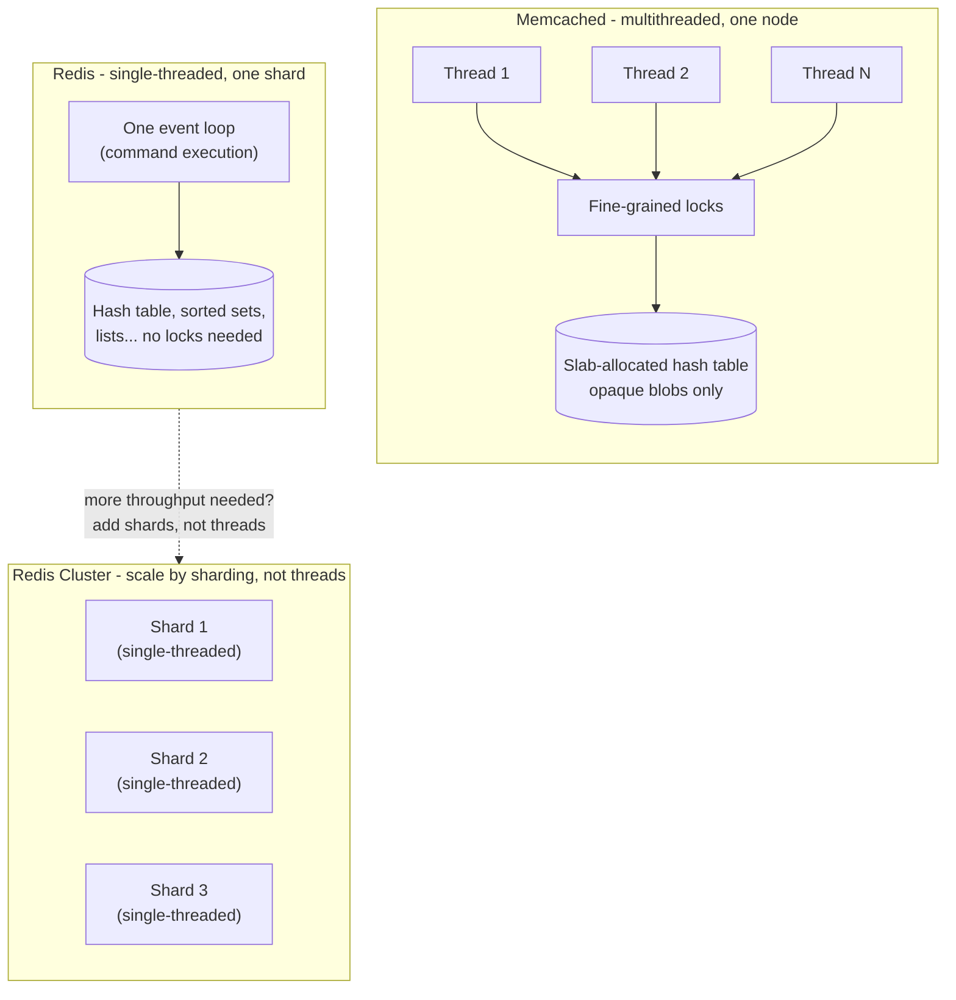

# Redis vs. Memcached

*Two products both sit at the [distributed cache](01-caching-layers-strategies.md#where-a-cache-can-live-the-layers) layer — this is why they don't actually compete for the same job as often as it looks.*

`⏱️ ~8 min · 3 of 8 · L3`

> [!TIP] The gist
> Memcached is a pure, opaque key-value cache: multithreaded, LRU-only, nothing survives a restart. Redis is an in-memory *data structure* server that happens to also be great as a cache: single-threaded (so every command is atomic, no locking needed), with persistence, replication, native sharding, pub/sub, and scripting. Memcached wins on raw simple-`GET`/`SET` throughput and memory-per-key; Redis wins the moment you need structure, atomicity across steps, or state that outlives a crash.

## Intuition

Imagine two storage lockers at a gym.

One locker is a bare metal box — you put a bag in, you take the exact same bag out, and if the power goes out overnight everything inside is gone by morning. But there are hundreds of these boxes, and dozens of attendants can open different boxes for different people at the same time without ever getting in each other's way — simple job, massive parallel throughput.

The other locker is more like a smart safe: it doesn't just hold your bag, it can look inside and let you swap out one item without unpacking the whole thing, it keeps a paper log of what went in so a locksmith could rebuild the contents from scratch if the safe itself broke, and it can even ring a bell to every other safe in the building the instant something changes. But there's exactly one attendant working that safe at a time — because giving the safe that much extra intelligence made "let two people touch it simultaneously" a much harder promise to keep safely.

Memcached is the bare metal box. Redis is the smart safe.

## The concept

**Memcached** and **Redis** are both **in-memory key-value stores** run as a separate networked service — the distributed cache layer named generically in [topic 01](01-caching-layers-strategies.md#where-a-cache-can-live-the-layers). Both trade RAM's cost for RAM's speed (100-1000x faster than a disk round trip) and both typically sit in front of a database rather than replacing one.

That's where the resemblance ends. **Memcached is a pure cache** — a flat map from key to an opaque byte blob, with no idea what's inside that blob. **Redis is an in-memory data structure store** that is *also* frequently used as a cache — it understands strings, hashes, lists, sets, sorted sets, and more as first-class server-side types, and layers persistence, replication, and scripting on top.

The one sentence to hold onto: Memcached asks "how do I serve `GET`/`SET` on bytes to as many clients as possible, as fast as possible, with the least code"; Redis asks "what if the cache itself could understand structure, survive a restart, and run a whole sequence of operations atomically" — and pays a real architectural price to get there.

## How it works

**1. Why the architectures diverge: threading model**

The single decision that explains most of the rest: how each handles concurrency.

**Memcached is multithreaded** — multiple worker threads (often one per CPU core) serve requests in genuine parallel, protected by fine-grained locks around the shared hash table. This is *safe* specifically because Memcached's operations are so simple: a `GET`/`SET` on an opaque blob touches one key, needs no cross-key coordination, so the locking stays narrow and cheap.

**Redis is single-threaded for command execution** — one event loop processes commands one at a time, fully sequentially, with **no locks anywhere**, because nothing else can ever be running at the same instant. (Since Redis 6, separate I/O threads handle network read/write in parallel, but the part that actually touches data stays single-threaded — an I/O optimization, not a concurrency change.) Redis Cluster gets multi-core parallelism a different way: many independent single-threaded Redis processes, each owning a shard of the keyspace.

Why give up intra-node parallelism on purpose? Because single-threaded execution makes **every Redis command atomic for free** — no locking code, no race conditions, and a multi-step sequence (a Lua script, a `MULTI`/`EXEC` transaction) runs to completion with zero risk of another client's command interleaving partway through. Memcached's blob-only model never needed that guarantee; Redis's richer operations require it. One core is fast enough that a single Redis shard sustains hundreds of thousands of ops/sec on simple commands — and past that ceiling, the answer is more shards, never more threads within one process.

**2. Data structures — the actual differentiator**

The threading model explains *why* Redis can safely offer more; the data structures are what that "more" actually buys an application:

| Need | Memcached | Redis |
|---|---|---|
| Increment a counter | Read, deserialize, increment, write back — not atomic under concurrency without external locking | `INCR key` — one atomic command |
| Update one field of an object | Fetch whole blob, mutate, write whole blob back | `HSET key field value` — touches only that field |
| Leaderboard / top-N by score | Application maintains its own sort, client-side | `ZADD`/`ZRANGE` — server-side sorted set (skip list), O(log n) |
| Broadcast an event to many subscribers | Not supported | Native pub/sub |
| A must-be-atomic sequence of reads and writes | Not possible server-side at all | Lua scripting or `MULTI`/`EXEC` |

Every row is the same pattern: Memcached's opaque-blob model pushes cost onto the network (transfer the whole value both ways) and onto application code (implement structure or atomicity yourself, often imperfectly under concurrency). Redis's typed operations push that cost into the server, handled once, correctly, in a single round trip.

**3. Persistence, replication, and clustering**

Memcached has **none of the following, by design** — it's a disposable cache in front of a real backing store, so losing everything on restart costs nothing durable.

Redis offers all three, because it's sometimes trusted as more than a disposable cache:

- **Persistence** — **RDB** takes periodic point-in-time snapshots of the whole dataset to disk (fast to restore, but loses anything since the last snapshot); **AOF** logs every write command and replays it on restart (tighter recovery point, tunable via `appendfsync always`/`everysec`/`no`). The two are commonly combined.
- **Replication** — a leader asynchronously streams writes to followers, which can serve reads; Redis Sentinel can auto-promote a follower on leader failure. Asynchronous by default means a leader crash right after acknowledging a write — before a follower received it — can lose that write on failover (the same async-replication risk L4/L5 cover generically).
- **Redis Cluster** — the keyspace is split into 16,384 fixed hash slots, `CRC16(key) mod 16384` decides which slot a key lives in, and each node owns a subset of slots. Rebalancing means migrating specific slots between nodes — server-coordinated. Memcached's sharding, by contrast, is entirely **client-side**: the client library hashes keys to pick a server; the servers don't know about each other, and a hash-ring change just reroutes future requests (nothing migrates — remapped keys are simply fresh misses).

**4. Worked example — rate limiter and session store, side by side**

Take a **sliding-window rate limiter**: allow at most 100 requests per user per 60 seconds.

*With Memcached:* the only atomic primitive is a simple `INCR` on a fixed-window counter — no atomic multi-step operation exists to implement a true sliding window. Doing it correctly under concurrent requests from the same user means either accepting a race (two requests both read count=99, both increment to 100, both get admitted — one over limit) or bolting on an external distributed lock, which adds a round trip and a whole new failure mode.

*With Redis:* a sorted set per user, member = unique request ID, score = timestamp. One atomic Lua script (or `MULTI`/`EXEC` batch):

1. `ZREMRANGEBYSCORE user:42:requests -inf (now-60000)` — drop anything older than the window.
2. `ZCARD user:42:requests` — count what's left.
3. If under 100: `ZADD user:42:requests now request_id` — admit and record.
4. Return allow/deny from step 2's count.

Because the whole sequence runs as one atomic unit under Redis's single-threaded guarantee, no two concurrent requests can both slip through at 99→100 — the exact race Memcached has no primitive to prevent without an external lock.

A shorter contrast for **session storage**: updating one field (`last_active`) on every request. Memcached: fetch the whole serialized session blob, deserialize, patch one field, re-serialize, write the whole thing back — on *every* request, for *every* logged-in user. Redis: `HSET session:abc123 last_active now` — one field, one round trip, nothing else touched.

## In the real world

- **Stripe — Redis for API rate limiting (fintech).** Stripe's rate limiters run on Redis using token buckets across four limiter types (per-second request rate, concurrent requests, fleet load shedding, worker-utilization load shedding), and deliberately **fail open** so a Redis bug degrades to "no limiting" rather than an outage — this is a production instance of the sliding-window pattern above. A companion account describes hitting Redis's own single-threaded ceiling: a single Redis node handling "tens to hundreds of thousands of operations per second" saturated one CPU core, and when it degraded, the rate limiter failed open and let a traffic surge hit the backend database directly. The fix was migrating to a **10-node Redis Cluster** — independent shards sharing the load rather than one node doing everything — after which error rates "took a nosedive." ([Stripe Engineering](https://stripe.com/blog/rate-limiters); [brandur.org](https://brandur.org/redis-cluster))
- **Facebook/Meta — Memcached at hyperscale (social/media).** The NSDI 2013 paper "Scaling Memcache at Facebook" documents Memcached serving "millions of user requests every second" to over a billion users, chosen specifically for its **simplicity** — easy to extend rather than fight. Facebook built everything Memcached itself doesn't provide as *application-level* infrastructure instead: **leases** (against stale writes and thundering herds), a **gutter pool** of standby servers absorbing traffic when primaries fail (since Memcached has no replication or failover of its own), and **mcrouter** for routing across the fleet. Choosing Memcached meant building replication, failover, and cross-region consistency yourself, in the application tier. ([USENIX](https://www.usenix.org/conference/nsdi13/technical-sessions/presentation/nishtala))
- **Discord — moving *away* from Redis for message indexing (a useful counter-example).** Discord originally used Redis as a durable queue in front of Elasticsearch indexing. Under backlog, the Redis cluster's CPU maxed out and it began **dropping messages outright** — because Redis pub/sub is fire-and-forget, not a durable delivery guarantee, exactly the mismatch this topic warns about. Discord's fix was replacing Redis in that role with **Google Cloud Pub/Sub**, built for guaranteed delivery under backlog. The lesson: Redis's sweet spot (structure, atomicity, session/rate-limit state) is distinct from "generic durable queue" — that's a job for a purpose-built broker, covered in L6. ([Discord Blog](https://discord.com/blog/how-discord-indexes-trillions-of-messages))

## Trade-offs

| Dimension | Memcached | Redis |
|---|---|---|
| Data model | Opaque byte blobs only | Strings, hashes, lists, sets, sorted sets, streams, and more |
| Concurrency | Multithreaded, fine-grained locking | Single-threaded event loop per shard, no locking |
| Atomic multi-step ops | None beyond single-key `INCR` | `MULTI`/`EXEC`, Lua — every command atomic by construction |
| Persistence | None — total loss on restart, by design | RDB snapshots and/or AOF log, tunable durability |
| Replication | None built-in; independent, unrelated nodes | Native leader-follower, async by default, Sentinel failover |
| Sharding | Client-side hashing only | Redis Cluster — server-coordinated hash-slot rebalancing |
| Pub/sub | Not supported | Native |
| Per-key memory overhead | Lower (near-minimal, opaque) | Higher (type/expiry/eviction bookkeeping) |
| Best fit | Massive-scale, simple, disposable key-value caching | Anything needing structure, atomicity, persistence, or clustering |

## When to pick which

- **Memcached** when the workload is a pure, ephemeral, simple cache-aside cache on flat blobs, scale is large enough that per-key memory and raw multithreaded throughput genuinely matter, and nothing needs to survive a restart or be sharded with server-side coordination.
- **Redis** when the use case needs richer server-side structures, atomicity across steps, persistence, pub/sub, or built-in replication/clustering — in practice the default choice for new deployments, since it's a strict superset of Memcached's core capability plus all of the above.
- **Both, for different jobs** is a common real answer: Memcached for the highest-volume simplest lookups, Redis for anything needing structure, atomicity, or persistence.

> [!IMPORTANT] Remember
> Memcached parallelizes *within* a node because its operations are simple enough that fine-grained locking is cheap; Redis stays single-threaded within a node because its richer operations make full atomicity worth more than intra-node parallelism — and it scales instead by adding more independent single-threaded shards.

## Check yourself

- Why can Memcached be safely multithreaded with only fine-grained locking, while Redis deliberately stays single-threaded for command execution? Name the specific property of each system's operations that makes that trade-off make sense.
- Walk through why a correct sliding-window rate limiter is straightforward to implement with Redis but requires either an external lock or accepting a race condition with Memcached.
- A team is caching fully-rendered HTML fragments keyed by URL — read-heavy, no per-field updates needed, running at a scale where every GB of RAM is a real cost line. Which system fits better, and what two properties from this lesson justify it?

→ Next: Cache stampede / dogpile / thundering herd
↩ comes back in: L4 (replication, partitioning), L7 (rate limiting)
