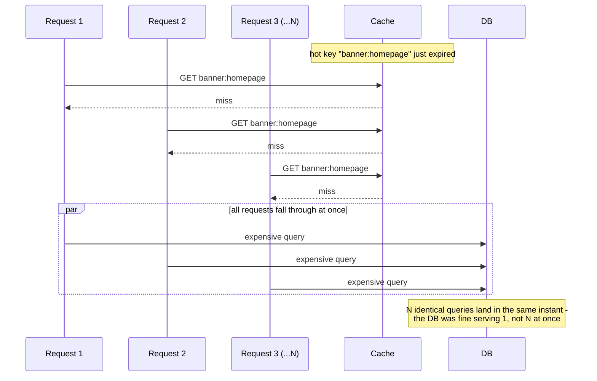
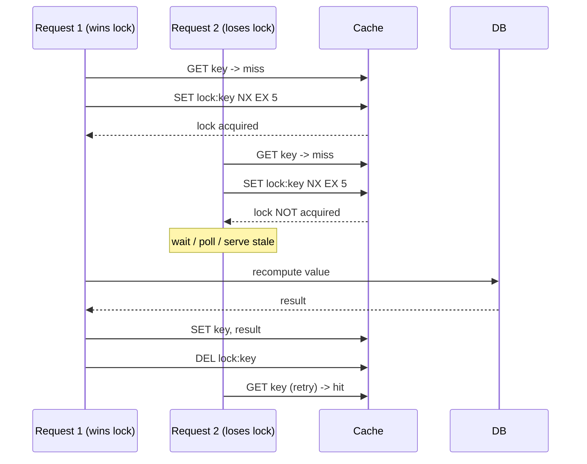

# Cache Stampede (Dogpile Effect / Thundering Herd)

*A hot key expires, and — instead of the usual trickle of misses — a thousand identical requests reach for the database in the exact same instant.*

`⏱️ ~7 min · 4 of 8 · L3`

> [!TIP] The gist
> A **cache stampede** happens when a cache entry that many concurrent requests depend on disappears all at once (TTL expiry, eviction, a cold restart), and every one of those requests falls through to the backing store **simultaneously** instead of the misses being spread out over time. N requests do N times the work at the worst possible moment. Six mitigations exist to collapse that N back down toward 1 — none of them is a universal fix, and production systems usually layer two or three together.

## Intuition

Picture a single popcorn machine at a movie theater. It runs fine all through the film, one customer at a time. Then the lights come up for intermission — and the *entire* theater stands up and heads to the counter in the same ten seconds. The machine didn't get slower; it just received a whole session's worth of demand compressed into one instant instead of spread across the two-hour show.

That's a stampede: not "too much traffic," but **the same traffic arriving with zero smoothing**, because something (an intermission, a TTL) synchronized everyone's timing for them.

## The concept

A **cache stampede** (also called the **dogpile effect**, or — borrowing from older OS/networking literature — a **thundering herd**) is what happens when a single cache entry (or a large batch of entries) becomes unavailable at once, and every concurrent request that depended on it misses **at the same instant** and independently falls through to the backing store.

Two words matter: **concurrent** and **duplicate**. An ordinary cache miss is fine — cache-aside ([topic 01](01-caching-layers-strategies.md)) assumes some fraction of requests miss and repopulate the cache, one at a time, spread across normal traffic. A stampede is what happens when that assumption breaks: **all N** concurrent requests for the same key miss together, and without a mitigation, all N of them independently redo the exact same expensive work — a full query, a join, an expensive computation — at precisely the moment the backing store is already absorbing a synchronized spike. A database that handles 10,000 reads/sec of naturally-arriving traffic can still be brought down by 10,000 requests landing in the same 50 ms window, because the problem isn't volume — it's volume with no smoothing, all demanding the same thing at once.

**Four root causes** produce this combination in practice:

1. **A single hot key expiring under high concurrency** — one popular entry, thousands of concurrent readers, one shared expiration instant.
2. **Mass expiry** — many *different* keys written in the same tight window with the same fixed TTL, so they all expire together later, even though no single key is unusually hot.
3. **Cold cache after a restart, deploy, or failover** — the entire keyspace is a miss at once, the most severe version since it isn't bounded to one key.
4. **Retry storms** — once a stampede starts, un-backed-off retries pile more duplicate traffic onto an already-struggling backing store, extending an incident that would otherwise self-resolve.

## How it works

**1. The failure shape**

**2. Two families of fix**

Mitigations split into **reactive** (accept the miss will happen, control what happens next) and **preventive** (try to stop the synchronized miss from happening at all):

- **Reactive — collapse the callers.** *Locking/mutex*: the first request wins a short-lived lock key (`SET lock:key NX EX 5`) and is the only one allowed to hit the backing store; everyone else waits or gets served stale. *Request coalescing / single-flight*: within one process, concurrent calls for the same key share one in-flight result instead of each starting its own — free, but doesn't cover the other 49 app instances behind your load balancer. *Stale-while-revalidate*: every caller gets the (slightly old) cached value immediately while exactly one background refresh runs — zero added latency, but knowingly serves stale data for a grace window.
- **Preventive — desynchronize the trigger.** *Jittered TTLs*: add a small random offset to each entry's expiry (`EX 3600 + random(0,300)`) so a batch of keys written together doesn't expire together — fixes mass expiry only. *Probabilistic early expiration (XFetch)*: readers occasionally recompute slightly **before** true expiry, with rising probability the closer the deadline gets, so the hard synchronized deadline is rarely reached at all. *Background refresh*: for a small, known set of very hot keys, refresh them on a schedule before they're ever close to expiring, so a miss should never happen.

**3. Worked example — a homepage banner under load**

`banner:homepage` is read at a steady 5,000 req/sec; recomputing it takes 200 ms; TTL is 60 seconds.

- **Unmitigated:** at the instant the TTL lapses, every request arriving in the ~200 ms it takes the *first* miss to refill the cache also misses. That's roughly `5,000/sec x 0.2s ≈ 1,000` concurrent requests all hitting the same expensive query at once — 1,000x the intended load, every 60 seconds.
- **With locking:** one of those ~1,000 acquires `lock:banner:homepage`; the other ~999 poll briefly or get a fallback. Backing-store load per expiry: **1 query, not 1,000** — a 1,000x reduction, at the cost of a small added wait for the losers.
- **With stale-while-revalidate:** all ~1,000 get the (60-second-old) stale banner immediately, zero added latency, while one background refresh runs — acceptable because a homepage banner being briefly stale costs nothing; it would *not* be acceptable for an account balance.

## In the real world

- **Meta — leases baked into Memcache itself.** The "Scaling Memcache at Facebook" paper (NSDI 2013) describes **leases**: on a miss, memcached hands the requesting client a token, given out at a constant rate; anyone else asking for the same key while a lease is outstanding gets told to retry, and only the lease-holder is allowed to refill the cache. Same shape as locking above, but implemented as a first-class cache-server primitive rather than an application-level lock key. ([Scaling Memcache at Facebook, NSDI 2013](https://www.usenix.org/system/files/conference/nsdi13/nsdi13-final170_update.pdf))
- **Cloudflare — lock-free probabilistic early revalidation at the edge.** Their engineering blog describes a popular cached image expiring and causing a burst that overwhelms the origin (their example: an origin that handles ~1 req/sec suddenly seeing 10 req/sec at the expiry instant). Instead of a distributed lock, each request independently rolls the dice using a probability that rises the closer it lands to true expiry (`p(t) = e^(-lambda*t)`) — the same "recompute a little early" idea as XFetch, arrived at independently. Result: roughly 20 rps of origin traffic even at 10,000 rps of edge traffic. ([Cloudflare Blog](https://blog.cloudflare.com/sometimes-i-cache/))
- **Stripe — jitter on the retry side, not the cache side.** Stripe's idempotency engineering post addresses root cause #4 directly: "We can address thundering herd by adding some amount of random 'jitter' to each client's wait time," layered on top of exponential backoff. Their Ruby client retries automatically "using increasing backoff times and jitter" — the same desynchronization principle as jittered TTLs, applied to retries instead of expiry. ([Stripe Blog](https://stripe.com/blog/idempotency))
- **UPI/NPCI — a real retry-storm outage.** On 12 April 2025, UPI success rates dropped to roughly 50% for nearly two hours after several banks' systems repeatedly hammered the "Check Transaction" status API without waiting for responses — a retry storm (root cause #4) rather than a classic TTL stampede, but the same underlying shape: uncoordinated, un-backed-off repeated requests overwhelming a shared backend. NPCI's immediate fix was to have the offending banks stop using that API. ([Outlook Money](https://www.outlookmoney.com/banking/upi-outage-attributed-to-surge-in-api-calls-from-banks-says-npci))

## Trade-offs

| Mitigation | Added latency to callers | Consistency cost | Solves which root cause |
| --- | --- | --- | --- |
| **Locking / mutex** | Losers wait (or get a fallback) | None once refreshed | Hot key (#1), across processes |
| **Request coalescing / single-flight** | None extra, for same-process callers | None | Hot key (#1), single process only |
| **Probabilistic early expiration (XFetch)** | None — recompute is transparent | Small wasted-recompute overhead | Hot key (#1), mass expiry (#2) |
| **Stale-while-revalidate** | Zero — always answers immediately | Serves known-stale data for a bounded window | #1, #2; not for correctness-critical data |
| **Jittered TTLs** | None | None | Mass expiry (#2) only |
| **Background/proactive refresh** | None — miss shouldn't occur | None, if refresh keeps up | #1, small known hot-key set only |
| **(Cold cache, #3)** | N/A — operational | N/A | Needs cache warming + staggered rollout; none of the above alone solves it |

> [!IMPORTANT] Remember
> A stampede is N concurrent requests doing N times the necessary work at once — every mitigation is really just a different point in the pipeline where that N gets collapsed back toward 1: at the lock (mutex), within the process (single-flight), before the deadline even arrives (XFetch, background refresh), at write time (jittered TTLs), or by answering instantly with a slightly-wrong value (stale-while-revalidate).

## Check yourself

- A hot key is read by 2,000 concurrent requests/sec and takes 150 ms to recompute on a miss. Roughly how many redundant backing-store calls does an unmitigated stampede produce the instant it expires — and how does locking versus stale-while-revalidate each change that number and the latency the "losing" requests feel?
- A batch job writes 500,000 cache entries in a 10-second window, all with the same fixed TTL. Explain why this creates a stampede risk an hour later even though no single key is especially hot — and why jittering the TTL fixes *this* case but does nothing for a single very-hot key's own expiration.

→ Next: Cache coherence and invalidation
↩ comes back in: L3 (topic 05's invalidation storms and topic 06's negative-caching miss patterns share this shape), reliability topics (exponential backoff, circuit breakers cover retry storms in full)
