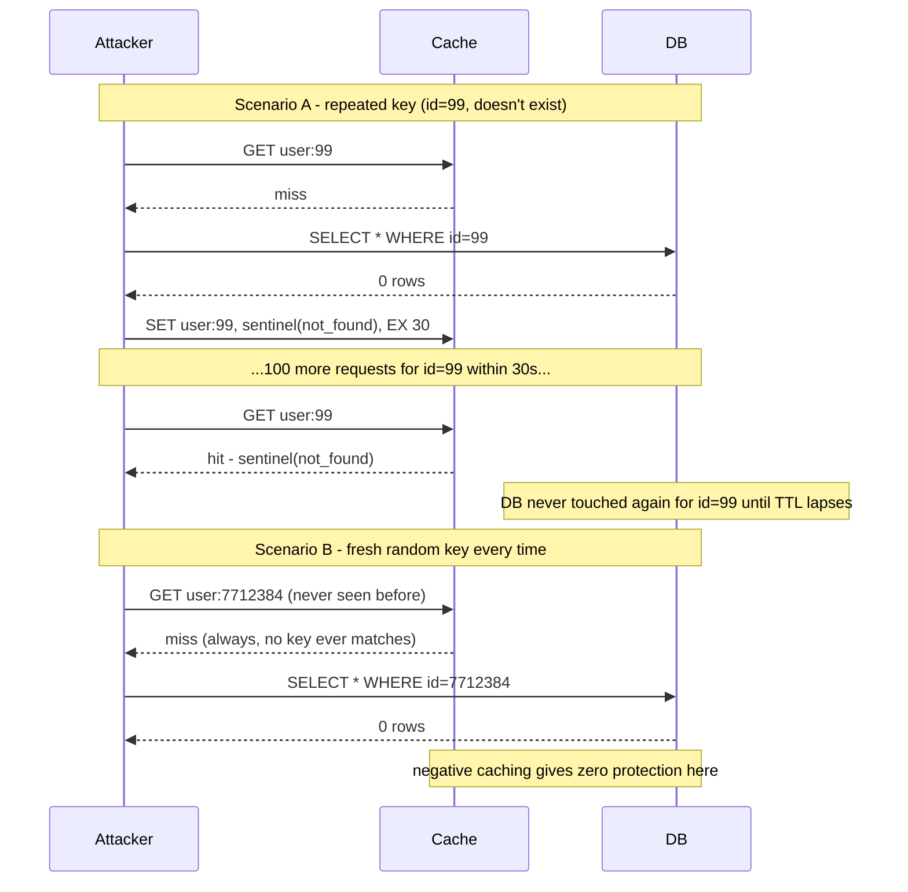

# Negative Caching

*A user checks `/users/8214` — an ID that never belonged to anyone. Without a plan for that answer, the database will get asked the exact same question, forever, on every single request.*

`⏱️ ~7 min · 6 of 8 · L3`

> [!TIP] The gist
> Every cache covered so far stores a **positive result** — something the backing store found. **Negative caching** stores the opposite: the fact that a lookup found *nothing*, so the next request for that same nonexistent key doesn't repeat the trip. Skip it, and a lookup for a key that never existed is a **guaranteed cache miss forever** — a failure mode called **cache penetration**, distinct from stampede/avalanche because it never self-resolves. The fix is simple (store a sentinel, short TTL) but has one hard limit: it only helps if the *same* nonexistent key is asked twice.

## Intuition

Imagine a librarian who, when asked for a book that isn't in the catalog, just says "not here" and forgets you ever asked. Ask again tomorrow — she walks the whole stacks again to confirm it's still not there. A smarter librarian jots "checked, not here, as of today" on an index card. Ask again this week, and she answers from the card without walking anywhere.

That index card is a negative cache entry. The catch: it only saves a trip if someone asks about *that same missing book* again. A different missing book every time still means walking the stacks every time.

## The concept

**Negative caching** is caching the result of a lookup that found nothing — a database query returning zero rows, a DNS query returning **NXDOMAIN**, an HTTP request returning **404** — the same way a "found" result gets cached, so a repeat query for that same absent key is answered from the cache instead of re-querying the backing store.

The gap it closes is structural, not incidental: a standard cache-aside read path (topic 01) only knows what to do with a *result*. When the backing store returns something, it gets stored. When the backing store returns nothing, most naive implementations pass "not found" straight back to the caller and touch the cache **not at all** — so nothing was ever written to hit against, and every future request for that exact key is a cache miss **by construction**, not "until something expires." Negative caching closes that gap by writing a marker at the key anyway, so the *fact of absence* gets the same protection from repeated backing-store trips that a fact of presence already gets.

## How it works

**1. Store a sentinel, not an empty value**

A negative entry can't just be a bare `nil` or empty string — that's indistinguishable from "key was never set" to careless calling code, which needs to tell "confirmed absent, skip the DB" apart from "never checked, go ask the DB." The fix is an explicit **sentinel**: a marker no real value could ever be, like `"__NOT_FOUND__"` or `{"exists": false}`. Any cache hit — real value or sentinel — skips the backing store; only a true absence of the key falls through to a real lookup.

**2. Negative TTLs are much shorter than positive TTLs**

A product page might cache for an hour; a "not found" result for that same key space typically caches for seconds to a few minutes. The asymmetry is about risk, not a fixed rule: a stale *positive* entry serves mildly outdated real data; a stale *negative* entry actively tells someone "this doesn't exist" after it just started existing — sharpest when a user creates an account and is immediately told "no such account" for however long the negative TTL runs. Negative entries are also cheap to recompute (asking "still not found?" costs the backing store nothing extra), so a short TTL has none of the recomputation penalty it would have for an expensive positive value.

**3. The three-way failure distinction interviews expect**

| Failure | Trigger | Shape |
| --- | --- | --- |
| **Cache stampede / breakdown** (topic 04) | One hot key **expires** | Brief, self-resolving spike |
| **Cache avalanche** (topic 04) | Many keys **expire together** | Larger, still self-resolving spike |
| **Cache penetration** (this topic) | A key that **never existed** | Steady, non-self-resolving stream of guaranteed misses |

Cache penetration is also a security concern: an attacker who wants to hammer a backend directly just needs to query keys **guaranteed not to exist** — `/user/1`, `/user/2`, ... — a request stream the cache absorbs none of.

**4. The hard limit: only repeated keys are protected**

Negative caching caches an answer *at a key*. If every request generates a **fresh, never-before-seen key**, there's no history at that key to have cached anything against — every such request is a first-time miss, no matter what TTL is set. This is why negative caching is described as complementary to, not a replacement for, a **Bloom filter**: a compact structure built from the set of known-valid IDs that answers "definitely absent, or possibly present?" without depending on having seen this exact key before — closing the gap negative caching alone leaves open, alongside rate-limiting the source of an abnormal volume of misses.

## Worked example: an attacker enumerating user IDs

`GET /users/:id` — IDs are sequential integers up to ~2,000,000.

**Scenario A — same 50 IDs, probed repeatedly.** Without negative caching, all 50 lookups hit the database on every pass, however many passes run. With a 30-second sentinel at each key, only the *first* pass reaches the database; the rest are absorbed by the cache. At 10,000 req/sec against this fixed set, database load drops from 10,000 qps to under 2 qps of genuine lookups.

**Scenario B — a fresh random ID every request.** Negative caching provides **zero protection**: every ID is a first-time key, a guaranteed miss regardless of TTL. The full 10,000 qps still reaches the database — closing this gap needs a Bloom filter (reject IDs outside the known-valid set before the cache) or rate-limiting the source, neither of which is negative caching proper.

## In the real world

- **AWS — DynamoDB Accelerator (DAX) implements this by default.** When DAX can't find a requested item, "instead of generating an error, DAX caches an empty result and returns that result to the user" — an entry that "remains in the DAX item cache until its item TTL has expired, its LRU is invoked, or the item is modified using PutItem, UpdateItem, or DeleteItem." AWS explicitly recommends a **lower, distinct TTL for negative entries** to bound staleness. The Builders' Library describes the same pattern generically: "we use a 'negative cache' using a different TTL than positive cache entries." ([AWS Builders' Library](https://aws.amazon.com/builders-library/caching-challenges-and-strategies/) · [DAX consistency docs](https://docs.aws.amazon.com/amazondynamodb/latest/developerguide/DAX.consistency.html))
- **Cloudflare — DNS negative caching, taken further than the RFC.** The 1.1.1.1 resolver implements standard RFC 2308 negative caching, but layers on **RFC 8198 aggressive negative caching**: for DNSSEC-signed zones, it can use NSEC records already in cache to answer a *brand-new, never-queried* name with an immediate NXDOMAIN — no query to the authoritative server at all, because the NSEC chain proves nothing exists in that range. That's meaningfully beyond this topic's basic limit (protection even for some never-before-seen keys, not just repeats). On the CDN side, Cloudflare's edge gives 404/410 responses a **3-minute default TTL** even with no `Cache-Control` header from the origin. ([Cloudflare 1.1.1.1 blog](https://blog.cloudflare.com/dns-resolver-1-1-1-1/) · [Cache by status code](https://developers.cloudflare.com/cache/how-to/configure-cache-status-code/))

## Trade-offs

| Concern | Detail |
| --- | --- |
| **Staleness (entity created after caching absence)** | A negative entry becomes wrong the instant that entity is created; it doesn't know the write happened. Bounded by a short TTL, closed faster by having the create path explicitly invalidate the negative entry (same delete-on-write pattern as topic 05). |
| **Memory cost / cache pollution** | Every distinct nonexistent key negative-cached consumes real memory; an enumeration attack can generate unbounded distinct keys, potentially evicting genuinely useful positive entries under LRU. Mitigated with short TTLs and a separate, size-capped space for negative entries. |
| **Only helps on repeated keys** | Zero protection against never-repeated nonexistent keys. Needs a Bloom filter or rate limiting as a complement, not a replacement. |
| **Security value** | Removes the backend-load incentive for repeated-target enumeration/scraping; can also avoid leaking timing differences between "forbidden" and "doesn't exist." |
| **Simplicity cost** | Requires deliberate code most frameworks don't add automatically — a sentinel, a shorter TTL policy, and ideally an invalidation hook on the create path. |

> [!IMPORTANT] Remember
> A cache only knows what to do with a *result* by default — "nothing found" gets no automatic protection, which is why the same nonexistent key can be asked forever without negative caching. Store a sentinel, give it a short TTL, and remember its one hard limit: it only helps when the *same* absent key is asked more than once — a fresh key every time needs a Bloom filter or rate limiting instead.

## Check yourself

- A cache-aside read path fetches a row, gets zero results, and returns "not found" without touching the cache. Explain precisely why every future request for that same key is a guaranteed miss "by construction," not "until something expires" — and how negative caching changes that.
- Why does a bare `nil`/empty value fail as a negative-cache marker, and what must a sentinel guarantee instead?
- An attacker sends 10,000 req/sec cycling through 200 fixed nonexistent IDs. A second attacker sends 10,000 req/sec, generating a brand-new random ID every time. Explain why negative caching (30s TTL, sentinel) protects against the first almost completely but does nothing against the second — and name the mechanism that would.

→ Next: CDN caching
↩ comes back in: L9 (security/abuse-mitigation topics revisit enumeration attacks and Bloom-filter-style defenses in full), L3 topic 05's invalidation pattern reapplied to negative entries
