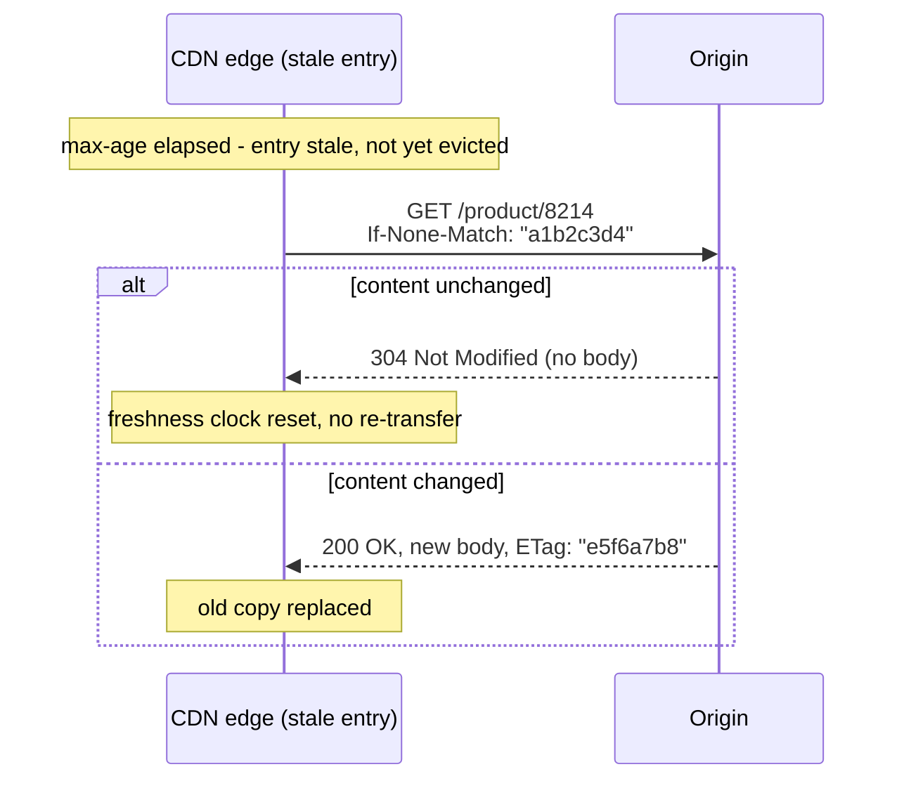
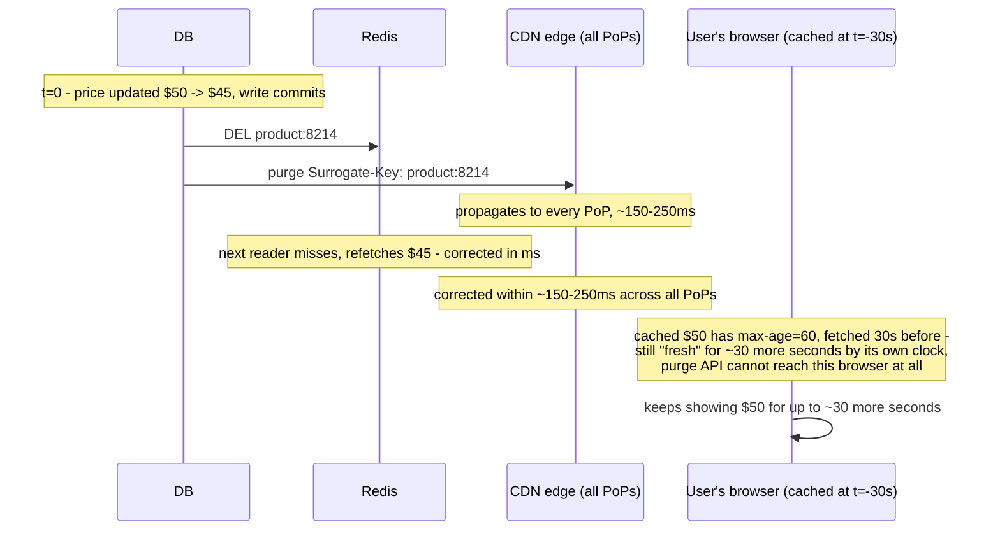

# CDN Caching

*A product's price changes in the database. Milliseconds later, Redis has the new number. A couple hundred milliseconds later, every CDN edge in the world has it too. One browser, thirty seconds later, is still showing the old price — and nothing you do can reach it faster.*

`⏱️ ~8 min · 7 of 8 · L3`

> [!TIP] The gist
> A CDN edge is just another cache sitting in front of your origin — but you don't run it, and it isn't one process, it's hundreds of independent points-of-presence (PoPs) you can't `DEL` directly. The entire interface between your app and CDN caching behavior is **HTTP response headers** (`Cache-Control`, `ETag`, `Vary`) — there's no `SET key value TTL` call to a CDN. This lesson is the HTTP-caching-semantics side; the network mechanics (PoPs, anycast, origin shielding) live in [CDN internals](../L1/15-cdn-internals.md).

## Intuition

Every other cache in this level, you can walk up to and ask "is this still good?" or tell "throw that out" — it's one machine, or a small cluster, and the answer is instant. A CDN is more like having your restaurant's menu photocopied and taped up in two hundred branches around the world. You can't walk into each one and cross out the old price yourself. Instead, you print a note on the menu itself — "good until 5pm, then re-check with headquarters" — and every branch obeys that note on its own schedule. Changing the price fast, everywhere, means calling every branch and asking them to re-print — and that phone call takes real time to reach all two hundred.

## The concept

A **CDN edge cache** is a generic HTTP cache with no idea what a "product price" or "user profile" is — it only reasons about two questions, both answered by response headers the origin sends: **freshness** (is this response still good to reuse without asking?) and **storability** (was this allowed to be cached at all, and by whom?). These are defined by the HTTP caching standard (RFC 9111, successor to RFC 7234).

Structurally, a CDN in the default pull mode is a **read-through cache**: your application never talks to the CDN's storage directly, only to the origin. The edge fetches from the origin on a miss and populates itself — there's no cache-aside CDN, because there's no code path where your application decides what to store at the edge. The origin's headers *are* the API.

## How it works

**1. Freshness — `Cache-Control: max-age` and `s-maxage`**

`max-age=N` says a response is reusable for `N` seconds without re-asking the origin — the fundamental hit-ratio-vs-staleness dial. `s-maxage=N` is the override a **shared cache** (CDN, proxy) must use instead of `max-age`, while a **private cache** (a browser) still uses `max-age`. This lets one response carry two different freshness lifetimes at once: `Cache-Control: max-age=0, s-maxage=300` means the browser revalidates every load (so a user always sees their own latest action), while the CDN happily serves everyone else the same response for five minutes.

**2. Storability — `public` / `private` / `no-cache` / `no-store`**

These answer "may this be cached, by whom" — a different axis from freshness entirely.

| Directive | Meaning |
|---|---|
| `public` | Any cache, shared or private, may store it |
| `private` | Only the requesting browser may store it — a shared cache must not |
| `no-cache` | **May** be stored, but must revalidate with the origin before every use — despite the name, this is not "don't cache" |
| `no-store` | Never stored anywhere, not even transiently — for genuinely sensitive responses |

**3. Revalidation — ETag / If-None-Match**

When a stored response's freshness runs out, the cache doesn't necessarily re-download the whole thing — it asks. The origin sends an **ETag** (an opaque hash/version tag) with every response; on revalidation, the cache echoes it back as `If-None-Match`. If it still matches, the origin replies `304 Not Modified` with no body — confirming the cached copy and resetting its freshness clock for the cost of a tiny round trip instead of a full re-fetch.

**4. Cache key design — `Vary`**

The default cache key is method + URL, but a response can genuinely differ by request header (`Vary: Accept-Encoding` for gzip vs. plain, `Vary: Accept-Language` for localization) — the cache must store those as separate entries. Get this wrong in either direction and it's a real failure: too broad a key (ignoring a header the body genuinely varies by) serves the wrong variant to the wrong request; too narrow a key (`Vary: Cookie` on a non-personalized response) fragments the cache into near-one-entry-per-user, tanking hit ratio for no benefit — functionally as uncacheable as marking the response `private`.

**5. Stale-while-revalidate — stampede mitigation, transplanted to the edge**

`stale-while-revalidate=N` lets a cache serve an already-expired response **immediately**, while triggering one background refresh — for up to `N` further seconds. This is [cache stampede](04-cache-stampede.md)'s mitigation applied at CDN scale: instead of many concurrent requests across hundreds of PoPs all racing to refetch the same just-expired object synchronously, exactly one background refresh runs while every other concurrent request gets the stale-but-present copy without waiting. `stale-if-error=N` does the same thing for a different trigger: if a revalidation to the origin fails (5xx, timeout), the cache serves the stale copy instead of propagating the failure — a brief origin blip becomes invisible instead of an outage.

**6. Purge — delete-on-write, one layer out**

TTL expiry is the passive default. An explicit **purge API** is the CDN-layer equivalent of [topic 05](05-cache-coherence-invalidation.md)'s delete-on-write: the origin calls the provider's purge API to discard a cached object at every edge ahead of its natural expiry. The structural difference from a local `DEL`: a purge has to *propagate* to every PoP — a real, measurable amount of time (Fastly cites roughly 150ms typical, up to 250ms, for a global purge). There's no mechanism to push a *new value* into every PoP directly — only a presence/absence flag to flip everywhere — which is exactly why purge is structurally a delete, never an update: nothing has to arrive in a guaranteed order across hundreds of independent PoPs, because there's no competing value to race. **Surrogate keys / cache tags** extend this: tag every response touching a given entity (`Surrogate-Key: product:4821`), and one purge call discards every tagged object everywhere without enumerating URLs — the same tag-based invalidation topic 05 described for a distributed cache, one layer further out.

## Worked example: a price change, four layers, four different outcomes

`GET /products/8214` is served with:

- Browser: `Cache-Control: public, max-age=60`
- CDN: `s-maxage=300, stale-while-revalidate=30`, tagged `Surrogate-Key: product:8214`
- Redis: cache-aside entry `product:8214`, 300s TTL
- Database: the row itself

At `t=0` an admin drops the price from $50 to $45. The write path issues `DEL product:8214` against Redis and calls the CDN purge API for `Surrogate-Key: product:8214`.

Three layers get actively corrected — Redis in milliseconds, the CDN in a couple hundred milliseconds — and one layer, the browser, is not reachable by either `DEL` or purge at all. It cached the old price 30 seconds before the change under a 60-second `max-age`, and simply hasn't run out its own clock yet. A design that assumed "we purged the CDN, so the price is correct everywhere" is wrong for up to 30 seconds, for exactly the users whose browsers happened to cache it just before the change — which is why a price-sensitive endpoint needs a deliberately short browser `max-age` (or `no-cache` + ETag revalidation), not one inherited from whatever felt reasonable for the CDN's `s-maxage`.

## In the real world

- **Fastly** — surrogate keys are the canonical tag-based purge model: tag an object with `Surrogate-Key`, purge every copy across the whole edge network with one call, no URL enumeration needed. Fastly's own guidance: "if you find yourself purging all cache on more than a weekly basis, consider using surrogate keys for more targeted purging." ([Fastly docs](https://www.fastly.com/documentation/guides/full-site-delivery/purging/purging-with-surrogate-keys/), verified current)
- **Cloudflare** — made `stale-while-revalidate` fully asynchronous in 2026: previously the *first* request after expiry still had to wait for the origin before getting a fresh copy; now that first request "triggers revalidation in the background and immediately receives stale content" — closing the gap between textbook semantics and production behavior. ([Cloudflare changelog](https://developers.cloudflare.com/changelog/post/2026-02-26-async-stale-while-revalidate/), 2026-02-26)
- **Vercel** — Incremental Static Regeneration applies the same pattern one layer up the stack, explicitly for "large product catalogs that need current pricing and availability without rebuilding the entire site," with globally consistent purging: "all caches across all regions update within 300ms." ([Vercel docs](https://vercel.com/docs/incremental-static-regeneration))
- No verifiable, dated source on Stripe's own CDN-caching configuration turned up in this sweep — flagged as a genuine gap rather than a forced fit.

## Trade-offs

| Concern | Detail |
| --- | --- |
| **Freshness vs. hit ratio** | Longer `max-age`/`s-maxage` = higher hit ratio and lower origin load, at the cost of longer worst-case staleness with no active correction. `s-maxage` lets the CDN and browser disagree deliberately, tuning this per layer instead of one forced compromise. |
| **`no-cache` vs `no-store`** | The most common misread: `no-cache` still caches (with mandatory revalidation); only `no-store` actually forbids caching. Using `no-store` where `no-cache` was meant throws away a real bandwidth benefit for no correctness gain. |
| **Cache key breadth (`Vary`)** | Too broad (ignoring a header the body genuinely varies by) is a correctness bug. Too narrow (`Vary: Cookie` on shared content) fragments the cache to near-per-user entries, destroying hit ratio. |
| **Purge granularity** | Narrow (per-URL) purges are cheap but require enumeration; surrogate-key purges scale without enumeration at the cost of maintaining a correct tag index; purge-all is a blunt last resort that risks an origin stampede across every PoP at once. |
| **Purge propagation is real time** | ~100-250ms to reach every PoP globally, not instantaneous — a small but nonzero window where different PoPs can answer differently for the same URL. |
| **The browser layer is unreachable by any purge** | Nothing corrects an already-cached response sitting on a user's device; only its own `max-age`/revalidation policy bounds how long it can be wrong. |

> [!IMPORTANT] Remember
> A CDN edge only ever learns your intent through response headers — `Cache-Control` for freshness and storability, `ETag` for cheap revalidation, `Vary` for a correct cache key. Purge is structurally a **delete**, propagating in ~150-250ms across hundreds of independent PoPs, never an in-place update — and the browser cache, one hop further out, can't be reached by purge at all, so it needs its own deliberately short freshness policy wherever staleness actually matters.

## Check yourself

- A response is served with `Cache-Control: private, max-age=0, no-cache`. What exactly is a CDN edge allowed to do with it, versus a browser — and why doesn't `no-cache` mean "don't cache" here?
- An API response varies by `Accept-Language` but the origin forgets to send `Vary: Accept-Language`. What's the concrete bug a shared CDN cache produces? Contrast it with sending `Vary: Cookie` on a response that doesn't actually depend on cookies.
- Why is `stale-while-revalidate` described here as "cache stampede mitigation, transplanted to the edge" — what does it specifically prevent at the moment of expiry that plain `max-age` alone would allow?
- A price change is corrected via a Redis `DEL` and a CDN surrogate-key purge, both completing within a few hundred milliseconds — yet a user sees the old price for 40 more seconds. Which layer is responsible, and why couldn't either action have prevented it?

→ Next: [Object / blob storage](08-object-blob-storage.md)
↩ comes back in: L12 (Scalability and Performance Patterns), wherever performance/scalability work revisits CDN and edge-caching strategy
