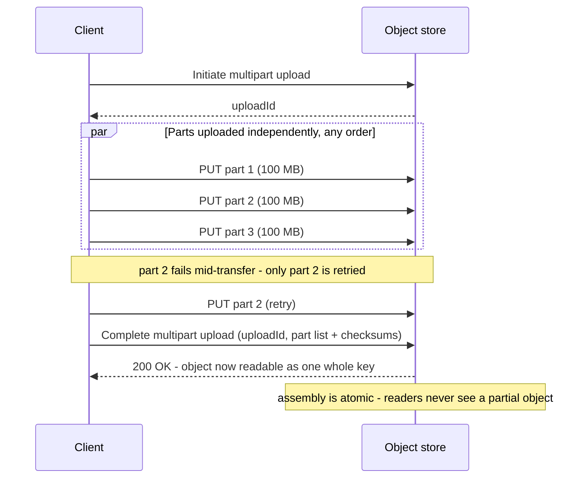
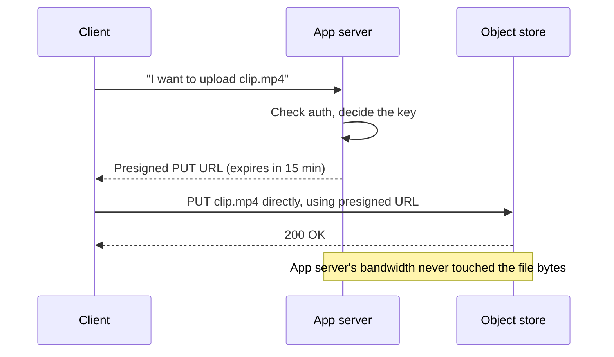

# Object / Blob Storage

*Every other lesson in this level has been about a fast, volatile copy of data sitting in front of something slower and authoritative. This is that "something" — where the big, unstructured stuff actually lives.*

`⏱️ ~8 min · 8 of 8 · L3`

> [!TIP] The gist
> Object storage stores whole, immutable blobs — a photo, a video, a backup — each addressed by a flat key over a plain HTTP API (`PUT`/`GET`/`DELETE`/`LIST`), not a directory tree or a database row. There's no "edit byte 500"; a change means uploading a whole new object. It's the deliberate, cheap-at-any-scale answer for data too large or unstructured to belong in a cache or a table — and it's usually the thing sitting *behind* the caches and CDNs the rest of this level was about.

## Intuition

A relational table is a filing cabinet: small index cards, each one editable in place, cross-referenced by drawer and folder. Object storage is a warehouse of sealed shipping crates: each crate has one barcode, holds anything from a photo to a terabyte-scale backup, and once sealed you never open it to swap one item — you print a new crate and give it a new barcode. There's no aisle-and-shelf map either, just a giant flat list of barcodes; "find everything starting with `videos/2026/`" is a search through that list, not a walk down an aisle.

## The concept

**Object storage is a system for storing and retrieving whole, immutable blobs of data — called objects — each identified by a unique key in a flat namespace, accessed entirely over an HTTP-based API rather than a filesystem or block-device interface.**

Every object is really three things, always handled as one atomic unit:

- **The data itself** — arbitrary bytes, from a few bytes to terabytes.
- **Metadata** — a key-value map traveling *with* the object: content type, cache headers, custom tags, size, last-modified time.
- **A unique key** — a string, often *written* to look hierarchical (`videos/2026/user-8214/clip.mp4`), that identifies the object inside its bucket.

That hierarchical look is a lie the console UI tells you for convenience. There is no directory tree underneath the key — no inode, no parent folder — just one flat set of keys per bucket. This single structural fact is the root of nearly everything else here: how it scales without limit, why "delete a folder" isn't one call, and why the API is as narrow as it is (`PUT` the whole thing, `GET` the whole thing or a byte range, `HEAD` for metadata only, `LIST` to enumerate keys under a prefix). Amazon S3's API, from 2006, is the de facto standard shape most other object stores (Google Cloud Storage, Azure Blob Storage, MinIO, Ceph) mirror or implement compatibly.

**How this differs from everything else you store data in:**

| | Block storage | File storage | **Object storage** | Relational rows ([L2](../L2/01-relational-model.md)) |
|---|---|---|---|---|
| Unit of access | Fixed-size block | A file, hierarchical path | **A whole object, flat key** | A row, inside a page |
| In-place edits? | Yes | Yes | **No — replace whole object** | Yes (`UPDATE`) |
| Typical scale ceiling | Single volume, TBs | Bounded filesystem | **Effectively unbounded** | Bounded per table |
| Best fit | DB data/log files, boot volumes | Shared config, legacy POSIX apps | **Images, video, backups, ML artifacts, logs** | Structured, transactional, queried data |

The relational-row column is the direct link back to [L2's storage engines](../L2/10-storage-engines.md#pages-slots-tuples-the-physical-unit-of-storage): a row lives inside a small, fixed-size page (8 KB Postgres, 16 KB InnoDB), and the whole engine — buffer pool, WAL, MVCC — is built for small, structured, transactional data. Cramming a 500 MB video into a `BYTEA` column *works*, but it bloats the buffer pool, every backup, every replica, and the WAL, for a write that has nothing to do with row semantics. The standard pattern is: store the blob in object storage, store only its **key/URL** in the relational row (`videos.thumbnail_url = 's3://bucket/videos/8214/thumb.jpg'`) — each store doing exactly the job it was built for.

## How it works

**1. Why it exists — the large-blob problem**

Three properties make block/file storage or a database a poor fit, and object storage a good one: **volume** that dwarfs any provisioned volume (buckets have no provisioned size — capacity is implicit, billed per byte); **access pattern** that's whole-object, not partial-byte (almost nothing reads "bytes 4,000–4,010 of this video" as normal operation); and **durability/availability** requirements beyond what one disk or one data center promises on its own, at a cost per GB far below provisioned block storage.

**2. Getting a huge object in — multipart upload**

A single `PUT` caps out fast (S3: 5 GiB per request) and is fragile — a network blip 90% through a 4 GB upload means starting over from byte zero. Multipart upload splits one logical object into independently-uploaded parts, uploaded in parallel, in any order, each retryable on its own:

This doesn't weaken "an object is only ever fully present or fully absent" — it just lets the *write* side of that guarantee be assembled incrementally instead of as one giant transfer. Readers see either the finished object or nothing, never a half-assembled one.

**3. Keeping the promise — consistency and durability**

Two different questions, both answered by real engineering trade-offs, not magic:

- **Consistency** — after a write, does the very next read anywhere see it? Object stores historically defaulted to *eventual* consistency (propagation to every replica takes real time); the industry has moved to **strong read-after-write consistency by default** — AWS announced this for all S3 operations in December 2020, `verify` this holds for your specific provider/version.
- **Durability** — will the object still be intact a year from now? S3 advertises **99.999999999% ("eleven nines") annual durability**, achieved by replicating or erasure-coding every object across multiple devices *and* multiple facilities. **Straight replication** (e.g., 3 full copies) is simple and fast to reconstruct from, at a fixed 3x storage overhead. **Erasure coding** splits an object into k data fragments plus m parity fragments, reconstructable from any k of the k+m — comparable or better durability at roughly 1.2–1.5x overhead instead of 3x, at the cost of more compute/network fan-in to reconstruct after a loss. This is the same space-vs-reconstruction trade RAID 6 makes, generalized.

**4. Operating knobs — tiers, direct access, and history**

Not all bytes are read equally often, so object stores expose **storage classes** trading retrieval latency/cost against per-GB storage cost — hot (milliseconds, priciest) down to deep archive (many hours, cheapest) — moved between automatically by declarative **lifecycle policies** ("archive after 90 days, delete after 7 years"), no application cron job required.

**Presigned URLs** remove the app server from the data path entirely while it still controls access: the server signs a time-boxed URL authorizing one specific `PUT`/`GET` on one specific key, and the client talks *directly* to the store.

**Versioning**, when enabled, keeps every version ever written to a key instead of silently overwriting — protection against accidental deletion, at the cost of storing every version's full bytes (never a diff), which is exactly why versioning and lifecycle policies are usually paired.

## Worked example: uploading and serving a 2 GB video

1. A user picks a 2 GB video. The app server authenticates them, decides the key (`videos/user-8214/raw/clip-a1b2c3.mp4`), and hands back a presigned multipart-upload URL set — the file bytes never touch the app server.
2. The client splits the file into 20 parts of 100 MB and uploads them in parallel. Part 14 fails once on a flaky connection; only that 100 MB part is retried, not the other 1.9 GB.
3. Once all 20 parts succeed, the client calls "complete multipart upload." The object is assembled atomically and replicated (or erasure-coded) across at least three facilities *before* the completion call even returns — durability is a property of the write path, not something bolted on after.
4. A background transcoding job reads the raw object and writes each resolution as its own new key (`videos/user-8214/720p/clip-a1b2c3.mp4`) — never modifying the original in place, since objects can't be partially edited.
5. A lifecycle rule moves the original raw upload to a colder tier after 30 days (rarely read again directly), while the transcoded renditions stay hot since those are what viewers actually watch.
6. When a viewer watches it, the CDN in front of this bucket serves the request from an edge cache on a hit; on a miss, the CDN itself — not the viewer, not the app server — issues the `GET` straight to the object store as its origin fetch, exactly the pairing [CDN caching](07-cdn-caching.md) anticipated.

## In the real world

- **AWS S3** — the durability engine is described as "a system of microservices that continuously inspect every single byte across the entire fleet," auto-triggering repair on any detected degradation, toward the 11-nines design goal. At launch (2006) S3 held ~1 PB across ~400 nodes with a 5 GB max object size; today it holds 500+ trillion objects, serves 200+ million requests/second, across 123 Availability Zones in 39 regions, with a 50 TB max object size. ([AWS News Blog, 20 years of S3](https://aws.amazon.com/blogs/aws/twenty-years-of-amazon-s3-and-building-whats-next/), accessed 2026-07-15)
- **Netflix** — moved from a traditional on-prem "3-2-1 backup" model to cloud tiering: underutilized media assets move to S3 Glacier Flexible Retrieval (3–5 hour restore, ~60% lower monthly cost) roughly six months after a title's launch, saving on the order of 50–70% on archived content; their internal S3 abstraction layer has archived 77 PB and purged 33 PB via automated lifecycle rules. ([Netflix Technology Blog](https://netflixtechblog.medium.com/netflixs-media-landscape-evolution-from-3-2-1-to-cloud-storage-optimization-77e9a19171ed), 2024)
- **Dropbox Magic Pocket** — an in-house, exabyte-scale blob store (built after Dropbox moved off S3): immutable 4 MB-max chunks replicated across zones while "hot," then erasure-coded once "cold" — the same replicate-then-erasure-code lifecycle described above, independently arrived at. Dropbox's durability bar: "loss due to an apocalyptic asteroid impact is more likely than random disk failures." ([Dropbox Tech Blog](https://dropbox.tech/infrastructure/inside-the-magic-pocket), 2016 — architecture still foundational, `verify` specific growth figures as dated)
- **Fintech/compliance angle** — no verifiable Stripe engineering post on object-storage architecture turned up in this sweep (flagged rather than guessed at). The verifiable pattern instead is **S3 Object Lock**, a WORM feature built on top of versioning, formally assessed against SEC Rule 17a-4(f), FINRA Rule 4511, and CFTC Regulation 1.31 — letting a regulated firm set independent per-object retention (5-year vs. 7-year records in the same bucket). ([AWS Storage Blog](https://aws.amazon.com/blogs/storage/protecting-data-with-amazon-s3-object-lock/), updated 2023)

## Trade-offs

| Concern | Detail |
|---|---|
| **No in-place edits** | Changing one byte means a whole new object (or version). Fine for write-once-read-many blobs; a poor fit for data genuinely edited incrementally — that belongs in a database row or real filesystem. |
| **No complex queries or joins** | Answers "bytes at this key" and "keys under this prefix" only — no filtering by content, no joins, no cross-object transactions. Structured queries over the payload belong in a database or a query engine reading the objects. |
| **Latency vs. block storage** | Every operation is a network round trip — tens of ms realistic floor for first byte, versus sub-ms for local SSD. Not a substitute for a database's own files or latency-sensitive random access. |
| **Cost per GB vs. tier** | Cheaper than block storage, cheaper still down the hot→archive spectrum — but archive tiers trade that for retrieval latency (ms to many hours) and often a per-GB retrieval fee, so a frequently-accessed object in a cold tier can end up costing *more* overall. |
| **Versioning cost** | Every version is a full copy, not a diff — an object rewritten daily with no lifecycle cleanup accumulates storage cost linearly, indefinitely. |
| **Durability vs. storage overhead** | 3x replication: simple, fast reconstruction, expensive overhead. Erasure coding: ~1.2–1.5x overhead, comparable durability, more compute/network to reconstruct after a loss. |

> [!IMPORTANT] Remember
> An object is a whole, immutable blob addressed by a flat key — never partially edited, never truly nested in folders. Everything else (multipart upload, presigned URLs, storage tiers, versioning) exists to make that one rigid model practical at exabyte scale: assemble large writes incrementally, let clients talk to the store directly, price bytes by how often they're actually read, and keep every version only as long as a lifecycle policy says to.

## Check yourself

- Why does deleting a "folder" of objects require a `LIST` plus many `DELETE`s, when the same operation on a real filesystem is one directory-delete call? What structural fact makes this true?
- A team stores 50 MB PDF invoices as `BYTEA` columns directly in a PostgreSQL table. Using L2's storage-engine concepts, what does that cost the database — and what's the standard alternative?
- Why doesn't multipart upload violate the "object is only ever fully present or fully absent" guarantee, even though it's assembled from many independently-uploaded parts?
- Contrast 3-way replication against erasure coding for durability: what does each cost in storage overhead, and what does each cost to reconstruct a lost fragment?

→ Next: NoSQL families (L4, first topic of NoSQL and Data at Scale)
↩ comes back in: L4 (replication and partitioning generalize this topic's consistency and durability mechanics), L13 (specialized systems and data lakes build directly on object storage as their substrate)
