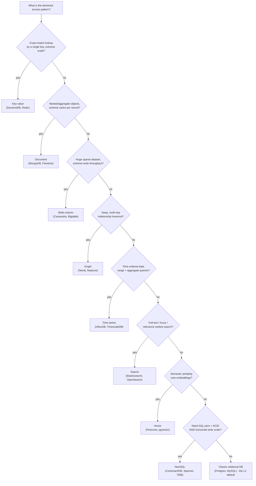

# NoSQL Families

*"NoSQL" isn't one database — it's eight different shapes data can take, each built to make one access pattern fast.*

`⏱️ ~8 min · 1 of 15 · L4`

> [!TIP] The gist
> A relational table is one shape for data — great when data is genuinely tabular and needs strong multi-row transactions. But not everything is naturally rows and columns: a social graph, a nested order object, a stream of sensor readings, free text, an embedding vector. NoSQL is the umbrella over the specialized data models built for those other shapes — key-value, document, wide-column, graph, time-series, search, NewSQL, and vector — each trading away something relational (joins, full ACID, or a fixed schema) to make its own access pattern cheap at scale. The real skill isn't memorizing eight databases; it's asking **"what does this application actually do to the data, and how often?"** and picking the family built for that answer.

## Intuition

[L2](../L2/01-relational-model.md) gave you one very good tool — the relational database — and it's the right tool for a lot of jobs. But a table saw, a chisel, and a router are all "woodworking tools," and none of them is a worse table saw; they're shaped for different cuts.

NoSQL is the rest of the toolbox. Each family below exists because someone had one specific, recurring access pattern — "give me this key instantly," "give me this whole nested object," "find everything within 5 hops of this account," "find the most similar embedding" — and built a data structure purpose-shaped for exactly that, instead of forcing it through a generic table-and-join engine.

## The concept

**NoSQL** ("not only SQL") is an umbrella term for database systems built around a data model *other than* the classic relational one — key-value, document, wide-column, graph, time-series, search, and vector, plus **NewSQL**, which keeps the relational model but borrows NoSQL's distributed architecture. There is no single "NoSQL data model" — each family below picked a different shape.

Three ideas underpin almost all of them:

- **Aggregate orientation.** Instead of normalizing an object into many joined tables, most NoSQL families store the object an application actually reads and writes as one physical unit (a whole document, a whole row with sparse columns) — eliminating join cost for the access pattern that never wanted a join in the first place.
- **Schema-on-read vs. schema-on-write.** A relational table forces every row into the same fixed columns *at write time*. Many NoSQL families defer "what does this record mean" to the application, letting each record's shape vary or evolve without a migration.
- **BASE, as a looser alternative to ACID.** [ACID](../L2/04-acid.md) is the relational model's strict contract, enforced by the database. Many NoSQL systems were built around **BASE** instead: **B**asically **A**vailable (respond even with possibly stale data, rather than block), **S**oft state (a replica's state can drift even with no new writes, as it catches up), **E**ventually consistent (replicas converge *eventually*, with no bound on *when*). This is a spectrum, not a rule — DynamoDB and Cassandra expose tunable consistency, MongoDB has multi-document transactions, and NewSQL rejects BASE entirely while still scaling horizontally.

## How it works

### The eight families, one line each

| Family | Built for | Canonical systems |
|---|---|---|
| **Key-value** | Exact-key lookup at extreme scale — no query language, no joins, just `GET`/`PUT`/`DELETE` | DynamoDB, Redis |
| **Document** | Nested, aggregate objects (an order + its line items) with per-record schema flexibility | MongoDB, Firestore |
| **Wide-column** | Huge, sparse datasets with extreme sustained write throughput and row-key range scans | Cassandra, Bigtable, HBase |
| **Graph** | Deep, multi-hop relationship traversal (friends-of-friends, fraud rings) | Neo4j, Amazon Neptune |
| **Time-series** | Time-ordered, mostly-append data, queried by time range and aggregated | InfluxDB, TimescaleDB, Prometheus |
| **Search** | Full-text, fuzzy, relevance-ranked queries a B-tree can't serve | Elasticsearch/OpenSearch |
| **NewSQL** | SQL + full ACID *and* horizontal write scale — not a new data model, a new architecture | CockroachDB, Spanner, TiDB |
| **Vector** | Semantic similarity search over high-dimensional embeddings (k-NN) | Pinecone, pgvector, Milvus |

### What powers each one, in one sentence

The internals aren't eight unrelated inventions — they cluster around a handful of techniques, most of which you've already met:

- **Key-value, wide-column, and time-series** are almost all built on an **LSM-tree** (the same write-optimized engine [L2 derived generically](../L2/10-storage-engines.md#lsm-tree-storage-engines-the-write-path-and-read-path-end-to-end)) — sequential writes to a memtable/WAL, flushed to immutable sorted files, merged by compaction. It's what makes sustained, massive write throughput possible.
- **Graph databases** use **index-free adjacency** — each node holds a direct pointer to its relationships, so traversing to a neighbor is a pointer chase, not an index lookup, making multi-hop query cost depend on edges visited, not total dataset size.
- **Search engines** invert the problem with an **inverted index** — term → list of documents containing it — plus a relevance-scoring function (BM25) that a B-tree simply has no equivalent for.
- **Vector databases** build an **approximate nearest-neighbor (ANN)** index — commonly **HNSW**, a multi-layer navigable graph — trading a small amount of recall for roughly logarithmic search cost instead of a linear scan across every vector.
- **NewSQL** replicates small key-range shards via **consensus** (Raft, or Spanner's Paxos-derivative + TrueTime) and coordinates cross-shard transactions with **two-phase commit** — full ACID, at the cost of a network round trip per commit.

### Picking a family: the decision that actually matters

Two caveats worth keeping in your back pocket: real production systems are almost always **polyglot** — one relational or NewSQL system of record, plus a search engine, a cache ([L3](../L3/01-caching-layers-strategies.md)), and maybe a wide-column store, each owning the slice of the workload it fits, wired together by replication/[CDC](02-replication.md) rather than any one database trying to be everything. And "which family" is only the *first* pass — once picked, the harder, more consequential work is designing the actual keys and record shapes around the real queries (data modeling and denormalization, later in this level).

## In the real world

- **Stripe — document database (MongoDB), fintech.** Stripe adopted MongoDB in 2011 for its schema-flexible model and native sharding, then built **DocDB** — an internal database-as-a-service on top of it — for stronger security, a minimal vetted query surface, and zero-downtime shard migrations. It now serves roughly **5 million queries/second** across **2,000+ shards** with **99.999% uptime**. ([ByteByteGo, summarizing Stripe Engineering](https://blog.bytebytego.com/p/how-stripe-scaled-to-5-million-database))
- **Discord — wide-column, Cassandra migrated to ScyllaDB.** Discord chose Cassandra in 2017 for message storage — a textbook append-heavy, ever-growing wide-column workload. At trillions of messages across 177 nodes, **hot partitions** and **JVM garbage-collection pauses** forced a migration to ScyllaDB (same wire protocol, GC-free C++), cutting read latency from ~200ms to ~5ms. ([Discord Engineering Blog](https://discord.com/blog/how-discord-stores-trillions-of-messages))
- **Netflix — wide-column *chosen over* a graph database.** Building an 8-billion-node real-time graph, Netflix explicitly rejected Neo4j (memory cost past hundreds of millions of records) and Neptune (single-writer bottleneck), instead building an adjacency-list layer on **Cassandra** — a reminder that "graph-shaped data" doesn't always mean "graph database" once operational scale is the real constraint. ([Netflix Technology Blog](https://netflixtechblog.medium.com/how-and-why-netflix-built-a-real-time-distributed-graph-part-2-building-a-scalable-storage-layer-ff4a8dbd3d1f))
- **Pinterest — deprecating HBase, a counter-case.** After running one of the world's largest HBase deployments (10+ PB, 10M+ QPS), Pinterest moved to TiDB (NewSQL) and a custom RocksDB store, citing HBase's lack of distributed transactions/global secondary indexes and a costly 6-replica disaster-recovery requirement versus 3 for TiDB — evidence that the right family shifts as a system's requirements grow. ([Pinterest Engineering Blog](https://medium.com/pinterest-engineering/hbase-deprecation-at-pinterest-8a99e6c8e6b7))

## Trade-offs

| Family | Canonical strength | Canonical cost |
|---|---|---|
| Key-value | Lowest latency, near-linear horizontal scale | No secondary indexes/joins by default; upfront denormalization |
| Document | No join needed for a whole aggregate; flexible per-record shape | Weaker cross-document consistency (improving); duplication risk |
| Wide-column | Sustained massive write throughput; efficient row-key range scans | No joins; row/column layout must be designed around known queries in advance |
| Graph | Traversal cost independent of total dataset size | Hard to partition well; not built for whole-graph aggregates |
| Time-series | Extreme compression/ingestion rate; cheap wholesale retention | Poor fit outside time-range-bounded queries; limited joins |
| Search | Best-in-class relevance ranking and faceted filtering | Near-real-time, not a system of record; memory-heavy |
| NewSQL | Full transactions/joins at horizontal, multi-region scale | Higher multi-shard transaction latency; operational complexity |
| Vector | Sub-linear ANN search at billion-vector scale | Approximate by construction; needs a paired source-of-truth store |

> [!IMPORTANT] Remember
> None of these families is "better" than the relational model — each one exists because one specific access pattern (exact key, nested aggregate, sparse high-write, multi-hop traversal, time range, relevance, similarity) needed an index structure a B-tree and a join planner can't efficiently provide. Pick the family by asking what the application actually does to the data and how often — not by picking the trendiest database first.

## Check yourself

1. A team is building fraud detection that needs to find every account connected to a flagged one through any chain of shared devices or payment methods, up to 5 hops away. Which family fits, and specifically why does a relational join-chain get combinatorially worse as hop count grows while this family's approach doesn't?
2. A colleague claims "NoSQL means eventual consistency." Name one system from this lesson that contradicts that, and state what it actually guarantees instead.

→ Next: Replication (leader-follower, multi-leader, leaderless)
↩ comes back in: later in L4 (partitioning & sharding), L5 (CAP and consistency)
