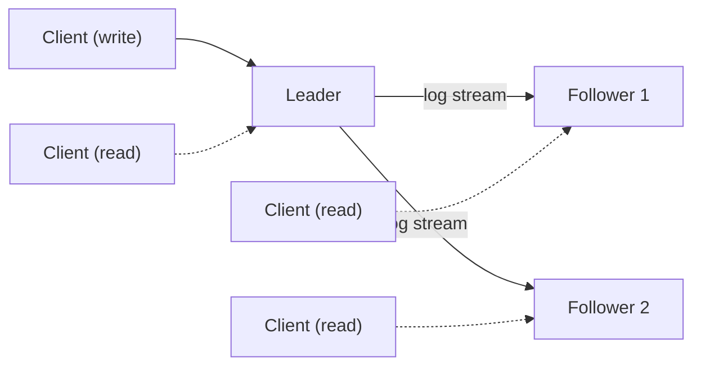
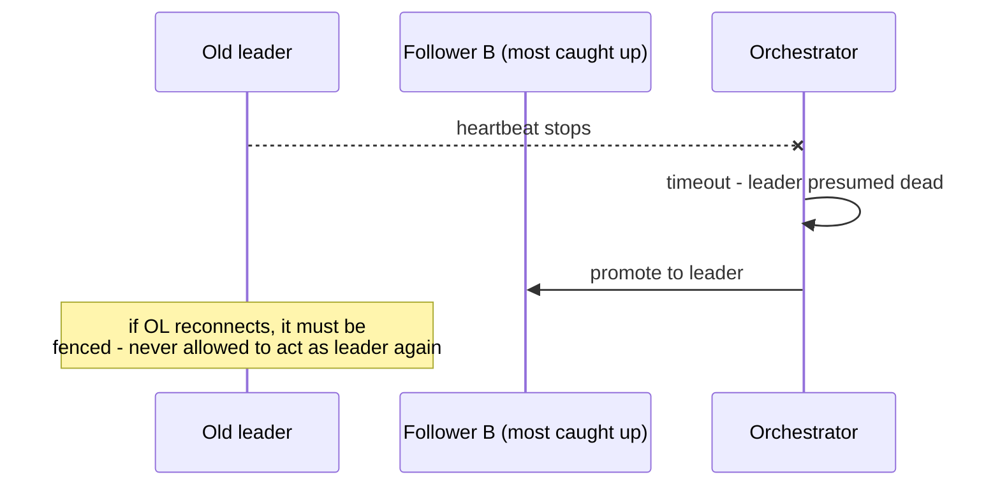
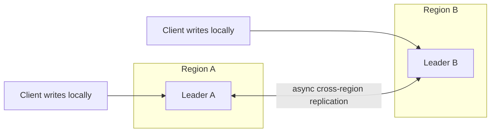
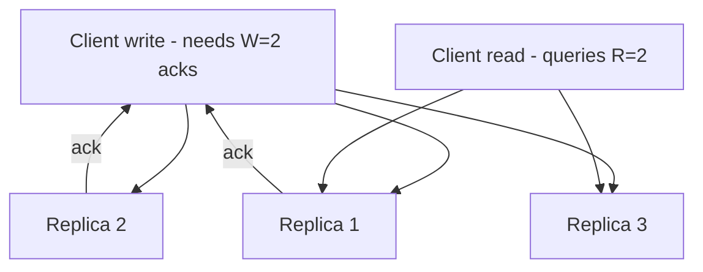

# Replication

*Keeping the same data safely duplicated across machines — with one writer, many writers, or no fixed writer at all.*

`⏱️ ~8 min · 2 of 15 · L4`

> [!TIP] The gist
> Replication means storing the same data on multiple machines so no single one is a single point of failure or a bottleneck. There are exactly three ways to organize who's allowed to write: **one leader** (simple, but writes cap at one node), **several leaders** (writes scale across regions, but concurrent writes can conflict), or **no leader at all** (any replica takes writes/reads, consistency comes from **quorum overlap** — R + W > N). Whichever topology you pick, if replication is asynchronous, replicas can lag behind — and that lag causes specific, nameable bugs (a user not seeing their own write, time appearing to move backwards) that every system built on top has to actively defend against.

## Intuition

Think of three ways a team could keep multiple copies of a shared document up to date.

One person is the only one allowed to edit, and everyone else gets read-only copies that refresh a moment later (**leader-follower**). Several people in different offices each edit their own local copy and periodically merge (**multi-leader** — great for speed, but two people editing the same paragraph now need a merge rule). Or: nobody's copy is "the" copy — any team member can jot a change on any copy, and the group relies on "enough people saw it" to know what's true (**leaderless**, backed by quorums).

None of these is universally right — each is the correct answer to a different question: *do I need write scaling? geographic write locality? maximum write availability during outages?*

## The concept

**Replication** is keeping identical data durably stored on multiple machines (replicas) so the failure or slowness of any single one doesn't mean the loss or slowness of the data itself. It exists for three reasons, usually combined: **fault tolerance** (a dead node isn't a data-loss event), **read scaling** (spread read load across many copies), and **latency** (place a copy near the users reading it).

One axis cuts across every topology below: does the node accepting a write **wait** for another replica to confirm before telling the client "done"?

- **Synchronous** — waits; the replica is never behind by a committed write, but write latency now includes a network round trip, and an unreachable replica can block the write entirely.
- **Asynchronous** — acknowledges immediately, ships the change in the background; fast, but a crash before shipping means an acknowledged write can be lost.
- **Semi-synchronous** — waits for just one (or a small, configurable number of) replicas, letting the rest lag; most of async's speed, most of sync's durability.

This choice reappears inside all three topologies — as a leader's wait policy, or (in leaderless systems) as the size of the write quorum **W**.

## How it works

### Topology 1 — Leader-follower (single-leader)

Exactly one node — the **leader** — accepts writes. Any number of **followers** receive a stream of every change and apply it locally; they can serve reads but never accept writes directly.

Changes ship as the literal WAL bytes (PostgreSQL's default physical replication — [same log L2 covered for crash recovery](../L2/09-write-ahead-log.md)), or as a decoded row-level description that's storage-format-independent (MySQL's row-based binlog, PostgreSQL logical replication) — the latter is exactly what change-data-capture tools read from later in this level.

Writes are trivially serialized (one writer, no conflicts possible) and reads scale by adding followers — the reason this is the default in PostgreSQL, MySQL, and MongoDB (replica sets). The cost: write throughput is capped at one node, and that node is a single point of failure until **failover** completes.

**Failover** has four steps, each with its own failure mode: detect the leader is gone (heartbeat timeout — too short causes false failovers, too long extends real downtime), elect the most-caught-up follower (choosing a lagging one would silently drop writes), reconfigure clients/followers to point at the new leader, and **fence** the old leader so it can never accept writes again if it reconnects (two leaders both believing they're in charge is "split brain").

Correctly electing a new leader without risking split brain is genuinely a **consensus** problem — neither PostgreSQL nor vanilla MySQL solves it internally; both lean on an external orchestrator (Patroni, Orchestrator) backed by its own consensus store. MySQL Group Replication instead folds Raft/Paxos-style consensus directly into the database, so failover doesn't need bolted-on tooling.

### Topology 2 — Multi-leader

More than one node accepts writes directly, each replicating its own writes — usually asynchronously — to every other leader.

This fits three cases leader-follower serves badly: **multi-region active-active** (writes accepted locally, no cross-continent round trip), **offline-capable clients** (a disconnected device is, in effect, its own leader), and **collaborative editing** (every editor's keystroke is a first-class write, not routed through one node).

The new problem it introduces: **write conflicts** — two leaders can accept a write to the same record with no coordination. Four resolution strategies, roughly least to most sophisticated:

- **Last-write-wins (LWW)** — highest timestamp wins, loser silently discarded. Simple, but vulnerable to clock skew, and it's an *unconditional* data-loss resolution (fine for "last seen online," dangerous for two concurrent inventory decrements).
- **Version vectors** — detect when two writes are genuinely concurrent (neither happened-before the other) and surface both as "sibling" versions for the application to merge, rather than silently picking one. Amazon's original Dynamo paper and Riak use this.
- **CRDTs** — data types engineered so concurrent updates merge deterministically by construction (a counter sums both increments instead of one overwriting the other). Only works for specific shapes (counters, sets, registers), but for those, no conflict ever needs resolving. Redis Enterprise's Active-Active uses this.
- **Application-defined merges** — CouchDB keeps *all* conflicting revisions and exposes them to the application (e.g., union two shopping-cart item lists instead of discarding one).

### Topology 3 — Leaderless

No designated leader; any replica can accept a read or write. Consistency comes from **quorum overlap**, not a single serializing writer.

A client sends a write to all **N** replicas that own a key and considers it successful once **W** acknowledge. A read queries **R** replicas and returns the freshest value, repairing any stale ones it finds.

**The quorum math: R + W > N.** If any write set of size W and any read set of size R are drawn from the same N replicas, and R + W > N, then by pigeonhole every possible write set and every possible read set must share at least one replica — so some replica the read touches has necessarily seen the latest acknowledged write.

Worked example, N = 3:

| W | R | R+W | Overlap guaranteed? | Cost if 1 node is down |
| --- | --- | --- | --- | --- |
| 1 | 1 | 2 | No | Nothing fails, but no consistency guarantee |
| 2 | 2 | 4 | Yes | Both reads and writes still succeed (2 of 2 remaining respond) |
| 3 | 1 | 4 | Yes | Writes fail outright (can't reach all 3) |
| 1 | 3 | 4 | Yes | Reads fail outright (can't reach all 3) |

Important precision: quorum overlap guarantees a read *can* see the latest write, not that it always will — a read racing an in-flight write, or clock skew between concurrent writes, can still surface a stale or ambiguous result. This is weaker than linearizability, not a substitute for it ([full formal treatment in L5](../L5/01-cap-and-pacelc.md); [tunable per-operation consistency levels get their own later L4 topic](07-quorums.md)).

When fewer than W of a key's true home replicas are reachable (a partition), a **sloppy quorum** accepts the write on other reachable nodes instead, tagging it with a **hint**; once the true home node comes back, **hinted handoff** forwards the write there. This trades strict R+W>N overlap for write availability during the outage — Dynamo/Cassandra's explicit answer to "what if we can't even reach W of the right nodes." Two background processes then keep replicas converging even for keys nobody reads: **read repair** (fix a stale replica the moment a read notices it) and **anti-entropy** (a Merkle-tree comparison that finds and repairs drift independent of read traffic).

### Replication lag: three concrete bugs

Any asynchronous replication — leader-follower's async mode, multi-leader's cross-region shipping, leaderless's low-quorum reads — means a replica can be **behind**. That lag produces specific, observable symptoms:

- **Read-your-writes violation** — you update your profile photo, reload instantly, and the read lands on a follower that hasn't caught up yet: you see the *old* photo. Fix: route a user's own post-write reads to the leader, or to a replica confirmed caught up to that write's position.
- **Monotonic reads violation** — two reads in a row land on different replicas with different lag, so the second read shows *older* data than the first — time appears to run backwards. Fix: route a given user's reads consistently to the same replica.
- **Consistent prefix reads violation** — a reply appears before the question it replies to, because the two landed in differently-lagging partitions. Fix: keep causally related writes on the same partition.

## In the real world

- **Stripe — leader-follower (MongoDB replica sets, fintech).** Stripe's internal DocDB service runs each shard as a classic replica set — one primary, several secondaries, automatic promotion on failure — and layers its own CDC-based replication service on top so a live shard migration blocks writes just long enough to ship every outstanding oplog entry before cutover, never losing a write in flight. ([Stripe engineering blog, 2024](https://stripe.dev/blog/how-stripes-document-databases-supported-99.999-uptime-with-zero-downtime-data-migrations))
- **Discord — leaderless (Cassandra, quorum-tuned).** Discord ran Cassandra at replication factor 3 with quorum-level reads/writes. Because there's no leader, a "hot" key's every query — not just one node's — suffered latency; the operational cost of continuous repair and rebalancing at 177 nodes was a major driver of their 2022 migration to ScyllaDB (72 nodes). ([Discord Engineering Blog, 2023](https://discord.com/blog/how-discord-stores-trillions-of-messages))
- **Uber — leader-follower evolving to consensus (MySQL, trip/payment infrastructure).** Uber's MySQL fleet ran single-primary async replication with an external failover chain rated around 120 seconds of write unavailability, plus a real risk of "errant" transactions the old primary had accepted but never shipped. Moving to MySQL Group Replication — consensus built into the database itself — cut failover write unavailability to roughly 10 seconds and eliminated that inconsistency class. ([Uber Engineering Blog, 2025](https://www.uber.com/us/en/blog/improving-mysql-cluster-uptime-part1/))
- **Redis Enterprise — multi-leader (CRDT-based active-active).** Each region runs its own writable instance of a shared "CRDB"; conflicts resolve automatically via CRDTs — a counter incremented concurrently in two regions sums correctly instead of one write clobbering the other. ([Redis Enterprise blog](https://redis.io/blog/getting-started-active-active-geo-distribution-redis-applications-crdt-conflict-free-replicated-data-types/))

## Trade-offs

| Topology | Who writes | Conflicts | Failure handling | Best fit |
| --- | --- | --- | --- | --- |
| Leader-follower | Exactly one leader | None needed — one writer, already serialized | External orchestrator or built-in consensus elects/fences a new leader | Read-heavy, simplicity, single-region low-latency writes |
| Multi-leader | Several (usually one per region/device) | Explicit — LWW, version vectors, CRDTs, or app merge | No failover needed; a leader's outage only removes local write availability | Multi-region active-active, offline clients, collaborative editing |
| Leaderless | Any replica, via quorums | Version vectors + read repair + anti-entropy | Tolerates node/AZ loss as long as a quorum remains; sloppy quorums extend this further | Very high write availability, tunable consistency |

> [!IMPORTANT] Remember
> Every replication topology answers "who's allowed to write, and what happens when writers disagree or go silent" — pick it by what you need (write scaling, geographic locality, maximum availability), not by default. And R + W > N only guarantees a read *can* see the latest write, not that it always will — that gap is exactly what read repair and anti-entropy exist to close.

## Check yourself

- For a leaderless system with N=5, propose a W and R that guarantee quorum overlap, and explain why using the R+W>N logic — then explain why satisfying it still isn't the same guarantee as linearizability.
- A user posts a comment, refreshes twice, and sees it, then doesn't, then does again. Which replication-lag symptom is this, and what's the standard fix?

→ Next: Partitioning and sharding
↩ comes back in: L4 (consistent hashing, quorums, CDC), L5 (CAP and consistency models)
