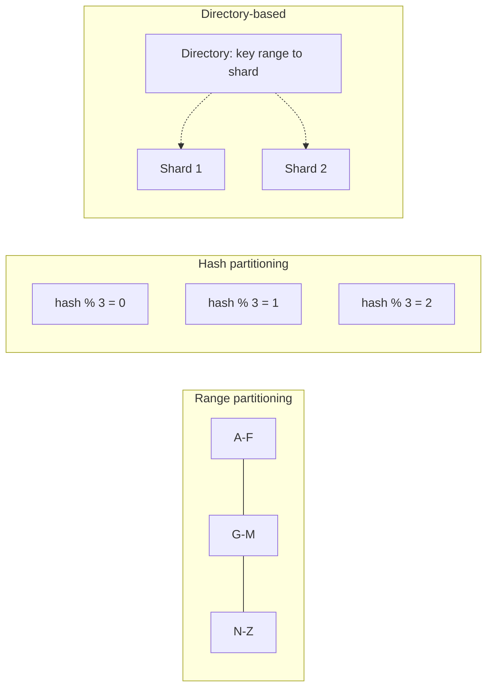
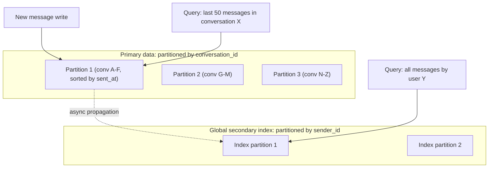

# Partitioning and Sharding

*Splitting different data across many machines so no single one has to hold or serve all of it.*

`⏱️ ~8 min · 3 of 15 · L4`

> [!TIP] The gist
> Partitioning (also called sharding) splits a dataset into disjoint slices, called partitions, and places each on a different node — no single node stores or serves everything. Three strategies answer "which partition owns this key": **range** (sorted, great for scans, risks hotspots on sequential keys), **hash** (evenly spread, but range scans become scatter-gather), and **directory-based** (an explicit lookup table, easy to rebalance, but the directory itself is a piece of state everyone must consult). Whichever you pick, each partition is *also* independently replicated — partitioning and replication are always combined, never a choice between.

## Intuition

Imagine a library too large for one building. You could split books alphabetically by author across several branches (range) — great for "give me every Steinbeck book," risky if one author (say, a school's required-reading writer) gets checked out constantly and overloads that one branch. You could scatter books randomly by a hash of the ISBN across branches (hash) — no branch gets overloaded by a popular author, but "every Steinbeck book" now means calling every branch. Or you could keep a card catalog that says exactly which branch holds which book (directory) — flexible to move books later, but now everyone has to trust that catalog is up to date.

None of these is "the" right answer — each is the right answer to a different access pattern.

## The concept

**Partitioning (interchangeably "sharding") is splitting a dataset into disjoint subsets — partitions or shards — and placing each on a different node, so no single node has to store or serve the whole dataset.** [Replication](02-replication.md) asked "how do I keep the *same* data safely duplicated"; partitioning asks the opposite question — "how do I split *different* data across many nodes." They're orthogonal, and combined in practice: a 12-node cluster typically holds a handful of partitions, each replicated across several of those nodes, not 12 independent unreplicated shards.

Two pressures drive the decision to partition:

- **The data is too big for one node** — a single machine's disk can't hold a petabyte-scale table, and even if it technically could, a full-table operation on that much data would take forever.
- **The data is too hot for one node** — even data that would *fit* on one machine can generate more read/write traffic than one machine's CPU and I/O can serve. Partitioning is the only way to scale **write** throughput horizontally, because it multiplies the number of nodes each independently accepting writes for their own slice of the keyspace — something leader-follower replication alone can never do (more followers means more read capacity, not more write capacity).

The **partition key** (shard key) is the field whose value decides which partition a row or document lives on. Choosing it well is the single highest-leverage decision in a partitioned system's design — it decides which queries stay fast (one partition) versus which must fan out everywhere (slow) — and it's hard to change later without a full migration.

## How it works

### Three strategies for "which partition owns this key"

- **Range partitioning** — keys are sorted and the keyspace is cut into contiguous ranges (`A–F` on partition 1, `G–M` on partition 2, ...). Keeps range scans cheap (a query for "every event between T1 and T2" touches only a few contiguous partitions) — Bigtable, HBase, and CockroachDB/Spanner all use it, splitting/merging ranges dynamically as they grow or shrink. The cost: a monotonic key (an incrementing timestamp or auto-increment ID) makes *all* new writes land on whichever range is currently "last," creating a hot partition while every other range sits idle.
- **Hash partitioning** — a hash function is applied to the key, and the hash value (not the key) decides the partition, typically via a **consistent-hashing ring**. A good hash scatters even adjacent keys uniformly, curing the monotonic-write hotspot — DynamoDB, Cassandra, and MongoDB's hashed shard keys all use this. The cost: hashing destroys ordering, so a range query can no longer touch a few contiguous partitions — it has to fan out to *every* partition and merge results, a **scatter-gather**. DynamoDB's partition-key-plus-sort-key design splits the difference: the partition key is hashed (spreading load), but within one partition the sort key stays sorted, so range queries scoped to one partition key stay cheap.
- **Directory-based (lookup) partitioning** — an explicit lookup table maps each key (or chunk of keys) to the node currently holding it, kept in a small, strongly-consistent config store. This decouples "which partition owns this key" (rarely changes) from "which node currently serves that partition" (can change freely) — moving a chunk is just updating one directory entry and migrating data in the background, not recomputing every key's assignment. MongoDB's config servers + `mongos` routers are the canonical example. The cost: the directory becomes shared state every node must consult (or cache), and a stale directory briefly misroutes requests.

### Partitioning secondary indexes

[L2 covered indexing on one node](../L2/08-indexing.md); once the underlying data is split across partitions, the secondary index has to be split too — and there are two genuinely different ways:

- **Local (document-partitioned) index** — each partition keeps its own index, covering only the data it already owns. Writes are cheap (touch one partition), but a query by the indexed field ("every order with `status = shipped`") must scatter-gather across every partition since matches could be anywhere. MongoDB and Elasticsearch/Lucene default to this.
- **Global (term-partitioned) index** — the index is partitioned separately, by the indexed term itself, so a query goes straight to the owning partition(s). Reads get cheap, but one document write may now need to update an index entry living on a *different* partition — an atomic cross-partition write is expensive, so this update is typically **asynchronous**, meaning the index can briefly lag. DynamoDB's Global Secondary Indexes work this way.

Same trade-off, one layer up: local bets writes matter more; global bets reads do.

### Partitioning is combined with replication, not chosen instead of it

Every partitioning strategy answers "which node(s) own this key"; [every replication topology from the previous topic](02-replication.md) answers "how many copies exist, and who can write to them." In practice a cluster with 8 partitions at replication factor 3, running leader-follower replication per partition, has **8 independent leaders total** — one per partition, each with its own 2 followers. A node is very often a leader for some partitions and a follower for others simultaneously; "leader" is a role scoped to a partition, not a label glued to a machine. Cassandra's leaderless replication composes the same way: a key's hash decides which N nodes on the ring own it, and R/W quorums apply within just those N replicas.

### Routing: how a request finds the right partition

Whoever sends a request needs to know which node to hit. Three broad approaches:

- **Gossip-based** — in a leaderless ring (Cassandra, Dynamo-lineage), nodes periodically exchange membership state with random peers so ownership information eventually reaches everyone; any node can act as a coordinator and forward a misdirected request.
- **A dedicated routing tier** — a stateless proxy (MongoDB's `mongos`, Vitess's `VTGate`) consults the directory and routes each query, so client code never needs to know the partitioning scheme exists.
- **A strongly-consistent config service** — ZooKeeper or etcd holds the authoritative partition-to-node mapping via consensus, so the directory itself doesn't become a single point of failure.

### Operational reality: adding nodes and resharding

Naive `hash(key) mod N` breaks catastrophically the moment N changes — adding one node changes the modulus for nearly every key, forcing almost the whole dataset to move (the exact problem [consistent hashing](05-consistent-hashing.md) — a later topic in this level — solves). Range partitioning rebalances more surgically: pick an oversized range, split it, move one half — since range boundaries are already stored as metadata, not computed from a formula. Resharding is inherently risky at any strategy because data has to move while the system stays live — a key mid-migration must be routed correctly, not dropped. A practical rule: create more logical partitions than current node count from day one (MongoDB and DynamoDB-style systems commonly do this), so future growth means "move existing chunks to new nodes," not "recompute every key's assignment."

## Worked example: partitioning a chat app's messages table

A messages table `(conversation_id, message_id, sender_id, body, sent_at)` needs to serve two queries: "last 50 messages in conversation X" (dominant) and "all messages by user Y" (rare).

- **Partitioning by `message_id`** (hash) spreads writes evenly overall, but scatters one conversation's messages across every partition — turning the dominant query into a scatter-gather just to reassemble one conversation.
- **Partitioning by `conversation_id`** instead keeps every message of one conversation on the same partition, with a sort key of `sent_at` giving a cheap, single-partition, sorted range read for "last 50 messages" — exactly matching the dominant access pattern.
- **The cost, made concrete:** one viral public channel now concentrates all its traffic on one partition — a hot partition with no way to split within the same key.
- **The rare query** needs a **global secondary index** on `sender_id`, updated asynchronously, so "all messages by user Y" goes straight to the index's own partition(s) instead of scattering across every conversation.

## In the real world

- **DynamoDB — hash partitioning with "split for heat."** DynamoDB hashes the partition key onto a consistent-hashing ring; a single partition supports roughly 3,000 strongly-consistent reads/second (or up to 9,000 eventually-consistent), and AWS recommends designing for 6,000 eventually-consistent reads/second for headroom. When one partition's traffic exceeds this, DynamoDB's adaptive capacity automatically splits it into two, each inheriting a subset of items and doubling available capacity. ([AWS Database Blog](https://aws.amazon.com/blogs/database/part-2-scaling-dynamodb-how-partitions-hot-keys-and-split-for-heat-impact-performance/))
- **Vitess/YouTube — directory-based routing over sharded MySQL.** YouTube built Vitess starting in 2010 after write traffic outgrew what read/write replicas alone could handle. `VTGate` proxies consult a `VSchema` (the directory, mapping key ranges to shards) to route and scatter-gather queries automatically, so the application talks to what looks like one logical database. YouTube reportedly scaled its user base "by a factor of more than 50" on this architecture. ([Vitess docs — History](https://vitess.io/docs/22.0/overview/history/))
- **Stripe DocDB — directory/chunk-based sharding (fintech).** Stripe's internal document database organizes data into chunks tracked by a chunk metadata service, which a fleet of proxies consults to find which of 2,000+ shards holds a given chunk — reportedly serving around 5 million database queries per second. Splitting a shard under pressure, or consolidating underused ones, is a background chunk-reassignment operation rather than a schema change. ([ByteByteGo, summarizing Stripe's engineering blog](https://blog.bytebytego.com/p/how-stripe-scaled-to-5-million-database))

*A dedicated search for NPCI/UPI's own partitioning architecture found only general vendor marketing about "sharded, always-on" banking infrastructure — no NPCI-published primary source on its specific shard key or throughput-per-shard. Flagged rather than filled in with an unverified claim.*

## Trade-offs

| Strategy | Range queries | Load distribution | Rebalancing | Canonical systems |
| --- | --- | --- | --- | --- |
| Range | Cheap — contiguous scan | Risk of hotspots on sequential keys | Cheap — split/merge ranges as metadata | Bigtable, HBase, CockroachDB, Spanner |
| Hash | Expensive — scatter-gather | Even, given a good hash | Naive `mod N` is catastrophic; consistent hashing bounds it | DynamoDB, Cassandra, MongoDB (hashed key) |
| Directory-based | Depends what's tracked underneath | As even as the assignment policy | Cheap — update one entry, migrate in background | MongoDB (config servers) |

| Secondary index | Write cost | Read cost | Consistency |
| --- | --- | --- | --- |
| Local (document-partitioned) | Low | High — scatter-gather | Immediately consistent |
| Global (term-partitioned) | High — may hit a remote partition | Low — targeted | Often asynchronous |

> [!IMPORTANT] Remember
> Partitioning splits *different* data across nodes; replication duplicates the *same* data — real systems always do both, never one instead of the other. And the partition key is the highest-leverage, hardest-to-undo decision you'll make: it decides which query stays a cheap single-partition read and which becomes a cluster-wide scatter-gather.

## Check yourself

- A time-series workload writes rows keyed by a strictly increasing timestamp. Why does range partitioning create a hotspot here, and what would hash partitioning break in exchange for fixing it?
- Why does a local secondary index make writes cheap and reads expensive, while a global secondary index makes the opposite trade — and why does the global index typically update asynchronously rather than atomically?

→ Next: Rebalancing and hotspots
↩ comes back in: L5, L12
