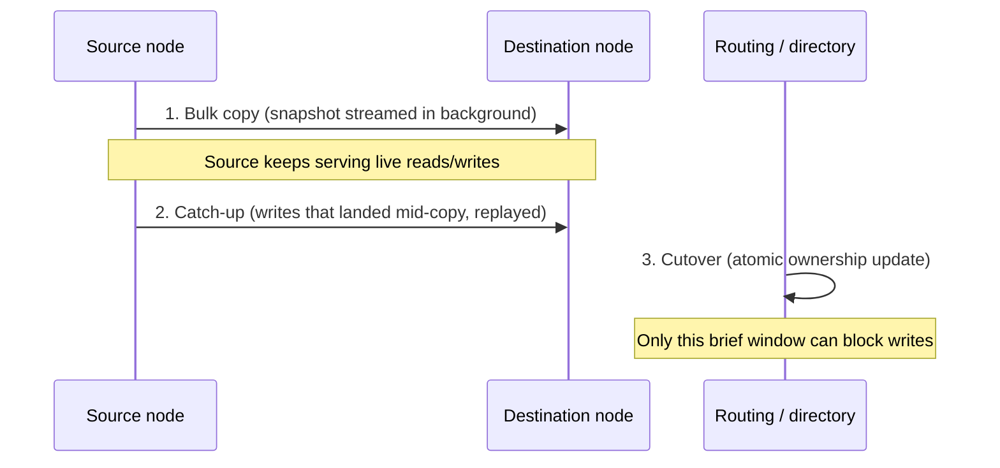
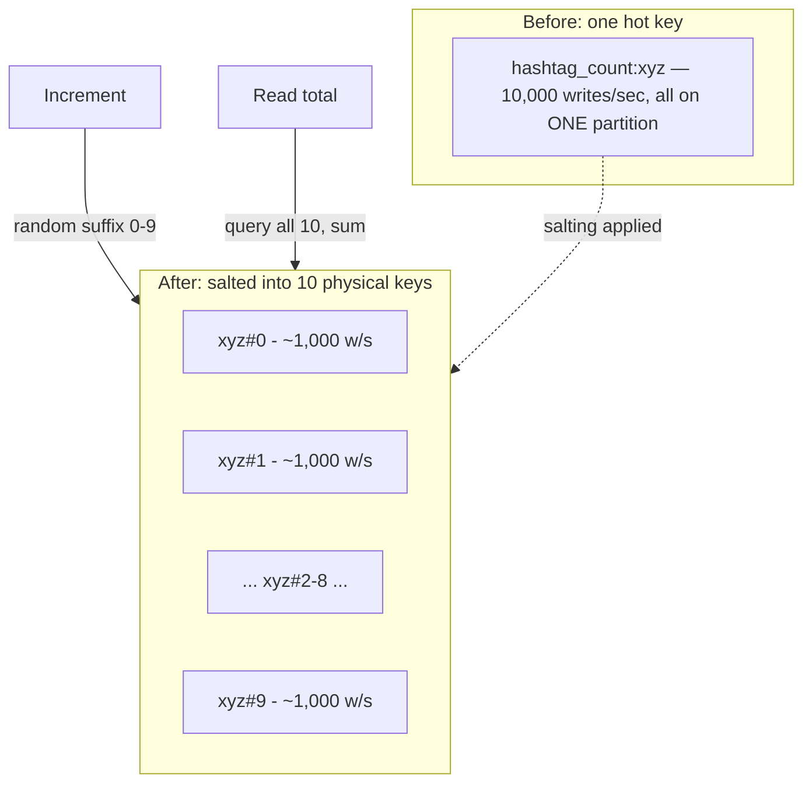

# Rebalancing and Hotspots

*A cluster is never static — nodes join, nodes die, and even a well-chosen key can still let one slice of traffic run away from the rest.*

`⏱️ ~7 min · 4 of 15 · L4`

> [!TIP] The gist
> **Rebalancing** is moving data (and the read/write responsibility for it) between nodes so load stays roughly even as the cluster changes — a node joins, a node leaves, or one partition just grows unevenly on its own. Three strategies structure partitions to make that movement cheap: **fixed number of partitions** (move whole pre-existing partitions), **fixed partition size** (split an overgrown one, dynamic splitting), and **dynamic, proportional to nodes** (many small virtual partitions per node — a preview of consistent hashing, next). A **hotspot** — one partition or one key taking disproportionate load — has four distinct root causes, and each needs a genuinely different fix: key salting, a better partition key, caching, or adaptive traffic-aware splitting. Splitting alone never fixes a single hot *key*.

## Intuition

Picture a warehouse where inventory is split across aisles. When a new aisle opens, someone has to physically carry boxes over so the new aisle actually shares the load — it doesn't help just by existing. When one aisle overflows because a product is suddenly popular, you might split that aisle's stock into two. But if the "overflow" is really just *one single item* being restocked constantly (a viral flash-sale product), splitting the aisle in half does nothing — that one item is still in one place, still overwhelmed. You'd need a different fix: put decoy copies of the item in several spots, or cache the answer to "is it in stock" instead of touching the shelf every time.

That's rebalancing (redistributing aisles) versus hotspot mitigation (fixing one overloaded item) — related, but solved with different tools.

## The concept

**Rebalancing is the process of moving data — and, in most designs, the read/write responsibility for it — between nodes so that load (storage, CPU, or traffic) stays roughly even across whatever nodes currently exist.** It's the ongoing, operational counterpart to [partitioning strategy](03-partitioning-and-sharding.md#three-strategies-for-which-partition-owns-this-key), which only answers "which partition owns this key, in principle" — rebalancing answers "membership or load just changed, how do we get to a balanced assignment without losing data or serving wrong answers along the way."

Three triggers force it, often within the same week on a real cluster:

- **Capacity added** — a new node joins and needs partitions actively moved onto it, or it just sits idle.
- **Capacity removed** — a node fails or is decommissioned, and its partitions need a new home.
- **Uneven growth, no membership change at all** — one range of keys (a large tenant, a busy time window) outgrows the rest purely from data skew.

A good rebalancing scheme is judged on three requirements: **load ends up fairly shared**, **reads/writes keep working while it happens**, and **no more data moves than necessary**. Naive `hash(key) mod N` fails the third one almost completely — changing N reshuffles nearly every key — which is exactly why none of the real strategies below use it.

A **hotspot** is a separate but related problem: a single partition or single key taking disproportionate load, independent of whether the cluster has enough *aggregate* capacity. The fix depends entirely on which of four causes produced it — that's the crux of this lesson.

## How it works

### Three ways to structure partitions so rebalancing stays cheap

| Strategy | What happens on a membership change | Cost |
| --- | --- | --- |
| **Fixed number of partitions** | Count is fixed forever at creation (e.g. 65,536); a membership change just moves whole, already-existing partitions between nodes — never recomputed | Must guess the final partition count correctly, up front |
| **Fixed partition size (dynamic splitting)** | A size (or request-rate) threshold triggers splitting one overgrown partition into two, moving roughly half its data | No up-front guess needed, but splits must be actively monitored, and a monotonic hot tail can re-split endlessly |
| **Dynamic, proportional to nodes** | Fixes partitions-*per-node*, not a total count — a joining node claims slivers split off many existing partitions (virtual nodes) rather than a whole chunk | Moves the least data per change, but tuning how many virtual partitions per node is its own knob |

The third row is Cassandra's modern **vnodes** default — many small, randomly scattered virtual partitions per physical node, so one node joining only claims small slivers from many others instead of one big contiguous chunk. That's the seed of [consistent hashing, covered next](05-consistent-hashing.md) — this lesson stops at "why bounding movement matters," the next one formalizes the ring mechanics.

### Moving a partition without dropping requests

Whichever strategy decides *what* moves, the mechanics of moving it are the same everywhere, in three phases:

1. **Bulk copy** — the destination streams a snapshot while the source keeps serving traffic normally.
2. **Catch-up** — writes that landed during the (possibly long) bulk copy get replayed, the same way [replication catches up a lagging follower](02-replication.md#leader-follower-single-leader-replication).
3. **Cutover** — routing metadata atomically flips to the new owner; only this brief window needs to block or reject writes for that one partition.

A request arriving mid-migration gets routed to whatever the (possibly briefly stale) directory currently says; if that's wrong, a "moved" response tells the client to refresh and retry.

### Hotspots: four causes, four different fixes

Splitting a partition only ever fixes a *range* problem — it can't touch a hot key trapped inside one row:

| Cause | The actual problem | Correct fix |
| --- | --- | --- |
| Skewed key distribution (celebrity account) | One key's traffic dwarfs its keyspace-neighbors | Composite key, or salting if it's one value |
| Poor hash / low-cardinality field | Many distinct keys collide onto few partitions | Higher-cardinality key or better hash input |
| Time-based monotonic key | "Now" always lands on the same tail partition | Prefix with hash/random value |
| Single hot key inside a partition | One row, not a range, is overloaded | Salting (writes) or caching (reads) — splitting does nothing |

- **Key salting** — split one logical key into N physical keys (`counter#0` .. `counter#9`), each absorbing ~1/N of the writes; reads fan out to all N and sum.
- **A better partition key** — the durable fix, e.g. `(hashtag, time_bucket)` instead of `hashtag` alone. This is a direct preview of [data modeling, later in this level](06-data-modeling-and-denormalization.md).
- **Caching in front of a hot key** — absorbs read-heavy hotspots (a celebrity profile) using exactly [the cache mechanics from L3](../L3/03-redis-vs-memcached.md); does nothing for a write-heavy hot key.
- **Adaptive, traffic-aware splitting** — splitting triggered by observed *request rate*, not just data size (DynamoDB's "split for heat" below) — but this only helps a hot *partition*; if one single key is the entire spike, splitting still leaves it hot on one side.

### Manual vs automatic

A human deciding when to rebalance (manual — control, but slow reaction) versus the system deciding for itself (automatic — fast reaction, but risks moving data at exactly the busiest moment) is a separate axis from which strategy is used. High-stakes systems (payments) often split the difference: automated detection, human-gated execution.

## Worked example: a viral hashtag counter

A social app shards posts by `hashtag`. One hashtag goes viral: its chunk grows fast and gets split by the balancer — this works cleanly *if* the viral traffic spreads across many nearby hashtag values. But suppose the real traffic is a single counter, `hashtag_count:xyz`, incremented on every post — a hot **key**, not a hot range. Splitting the chunk changes nothing; the counter still lives on one side.

The fix: salt it into ten physical keys.

Each physical key now takes ~1/10th the write load; a read for the true total queries all ten and sums them — ten small reads traded for removing the single-key bottleneck entirely.

## In the real world

- **DynamoDB adaptive capacity ("split for heat").** Before this feature, DynamoDB spread provisioned throughput evenly across partitions, so an app with genuinely uneven traffic (AWS's own example: a table partitioned by Canadian province, where Ontario and Quebec alone drive ~60% of the write traffic) would throttle on the hot partition long before the table's total capacity was used. Adaptive capacity now boosts a hot partition's allocation automatically — originally taking 5-30 minutes, updated in 2019 to kick in instantly. ([AWS Database Blog](https://aws.amazon.com/blogs/database/how-amazon-dynamodb-adaptive-capacity-accommodates-uneven-data-access-patterns-or-why-what-you-know-about-dynamodb-might-be-outdated/))
- **Discord — fixing a hot partition upstream of the database.** Popular channels generated orders-of-magnitude more read traffic than ordinary ones on Discord's Cassandra cluster. Rather than relying on splitting alone, Discord added a data-services layer that does **request coalescing** — many simultaneous requests for the same hot channel collapse into one underlying query — using consistent-hash-based routing so repeat requests land on the same instance. ([Discord Engineering Blog](https://discord.com/blog/how-discord-stores-trillions-of-messages))
- **Stripe DocDB (fintech) — throttled, gated rebalancing at payments scale.** Stripe's Data Movement Platform migrated 1.5 petabytes in 2023 alone, run as deliberate background rebalancing rather than emergency reaction to a live hotspot, plus an in-progress heat-management system that balances shards on both size *and* throughput. ([Stripe Engineering Blog](https://stripe.dev/blog/how-stripes-document-databases-supported-99.999-uptime-with-zero-downtime-data-migrations))

*A dedicated search for NPCI/UPI's own rebalancing or hotspot-mitigation practices found only generic third-party explainers, not a primary NPCI source describing its shard key or a specific incident — flagged rather than filled with an unverified claim.*

## Trade-offs

| Rebalancing trigger | Same for all strategies |
| --- | --- |
| Node added | Move/split partitions onto it, or it stays idle |
| Node removed | Its partitions must be relocated to survivors |
| Uneven growth, no membership change | The overgrown partition must be split regardless |

| Manual | Automatic |
| --- | --- |
| ✅ Scheduled, throttled, reviewed by a human | ✅ Reacts in minutes, no ongoing attention needed |
| ❌ Slow to react to a sudden 2 a.m. hotspot | ❌ Can transiently worsen load if it moves data at peak |

> [!IMPORTANT] Remember
> Rebalancing fixes an unevenly-loaded *cluster*; hotspot mitigation fixes an unevenly-loaded *key or partition* — and splitting, the default tool for the first, is powerless against a single hot key, which needs salting, a better key, or caching instead.

## Check yourself

- A single row's counter is incremented thousands of times per second by a viral event. Why does adding more partitions do nothing to relieve this, and what would actually help?
- Walk through the three phases a rebalance uses to move a partition from one node to another — why does only the last phase need to block writes?
- Distinguish a hotspot caused by skewed key distribution from one caused by a single hot key inside a partition, and explain why the fix for one doesn't fix the other.

→ Next: Consistent hashing (virtual nodes)
↩ comes back in: L5, L12
