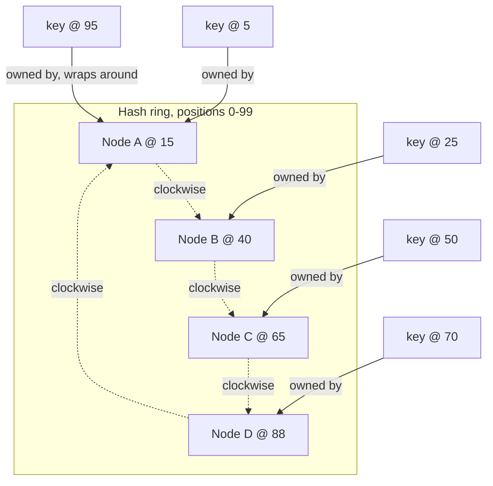

# Consistent Hashing (Virtual Nodes)

*The ring that lets a cluster gain or lose a node while moving only a sliver of the data — the fix both of the last two lessons pointed forward to.*

`⏱️ ~8 min · 5 of 15 · L4`

> [!TIP] The gist
> Naive `hash(key) mod N` breaks the moment N changes — adding one node reshuffles almost every key. **Consistent hashing** fixes this by hashing both nodes and keys onto the same fixed circle (a "ring"); a key belongs to the first node reached going clockwise. Because a node's ring position doesn't depend on how many other nodes exist, joining or leaving only disturbs the *one* neighboring arc — roughly `1/(N+1)` of the keyspace, not nearly all of it. Giving each physical node many small, scattered **virtual nodes (vnodes)** instead of one position spreads that movement across many neighbors and evens out load that would otherwise depend on placement luck.

## Intuition

Imagine a round table with numbered seats going all the way around, wrapping back to seat 1 after the last one. Instead of assigning guests to seats by counting "guest 17 out of 40 total guests, so seat 17 mod 40," you give every guest a *fixed* seat number based only on their own name — computed once, never recalculated when someone else arrives or leaves. Guests eat at whichever seat is theirs, then keep walking clockwise; when new dishes rotate around, each dish stops in front of whichever guest it reaches first.

If a new guest squeezes in between seat 15 and seat 40, only the people already sitting between 15 and the new arrival need to shuffle down slightly — everyone at the far side of the table is untouched. That's the whole trick: fix positions independently of the *count*, and only the local neighborhood ever has to move.

## The concept

**Consistent hashing is a scheme that maps both nodes and keys onto the same fixed, node-count-independent hash space, arranged as a circle, so that adding or removing a node changes only the ownership of keys in its immediate neighborhood on that circle — not a recomputation of every key's assignment.**

The formal picture:

- **The ring** — a fixed range of hash output values (e.g. 0 to 2^32 − 1), conceptually wrapped into a circle so the maximum value connects back to zero.
- **Node placement** — each node is hashed (using its ID, IP:port, or an assigned token) onto one or more ring positions. This position depends only on that node's own identifier — never on how many other nodes currently exist.
- **Ownership rule** — a key's owner is whichever node's position is the first one reached going **clockwise** from the key's own hash position (its **successor**).
- **Virtual nodes (vnodes)** — instead of one ring position per physical node, each physical node is hashed onto *many* scattered positions (via distinct labels like `"nodeA-vnode0"`, `"nodeA-vnode1"`, ...), so its total keyspace share is the sum of many small arcs rather than the luck of a single one.

Why this matters, precisely: because `mod` is not monotonic in its divisor, changing the node count N under naive `hash(key) mod N` changes almost every key's assignment — only about `1/(N+1)` of keys keep the same owner, meaning roughly `N/(N+1)` move, almost the whole dataset, to add one node's worth of capacity. Consistent hashing inverts that: a membership change moves only about `1/(N+1)` of keys — the small fraction that logically *needs* to relocate — and nothing else.

## How it works

### The naive scheme's failure, in numbers

Twelve keys hash to `3, 17, 22, 35, 41, 48, 53, 61, 74, 82, 91, 97`. With `N=4` nodes, then a fifth node added (`N=5`):

| Key hash | mod 4 | mod 5 | Moved? |
| --- | --- | --- | --- |
| 3 | 3 | 3 | no |
| 17 | 1 | 2 | **yes** |
| 22 | 2 | 2 | no |
| 35 | 3 | 0 | **yes** |
| 41 | 1 | 1 | no |
| 48 | 0 | 3 | **yes** |
| 53 | 1 | 3 | **yes** |
| 61 | 1 | 1 | no |
| 74 | 2 | 4 | **yes** |
| 82 | 2 | 2 | no |
| 91 | 3 | 1 | **yes** |
| 97 | 1 | 2 | **yes** |

Adding one node out of four — a 25% capacity increase — moved **7 of 12 keys (58%)**, not the 1-in-5 (20%) that logically needed to move to populate the new node. This is exactly the `hash(key) mod N` failure [partitioning and sharding flagged as "precisely the problem consistent hashing was invented to solve"](03-partitioning-and-sharding.md#operational-concerns-adding-nodes-and-resharding), and it's why no production hash-partitioned system actually computes ownership this way.

### The ring, worked

Four nodes hash onto a ring of 100 positions (0-99, kept small purely so the arithmetic is checkable by hand — real systems use 32-bit or 160-bit spaces): A=15, B=40, C=65, D=88. Five keys hash to 5, 25, 50, 70, 95. Each key's owner is the first node reached clockwise:

| Key position | First node clockwise | Owner |
| --- | --- | --- |
| 5 | 15 | A |
| 25 | 40 | B |
| 50 | 65 | C |
| 70 | 88 | D |
| 95 | wraps past 99 to 15 | A |

Each node owns the contiguous arc from its predecessor's position (exclusive) to its own (inclusive): A owns (88,15] (size 27), B owns (15,40] (size 25), C owns (40,65] (size 25), D owns (65,88] (size 23) — together covering the whole ring exactly once.

### Adding and removing a node: movement stays local

**Adding.** A fifth node, E, joins at position 30 — inside B's (15,40] arc. E takes (15,30] (size 15); B shrinks to (30,40] (size 10). **A, C, and D's arcs never change.** Of the five sample keys, only the one at position 25 moves — from B to E. **1 of 5 keys moved (20%)**, matching the `1/(4+1)` expectation, and it moved from *one specific neighbor*, not scrambled cluster-wide.

At real scale: a ring with 1,000,000 keys across 10 nodes gaining an 11th moves roughly `1,000,000 / 11 ≈ 90,900 keys` — all carved from whichever single node's arc the new position landed in, leaving the other 9 nodes' ~909,100 keys untouched. Compare that to naive `mod N`'s ~909,100 keys moved for the identical change — **near-mirror-image outcomes**.

**Removing.** Removing C (position 65) means its whole arc, (40,65], has nowhere to go but its clockwise successor: D absorbs it, growing to (40,88] (size 48). A and B are untouched. **A node leaving dumps its entire arc onto exactly one neighbor** — worth remembering, because it's exactly the problem vnodes fix next.

### Virtual nodes: fixing load imbalance

One token per node creates two problems:

1. **Uneven arcs, purely from placement luck.** Four single-tokened nodes at positions 2, 8, 15, 60 produce arcs of size 42, 6, 7, and 45 — two nodes holding ~42-45% of the keyspace, two holding only ~6-7%, even though each is "supposed to" own 25%.
2. **One join/leave dumps a whole, possibly oversized, chunk onto one neighbor** — as the removal example just showed.

**The fix:** hash each physical node onto many scattered positions instead of one. A node's total share becomes the *sum* of many small, independently-placed arcs, which — the same way an average of many samples converges tighter than any single sample — concentrates much closer to the true `1/N` share as vnode count grows.

**Worked comparison, 4 tokens per node.** Sixteen tokens placed at: A = 4, 28, 55, 80; B = 11, 37, 61, 88; C = 19, 44, 70, 93; D = 33, 49, 76, 97. Each node's total share: **A=26, B=25, C=29, D=20** — a spread of only 20-29%, versus the single-token example's wild 6-45% spread.

**Worked comparison, joining with vnodes.** A fifth node E joins the 16-token ring above with its own 4 tokens at 7, 24, 46, 67 — each landing inside a *different* existing node's arc: 7 takes 3 from B, 24 takes 5 from A, 46 takes 2 from D, 67 takes 6 from C. E's total new share: 3+5+2+6 = 16 (close to the ideal `100/5 = 20`), assembled from four small pieces taken from **all four** existing nodes. Compare to the single-token join earlier, where the entire new arc came from **one** neighbor (B alone lost 15 of 25). Vnodes convert "one big chunk from one unlucky neighbor" into "many small chunks spread across the whole cluster" — delivering exactly what [rebalancing and hotspots previewed](04-rebalancing-and-hotspots.md#three-ways-to-structure-partitions-so-rebalancing-stays-cheap) as "a membership change that splits the load contribution of many existing nodes by a small amount each."

### Finding a key's replica set on the ring

At replication factor N, walk clockwise from a key's position exactly as for ownership, but keep collecting **distinct physical nodes**, skipping any vnode token that belongs to a physical node already counted.

**Worked example, N=2.** Walking clockwise, the coordinator meets tokens in this order: `42 (node C)`, `44 (node C)`, `50 (node D)`. Token 42 → count C as replica 1. Token 44 → also C, already counted, skip. Token 50 → D, a new physical node, count as replica 2. Two distinct nodes found, walk stops: replica set is `{C, D}`. This is the original Dynamo paper's **preference list**, and it's exactly the N-node set that [leaderless replication's R/W quorums](02-replication.md#the-write-path) and [per-partition replica sets](03-partitioning-and-sharding.md#partitioning-is-combined-with-replication-not-chosen-instead-of-it) operate over.

## In the real world

- **Amazon DynamoDB** — the original Dynamo design used a fully peer-to-peer ring with gossip-based membership; the production service has since moved that *coordination* to logically-centralized services, but the underlying ring-based item placement this lesson derives is still how partitions get their assignment. `verify` — the centralization detail is confirmed via a paper summary rather than the primary USENIX PDF.
- **Apache Cassandra** — `num_tokens` (vnodes per physical node) defaults to **16** as of Cassandra 4.0, down from a legacy default of 256 — not an arbitrary cut, but made possible once Cassandra 3.0 shipped a smarter token-allocation algorithm that deliberately splits the *largest* existing ranges instead of scattering tokens at random, so 16 tokens with the new algorithm balances load about as well as 256 random ones used to.
- **Discord** — its Data Service layer routes requests using consistent hashing keyed on channel ID, so all requests for one channel land on the same instance and can be coalesced into a single query — the same ring mechanic used for request routing rather than data storage. ([Discord Engineering](https://discord.com/blog/how-discord-stores-trillions-of-messages))

See [the research file](../../../research/backend/L4/05-consistent-hashing.md) for full sourcing and the DynamoDB paper caveat.

## Trade-offs

| Scheme | Key movement on membership change | Load balance | Overhead | Canonical systems |
| --- | --- | --- | --- | --- |
| Naive `hash(key) mod N` | Catastrophic — roughly `N/(N+1)` of all keys | Even, but only while N is fixed | None | Not used in production, for this exact reason |
| Consistent hashing, 1 token/node | Bounded — `~1/(N+1)`, but dumped on/taken from one neighbor | Uneven — placement luck can give a node far more or less than `1/N` | Minimal | Original Chord/early Dynamo |
| Consistent hashing + vnodes | Bounded, spread across many neighbors in small pieces | Much tighter around `1/N` as vnode count grows | Higher — every vnode is a tracked, gossiped token | Cassandra (`num_tokens`), Riak, DynamoDB's ring internals |

**What this does *not* fix.** Consistent hashing balances *keyspace*, not *traffic per key*. A celebrity's key still hashes to exactly one ring position regardless of vnode count — if that one key is disproportionately hot, more vnodes do nothing about it. [Salting, caching, and adaptive splitting](04-rebalancing-and-hotspots.md#hotspots-four-causes-four-different-fixes) remain necessary on top of this, not replaced by it.

> [!IMPORTANT] Remember
> Consistent hashing bounds key movement to roughly `1/(N+1)` of the keyspace per membership change by fixing node and key positions on a shared ring instead of recomputing `mod N`; virtual nodes then spread that movement — and each node's baseline load — across many small pieces instead of one lucky (or unlucky) neighbor.

## Check yourself

- On a ring with nodes at positions 15, 40, 65, 88 (out of 0-99), a key hashes to position 62. Which node owns it, and why? If a new node joins at position 58, does that key's owner change — does node D's arc change at all?
- Explain why a single-token-per-node ring produces uneven arc sizes even with "randomly" chosen positions, and why adding many small tokens per node fixes this without changing any node's *expected* share.
- At replication factor 3, walking clockwise from a key's position, a coordinator meets tokens belonging to nodes `B, B, A, C` in that order. Which three nodes end up in the replica set, and why is the second `B` skipped?
- A table's partition key is a celebrity's user ID that draws far more traffic than any other key. Why does adding more vnodes to the cluster do nothing to relieve this, and what would actually help?

→ Next: Data modeling and denormalization
↩ comes back in: L5, L12
