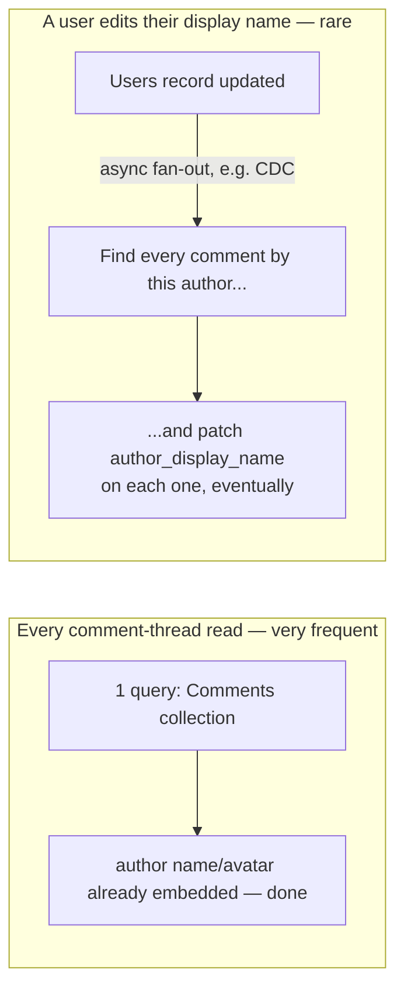
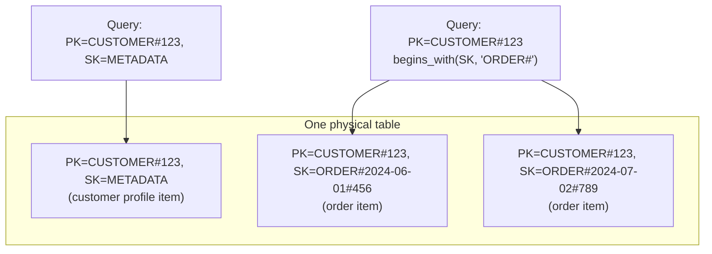

# Data Modeling and Denormalization

*The payoff topic four earlier lessons in this level all deferred to — how you actually design the schema around the access pattern instead of the other way around.*

`⏱️ ~9 min · 6 of 15 · L4`

> [!TIP] The gist
> In a relational schema you normalize first and let the query planner figure out joins later. Most NoSQL systems remove that assumption — there's no cheap join, so you have to flip the order: **enumerate every access pattern first, then shape the keys and records to answer each one with a single partition read.** The main tool is **denormalization** — deliberately duplicating data so a read never needs a second lookup — paired with **composite keys** (partition key + sort key) that let one entity be found several different ways. Both cost the same thing: the update anomalies normalization was built to prevent come back, on purpose, in exchange for reads that stay fast and single-partition no matter how big the dataset gets.

## Intuition

Keep a master address book in one drawer, and every time you mail an invitation you walk over, look up the address, and copy it onto the envelope. That's normalized — one source of truth, a little walking on every use.

Now instead write each guest's address directly on the invitation the moment you create it. Mailing is now instant — no drawer trip. But if that guest moves house, you don't just update one card in the drawer; you have to track down and correct every invitation, party favor, and thank-you note you ever wrote with their old address. You've traded a cheap, frequent read for an expensive, rare update — and that trade is only smart if people move far less often than you mail things to them.

That's the entire discipline in this lesson: duplicate data on purpose, but only where the read happens often enough to be worth the update headache.

## The concept

**Data modeling for NoSQL is the discipline of shaping a record's keys and body around the specific queries an application actually runs, so that each named access pattern is answered by a single partition read rather than a join or a scatter-gather.** [Denormalization](../L2/02-normalization-forms.md#denormalization-the-deliberate-trade-off) is its main technique: deliberately duplicating data across records so a read that would otherwise need a second lookup can be satisfied from one place.

The core knowledge to take away:

- **The design order inverts.** Relational modeling normalizes the data first and writes whatever query is needed later, because a join is cheap. NoSQL modeling enumerates every access pattern *first* — every query, how often it runs, how fast it must be — and only then decides what a record looks like and which field is the key.
- **"Correct" means something different.** A relational schema is correct if it eliminates redundancy and anomalies (provable via functional dependencies). A NoSQL schema is correct if every named access pattern resolves to one partition read (or a small, bounded number of them).
- **The composite key is the workhorse.** A **partition key** decides which node/partition owns an item; a **sort key** orders items within that partition. Together they let one entity answer two different questions cheaply: "give me this one item" (exact match on both) and "give me a range of related items" (exact match on partition key, range on sort key) — no scatter-gather, because everything sharing a partition key sits physically together.
- **It is not "skip normalization."** It trades one rigorous discipline (normalize by functional dependency) for a different, equally rigorous one (model by access pattern, verified by "can this be answered by one partition read"). Both are precise; they optimize for opposite things.

## How it works

### Denormalization: duplicate the joined data into the record

A social app renders every comment's author name and avatar next to the comment body — the single most frequent read in the app.

**Normalized** (the relational instinct): `Comments(comment_id, post_id, author_id, body)` plus a separate `Users(user_id, display_name, avatar_url)` — rendering a thread means resolving `author_id` against `Users` for every comment, a join (or an extra round-trip per author in a joinless store) on every page view.

**Denormalized**: embed the author's name and avatar directly in each comment:

```json
{
  "comment_id": 9001,
  "post_id": 501,
  "author_id": 12,
  "author_display_name": "ava.codes",
  "author_avatar_url": ".../ava.png",
  "body": "nice shot"
}
```

Rendering the thread is now one query, one collection, done. The cost shows up only when Ava edits her display name: every comment she's ever written now holds a stale copy, and all of them eventually need patching — the exact **update anomaly** normalization was built to make impossible, reintroduced deliberately.



The fan-out is handled **asynchronously** — a background job or a change-stream off the `Users` table — accepting a bounded window where a comment shows a stale name, in exchange for every *read* staying a single-partition lookup forever. The bet only works because reads (millions of page views) vastly outnumber writes (rare profile edits). A field that changes on nearly every read — a live `like_count` — is exactly the wrong candidate: embedding it would mean the write fan-out happens constantly instead of rarely, dominating the cost it was supposed to avoid.

### Composite keys — closing the loop on the messages table

[Partitioning and sharding's messages-table example](03-partitioning-and-sharding.md#worked-example-partitioning-a-chat-apps-messages-table) chose `conversation_id` as the partition key so "last 50 messages in this conversation" stays a single partition — and flagged that choice as "the leading edge" of this very topic. Here's the mechanism it was leaning on: partition key `conversation_id`, sort key `sent_at` (or `message_id`). One partition key groups every message of one conversation together; the sort key keeps them ordered within it, so a range read (`sent_at` between two bounds, or "last 50") is one sorted scan on one partition — never a scatter-gather across the whole cluster. The second access pattern that example flagged as unsolved — "all of a user's messages across every conversation" — needs a **global secondary index** on `sender_id`, updated asynchronously, precisely because that query cuts across partition keys the primary layout wasn't built to serve.

This is the general shape of composite-key design: **one field picks the neighborhood (partition key), a second field picks the position within it (sort key)** — and a query that needs a third dimension gets its own index or its own denormalized copy, never a join.

### Single-table design — the technique taken to its limit

DynamoDB modeling practice pushes the composite-key idea as far as it goes: instead of one table per entity type, store *every* entity an application needs in **one physical table**, using generic, overloaded attribute names (`PK`, `SK`) whose meaning depends on which kind of item currently occupies them.



One query (`PK = CUSTOMER#123`) returns the customer's profile *and* every one of their orders, pre-sorted, zero joins — DynamoDB's own blog calls this "materializing joins" at write time. The cost is real: every access pattern has to be known and enumerated *before* the table is built, because bolting on an unanticipated query later often means a new index or a full migration, and the raw table becomes unreadable by inspection without knowing the `PK`/`SK` convention. Many teams deliberately choose multi-table design instead — one table per entity type, a few more round trips per request — to keep the schema legible and each entity's access patterns independently evolvable. Neither is universally right; it's the same read-cost-vs-flexibility trade this whole topic keeps restating, one level up.

### Relationships without joins, briefly

- **One-to-many** — **embed** the "many" side when it's small, bounded, and always read with its parent (a handful of shipping addresses on a customer). **Reference** it (its own items, keyed by the parent's ID as partition key) when it's large or independently queried — a post's comments can't be embedded once they number in the thousands without hitting document-size limits or degrading every write.
- **Many-to-many** — no join exists to fall back on, so the relationship is **duplicated on both sides**: `PK=USER#ava, SK=FOLLOWS#ben` alongside `PK=USER#ben, SK=FOLLOWER#ava`. Two physically separate items encode one logical fact, so "who does ava follow" and "who follows ben" are each single-partition reads. An unfollow must update both copies, and the two can briefly disagree — an eventual-consistency window accepted on purpose, because a distributed transaction across two partitions on every follow is exactly the coordination cost this database family was chosen to avoid.
- **Aggregates** ("how many followers does ava have") are **precomputed and stored as their own record**, incremented atomically as facts change, instead of scanned on every read. This is denormalization at its purest: a derivable fact, stored redundantly, so reading it costs one lookup instead of a scan.

## In the real world

- **DynamoDB single-table design.** AWS's own Database Blog frames it as "materializing joins" at write time, and names concrete reasons for it (fewer round trips for items accessed together) alongside concrete reasons against it (DynamoDB Streams' consumer limits, analytics pipelines wanting different strategies per table). The technique's most-cited independent explainer, Alex DeBrie, describes the same trade candidly: real difficulty retrofitting an unanticipated access pattern later, and a schema that "looks more like machine code than a simple spreadsheet." ([AWS Database Blog](https://aws.amazon.com/blogs/database/single-table-vs-multi-table-design-in-amazon-dynamodb/); [Alex DeBrie](https://www.alexdebrie.com/posts/dynamodb-single-table/))
- **Bluesky — denormalization and fan-out-on-write for timelines.** Migrating its read-heavy "AppView" to ScyllaDB, Bluesky's own engineers describe the direct cost in this lesson's exact vocabulary: "data must be denormalized, meaning it isn't stored as efficiently as in a relational database." A separate technical deep-dive shows the payoff in numbers: a fan-in ("query on read") implementation topped out around 600 requests/second with p99 latency over 60ms, while a fan-out-on-write reimplementation held tiny latencies near 800 requests/second — precomputing each user's timeline as posts arrive, rather than assembling it at read time. ([The Pragmatic Engineer](https://newsletter.pragmaticengineer.com/p/bluesky); [bitcrowd](https://bitcrowd.dev/timelines-from-elixir/))

See [the research file](../../../research/backend/L4/06-data-modeling-and-denormalization.md) for full sourcing, including the messages-table walkthrough extended to two more access patterns.

## Trade-offs

| Gained | Spent |
| --- | --- |
| Single-partition reads for every enumerated access pattern — no join, no scatter-gather | The update/insertion/deletion anomalies normalization eliminated by construction, reintroduced on purpose |
| Horizontal write scalability — each partition independently absorbs its own writes | Storage bloat — the same fact is physically stored in multiple places |
| Predictable, bounded read latency regardless of dataset size | Eventual inconsistency between duplicated copies, in the window before a fan-out completes |
| No coordination cost on the hot, frequent path (a comment read) | Real coordination cost pushed onto the cold, rare path (a display-name edit) — paid asynchronously, not never |

> [!IMPORTANT] Remember
> Enumerate the access patterns first, then design the keys and duplicate whatever data makes each one a single-partition read. Denormalize fields that are read far more often than they change; leave correctness-critical, frequently-updated fields (a balance, an inventory count) closer to normalized, transactional treatment.

## Check yourself

- In the comment-author example, explain precisely why embedding the author's display name is a good bet, but doing the same for a field like `like_count` would be a bad one.
- Revisit the messages-table example from partitioning and sharding: explain, in this lesson's vocabulary, why choosing `conversation_id` as the partition key was already "designing the schema around the access pattern" — and what part of that example (the sort key, the second access pattern) this lesson finished off.

→ Next: Quorums (R + W > N)
↩ comes back in: L12
