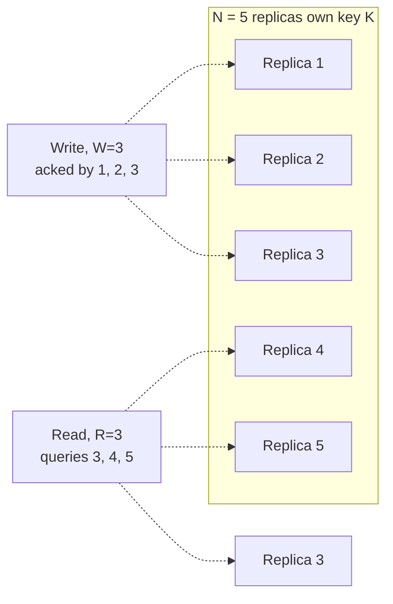

# Quorums (R + W > N)

*The precise arithmetic behind leaderless replication's promise that "enough" replicas agreeing is as good as all of them agreeing.*

`⏱️ ~8 min · 7 of 15 · L4`

> [!TIP] The gist
> In a leaderless store, no single node is "the" copy — a write is acknowledged by **W** of **N** replicas, and a read queries **R** of them. Choose R and W so that **R + W > N**, and a simple pigeonhole argument guarantees every read's query set overlaps with every prior write's acknowledgment set — a read is *guaranteed* to touch at least one replica that has seen the latest write. That's the whole trick: R and W are independent per-operation knobs, so the same cluster can be tuned from "fast reads, fragile writes" to "fast writes, fragile reads" to a balanced majority split — without changing how the data is stored. What it does **not** buy is a single agreed order of operations (linearizability); that's consensus's job, covered later.

## Intuition

Picture a rumor passed among a fixed group of N friends. To call the rumor "officially confirmed spread," you need at least W of them to have heard it — that's the write. Later, to find out what the current rumor is, you don't ask everyone; you ask R random friends and trust what you hear from them — that's the read.

If W + R is bigger than N, something has to give: two subsets of a group that size *can't* both avoid overlapping. So no matter which W friends happened to hear the update, and which R friends you happen to ask afterward, at least one of your R friends is guaranteed to be someone who heard it. You never had to ask everyone, and you never had to guess who to ask — the arithmetic guarantees the overlap for you.

## The concept

**A quorum system tunes how many of a key's N replicas must participate in a write (W) or a read (R) before the operation counts as done, choosing R and W so that R + W > N — guaranteeing every read overlaps with every prior write, without requiring either operation to touch all N replicas.**

The core knowledge to take away:

- **N, R, W are three independent integers**, and only N is fixed by the system's replication factor. R and W are chosen per operation type (or even per individual request, in some systems) — one store commonly runs a different W for writes than R for reads.
- **N is not a free number** — it's exactly the set of physical nodes a key's [consistent-hashing ring walk](05-consistent-hashing.md#replication-on-the-ring-finding-a-keys-replica-set) already produces for that key.
- **The condition is R + W > N, not R + W = N.** Any split satisfying the strict inequality guarantees overlap; the majority split (`⌊N/2⌋ + 1` for both) is just the one that spreads fault tolerance evenly across reads and writes — it isn't the only valid choice.
- **The boundary that matters most:** R + W > N guarantees a read *can* see the latest acknowledged write — it does **not** guarantee **linearizability** (one agreed, real-time-respecting order every client sees the same way). Concurrent writes, clock-skewed timestamp resolution, and in-flight writes racing a read can all still produce a stale or ambiguous answer. Closing that gap is what **consensus** protocols (Raft, Paxos, ZAB — coming in L5) add on top of quorum arithmetic.

## How it works

### The condition, proved — and what it costs to satisfy

Suppose a write's W acknowledgments and a later read's R responses were completely disjoint sets, drawn from the same pool of N replicas. Two disjoint subsets of an N-element pool can hold at most N elements between them, so `W + R <= N` — the exact negation of `R + W > N`. So if `R + W > N` holds, the two sets *cannot* be disjoint; they're guaranteed to share at least `R + W - N` replicas.

Worked example at N=5, W=3, R=3 (`R+W=6 > 5`, guaranteed overlap of 1 replica):

Replica 3 sits in both sets — the read is guaranteed to see it. Compare W=2, R=2 (`R+W=4 <= 5`): a write acked by {1,2} and a read that queries {4,5} can share zero replicas, and the read returns stale data with no way to detect it.

Every valid split at N=5 trades fault tolerance between the two operations:

| W | R | R+W | Overlap holds? | Write tolerates this many down | Read tolerates this many down |
| --- | --- | --- | --- | --- | --- |
| 1 | 5 | 6 | Yes | 4 | 0 |
| 3 | 3 | 6 | Yes | 2 | 2 |
| 5 | 1 | 6 | Yes | 0 | 4 |
| 2 | 2 | 4 | **No** | 3 | 3 |

The last row makes the trade concrete: dropping below quorum buys more fault tolerance on *both* sides, but loses the overlap guarantee entirely — not partially. **W=R=3** (majority, `⌊N/2⌋+1`) is the unique split giving both operations the same, maximum simultaneous fault tolerance while still satisfying the condition — why "majority quorum" is most systems' default.

### Strict quorums vs sloppy quorums

**Strict quorum** requires the W acknowledgments (or R responses) to come specifically from the key's true N home replicas — the exact set the ring walk names. Fewer than W of those specific nodes reachable means the write fails outright, full stop. This is the scheme the proof above assumes, and it's what actually makes the guarantee hold: both sets must be drawn from the *same* fixed pool.

**Sloppy quorum (with hinted handoff)** trades that guarantee for availability: if fewer than W true home nodes are reachable, the coordinator accepts the write on any W reachable nodes, home or not, tagging the borrowed acknowledgment with a **hint** and forwarding it once the real destination recovers. Worth stating precisely: a sloppy write does **not** satisfy R+W>N's overlap guarantee during the sloppy period, because the write may not have landed on any node a subsequent strict read would query — that's not a bug, it's the entire deliberate trade, repaired later by hinted handoff and anti-entropy.

### Read repair rides along on every quorum read

A coordinator sends a read to R replicas; each returns its value tagged with a version. If all R agree, the coordinator answers immediately. If they disagree, it resolves the conflict (highest version, or exposes concurrent siblings) and pushes the winning value back to whichever queried replica was behind — either before answering the client, or in the background after.

One caveat worth holding onto: a single quorum read repairs only the R replicas it happened to query. Any of the remaining N-R stale replicas stay stale until a future read happens to touch them or a separate background **anti-entropy** process reaches them — the reason leaderless stores need both mechanisms, not just one.

### Tunable consistency: choosing R and W

Because R and W are independent knobs, the same N-replica cluster tunes along a spectrum without touching how data is stored:

| Choice | Reads | Writes | When it fits |
| --- | --- | --- | --- |
| R=1, W=N | Fastest, most available | Slowest, most fragile (all N must ack) | Rare writes, frequent reads (config/reference data) |
| R=N, W=1 | Slowest, most fragile | Fastest, most available | Write-heavy, eventual consistency acceptable |
| R=W=majority | Balanced, tolerates `⌊N/2⌋` down | Balanced, tolerates `⌊N/2⌋` down | Default absent a reason to lean either way |
| R=1, W=1 | Fastest | Fastest | No consistency guarantee at all (fails the condition) |

Real systems expose this as named levels rather than raw integers: Cassandra's `ONE`, `QUORUM` (majority across the whole cluster), `LOCAL_QUORUM` (majority within one data center only — avoids a cross-region round trip), `EACH_QUORUM` (majority in *every* data center), and `ALL` (R=N or W=N). DynamoDB collapses the same idea to a boolean on reads: `ConsistentRead=false` (eventually consistent, cheaper) vs. `true` (strongly consistent, costs double the read capacity).

## In the real world

- **Discord — quorum consistency turning hot partitions into cluster-wide latency incidents.** Discord's original Cassandra-backed message store (177 nodes, trillions of messages) ran reads and writes at `QUORUM`. Their own migration write-up states plainly: "Since we perform reads and writes with quorum consistency level, all queries to the nodes that serve the hot partition suffer latency increases, resulting in broader end-user impact" — a concrete instance of the trade this lesson derives abstractly: `QUORUM` buys the overlap guarantee, but every operation on a key now waits on however many of *that key's* specific replicas are healthy. ([Discord Engineering, 2022](https://discord.com/blog/how-discord-stores-trillions-of-messages))
- **Apache Cassandra — the canonical named consistency-level menu.** Cassandra's own architecture docs describe its consistency levels explicitly as "a version of Dynamo's R + W > N consistency mechanism," recommending `LOCAL_QUORUM` for multi-DC clusters to avoid cross-DC round trips on every operation while still guaranteeing same-DC read-your-write consistency. ([Cassandra docs](https://cassandra.apache.org/doc/latest/cassandra/architecture/dynamo.html))
- **DynamoDB — tunable consistency collapsed to a read flag.** AWS's docs confirm eventually-consistent reads are the default and "half the cost" of strongly consistent ones, with `ConsistentRead=true` reflecting "the updates from all prior write operations that were successful" (`verify`: DynamoDB's internal replication is closer to per-partition leader-based replication than a literal client-tunable R/W scheme, so read this as the same trade-off re-exposed through a simpler API). ([AWS docs](https://docs.aws.amazon.com/amazondynamodb/latest/developerguide/HowItWorks.ReadConsistency.html))
- **Riak — the most literal N/R/W implementation.** Riak KV exposes `n_val`, `r`, and `w` as first-class, per-bucket-or-per-request tunables, plus shorthands `all`, `one`, and `quorum` — matching this lesson's table almost exactly (`verify` current production adoption; Riak's commercial backing ended in 2017, so treat it as a canonical design reference). ([Riak KV docs](https://docs.riak.com/riak/kv/latest/developing/app-guide/replication-properties/index.html))
- **Fintech / UPI:** actively searched, not found for this specific topic — payments systems more commonly reach for single-leader or consensus-replicated stores with strong per-transaction consistency rather than a client-tunable eventual-consistency knob directly on money-moving writes, so the absence fits the domain rather than being a research gap.

See [the research file](../../../research/backend/L4/07-quorums.md) for the full general proof, the complete failure-scenario matrix, and the full linearizability discussion.

## Trade-offs

| Gained | Spent |
| --- | --- |
| Tunable per-operation consistency/availability/latency without changing storage | No linearizability — concurrent writes, clock skew, and in-flight races can still surface stale answers |
| Staleness becomes *detectable and correctable* (read repair + anti-entropy) | Detection isn't prevention — repair happens after the fact, only for replicas actually queried |
| Availability survives partial node failure (fewer than N replicas needed per operation) | Sloppy quorums buy that availability by temporarily breaking the overlap guarantee outright |
| Simple, symmetric arithmetic that composes cleanly with consistent hashing's ring | Choosing R/W wrong (e.g. R=W=1) silently gives up the guarantee entirely, with no built-in warning |

> [!IMPORTANT] Remember
> R + W > N guarantees a read's query set overlaps with a write's acknowledgment set — it makes staleness detectable and correctable, not impossible. It's a dial for trading consistency, availability, and latency per operation; it is not a substitute for the single agreed order that consensus protocols exist to provide.

## Check yourself

- At N=5, name a valid (W, R) pair other than the majority split (3,3) that still satisfies the quorum condition — what does it cost on one operation to buy extra fault tolerance on the other?
- A sloppy quorum accepts a write during a partition. Explain precisely why a strict read immediately afterward, querying only the key's true N home replicas, might still return stale data — and name the two mechanisms that eventually fix it.
- Without invoking clock skew, describe a way a bare R+W>N quorum scheme can return a stale answer even when no node has failed and no partition is happening. What extra guarantee would a consensus protocol add to close that gap?

→ Next: Change data capture (CDC) + outbox pattern
↩ comes back in: L5 (quorums resurface alongside consensus) and L12
